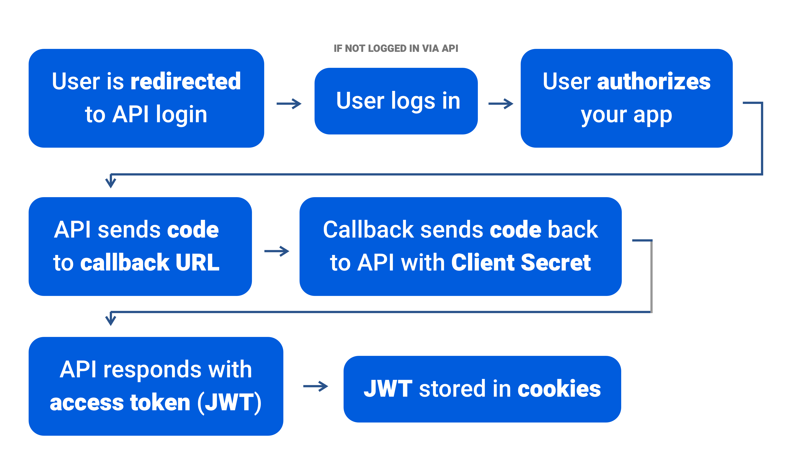

We'll be using the OAuth2 process to authenticate our NextJS app users with our Laravel API (thanks to Passport). If you aren't using Laravel, the process should be fairly similar in concept to 3rd party API's like Twitter.

> *This guide assumes you know a bit of React, what a HOC is and how to use it, and the basics of things like NextJS, Express, or OAuth2.*

## How it works

Say you need an app where a user can login and access private pages only for registered users. You could create a login form that accepts a username and password, and send that to the API. But that's a lot of code to write for every small app you want authenticated. That's where OAuth2 comes in.

With OAuth2, we can have the user click on a login link, like a "Sign in with Twitter" button. This redirects the user to Twitter, where they login with their Twitter account, and accept your app. Twitter then sends you a special "access token" that lets you use the Twitter API on the user's behalf. 

Now instead of Twitter, imagine that it's your own API. The user gets sent to a login server you create, and you get an access token that works for your own API. That way, you can allow developers to create apps that use your API as a user, as opposed to direct access. This way you can limit API access based on user permissions you set.

## The Authentication API

First and foremost, we need an authentication API to use so we can use it in our frontend NextJS app. The API will using the OAuth2 protocol, and return a JSON Web Token (or JWT) for each authorized user.

### The OAuth2 Process

OAuth2 might seem daunting at first, but since every major platform (Twitter, Facebook, Google, and countless more) use it for accessing authenticated sections of their API, you'll get to know it quick. The process to login a user through your app is very simple:



1. You login to the API you want to use for authentication and create a new **"client"** with a callback URL. This callback URL is the page on your app the API redirects the user after they login. On Twitter, is this the "Apps" page.

> Creating the **"client"** generates a API client ID and secret, which you use to authenticate your own app with the API. Save them for later. The ID is public (anyone can see it), while the secret is well, secret. You never let the user see your secret or access it, it stays in server-side code.

2. You create a button in your app, or redirect your user, to a specific URL that contains query parameters with your client ID, callback URL, and a response type ("code" by default). It should something like this: 

http://127.0.0.1/oauth/authorize/?**client_id**=2&**redirect_uri**=http://127.0.0.1:3000/token&**response_type**=code&**scope**=access-user-account

> Sometimes scope is added to the URL's query parameters, which are key strings that give you extra API privileges - like accessing user email.

3. The user gets redirected to the API where they see a login screen if they're not logged in. Once they login, they see an authorization request for your app. The request is a window that shows the app name you entered earlier, and asking the user if they approve it to access the API on their behalf. If you've ever logged in on a website using Twitter/Facebook/etc, you've seen something like this.

4. If the user approves, they're redirected back to the callback URL you used earlier when creating the app. When the user is redirected, they're sent with a special code. On the callback page in your app, you take this code and make another request to the API that includes the code, as well as your secret.

5. If the API approves your request, it sends back a JSON response with the user's token, and other data about it. Normally you'd grab the token from the response and store it in a session or cookie to use later (because you'll be using it a lot!).

## Creating the API

Now that you understand what kind of API we're creating, we can actually make it. 

I have [a guide on creating a quick authentication API using Laravel and the Passport package](http://stayregular.net/blog/deploy-laravel-on-heroku-to-create-oauth2-0-api). Try spinning up that project and using it alongside this one. It'll create a separate server with an API you can access to login users and get tokens back.

Once the API server is up and running, run the following command to create a new app:

`php artisan passport:client`

> If you're inside a Docker container (like my project uses), make sure to use the docker-compose `exec` command: `docker-compose exec workspace php artisan`

The CLI will ask for an app name and generate a client ID and secret for you, store these for later.

> Ideally you'd create a frontend UI to generate these API credentials, and Laravel does offer a sample version in Vue if you need it. But for testing or simpler purposes, the CLI works just fine.

### Alternatives to Laravel

I know PHP or Laravel isn't everyone's bag, or you don't have time to spin up a server and host it on Heroku -- **you just want an API that works.**

You can leverage free platforms like Twitter or Slack and use their "Sign in with..." services. However, if you want to ingest your own API, you'll probably still need to use your own authentication server. Otherwise the only reason to use Sign in with Twitter is to access the Twitter API on behalf of the user through your app.

> Rather than creating your own, or using social media platforms, you can also use a 3rd party service like [Auth0](http://auth0.com) to leverage their cloud-based authentication API. Platforms like [Netlify](http://netlify.com) also offer JWT support for your projects.

## The NextJS App

Nothing special here, just `npm init` a new project and lets `npm install` a few modules. I'll explain each more in depth as we use them:

`npm install react react-dom next express cookie-parser csurf dotenv isomorphic-unfetch js-cookie --save`

### App structure

The app structure is very simple, and I'll show you a couple different techniques to authorize your app (server-side and client-side).

1. Login link or page that redirects user to API login.
2. Callback page that accepts the API's response code, sends a request with our secret, receives the access token (JWT), and stores it in our app.
3. A React page wrapper (or HOC) for private pages that will check for the token in the cookies, and if it doesn't check out, they get redirected to a public page (usually a login).

### The login link

We need to make a link, anywhere in the app, that'll serve as a "Login" button for the app. It'll be a simple `<a>` element, with a link to our Laravel API and the /oauth/authorize/ endpoint (assuming localhost):

`http://localhost/oauth/authorize/?client_id=4&redirect_uri=http://localhost:3000/token&response_type=code`

This link contains our **client_id**, **redirect_uri** or callback URL, and a **response_type** which should be set to 'code'. The **client id** and **redirect_uri** are given to us when we create a new OAuth application using the Laravel API. Usually you'd setup a frontend form, like Twitter's Developer section and their form to create new "apps" in exchange for API keys.

> If you'd like to create an app using JS, or even the PHP Artisan CLI, check out the Laravel Passport docs for more info.

### Create callback URL

Using Express, or a custom server setup for NextJS, we need to setup a callback route that the API can query to verify our credentials. It's a fairly simple process:

1. Create a GET route and name it whatever you want.
2. Make a `fetch()` request to the API with our credentials, and the request code sent by the API server.
3. Store the token in the cookies using cookie-parser and Express (`res.cookies`).

Here's the final code in `server.js`:

```js
// Callback for OAuth2 API
server.get('/token', (req, res) => {
    const callback = {
    grant_type: 'authorization_code',
    client_id: process.env.API_CLIENT_ID,
    client_secret: process.env.API_CLIENT_SECRET,
    redirect_uri: process.env.API_REDIRECT_URI,
    code: req.query.code
    }

    // Query API for token
    fetch('http://localhost/oauth/token', {
        method: 'post',
        headers: {
        'Content-Type': 'application/json'
        },
        body: JSON.stringify(callback)
    })
    .then(r => r.json())
    .then(data => jsonErrorCheck(data))
    .then(data => {
        // Store JWT from response in cookies
        res.cookie('kushyFToken', data.access_token, {
        maxAge: 900000,
        httpOnly: true
        });

        // store object in session (with express-session)
        // req.session.token = data.access_token

        return res.redirect('/dashboard')
    });
```

> Don't forget to use an isomorphic version of `fetch()`, since Node doesn't come installed with it.

### Protecting routes + Grabbing our token from cookies

To access the token in each route, we'll create a multi-purpose HOC. This HOC will wrap our components and only return them when we have a token, otherwise it'll redirect the user. The HOC works by grabbing our token from the cookies (either server or browser cookies), and if a token is retrieved, the component we wrapped gets to load.

> In a production setting you should verify tokens any time you need to authorize a page. You never know if a user faked their cookie, so just accepting a token isn't sufficient -- the token needs to work. Making a quick `fetch()` request to our API with the token (usually on the user profile endpoint, so we don't waste the API call and grab relevant data). If the request worked, the user is approved. After the check, you can set a server-side cookie (encrypted hash of user ID + current time + an app secret) that lets the app know the user was authorized recently.

We'll also be utilizing React's Context API to wrap our authorized page component with a Provider that contains our token. That way, you can wrap any component that needs to access authenticated API routes with a Consumer. This Consumer passes the token down to your component in it's props.

#### But what about production?

In production, best practice is to never show anyone the access token (JWT). But because of the fairly secure nature of OAuth2, and the need to run authenticated client-side requests, developers often throw an unencrypted JWT in the cookies, or worse, `localStorage`. 

Ideally, you should store the JWT in a server-side session, where an encrypted ID is kept in a cookie, and the JWT is stored in a server-side data store (like Redis or Memcached). Whenever you need the token, you'd send a POST request to your app's Express server with the encrypted cookie ID and a CSRF token (generated by the server to ensure it came from a `<form>` created by the server -- not a random POST request). The Express server checks data store for the cookie's ID, grabs the token, and uses it to make an API request, then returns the API's response. 

You can see that your app's server acts as a "middleman" to ensure secure transmissions between the client and the API. This way no one can do something like trying to login by creating fake cookies with tokens. The tokens have to be stored server-side, and they'd need the appropriate key to access any currently in the data store. I cover this method below if you're interested.

### Authorization HOC

For the HOC, we load our props containing our token in `getInitialProps()`, which is grabbed from cookies. Then when the component mounts (`componentDidMount()`), we run a check to see if the token is in the props. If not, we redirect to the login page using Next's `Router`. If we have a token, we set the loading state to false, which activates the component of the protected route (the component we wrap the auth HOC around).

> Feel free to replace the "LOADING" text with a real loading component, or a page with a loader.

Now we'd normally grab the token using cookies, but I'll show you how to do it server-side as well so you can see why it's *not* the best option.

#### Server side

Create a middleware to grab the cookie and store it in `res.local.cookies`, and then pass it into app when rendering each route: `return app.render(req, res, '/dashboard', { token: res.locals.token })`.

server.js

```js
// A JSON error checking function since fetch()
// won't let us know if it failed or not
function jsonErrorCheck(data) {
  if('error' in data)
  {
    return error
  }
  return data
}

// The middleware
function getUser(req, res, next) {
  if (req.cookies['kushyFToken']) {
    const credentials = {
      method: 'get',
      headers: {
        'Authorization': 'Bearer ' + req.cookies['kushyFToken'],
        'Content-Type': 'application/x-www-form-urlencoded'
      }
    }

    const fetchUser = async () => {
      await fetch('http://localhost/api/user/', credentials)
        .then(r => r.json())
        .then(data => jsonErrorCheck(data))
        .then(data => {
          res.locals.token = req.cookies['kushyFToken']
          res.locals.user = data
          next()        
        });
      }
      fetchUser();
  } else {
    next()
  }
}

// .... some other code

// Apply middleware to your route
// You basically stack middleware after the page string
// and before your page render 
// otherwise the middleware would never get called
server.get('/dashboard', getUser, (req, res) => {
    return app.render(req, res, '/dashboard', { token: res.locals.token, user: res.locals.user })
})
```

```js
import React, {Component} from 'react'
import Router from 'next/router'

export default function withAuth(AuthComponent) {
    return class Authenticated extends Component {

      static async getInitialProps(ctx) {
        // Check if Page has a `getInitialProps`; if so, call it.
        const pageProps = AuthComponent.getInitialProps && await AuthComponent.getInitialProps(ctx);
        // Return props.
        return { 
          ...pageProps,
          token: ctx.query.token
          user: ctx.query.user
        }
      }

      constructor(props) {
        super(props)
        this.state = {
          isLoading: true,
        };
      }

      componentDidMount () {
        // Console logs for convenience
        // console.log('protected page, did we get token?:');
        // console.log(this.props.token);
        if (!this.props.token) {
          Router.push('/login')
        }
        this.setState({ isLoading: false })
      }

      render() {
        return (
          <div>
          {this.state.isLoading ? (
              <div>LOADING....</div>
            ) : (
                // We don't need to explicitly pass token or user as props here
                // because {...this.props} includes them (ES6 destructuring ftw)
              <AuthComponent {...this.props}  auth={Auth} />
            )}
          </div>
        )
      }
    }
}
```

This is tedious since it requires you to place the token in every request. And if a page loads client-side, without making a server request, we have no way to access the `ctx` variable that contains our token. 

So **we're forced to use a client-side data store**, preferably a secure one like **cookies** or IndexDB.

#### Using Cookies

Since we use [cookie-parser](https://www.npmjs.com/package/cookie-parser) middleware for Express, we can access the cookies server-side using the `req` variable in the `getInitialProps` state: `ctx.req.headers.cookie`. This returns a giant string of all the cookies separated by & symbols (like query parameters). If we parse the string and find the cookie by key name, we'll have our cookie. 

Or if we're in the browser (like if a user clicks an internal `<Link />` in the app), we can use the [js-cookie](https://github.com/js-cookie/js-cookie) library to grab cookies from the client-side (`cookie.get('token')`).

> I use helper functions to make accessing cookies easier ([stolen from @carlos-peru on Github](https://github.com/carlos-peru/next-with-api/blob/master/lib/session.js)). It's basically a wrapper for js-cookie, and checks if the user is server or client-side. If they're server-side, it searches the `req` variable for our cookie name. If it's client-side, it uses js-cookie.

utils/Cookies.js

```js
import cookie from "js-cookie";

export const setCookie = (key, value) => {
    if (process.browser) {
        cookie.set(key, value, {
            expires: 1,
            path: "/"
        });
    }
};

export const removeCookie = key => {
    if (process.browser) {
        cookie.remove(key, {
            expires: 1
        });
    }
};

export const getCookie = (key, req) => {
    return process.browser ?
        getCookieFromBrowser(key) :
        getCookieFromServer(key, req);
};

const getCookieFromBrowser = key => {
    console.log('grabbing key from browser')
    return cookie.get(key);
};

const getCookieFromServer = (key, req) => {
    console.log('grabbing key from server')
    if (!req.headers.cookie) {
        return undefined;
    }
    const rawCookie = req.headers.cookie
        .split(";")
        .find(c => c.trim().startsWith(`${key}=`));
    if (!rawCookie) {
        return undefined;
    }
    return rawCookie.split("=")[1];
};
```

withAuth.js

```js
import React, {Component} from 'react'
import Router from 'next/router'
import TokenContext from '../context/TokenContext'
import { getCookie } from '../utils/Cookies'

export default function withAuth(AuthComponent) {
    return class Authenticated extends Component {

      static async getInitialProps(ctx) {
        const token = getCookie('kushyFToken', ctx.req)
        // Check if Page has a `getInitialProps`; if so, call it.
        const pageProps = AuthComponent.getInitialProps && await AuthComponent.getInitialProps(ctx);
        // Return props.
        return { ...pageProps, token }
      }

      constructor(props) {
        super(props)
        this.state = {
          isLoading: true
        };
      }

      componentDidMount () {
        console.log('checking auth')
        if (!this.props.token) {
          Router.push('/')
        }
        this.setState({ isLoading: false })
      }

      render() {
        return (
          <div>
          {this.state.isLoading ? (
              <div>LOADING....</div>
            ) : (
              <TokenContext.Provider value={this.props.token}>
                <AuthComponent {...this.props} />
              </TokenContext.Provider>
            )}
          </div>
        )
      }
    }
}
```

This is a better approach, since you get the safety of cookies for both the server and client.

> Protip: You might want to take advantage of the Context API and wrap the Authorized component in a Provider with the token data, so any part of the app can easily access the token without doing any prop-drilling! Your other option is to use the Cookies helper/utility functions and grab the cookie again inside any component you need it in like above. *Or you know, Redux.*

### Secret 3rd Option: API Endpoints

Since we're using Express to create routes, and we have access to the server to run Javascript, there's no reason we can't create a dynamic route to act as a middleman for our external API. You'd grab the API endpoint from the dynamic route (`app.render('/api/:endpoint', callback)`) and use it (`req.params.endpoint`) to send an authenticated API request with the cookies we got earlier (`req.cookies['seshToken']`).

```js
// Route for sending POST requests
server.post('/api/:endpoint', (req, res) => {

    // Query protected API endpoint with token
    fetch(`http://localhost/api/${req.params.endpoint}`, {
    method: 'POST',
    headers: {
        'Content-Type': 'application/json'
        'Authorization': `Bearer ${req.cookies['seshToken']}`
    },
    // Grabs request body (ideally Form data), converts to JSON, and sends it as POST
    body: JSON.stringify(req.query)
    })
});

// Route for sending authenticated GET requests
server.get('/api/:endpoint', (req, res) => {

    // Query protected API endpoint with token
    fetch(`http://localhost/api/${req.params.endpoint}`, {
    method: 'GET',
    headers: {
        'Content-Type': 'application/json'
        'Authorization': `Bearer ${req.cookies['seshToken']}`
    }
    })
});
```

This way, the client is never exposed to the token in the source code (only if they check their cookies). This is the **best case scenario** when paired with sessions (e.g. express-session). Although it limits you to using NextJS on the server-side, and **requires you to have a data store in production (like Redis)**.

## HOC vs Functional Programming

Does a HOC look like overkill? Do you want something thats more functional? Rather than wrapping your component in an auth HOC like we did earlier, you could add a kind of "middleware" to the page's `getInitialProps()` that would check the cookies for a token, and redirect on false.

Your page component:

```js
static async getInitialProps(ctx) { 
  // If it does not exist session, it gets redirected
  if (redirectIfNotAuthenticated(ctx)) {
    return {}; 
  } 
```

And the magic behind the "middleware":

```js
export const getJwt = ctx => {
  return getCookie("jwt", ctx.req);
};

export const isAuthenticated = ctx => !!getJwt(ctx);

export const redirectIfAuthenticated = ctx => {
  if (isAuthenticated(ctx)) {
    redirect("/user", ctx);
    return true;
  }
  return false;
};
```

It's basically what we do in our HOC, but broken down into separate functions. More of a functional approach to the same solution.

## To Redux or Not?

**You don't technically need Redux**, since you can access cookies from the client-side using js-cookie, or wrap your app in a token Provider. But I found that I started to reach for Redux when I needed to start managing more complex state in my app, and particularly **persisting state**. You can use the Context API all day, but if you don't write a fallback and retrieval system from `localStorage`, your app's state will get wiped on every refresh. Which requires dynamic data requests to run again, *and again*, ***and again***.

### Data Peristence

Fetching data using Redux and storing the results in the application's state allowed for more data persistence, especially in an universal app like NextJS which runs frequent server and client-side requests. If your app was just client-side (like a SPA), Redux would be a probably be trivial, since your user would rarely ever "hard" reload the page. But since some NextJS routes load server-side, it refreshes your app's state, requiring your Context Providers to reach for the API again.

But like I said, you can always use Context Providers to persist your state to `localStorage`, or another local data store, and use Consumers to grab it when you need it again.

### Complex Data Management

Imagine an app where you have components that needs to access 3 (or more) different values from Providers. Each time you create a component, you'll need to wrap 3+ Consumers around the component and drill down props appropriately (or [create a HOC to combine them into props](https://www.npmjs.com/package/react-context-consumer-hoc)).

```js
// Impractical code that doesn't work
const SomeComponent = () => (
    <ThemeContext.Consumer>
        { theme => 
            <TokenContext.Consumer theme={theme}>
                { token => 
                    ...etc
                }
            </TokenContext.Consumer>
        }
    </ThemeContext.Consumer>
)
```

With Redux, you'd create a container component for your component. The container connects the component to the Redux store, and sends down any state values you need as props. Once it's connected, the component has access to anything in the store you define.

### So...Redux?

You'd be surprised how far you can get *without* Redux, *then again,* it's all about making the ride *smoother*. Do whatever **you** think is best for your app. [*Obligatory link to the creator of Redux saying you might not need it*](https://medium.com/@dan_abramov/you-might-not-need-redux-be46360cf367)

## Simple as that

Since NextJS is capable of server-side tasks - and even utilizing other frameworks like Express - it makes it very simple to extend a frontend application with the necessary routes to authenticate users via OAuth2. This tutorial used the Laravel API as an example, but the code for implementing other OAuth2-based APIs (like Twitter) is very similar. 

If my guide was confusing at all, I'd recommend checking out [this video from the NextJS conference](https://www.youtube.com/watch?v=bo4BbGwZsWo) that explains the NextJS user auth process in under 15 minutes. 

[Download the project on Github here](https://github.com/whoisryosuke/nextjs-oauth2-cookie-auth)

Kanpai 🍻
Ryo

***

**References**:

* [Prosper Otemuyiwa: Authentication and Authorization in Next.js](https://www.youtube.com/watch?v=bo4BbGwZsWo)
* [Encrypt your cookies](http://blog.teamtreehouse.com/encrypting-cookies-in-the-browser)
* [js-cookie](https://github.com/js-cookie/js-cookie)
* [Cookies helper functions](https://github.com/carlos-peru/next-with-api/blob/master/lib/session.js)
* [Creating authentication middleware for getInitialProps](https://medium.com/@positivecarlos/authentication-on-universal-react-with-next-js-b441ef458046)
* [OAuth 2.0 - Official](https://oauth.net/2/)