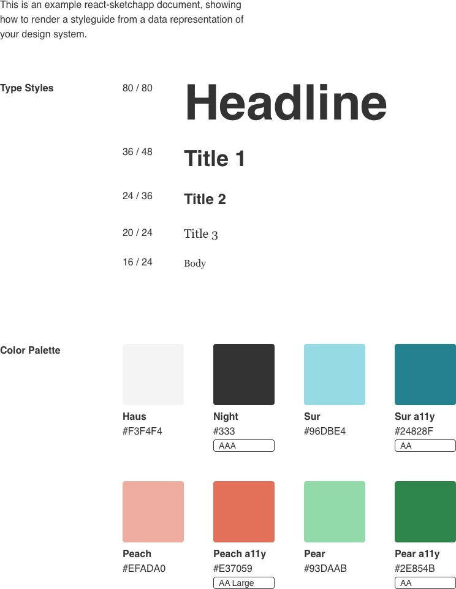
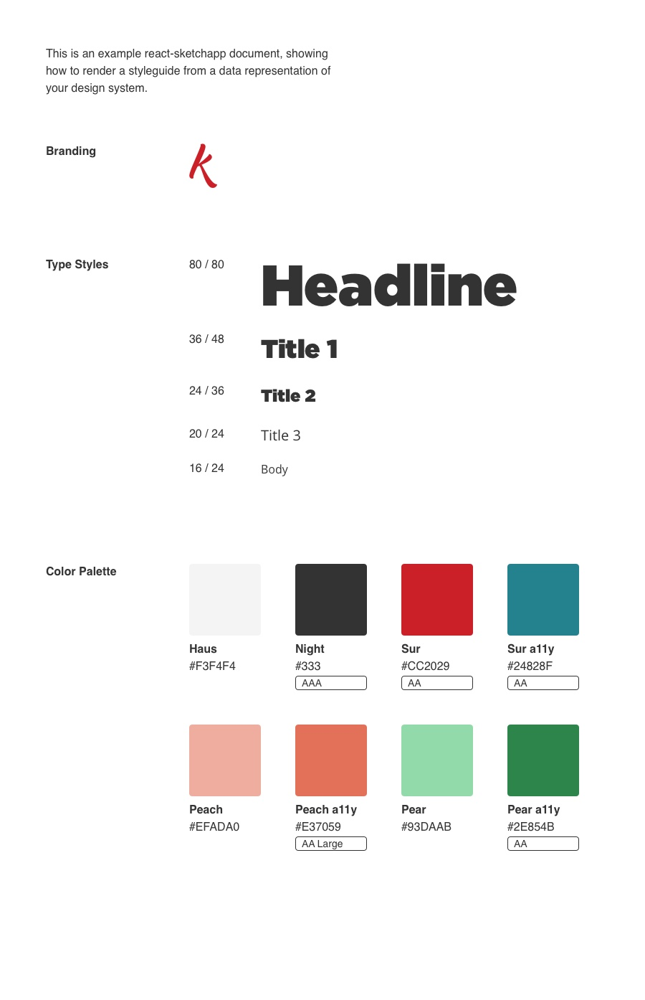

When I discovered Airbnb's [react-sketchapp](https://github.com/airbnb/react-sketchapp), I was ecstatic to start ditching the clunky design version control systems for a single source of truth: **React**. 

Everything ends up in React anyway. And despite my love for [Sketch](https://sketchapp.com) -- it's not available on Windows or Linux, limiting contribution. We wanted to make our design system as accessible as possible, and as exclusive as React sounded, it was ultimately the better choice.

## Single source of truth: React

### Normal development process:

* Design in sketch
* Transfer designs to React
* Design again in sketch
* Translate changes to React
* Commit sketch file to git repo
* Git pull new changes and lose small changes another artist made in another commit
* Or ideally version control with [Plant](http://plantapp.io/) or [Kactus](http://kactus.io) and still struggle.

### The better way:

* Design in sketch (or Photoshop, or any program really)
* Transfer designs to React
* Never touch Sketch again, unless you need to, you know...sketch
* Transfer React designs to Sketch
* Update React code, generate new Sketch file

## The problems with react-sketchapp

### React as a requirement

This is a issue for some, particularly companies that prefer to stay platform agnostic. If this is the case, then definitely base your design system in whatever format you prefer.

For Kushy, all of our applications are being developed in React. Every single one of them. Maybe one or two in Preact, some in Electron (which uses React). Obviously non-app projects, like static websites, are built on basic HTML/CSS. But for the most part, 90% of the time you're using React in our ecosystem. This makes it an obvious choice for the source of truth.

### Updating designs via Sketch

This system makes it easy for developers to contribute to the design system, but is it a 2-way street? Does it allow for designers to update Sketch and reflect in React? **Spoiler alert:** *Nope, only React to Sketch.*

Which means you need design version control using Kactus, Plant, etc. The design system would have a script that builds Sketch files from React components. Designers `git pull` those Sketch files and use Kactus to handle changes between designers + submitting PR to repo. A developer has to look at the Sketch file (ideally using Kactus to compare visual commit diffs), and then apply changes to React.

### It's not a React Converter

One of the major issues is that you're required to use only 3 types of *universal* components (View, Text, StyleSheet) to create all your components. It's a system of *primitives*, similar to React Native, where you have base components that extend the client's OS or browsing software.

These primitives allow you to easily create compositions that convert to Sketch styles and shapes, rather than having to interpret DOM nodes + CSS. 

However, if you have an existing design system in React, like Bootstrap or Material UI, **you'll have to recode everything by hand** in a new API. And you'll *still* have to manually update your old React components, unless you choose to switch over to universal rendering with [react-primitives](https://github.com/lelandrichardson/react-primitives).

## The solutions

### Everyone doesn't use Sketch, everyone can use React

Sketch is an application that is exclusive to the Mac, so Windows and Linux users will be unable to contribute to the design system if it's basis begins at Sketch. 

By making the single source of truth React components, it allows anyone to make contributions on any platform. And by using the Airbnb library, we can create a bridge between React and Sketch, so we can still facilitate access to the creatives using Sketch.

### More accessible components

Even if someone doesn't prefer React, we can still easily extract the HTML and CSS from rendered components. It's not exactly copy paste, but it's an easier translation than say converting a Sketch file to HTML/CSS (since those services exist, but [tend to be pricey](https://launchpad.animaapp.com/pricing)).

And by forcing you to work in *primitives*, your components become *universally available* in most devices (mobile - Android + iOS, desktop, etc).

## The Process

* Make list of needs for style guide (typography, colors, etc)
* Make a template in Sketch of how the final product will look
* Make Sketch of interface for app
* Make the app!

## Using react-sketchapp

We'll be using [the Styleguide example](https://github.com/airbnb/react-sketchapp/tree/master/examples/styleguide) in the React-Sketch.app repo. 

### New projects

If you're starting a new project: 

1. `git clone` the base project
1. `cd` into the styleguide folder
1. `npm install`
1. `npm run render`
1. Open Sketch, create a new document.
1. Click on Plugins in the top menu, navigate to `react-sketchapp: Styleguide`

### Existing projects

In an existing project, install the necessary dependencies:

```bash
npm i react react-sketchapp react-test-renderer chroma-js
npm i @skpm/builder --dev
```

Add the following scripts to your `package.json`:

```json
  "scripts": {
    "build": "skpm-build",
    "watch": "skpm-build --watch",
    "render": "skpm-build --watch --run",
    "render:once": "skpm-build --run",
    "postinstall": "npm run build && skpm-link"
  },
```

## The Results



Here's what you get out of the box. You get a basic style guide with typography and color definitions. 

### Hot reloading

Editing and saving the React components triggers Sketch to remove the old layer group, and replace with a new group. If you move anything around, you'll see it bounce back to the original position on the canvas. That also means even if you place anything inside an artboard, it'll get deleted and replaced with only what is defined in React.

### Works with custom fonts

It instantly changed the text from Helvetica and Georgia to a custom font I've installed from a 3rd party. 

### SVGs 

Using SVGs was fairly simple. I grabbed SVG code, imported it into the project, and replaced all the SVG's DOM elements with React component equivalents (`<path> becomes <Svg.path>`). It was a simple process of find and replace, and I had functional (and universal) SVG components.

### Artboards, Pages, Organization

You can create artboards and pages with React using the `<Artboard>` and `<Page>` components. It's as easy as wrapping everything in these . It also supports `/` based name notation, which is vital for Sketch to export into organized folders.

I couldn't get multiple pages to work with the Styleguide example, and the documentation didn't help much. I kept getting an error saying something about `document.pages` after I wrapped everything in `<Document>` components (had to rename the other Document component that gets rendered).

#### Generating artboards for each <Component />

I was looking for examples of devs using react-sketchapp in the wild, and stumbled on this bit of code in the [antd-sketchapp](https://github.com/ant-design/antd-sketchapp/blob/master/src/demo.js) repo:

```js
import React from 'react';
import { render, Artboard } from 'react-sketchapp';

import ButtonDemo from './components/Button/demo';
import CheckboxDemo from './components/Checkbox/demo';
import PaginationDemo from './components/Pagination/demo';
import TableDemo from './components/Table/demo';
import GridDemo from './components/Grid/demo';
import IconDemo from './components/Icon/demo';

const renderDemo = (name, Component) => {
  return () => {
    render(
      <Artboard
        name={`antd-sketchapp ${name}`}
        style={{
          padding: 40,
        }}
      >
        <Component />
      </Artboard>,
      context.document.currentPage()
    );
  };
};

export const Checkbox = renderDemo('Checkbox', CheckboxDemo);
export const Button = renderDemo('Button', ButtonDemo);
export const Pagination = renderDemo('Pagination', PaginationDemo);
export const Table = renderDemo('Table', TableDemo);
export const Grid = renderDemo('Grid', GridDemo);
export const Icon = renderDemo('Icon', IconDemo);
```

You create a simple functional component called `renderDemo` that accepts the name of the component, and the actual component itself. It returns an Artboard with the dynamic <Component /> nested inside. Then we run that `renderDemo` function on each component. Wha-la 👉 we have 6 separate artboards for our individual components.

## Conclusion




**If you're starting from scratch,** this seems like an interesting experiment to create a truly universal set of React components that work on web and mobile.

**If you have an existing design system**, I say pass on this. It's not worth the effort in developing and maintaining a mirrored set of primitive components. Unless you plan on switching to primitives, or already use some sort of universal component setup -- then this might be a promising path for you. 

It was a little disappointing to find that this wasn't as robust as I wanted it to be. The process was inhibited by the limitations of primitives. I need a world where I can grab my React components defined fundamentally in HTML/CSS and convert them to Sketch.

I'm looking forward to trying out brainly's [html-sketchapp](https://github.com/brainly/html-sketchapp), which does exactly that -- converts HTML + CSS to a Sketch file. Rather than using React native-like primitives, we simply render our React components to HTML and pull them into the converter. But I'll get into that next time!

**[⚡️  Download my source code here on Github 👈 ](https://github.com/whoisryosuke/kushy-react-sketchapp)**

Hope this helps 👍
Ryo

***

**References**:

* [My sample project on Github](https://github.com/whoisryosuke/kushy-react-sketchapp)
* [airbnb's react-sketchapp](https://github.com/airbnb/react-sketchapp/)