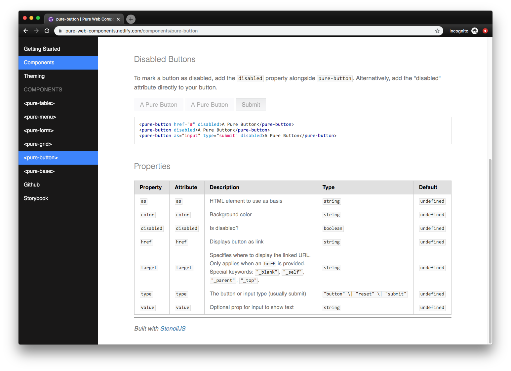

I recently created a web component based design system using StencilJS. Afterwards, I wanted to find a solution to create a documentation site based on the auto-generated component docs from StencilJS.


I ended up creating [a GatsbyJS starter](https://github.com/whoisryosuke/pure-web-components/tree/master/docs) for this, and I thought I'd share how easy it was using both Stencil and Gatsby.

[🖥 See the live documentation site](https://pure-web-components.netlify.com/)

[📓 Browse the source code on Github](https://github.com/whoisryosuke/pure-web-components/tree/master/docs)

## ✏️ What is StencilJS?

[StencilJS](https://stenciljs.com/) is a tool chain for building web components. It's like [lit-element](https://lit-element.polymer-project.org/), from Google and the Polymer team, which offers utilities and decorators to easily bootstrap Web Components to [the W3C standard](https://github.com/w3c/webcomponents). But StencilJS brings more to the party than lit-element, and handles every other part of the process: building components, **_auto-generating documentation_**, or even unit and E2E testing. With it's CLI, you can instantly create standard web components complete with Typescript component, CSS or SCSS, and E2E Typescript testing files - all with a single command.

From someone who has had to setup new projects in the past and deal with the long and laborious process of configuring an entire build and test suite for an app or library — I never want to do it again if I can help it. That's why I love CLIs like create-react-app, [NextJS](http://nextjs.org), NuxtJS, [GatsbyJS](http://gatsbyjs.org), Gridsome, [tsdx](https://github.com/jaredpalmer/tsdx), or [create-react-library](https://www.npmjs.com/package/create-react-library). You run a command and you have a project ready to go, whether it's React, Vue, or in this case Web Components.

## ⚡️ What is GatsbyJS?

GatsbyJS is a static site generator that's optimized to deliver React PWAs that are server-side rendered and blazing fast by default. You'll notice it used for mostly content-heavy projects that leverage it's local GraphQL API to aggregate various content APIs. It's commonly used with Markdown or MDX, common writing syntaxes that convert symbols like `##` to HTML elements `<h2>`.

I picked Gatsby for this project particularly because of how well it works with Markdown and JSON. You can just point to a directory with Markdown files and you can query them across the app to create content pages, print navigational menus, etc. And with JSON you can import it into GraphQL and query the structured data. And since StencilJS outputs both Markdown and JSON files automatically for every component, it was a perfect pairing.

# 🔧 Using Web Components in Gatsby

To use Web Components in an app, all you have to do is import the distribution bundle into the `<head>` of your app (like any other script). Stencil by default [creates a distribution bundle for both ES6 and older CommonJS.](https://stenciljs.com/docs/distribution) As long as you import both in the `<head>` of your app, you're good to go in most cases.

Gatsby uses a library called `react-helmet` to insert content into the DOM's `<head>`. You can use the `<Helmet>` component to insert your web component's bundle into any page's `<head>` (ideally the root):

```js
<Helmet>
  <script
    type="module"
    src="/dist/your-web-component/your-web-component.esm.js"
  ></script>
  <script nomodule="" src="/dist/your-web-component.js"></script>
</Helmet>
```

I generally put this in my `<Layout>` component that wraps all pages, that way every page has access to components. You can find it [in the pure-web-components docs](https://github.com/whoisryosuke/pure-web-components/blob/master/docs/src/layouts/documentation.js) in `layouts/documentation.js`.

The "best practice" way to accomplish this method would be to use `gatsby-browser.js` and `gatsby-ssr.js` to wrap the entire app with our scripts. This ensures it truly wraps the entire app, and not wherever the `<Layout>` may begin (just in case some pages aren't wrapped in it).

### ES6 version

You can also use the ES6 module version (in this case, from a CDN), with a fallback for IE11/Edge:

```js
<Helmet>
  <script type="module">
    import { applyPolyfills, defineCustomElements } from 'https://unpkg.com/pure-web-components/loader';
    applyPolyfills().then(() => {
      defineCustomElements(window);
    });
  </script>
</Helmet>
```

### Best Practice React Version

If you prefer a more React orientated solution, you can also import components as NPM/ES6 modules if you have installed them as dependencies. Import the NPM module wherever you need it (generally the root of your app or a nested route/component) and run the polyfill and web component loading methods:

```js
import {
  applyPolyfills,
  defineCustomElements,
} from 'pure-web-components/dist/loader'

// This applies polyfills (if necessary)
// Then registers the new "custom element" or web component
applyPolyfills().then(() => {
  defineCustomElements(window)
})
```

You'd include this in `gatsby-browser.js` and `gatsby-ssr.js` to apply it across the entire client-side app, as well as when Gatsby prerenders for SSR. Here's an [example of this in action on CodeSandbox](https://codesandbox.io/s/bulmil-bulma-web-components-qb3kd) using the Bulmil (Bulma CSS) Web Components.

Make sure to check out [\*\*Stencil's integration guides](https://github.com/whoisryosuke/gatsby-theme-stencil-docs) for examples on each framework**, like **Angular** or **Vue\*\*, if you're interested in working with those.

If you try to import your Web Components directly (without compiling them and using the distribution bundle), you'll encounter a build error with Gatsby. This is because Gatsby generates static HTML for it's React components, and [it uses Node to do this, which only supports a subset of the actual web JS](https://vaadin.com/forum/thread/17805764/using-vaadin-webcomponents-in-gatsby). **This means Gatsby can't import Web Components _unless_ they're pre-compiled** and included as a client-side `<script>` tag (or ES6 import) in your HTML.

If you need to use a static site generator with Web Components, try to find one that's HTML based, like [11ty](https://www.11ty.io/). I haven't personally tried it, but it reportedly works better with Web Components.

# ⚙️ Setting up Gatsby with Stencil

Gatsby makes working with Markdown much easier thanks to the [numerous plugins](https://www.gatsbyjs.org/plugins/?=markdown) in it's ecosystem. With just a few steps, and _a little bit_ of configuration, we have a fully functioning documentation site.

First we install a few dependencies like [gatsby-transformer-remark](https://www.gatsbyjs.org/packages/gatsby-transformer-remark/), which takes files we load into Gatsby and parses any Markdown:

```bash
    yarn add --save gatsby-transformer-remark gatsby-remark-prismjs prismjs
```

Then we setup the `gatsby-config.js` to import our component Markdown from Stencil and run the Markdown parser _(and also converts code blocks to PrismJS)_:

```js
// Gatsby source filesystem loads files into GraphQL
// Grabs your Stencil components from the parent folder
{
  resolve: `gatsby-source-filesystem`,
  options: {
    name: `components-readme`,
    path: `../src/components`,
  },
},
// Gatsby transformer plugins run after data is loaded
// In this case we parse Markdown into HTML using Remark
{
  resolve: `gatsby-transformer-remark`,
  options: {
    // CommonMark mode (default: true)
    commonmark: true,
    // Footnotes mode (default: true)
    footnotes: true,
    // Pedantic mode (default: true)
    pedantic: true,
    // GitHub Flavored Markdown mode (default: true)
    gfm: true,
    plugins: [
      // You can add plugins here that alter the Markdown parsing
      // In this case, we replace code blocks with PrismJS blocks
      {
        resolve: `gatsby-remark-prismjs`,
        options: {
          // Class prefix for <pre> tags containing syntax highlighting;
          // defaults to 'language-' (eg <pre class="language-js">).
          // If your site loads Prism into the browser at runtime,
          // (eg for use with libraries like react-live),
          // you may use this to prevent Prism from re-processing syntax.
          // This is an uncommon use-case though;
          // If you're unsure, it's best to use the default value.
          classPrefix: "language-",
          // This is used to allow setting a language for inline code
          // (i.e. single backticks) by creating a separator.
          // This separator is a string and will do no white-space
          // stripping.
          // A suggested value for English speakers is the non-ascii
          // character '›'.
          inlineCodeMarker: null,
          // This lets you set up language aliases.  For example,
          // setting this to '{ sh: "bash" }' will let you use
          // the language "sh" which will highlight using the
          // bash highlighter.
          aliases: {},
          // This toggles the display of line numbers globally alongside the code.
          // To use it, add the following line in gatsby-browser.js
          // right after importing the prism color scheme:
          //  require("prismjs/plugins/line-numbers/prism-line-numbers.css")
          // Defaults to false.
          // If you wish to only show line numbers on certain code blocks,
          // leave false and use the {numberLines: true} syntax below
          showLineNumbers: false,
          // If setting this to true, the parser won't handle and highlight inline
          // code used in markdown i.e. single backtick code like `this`.
          noInlineHighlight: false,
          // This adds a new language definition to Prism or extend an already
          // existing language definition. More details on this option can be
          // found under the header "Add new language definition or extend an
          // existing language" below.
          languageExtensions: [
            {
              language: "superscript",
              extend: "javascript",
              definition: {
                superscript_types: /(SuperType)/,
              },
              insertBefore: {
                function: {
                  superscript_keywords: /(superif|superelse)/,
                },
              },
            },
          ],
          // Customize the prompt used in shell output
          // Values below are default
          prompt: {
            user: "root",
            host: "localhost",
            global: false,
          },
        },
      },
    ],
  },
},
```

This configuration assumes your Stencil web components are located in a folder "above" the docs folder (or in better terms, the Gatsby docs should be nested inside your root Stencil project - `stencil-web-components/docs/gatsby-config.js`). Gatsby grabs the Stencil component Markdown docs from the configured folder and parses any Markdown to HTML.

All this data is loaded into a local GraphQL server where "transformers" run on the data. Our Markdown is parsed into HTML by the Remark plugin. But we can also run our own custom scripts on the GraphQL data. We need to new fields on our Markdown GraphQL "node" for things like the page slug and category/section. I touch on this more below under "Markdown Everything".

With this data we query, we can do things like display the parsed Markdown HTML in our app, or even create pages dynamically based on the files.

In this case, we create a page for each Markdown file we've loaded in `gatsby-node.js`:

```js
exports.createPages = async ({ graphql, actions, reporter }) => {
  // Destructure the createPage function from the actions object
  const { createPage } = actions
  // Query GraphQL for the Markdown data
  const result = await graphql(`
    query {
      allMarkdownRemark {
        edges {
          node {
            id
            fields {
              slug
            }
          }
        }
      }
    }
  `)
  if (result.errors) {
    reporter.panicOnBuild('🚨  ERROR: Loading "createPages" query')
  }
  // Create blog post pages
  // Grab the posts (or "nodes") from the GraphQL "edges"
  const posts = result.data.allMarkdownRemark.edges
  // We'll call `createPage` for each post
  posts.forEach(({ node }, index) => {
    createPage({
      path: node.fields.slug,
      // This component will wrap our Markdown content
      component: path.resolve(`./src/templates/component-docs.js`),
      // We can use the values in this context in
      // our page layout component to query GraphQL again
      context: { id: node.id },
    })
  })
```

And with that, you have all that you _basically_ need. Gatsby grabs Stencil's Markdown and creates a page for each. Gatsby uses the `./src/templates/component-docs.js` template create the pages, which is basically just a React wrapper that queries GraphQL for the specific Markdown file.

For a more in depth walkthrough, [you can see Gatsby's great guide on creating pages using Markdown here.](https://www.gatsbyjs.org/docs/adding-markdown-pages/)

# 🚵‍♀️ UX and UI

But I didn't want to stop there. I needed to create a **sidebar menu** that shows all the components and custom pages (using a JSON config). And what if when we parse Markdown, we could **replace HTML elements with our web components** (like replacing a `<button>` with `<pure-button`)? And how will someone _actually_ write docs in Gatsby?

I tackled each step by step 💪

### Sidebar Menu

I wanted to create a sidebar that displays all the components and any custom pages the user defines.

We query the components in the Layout wrapper using Gatsby's static GraphQL query hooks and pass the data to our sidebar:

```js
const data = useStaticQuery(graphql`
    query HeaderQuery {
      sidebar: allMarkdownRemark {
        edges {
          node {
            fields {
              slug
              filename
              section
            }
          }
        }
      }
      title: site {
        siteMetadata {
          title
        }
      }
    }
  `)
  return (
    <pure-base>
      {{-- Truncated --}}
      <main className="Dashboard">
        <Sidebar
          currentPage={location.pathname}
          components={data.sidebar.edges}
        />
        {{-- Truncated --}}
      </main>
    </pure-base>
  )
```

Then we take the components (via the props) and loop through it in the Sidebar, along with the user defined pages:

```js
const Sidebar = ({ components, currentPage }) => {
  const pages = [
    {
      name: 'Getting Started',
      url: '/getting-started',
    },
    {
      name: 'Components',
      url: '/components/pure-button',
    },
    {
      name: 'Theming',
      url: '/theming',
    },
  ]
  const componentList = components.map(component => {
    const {
      node: {
        fields: { section, slug, filename },
      },
    } = component
    if (section === 'components') {
      // Set active depending on currentPage vs slug
      return (
        <li
          className={`pure-menu-item ${
            currentPage.includes(slug.slice(0, -1)) ? `pure-menu-selected` : ''
          }`}
        >
          <Link to={slug} className="pure-menu-link">
            {`<`}
            {filename.replace('/', '')}
            {`>`}
          </Link>
        </li>
      )
    }
  })

  const pageList = pages.map(page => {
    // Set active depending on currentPage vs slug
    return (
      <li
        className={`pure-menu-item ${
          currentPage.includes(page.url) ? `pure-menu-selected` : ''
        }`}
      >
        <Link to={page.url} className="pure-menu-link">
          {page.name}
        </Link>
      </li>
    )
  })
  return (
    <nav
      id="PrimarySidebar"
      className={`Dashboard__sidebar ${isScrolled} ${hideSidebar}`}
    >
      <pure-menu>
        <ul className="pure-menu-list">{pageList}</ul>
        <span className="pure-menu-link pure-menu-heading">Components</span>
        <ul className="pure-menu-list">{componentList}</ul>
      </pure-menu>
    </nav>
  )
}

export default Sidebar
```

We loop through each array (components and custom pages) and generate a list of links. Nothing fancy here.

### Replacing Markdown HTML with Web Components

Let's say you want to swap out `<h1>` elements with a `<Header>` component when the user writes the following Markdown: `# Hello World`. Rather than returning the `<h1>` when parsing the Markdown, you can replace it with whatever component you need.

Usually you just query the parsed HTML from the Markdown GraphQL endpoint, but in this case, you query an AST version. This allows you to swap DOM elements in the tree with your own React or Web Components.

The Gatsby plugin that handles Markdown (gatsby-transformer-remark) [recommends that you use](https://using-remark.gatsbyjs.org/custom-components/) a library called [rehype-react](https://github.com/rehypejs/rehype-react) to alter the AST provided by the Gatsby Markdown parser:

```js
import React from 'react'
import { graphql } from 'gatsby'
import rehypeReact from 'rehype-react'
import DocsLayout from '../layouts/documentation'
import SEO from '../components/seo'
import PageHeader from '../components/pageHeader'

export default function Template({
  data, // this prop will be injected by the GraphQL query below.
  location,
}) {
  // Customize the Markdown components here
  // I swap <table> here for a <pure-table> WC
  // And add a custom component to Markdown (<page-header>)
  const renderAst = new rehypeReact({
    createElement: React.createElement,
    components: {
      table: 'pure-table',
      'page-header': PageHeader,
    },
  }).Compiler

  const { markdownRemark } = data
  const { fields, frontmatter, htmlAst } = markdownRemark

  return <DocsLayout location={location}>{renderAst(htmlAst)}</DocsLayout>
}
// Make sure to query the htmlAst instead of html
export const pageQuery = graphql`
  query($id: String!) {
    markdownRemark(id: { eq: $id }) {
      htmlAst
      frontmatter {
        title
      }
      fields {
        slug
        filename
        section
      }
    }
  }
`
```

It's a bit of "magic" since it all happens using two different libraries APIs, but I can't complain about how easy it is to accomplish (especially if you've done AST work before).

You can see an example of this in action below, where I swap a `<table>` for my `<pure-table>` component:



### Markdown Everything

To make authoring documentation easier, I setup Gatsby to grab any Markdown files in the `src/pages/` directory of the Gatsby starter. This allows users to write longer form content and include code examples easily. The alternative would be writing content inside ReactJS components, which requires a custom solution for code blocks, and restricts the author to writing in JSX (which can be tricky for those unsavvy with React quirks).

To distinguish component documentation from custom pages, I added new fields to the Markdown's GraphQL endpoint that included a "section" (component or page) and the filename (to use for component titles):

```js
const path = require(`path`)
const { createFilePath } = require(`gatsby-source-filesystem`)
exports.onCreateNode = ({ node, getNode, actions }) => {
  const { createNodeField } = actions
  if (node.internal.type === `MarkdownRemark`) {
    const markdownPath = createFilePath({ node, getNode, basePath: `pages` })
    const isComponent = markdownPath.includes('readme')
    let section
    if (isComponent) {
      section = 'components'
    } else {
      section = 'page'
    }
    // Generate page titles and slugs from file name
    // Remove slashes and readme from component filenames
    const slug = markdownPath.replace('readme/', '')
    const fileName = slug.replace('/', '')
    if (isComponent) {
      createNodeField({
        node,
        name: `slug`,
        value: `components${slug}`,
      })
    } else {
      createNodeField({
        node,
        name: `slug`,
        value: slug,
      })
    }
    createNodeField({
      node,
      name: `filename`,
      value: fileName,
    })
    createNodeField({
      node,
      name: `section`,
      value: section,
    })
  }
}
```

This function runs when Gatsby is generating the GraphQL server (`gatsby-node.js`), and adds any new fields we need to it.

We check if it's a Markdown file, then if the filename is `readme.md`, we assume it's a StencilJS auto-generated component documentation file. Using this section, we also change the page slug, so if it's a component page, we prepend "components" to make the URL: `components/pure-button/`.

# 👩‍🎨 Integrating your own Stencil design system

The beauty of this Gatsby starter template is that you can install it nested inside (or alongside) your web components project and it'll automatically generate a documentation site for any component docs that Stencil generates.

Copy the starter inside your Stencil repo, install the docs dependencies (`npm i` or `yarn`), swap the distribution bundle with your own (see below), and run `yarn develop` 🚀 You should be good to go!

## Using your own Web Components

The Gatsby starter template currently references my Web Component library: **pure-web-components**.

You can swap this out with your own web component bundle by editing the `docs/src/layouts/documentation.js` file and changing the two scripts wrapped in the `<Helmet>` tag:

`docs/src/layouts/documentation.js`:

```js
<Helmet>
  <script
    type="module"
    src="/dist/your-web-component/your-web-component.esm.js"
  ></script>
  <script nomodule="" src="/dist/your-web-component.js"></script>
</Helmet>
```

You'll notice we reference a relative URL for the distribution bundle. This assumes you copy your Stencil `dist` folder into your Gatsby `static` folder. I included a couple NPM scripts to help keep your components synced in the `package.json`.

If you have the capacity, you should use a relative NPM module (installing the web components into your Gatsby project) or URL to a CDN.

## Changing the Stencil directory

If you prefer to keep projects separate, you can easily change the filesystem plugin configuration (located in `docs/gatsby-config.js`) to point to your project folder. It's currently set to look in it's parent folder for a `src/components` folder, but you can set it to any relative directory.

`docs/gatsby-config.js`:

```js
{
  resolve: `gatsby-source-filesystem`,
  options: {
    name: `components-readme`,
    // Change the path here to your Stencil components
    // For example: path: `../stencil-project/src/components`,
    path: `../src/components`,
  },
},
```

When the Gatsby development server runs, the `package.json` also runs another script that deletes the components scripts from the Gatsby static folder, and re-copies a fresh component bundle from your Stencil folder. This allows you to use your web components without a CDN, and see what the docs look like with development version of components.

This assumes you're running the Gatsby docs nested inside your Stencil project. But if you change the component folder in the `gatsby-config.js` (like above), you have to make sure to change the `"components:copy"` script in the `docs/package.json` as well to point to the correct directory.

## Customizing the sidebar

The sidebar is made of 3 parts. A list of custom pages, an automatically generated list of components, and manually entered list items. Here you can add custom pages by editing the `pages` variables.

`docs/src/components/sidebar.js`:

```js
const pages = [
  {
    name: 'Getting Started',
    url: '/getting-started',
  },
  {
    name: 'Components',
    url: '/components/pure-button',
  },
  {
    name: 'Theming',
    url: '/theming',
  },
]
```

You can also edit the manual links in the return statement of the Sidebar component:

```js
const Sidebar = ({ components, currentPage }) => {
  // ... truncated
return (
    <nav
      id="PrimarySidebar"
      className={`Dashboard__sidebar ${isScrolled} ${hideSidebar}`}
    >
      <pure-menu>
        <ul className="pure-menu-list">{pageList}</ul>
        <span className="pure-menu-link pure-menu-heading">Components</span>
        <ul className="pure-menu-list">{componentList}</ul>

        {{-- Custom menu here! --}}
        <ul className="pure-menu-list">
          <li className="pure-menu-item">
            <a
              href="https://github.com/whoisryosuke/pure-web-components"
              className="pure-menu-link"
              target="_blank"
            >
              Github
            </a>
          </li>
          <li className="pure-menu-item">
            <a
              href="https://pure-web-components-storybook.netlify.com/"
              className="pure-menu-link"
              target="_blank"
            >
              Storybook
            </a>
          </li>
        </ul>
      </pure-menu>
    </nav>
  )
}
```

If you'd like to change what components are shown in the sidebar, you can edit the GraphQL query that returns them. It's located in `docs/src/layouts/documentation.js` and it's called `HeaderQuery`. By default it will grab all your components that have Markdown files and create sidebar links, but you could filter this by properties like Markdown frontmatter [using GraphQL filters](https://graphql.org/learn/queries/#variables), or [limit it to a certain number](https://graphql.org/learn/pagination/).

```js
// Grabs the first 10 components instead of all of them
const data = useStaticQuery(graphql`
  query HeaderQuery {
    allMarkdownRemark(first: 10) {
      edges {
        node {
          fields {
            slug
            filename
            section
          }
        }
      }
    }
  }
`)
```

## Building and deploying

Since this project relies on copying production bundles from a Stencil project (_see above: Changing the Stencil directory_), it's difficult to build this theme using a process like Netlify. The best way to go about it would be to use a CDN (instead of relative distribution builds), or import directly from NPM (and use Yarn Workspaces for local development). You'd use the CDN or NPM JavaScript bundles instead (_see above: Using your own Web Components_).

If you use a CDN or NPM dependency, edit the `package.json` and remove any copy/syncing scripts the build script. You should just be running `gatsby build`.

If you're willing to sacrifice a CI/CD workflow, you can just run `yarn build` locally and upload the HTML output to Netlify. That's how I got my docs up and running - a bit more _quick and dirty._

# 🤔 Why not a Gatsby Theme?

I tried exploring using a Gatsby theme (rather than a "starter") for this documentation. Rather than editing the Gatsby project directly with the "starter", you'd install the theme as a dependency and add it to a new Gatsby site's config.

The issue with process is the amount of configuration and customization users will inevitably want over the process. It also required a re-thinking of the architecture of the project, making things more modularized and overridable (like separating out custom Markdown components from the file) — as well as [some quirks of themes vs starters.](https://www.gatsbyjs.org/docs/themes/converting-a-starter/)

To add their own Stencil web component library, the user would have to create 2 new files in their own project to import their library (gatsby-browser and gatsby-ssr) — on top of installing the dependency and adding that to the config. Then they'd have to edit their project's `gatsby-config.js` with some required properties (such as the sidebar pages). And to create pages, they'd add Markdown files to their `/src/pages/` directory.

**It _works_**, but honestly required more work than I wanted to invest at the moment. Particularly when the complexity of the theme process was comparable to a developer just using the starter instead. In the future, if I were to approach a project and want to create a Gatsby theme, I'd start from there to reduce them amount of conversion of a starter.

You can see the progress of [the Gatsby theme here on Github.](https://github.com/whoisryosuke/gatsby-theme-stencil-docs)

# Automatic Web Component Docs 🚀

I hope this helps you with you the documentation process of your next StencilJS project or design system! Docs can often be the most tedious process, or extra work on top of all your other tasks, so it's nice to have any tools at your disposal to expedite the execution.

If you have any questions, feel free to ask in the comments or [hit me up on Twitter](https://twitter.com/whoisryosuke). And if you'd like to contribute (or spot a bug 🐛👀) please [create a pull request](https://github.com/whoisryosuke/pure-web-components/compare) or [issue](https://github.com/whoisryosuke/pure-web-components/issues) [on Github](https://github.com/whoisryosuke/pure-web-components) 👍

# References

- [Gatsby Starter Template in my StencilJS Design System](https://github.com/whoisryosuke/pure-web-components/tree/master/docs)
- [Pure Web Components Documentation (live example)](https://pure-web-components.netlify.com/)
- [Gatsby Theme version of starter template (Incomplete/WIP)](https://github.com/whoisryosuke/gatsby-theme-stencil-docs)
