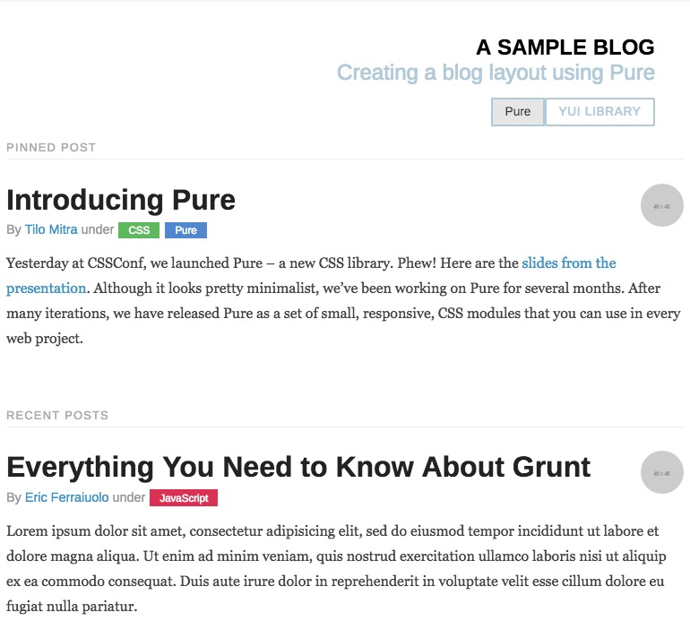

Recently I've been doing a lot of research into the myriad of design systems out there, and I stumbled upon Pure CSS, a tiny CSS framework with only essential modules for creating sites. I've been wanting to experiment with Styled Components, and I thought converting the CSS framework into React components would be an fantastic exercise to flex a few skills. And Pure CSS was so small and modular, it was perfect for translating into CSS-in-JS.

Ultimately, I was able to create a complete React component system in ***only* 135 KB of code 😳🤯  *(not minified/gzipped, but also not including peer dependencies like React and styled-components).*

## How to use

You can install this into your project today [using npm](https://www.npmjs.com/package/pure-styled-components):

`npm i pure-styled-components`

> Make sure you have all the peer dependencies installed: React, styled-components, and styled-system. `npm i react react-dom styled-components styled-system`

Then just import the components you need:

```js
import React from 'react'
import { Base, Grid, Button, Menu } from 'pure-styled-components'

function App() {
  return(
    <Button>Click Here</Button>
  )
}
```

Here's [a CodeSandbox](https://codesandbox.io/s/5z90r1rkjx) setup with an example blog layout:

<iframe src="https://codesandbox.io/embed/5z90r1rkjx" style="width:100%; height:500px; border:0; border-radius: 4px; overflow:hidden;" sandbox="allow-modals allow-forms allow-popups allow-scripts allow-same-origin"></iframe>



Check out [the Github repo here](https://github.com/whoisryosuke/pure-components) if you're interested in contributing or forking the code.

## Why make *yet another* React UI kit?

There's a repo out there for [pure-components](https://www.npmjs.com/package/pure-components), but it requires you to import the CSS yourself.

To make the components more modular, I opted to use CSS-in-JS. This allows you to import only the Button into your app and have everything you need to display it (rather than possibly figuring out some Webpack config for CSS). 

## The Process

At first I outlined a few goals for the component system:

* **✨ Keep it simple.** Just like Pure CSS, the bundle size should be minimal, and performance should be high.
* **🔧 Minimal API.** Too many components and props gets confusing and provided excessive overhead. Should be an easy to use library that's extensible for users seeking more complexity.
* **♻️ Recycle**. Use as much of Pure CSS as possible. Upgrade what conflicts with React.
* **📚 Documentation**. The docs should be auto-generated from the JSDoc formatted comment blocks inside the code.

### Components

Here's the final list of components I ended up with:

- Base
- Button
- Form
- Grid
- Grid.Unit
- Menu
- Menu.Header
- Menu.Item
- Dropdown
- Table

After analyzing the CSS and seeing what could be broken down, I came down to basically a component for each Pure CSS module, with a couple extra to provide more semantic component-based alternatives to DOM elements and Pure's required classnames.

### Menu

The Pure CSS menu is made of up "headers" and the menu "items" themselves. Rather than using class names here, I opted to create sub-components. Using `<Menu.Header>` is the equivalent of `<div class="pure-menu-header">`. It's probably less performant than just using class names, but the semantic sugar it adds on top makes assembling and reading the source code more human-friendly.

In order to create the sub-component in React, you have to filter through the component's children and check if the child's name matches the component you're looking for:

```js
import React from "react";

/**
 * Loops through children and adds provided props to specified component
 *
 * @param {React.Children} children - React Component's children
 * @param {React.Component} component - Component to filter children by
 * @returns {React.Children}
 */
const findByType = (children, component) => {
  const result = [];
  const type = [component.displayName] || [component.name];
  React.Children.forEach(children, child => {
    const childType =
      child && child.type && (child.type.displayName || child.type.name);
    if (type.includes(childType)) {
      result.push(child);
    }
  });
  return result;
};
export default findByType;
```

This worked great inside the component to render a single sub-component:

```js

class List extends React.Component {
  renderList() {
    const { children } = this.props;
    const list = findByType(children, List);
    const items = list.map(listItems =>
      listItems.props.children.map(item => (
        <Item className="item" key={item.props.children}>
          {item.props.children}
        </Item>
      ))
    );
    if (!list) {
      return null;
    }
    return <List className="list">{items}</List>;
  }
  render() {
    return(<div>{this.renderList()}</div>
  }
}

```

The only issue with this method was that the heading and list would be rendered separately, so you could only render one heading at a time. With a bit of refactoring, I ended up with this method to render both:

```js
class BaseMenu extends PureComponent {
  renderMenu() {
    const { children } = this.props;

    const listType = [List.displayName] || [List.name];
    const headingType = [Heading.displayName] || [Heading.name];
    const items = React.Children.map(children, child => {
      const childType =
        child && child.type && (child.type.displayName || child.type.name);
      if (childType.includes(listType)) {
        return child.props.children.map(item => (
          <Item className="item" key={item.props.children}>
            {item.props.children}
          </Item>
        ));
      }
      if (childType.includes(headingType)) {
        return <Heading className="heading">{child.props.children}</Heading>;
      }
    });
    if (!items) {
      return null;
    }
    return <List className="list">{items}</List>;
  }

  render() {
    const { className } = this.props;
    return (
      <nav className={className} {...this.props}>
        {this.renderMenu()}
      </nav>
    );
  }
}

BaseMenu.Heading = Heading;
BaseMenu.List = List;
BaseMenu.Item = Item;
```

### Dropdown

The `<Dropdown>` was another component that was created because it's functionality could be handled purely through CSS, but in React we may want to alter the traditional functionality using Javascript event handling. When I finished the first version (1.0) of the component system, it included a pure CSS dropdown. I immediately noticed that it wasn't as accessible as I preferred for keyboard inputs, and I upgraded the component to use React state (with the CSS as a fallback).

The dropdown (presentational component working off props):

```js
const showDropdown = ({ active }) => {
  if (active) {
    return `display:block;`;
  }
  return ``;
};

/**
 * Dropdown used in `<Menu>` component
 *
 * @param {*} { className, children }
 */
const Dropdown = styled(BaseDropdown)`
  display: none;
  position: absolute;
  left: 100%;
  top: 0;
  margin: 0;
  padding: 0;
  z-index: 3;

  ${props => showDropdown(props)};
`;
```

The menu item (container component with state, passed to dropdown as props):

```js
class BaseItem extends PureComponent {
  constructor(props) {
    super(props);
    this.state = {
      active: false
    };
  }

  /**
   * Toggles active state of dropdown
   *
   * @memberof BaseItem
   * @private
   */
  handleDropdown = e => {
    const { active } = this.state;
    this.setState({ active: !active });
  };

  /**
   * Renders all child elements
   * and applies state as props to nested Dropdown menus
   *
   * @memberof BaseItem
   * @private
   */
  renderDropdown = () => {
    const { children } = this.props;
    const { active } = this.state;

    /**
     * Find Dropdown components and add active state as prop
     */
    const propsToAdd = { active };
    const elements = addPropsToComponent(children, Dropdown, propsToAdd);
    if (!elements) {
      return null;
    }
    return elements;
  };

  render() {
    const { className, classes } = this.props;
    return (
      <li
        className={`${className} ${classes}`}
        onMouseEnter={this.handleDropdown}
        onMouseLeave={this.handleDropdown}
        onFocus={this.handleDropdown}
        onBlur={this.handleDropdown}
      >
        {this.renderDropdown()}
      </li>
    );
  }
}
```

> I kept this as a Pure Component because React's Hooks are still in alpha stage and only available in the latest versions. By opting for an older (but still supported) API, these components can be used in a wider range of projects.

### Grids

Since `<Grid>` is basically a flexbox container, the `<Grid.Unit>` actually specify each columns width. And since it's accomplished more efficiently using CSS-in-JS, the process is handled by a React component with props (as opposed to adding classes `.pure-u-1-2`).

Pure CSS provides a hard-coded 5 and 24 column grid. Using Grunt, you can customize the grid to any other column count. Rather than bloat the code with each column's class, I created a Javascript function to return the column width on demand. By providing an array of the column size and number of columns, you can generate a column for any grid, any time:

```js
/**
 * Calculates width of a grid element.
 *
 * Accepts an array of two numbers, the column size
 * and total number of columns (respectively).
 *
 * Uses the total columns to determine total width,
 * then multiplies by the column size to calculate
 * current column width.
 *
 * For example: a two column grid, with 50% wide columns,
 * would be an array of `[1,2]`. 2 total columns, with a
 * column taking up 1 of the 2 (so 50%). Same as `[3,6]`.
 *
 * @param {array} columns [Column size, Number of columns]
 */
const calculateGridWidth = columns => {
  if (columns) {
    return `width: ${(100 / columns[1]) * columns[0]}%;`;
  }
};

export default calculateGridWidth;
```

### Responsive Design

I started to code my own function to generate [responsive media queries](https://www.styled-components.com/docs/advanced#media-templates) using the grid calculation function above, but I discovered [styled-system](https://github.com/jxnblk/styled-system), and it provided the same functionality I was looking for -- and a bit more I'd want to add in down the line as well. So I installed that, scrapped my code, and ran with it.

This code creates a grid with 50% column on **mobile**, 33% on **tablet**, and 25% on **desktop**:

```js
<Grid>
  <Grid.Unit width={[1 / 3, 1 / 2, 1 / 3, 1 / 4]} bg="red">Thirds</Grid.Unit>
  <Grid.Unit width={[1 / 3, 1 / 2, 1 / 3, 1 / 4]} bg="blue">Thirds</Grid.Unit>
  <Grid.Unit width={[1 / 3, 1 / 2, 1 / 3, 1 / 4]} bg="teal">Thirds</Grid.Unit>
</Grid>
```

> styled-system also provided props to control attributes like background color (seen above), font color and size, as well sizing (even padding and margin).

## Assorted Issues 😭

### Styled Components + React-Styleguidist

I had an issue where Styled Components weren't working with React-Styleguidist. I found the Styleguidist docs for 3rd party libraries and they show you have to add a `/** @component */` comment block above the styled component's export.

This made the Styled Components pop up, but now they were missing the description and prop types I had included in the code. It took me a little bit to figure it out, but I had applied the JSDocs to a "base" component, rather than the actual Styled Component. Once I moved the comment blocks and prop types over to the actual Styled Component, I was able to propagate the docs.

### Upgrades upon upgrades

I was using an older of react-styleguidist when I started, which used v6 of Babel, but my dev environment was using v7 (I recently upgraded). So my Babel config file included v7 presets that styleguidist couldn't use, and crashed it. After upgrading styleguidist to the latest version, everything worked again. 

Gotta love when you spend 10 minutes having to maintain your development environment instead of actually coding 🙃 **#productivity**

## The future 🌠

The Pure Styled Component system is stable at 1.0.3, and can be used in your apps today without any major issues (that I've been able to discover 🙊). I've imported all the components and styles from Pure CSS, so there's nothing that would really effect the API immensely. 

### Optimizations 💪

At this point, it's all about refining and optimizing any CSS I converted to Styled Components (possibly removing more class definitions, making sure all variants work, etc) -- as well as perf optimization on the React end (looking at you `React.memo()` 👀).

### Testing + Type Checking ✅

We currently have `prop-types` for minimal type checking. I'd like **full test coverage** using Jest for the components as soon as possible, and I'm even looking into refactoring into **Typescript** to leverage the static type benefits.

### Layouts + Better Docs 📚

Pure CSS features an entire section of their doc with pre-made layouts made using the framework. I converted the **blog layout** as an initial test, but I'd like to convert the rest. I'd also like to use the layouts (like the blog) in **Gatsby themes**. It'd encourage the use of the components more, and give people more empowering tools.

The docs are fairly minimal, and mostly from the Pure CSS docs themselves. I'd like **more React-focused** docs to help users with things like **theming**, extending components + **customization**, etc.

### Preact? Vue? ♻️

Since these components are very basic and mostly functional for the most part, I'd like to see how many different frontend view layers I can support with the library. **Preact** would be the first, since it's API is so close to React. **Vue** is also a priority, since it'd allow for greater "drop-in" support for the components (vs needing a build process for React's JSX).

## Create your own design system

It's always great (and easier) to use the off-the-shelf component systems like Bootstrap or Material UI. But if you're training as a UI/UX developer, it's immensely invaluable to build your own from scratch. That way you can discover all the various nuances that make the more popular UI kits as bulletproof as they are. And there's something fun about building something from scratch, instead of say, a box mix recipe.

### Design System Boilerplate 👇

If you're interested in making your own design/component system, I recommend forking my [design-system-jss repo](https://github.com/whoisryosuke/design-system-jss). It's basically a boilerplate for creating your own React component system, wired up with everything you need to develop, document, and deploy your component code. 

> Make sure to browse the branches on the repo, there are different variations of the boilerplate you can swap into (like Gatsby for docs instead of Styleguidist).

Let me know what you think about the components and if you have any issues feel free to comment below [(or open an issue on Github)](https://github.com/whoisryosuke/pure-components/issues).

Enjoy! ✌️
Ryo

***

**References**:

* [Pure Styled Components on Github](https://github.com/whoisryosuke/pure-components)
* [Pure Styled Components on NPM](https://www.npmjs.com/package/pure-styled-components)
* [Pure CSS](https://purecss.io/)
* [StorybookJS](https://storybook.js.org/)
* [Styleguidist 3rd Parties - Styled Components](https://github.com/styleguidist/react-styleguidist/blob/master/docs/Thirdparties.md#styled-components)