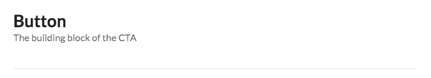

I'm a big fan of [**Semantic UI**](https://semantic-ui.com), one of the top used CSS frameworks out there next to **Bootstrap** and **Material**. I reach for it so often because of how flexible it is. If I need to work on an old project that uses jQuery, it integrates perfectly. Likewise, if I'm working on a modern project using React, I can use the [Semantic UI React](https://www.notion.so/whoisryosuke/87ac2b52857b44cb9b8ab7bc0039d5be?v=c88b545303694aaf88c4b205117c423a) components. And when you work with enterprise level clients, you can often find yourself in **_both_** situations, needing to **unify the design system across the brown and greenfields.**

I developed this documentation for Semantic UI because I wanted to provide clients a white labeled design system and style guide that created a unified design language across old to new apps.

In order to do that, I had to redesign the docs from the ground up. The current Semantic UI docs are limited to the one version or the other — and written in DocPad (not the best SSG). This documentation redesign would encourage more authoring through Markdown and HTML, as well as React components using MDX.

🔌 [Clone the repo on Github here to get started](https://github.com/whoisryosuke/semantic-ui-docs-gatsby)

## ⚙️ How to use

For those interested in using this documentation for their own project, I urge you to [check out the README](https://github.com/whoisryosuke/semantic-ui-docs-gatsby#how-to-use). It has detailed instructions on [how to create new pages](https://github.com/whoisryosuke/semantic-ui-docs-gatsby#creatingediting-pages), [editing the sidebar menu](https://github.com/whoisryosuke/semantic-ui-docs-gatsby#editing-the-sidebar), and other common tasks ([using images](https://github.com/whoisryosuke/semantic-ui-docs-gatsby#add-images), [code snippets](https://github.com/whoisryosuke/semantic-ui-docs-gatsby#adding-code-snippets), etc).

But for those interested in **how** I created this and **_why_**, please read on! 📖👇

## 🏚 The SUI docs need improving

I mentioned that the current SUI docs are written in [**DocPad**](https://docpad.bevry.me/). It was one of the first static site generators (SSG) for NodeJS. It definitely works - I was capable of spinning up the docs (~~after some tinkering without a good README~~), and I could edit content using the `.eco.html` template files.

I had some issues with it, and there were many areas to improve:

- A lot of the HTML contains broken/misformed elements that only work because of how foolproof HTML rendering can be. Using React and a better linting environment (ESLint + Prettier) allows me to check if HTML and even Markdown is written to standard, and also ensure no code is committed that would break convention (or compilers).
- The SUI docs are slow and a bit bloated. Gatsby offers optimizations it could use (like image resizing/loading, offline caching, etc) to make it much faster and accessible on slower internet connections.
- Semantic UI's development has slowed and even split to a separate repo called Fomantic UI, which contains even more components and bug fixes. There were some FUI components that I needed for projects (like a calendar module), and I wanted to ensure these were included in the documentation. I could have just used the FUI docs, but those were the same as SUI (using Docpad).

## ⚛️ Why use Gatsby?

Gatsby provides a better ecosystem for the use of SUI React components, which is a more modern option for SUI developers. However, much of the SUI React documentation is also reliant on the old CSS/jQuery docs — making both in one place more convenient. And Gatsby makes that possible with it's unified content layer, allowing me to import HTML directly, import and parse Markdown, or query an API and use that.

It also encourages more contribution using Markdown for content rather than HTML based templates. Regular tasks such as writing code examples are much simpler and streamlined using Markdown. And authors still have the option to "eject" and use ReactJS pages for more complex or dynamic pages.

Overall, it's a good opportunity to re-approach SUI docs and refresh them to make them resemble a modern design system (with tokens, principles, etc).

## 👨‍💻 The process

I spun up a new Gatsby project from one of their basic starters to start as fresh as possible. I extended it with necessary plugins, like SASS/LESS (for importing SUI directly from source).

I designed a basic layout using an old [Semantic UI dashboard HTML/CSS template](https://codepen.io/whoisryosuke/pen/LJxKKb) I had, but had to adapt it to use Semantic UI React components instead, since some functionality was JS based. The layout was very easy to recreate considering SUI provides most of the styling. I extended the site configuration to define the sidebar navigation in `gatsby-config.js`, allowing the user to manually create their own menu list.

Structured the content of the documentation using [Style Guide Guide](https://www.notion.so/whoisryosuke/87ac2b52857b44cb9b8ab7bc0039d5be?v=c88b545303694aaf88c4b205117c423a) and looking at how various other design systems handle topics (from colors, to typography, to components).

### Testing out HTML (and switching to MDX)

SUI comes [with HTML examples inside the repo](https://github.com/Semantic-Org/Semantic-UI/tree/master/examples). They're just HTML files with a "kitchen sink" of components (written in HTML/CSS with some jQuery sprinkled in). I thought I'd use Gatsby to load them into GraphQL and create pages based on that. This _worked_, but the examples weren't comprehensive enough to use alone. I opted to go for 1:1 copy of content from the SUI docs instead.

Before I had completely settled on using Markdown for content, I tried using Gatsby without MDX. Copying the HTML from the SUI docs into React components revealed how broken it was, and required a lot of cleaning up (closing `
`s that never were, fixing misspellings of attributes, and any common React gotchas like self-closing inputs and images). Then there was the task of showing code snippets inside React, and having to reference them as string literals.

It was just _a mess_, and made authoring documentation much more difficult than it needed to be. **Switched over to MDX partially through**, and was able to knock out 5 pages of MDX docs in the _same time_ as 1 ReactJS page.

### Copying old docs content to Markdown

Now that MDX was being used, [I used a Chrome extension I created called "Copy to Markdown"](https://github.com/whoisryosuke/chrome-copy-as-markdown/blob/master/README.md) to create documentation pages quickly. I would go to the component page on the official SUI docs, select the content area, right click - copy as Markdown, and then paste into an MDX file. The extension converts HTML elements like `<h2>` to equivalent Markdown (`##`). I would go back to the official docs, view source, copy each example into the appropriate section, and wrap it in the Markdown code syntax (`html live=true`).

This worked great, but still required some fine tuning. I ended up just copying the entire content area source code and using VSCode's find and replace to convert the HTML to Markdown, which ended up being faster in some cases, but difficult in others where headings were used inside examples. Ultimately went back to the first technique using my Chrome extension.

### Making MDX Components _(aka Wordpress Shortcodes)_

MDX allows you to import components into it's global scope that can be used anywhere in the MDX file (rather than importing manually). This also enables you replace DOM elements that MDX would parse Markdown into (like a `<Heading>` element instead of `<h1>).`

The first component I created was a `<CodeBlock>`, which displayed either a live React-based code editor (showing code + live preview) or a simple syntax highlighted code block. MDX made it easy to swap out any reference of `<code>` when the MDX is rendered with my own component. So when I type code examples in Markdown, it wraps it in my React component instead.

I also added a `<Masthead>` component to easily create page headings for documentation pages (instead of duplicating the HTML/logic across MDX files, it's encapsulated in a reusable component).

### Restructuring for modularity 🔨

Originally, I had the documentation nested inside of another Semantic UI installation folder. I liked the idea of having the documentation in the same repo as the component library (as opposed to separate how it is now). I colocated all the MDX files with their components, as well as added Storybook stories with examples of each. Each MDX file would be in the same folder as the LESS source. Gatsby was located in a `/docs/` folder, which reached "above" itself into the parent SUI folder, and grabbed all the MDX files from the `/src/definitions` folder.

As much as this structure worked and kept things logically organized for a new design system, I had to abandon this structure to ensure this documentation was more modular. Rather than requiring someone to fork a new SUI repo with MDX docs inside it, this Gatsby repo would be fully independent (besides any CSS/styling provided by SUI). Now the MDX files are located in a `/content/` folder in the docs repo. This Gatsby documentation can be installed anywhere, inside or outside a project, and the user simply has to import their themed SUI CSS from a file or dependency.

## 😫 Unresolved Issues

### Using jQuery in React.

I haven't figured out an elegant solution for running vanilla JS or jQuery code for examples, particularly embedded inside an MDX file. Not sure how some examples might work when combined with React's shadow DOM, have to make sure nothing breaks it.

## Final thoughts

I don't envision Semantic UI or Fomantic UI adopting this, but I hope it serves as a case study and inspiration for any contributors eventually interested in or assigned the documentation redesign.

Regardless, **this is a great template for SUI-based docs.** I can see a few projects I'd like to use it for as an alternative to something like Docusaurus or Docz for quickly spinning up flat-file based sites. Please feel free to use for your own projects.

I'm thinking about converting this to Gatsby theme for easy reusability and extensibility. Let me know if you're interested in something like that! 🙌

## References

- [Github Repo: semantic-ui-docs-gatsby](https://github.com/whoisryosuke/semantic-ui-docs-gatsby)
- [Live Example: semantic-ui-docs-gatsby](https://semantic-ui-docs-gatsby.netlify.com/)
- [Semantic UI](https://semantic-ui.com/)
- [Semantic-UI-Docs](https://github.com/Semantic-Org/Semantic-UI-Docs)
- [Alternative SUI Gatsby Starter](https://www.gatsbyjs.org/starters/fabien0102/gatsby-starter/)
- [Fomantic UI](https://fomantic-ui.com/)
