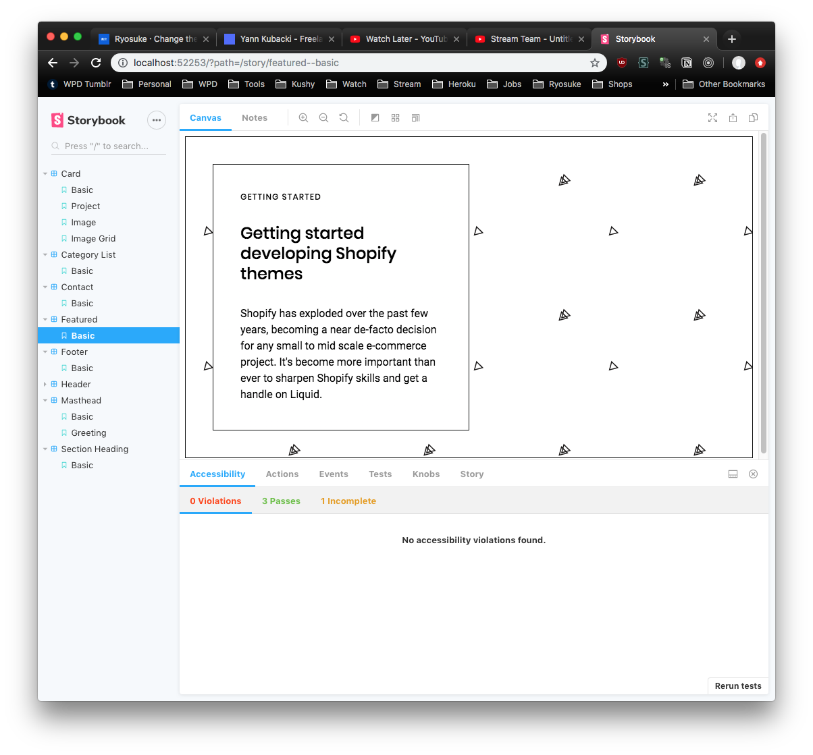
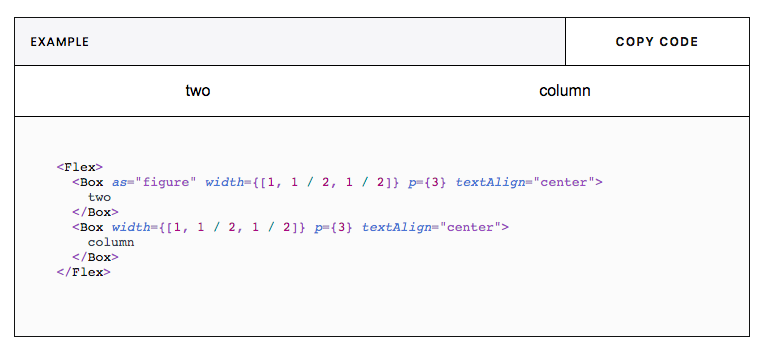
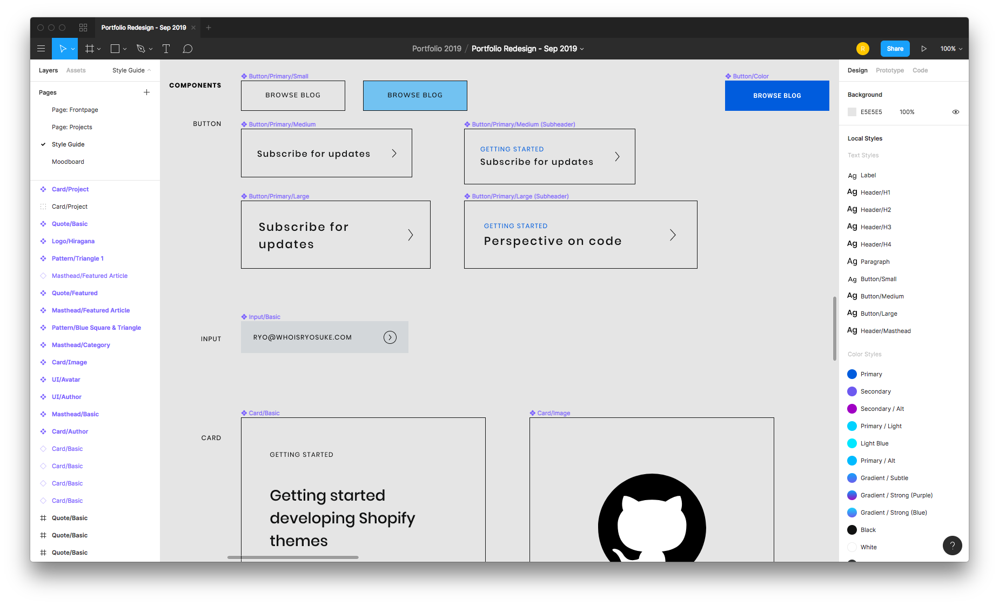
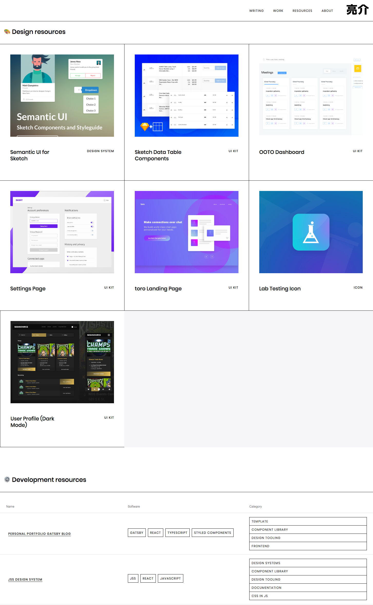
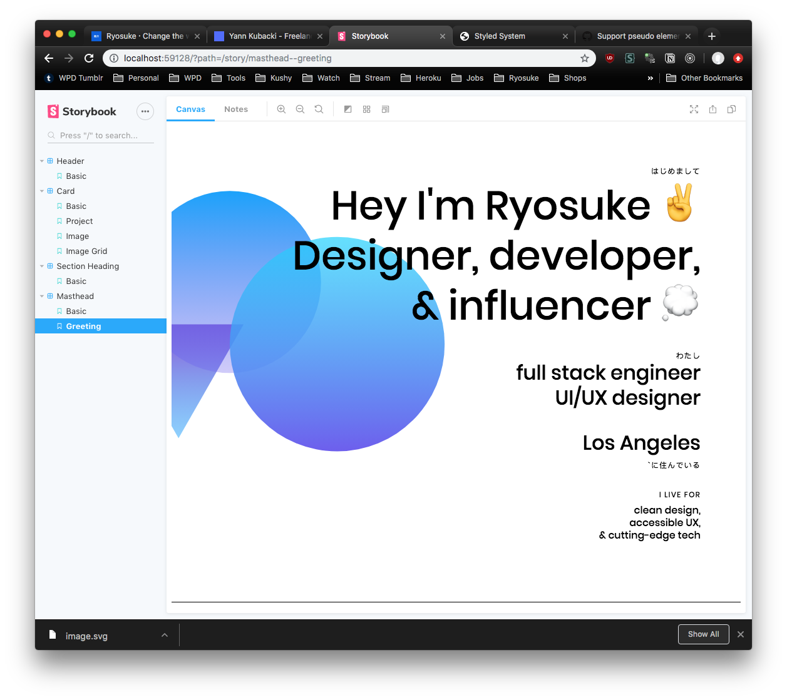

If you're a regular user of my blog, you'll notice that I finally had the time to redesign my site from the ground up. I made my first commit on March 30, 2018 and launched the site soon after on April 5. After a year of working extensibly with React and Gatsby-based sites, and my deeper endeavors into the design system space, I wanted to take my new experience and channel it into a new interface for my personal content.

And the old site was looking, well, **_old_**.

The redesign is **elevated** and **_overengineered_** with a purpose — to serve as a **boilerplate for future Gatsby projects** and provide an example for others looking to design from the ground up.

🔗 [Peruse my source code (and star 🌟) my Github repo here.](https://github.com/whoisryosuke/ryosuke-gatsby-blog/)

## 🎯 The goals

I set out with a few goals in mind to establish the boundaries of the design. It provides greater context when researching and accruing inspiration in a mood board. It also serves as an excellent anchor during the design process to ensure nothing embarks too far from the original intention.

### It should be:

- **Interactive**, but not overly invasive. Should accompany actions, or encourage engagement.
- **Content first**, _photos come second_. Blog and more development-based work will rely on more text based layouts.
- **High design** giving an impression of art gallery, high-end portfolio, etc.
- **Japanese influenced** with it's typography and use of selective RTL (vs LTR).
- **Design system** focused from the ground up.

## ✨ The new features

With the goals laid out, I also tried to envision what new aspects of the site I'd have to design and develop. It allowed me to answer the question:

> _"What do I need from the website, and what would that require practically?"_

I laid out a clear vision for the tech stack:

- **Gatsby v2** as the framework
- **Storybook** for developing in isolation
- **MDX** for authoring rich, React and Markdown-based content
- **Design System** using Styled Components and Rebass
- **Typescript** for the Design System
- **Free Resources** using JSON + Gatsby GraphQL

### Gatsby v2

The original site design was created using **Gatsby v1**. The website was working great, build times were fine for the scale.

In this particular case, v2 of Gatsby meant faster build times (thanks to optimizations + Webpack v4), fixed security issues with dependencies, and any funky bugs that have gotten patched.

[I live tweeted the entire process here](https://twitter.com/whoisryosuke/status/1178759707374129152) so you can see what kind of issues I encountered along the way. Honestly, just reading [the Gatsby migration guide](https://www.gatsbyjs.org/docs/migrating-from-v1-to-v2/?no-cache=1#install-react) enough to solve 80% of the issues immediately.

### Storybook

Since I wanted to design components first, I wanted to leverage [\*\*Storybook](http://storybook.js.org)\*\* and it's ecosystem. It's an amazing tool for design systems or component libraries, offering a lot of fantastic utilities outside of the simple hot-reloading setup. Namely, the accessibility tools are indispensable, allowing you to ensure each component passes accessibility standards (from WCAG to color blindness).

Some people call it Storybook Driven Development, and it's been growing on me as a more refined workflow.

### MDX

I've been working a lot with [**MDX**](https://mdxjs.com) recently since I work with design systems and documentation, which benefit immensely from it. MDX is like Markdown, but allows for the use of React components inside your files by writing JSX.

This was pretty mind-blowing discovery when I first encountered it, since I come from a Wordpress background, and this seemed like the shortcodes there. I'm a huge fan of things like shortcodes when it comes to CMS and content authoring, it empowers the writer to create more dynamic and engaging posts using off-the-shelf components. And it's ability to simply use React components minimizes any overhead of having to create any specific "shortcode" templates.

After seeing a few blogs by [Amelia Wattenberger](https://wattenberger.com/blog/react-hooks) and how she creates incredibly interactive and engaging components to showcase her content. It increases comprehension and overall enjoyment of the user. I wanted to take my previous skills making shortcodes for CMS like Wordpress or Kirby, and try designing better layouts for common content patterns (like code blocks, side by side examples, graphs, etc).

One of the first and easiest components I added to MDX was a live code editor. I add a `live` parameter to my Markdown code blocks and it renders a React component that displays the highlighted code alongside a live preview. This lets users get immediately engaged in the code, rather than having to fork it, make a pen/sandbox, etc.

### Design System based

The entire website was developed with a design systems mindset. I started by establishing a more concise style guide using the pre-existing brand assets inside [**Figma**](https://figma.com). Figma made it easy to create color and text styles to eventually compose a component library (buttons, cards, just standard things I'd need). These components made it effortless to plug and play them as modules inside page layouts, which served as mockups for pages like the frontpage and blog archive.

The design tokens — colors, typography, spacing, sizing, and much more — were translated from the Figma design document to a Typescript "theme" file. This file contains JSON interpretations of the Figma styles, and the tokens or variables are used across the application.

    const colors = {
      text: '#111212',
      background: '#fff',
      primary: '#005CDD',
      secondary: '#6D59F0',
      muted: '#f6f6f9',
      gray: '#D3D7DA',
      highlight: 'hsla(205, 100%, 40%, 0.125)',
      white: '#FFF',
      black: '#111212',
    }

    const gradients = {
      subtle: `linear-gradient(180deg, ${colors.primary} 0%, ${colors.secondary} 100%)`,
      purple: `linear-gradient(180deg, ${colors.primary} 0%, #A000C4 100%)`,
      blue: `linear-gradient(180deg, #00D2FF 0%, ${colors.secondary} 100%)`
    }

    const fonts = {
      body: 'Roboto, Helvetiva Neue, Helvetica, Aria, sans-serif',
      heading: 'Poppins, Helvetiva Neue, Helvetica, Aria, sans-serif',
      monospace: 'Menlo, monospace',
    }

    const theme = {
      animation,
      breakpoints,
      mediaQueries: {
        mobile: `@media screen and (min-width: ${breakpoints[0]})`,
        tablet: `@media screen and (min-width: ${breakpoints[1]})`,
        computer: `@media screen and (min-width: ${breakpoints[2]})`,
        desktop: `@media screen and (min-width: ${breakpoints[3]})`,
        widescreen: `@media screen and (min-width: ${breakpoints[4]})`,
      },
      colors,
      gradients,
      fonts,
      fontSizes: [
        12, 14, 16, 20, 24, 32, 48, 64, 96
      ],
      fontWeights: {
        body: 400,
        heading: 500,
        bold: 700,
      },
    	...
    }

I also opted to use Rebass components as the basis for my React component library. Once I had to take my design to code, to expedite the development process, I wasn't interested in recreating all the "base" components (like buttons or form elements). Rebass allowed my to extend it's fairly un-opinionated and un-styled components to make my own.

With Rebass, also came Styled System, an opinionated way of theming components using Emotion or Styled Components. It's kind of like utility CSS meets CSS-in-JSS, where you can provide any component props like `width={[1,1/2,1/3]}` to set the width responsively. This would make a width of 100% on the smallest viewport, and 33% on the largest. You can also define these responsive parameters, as well as other styling/CSS parameters, inside the theme file as "variants". This allows you to create things like `<Box variant="card.basic">` , which would apply card-like styling based on what you define in the theme file.

    const theme = {
    	...
      // rebass variants
      text: {
        header: {
          fontFamily: fonts.heading,
          lineHeight: '1.25',
          fontSize: [3, 3, 4, 5],
          marginBottom: 3,
        },
        subheader: {
          fontFamily: fonts.heading,
          lineHeight: '1.25',
          fontSize: [2, 2, 3, 3],
          marginBottom: 3,
        },
      },
      variants: {
        card: {
          p: 2,
          bg: 'background',
          boxShadow: 'card',
          avatar: {
            width: 'avatar',
            height: 'avatar',
            backgroundSize: 'cover',
            backgroundPosition:'center',
            marginBottom: "3rem"
          }
        },
    	},
    	...
    }

This made working with Styled Components a bit easier, since re-composing or extending styles can be a little odd due due to the sheer simplicity of the framework. Normally you'd create a file with CSS literal blocks containing re-usable styles across components, or even functions that act as SASS-style "mixins" that return CSS literal blocks. But once you read up on how Styled Components works, you'll find it basically does all this under the hood for you with [Styled System](https://styled-system.com/), and keeps your theme file as the source of truth for reusable styles (instead of disparate JS files).

### Typescript

I've been working with more Typescript projects as it's popularity and use grow, and what better place to continue my practice than my own blog. I also wanted to take the opportunity to experiment with how Typescript can be integrated with design systems and how much it offers to the developer experience.

In a recent talk by Isha Kasliwal, [she discussed the benefits of using TS in design systems](https://www.youtube.com/watch?v=hbsIOHktvfo). I was already on this wavelength, and seeing a talk on it just reiterated the need to experiment more with it.

### Free resources

As someone who benefits regularly from free resources, I like to create free resources and assets to contribute back to the community as much as possible. I've been doing it for years on a variety of different platforms (stock photo sites, Github, Uplabs/Dribbble) but I never really had a place for to aggregate them on my personal website.

I had to decide if I'd like to **curate** or **aggregate** the content. Gatsby makes either easy with it's content mesh and various source plugins, but I wanted to ensure whichever avenue I picked would be simple, effective, and future-proof.

At first, you might say: "hey you need Github repos, why not pull from the API?". Since my resources were so disparate across many different platforms (like Gitlab in some cases), and I didn't want to list all my repos so I'd have to filter anyway — I opted to create [JSON files in my website's repo](https://github.com/whoisryosuke/ryosuke-gatsby-blog/blob/master/content/resources/development.json) to act as the content hub for this data. I've had experience before using the JSON transformer plugin for Gatsby, which takes JSON files and makes GraphQL endpoints out of them (pretty 1:1 too, making mocking and data structure fairly easy).

## 🎨 The design process

Branching from my goals, I started to browse design inspiration resources like Behance, Dribbble, and my Instagram Bookmarks — as well as Awwwards, [the Gatsby Showcase section](https://www.gatsbyjs.org/showcase/), basically any directory with quality websites.

I gathered links in a Trello card, as well as notes as to what particular part of the website I particularly liked, and what part of I could replicate on my own. I took copious screenshots of any sites within the spectrum of my desired aesthetic, refined them down to what was closest, and then imported into a Figma file for easy access during design.

> Ultimately I was looking to create something that channeled my background in editorial design creating print such as magazines, newspapers and eventually digital blogs.

**Strong typography**, uses or emphasize on **grids** and **design systems**, yet consistent room for **breaking the system** for **unique designs** (i.e.: magazine spreads vs simpler articles).

I primarily drew inspiration from:

- [**DesignSystems.com**](http://designsystems.com) (by Figma ironically). You'll see a bit of the core design elements of that site reflected here, like the clean and minimal aesthetic, 1px borders, and gradient shapes.
- The portfolio of [**Kwok Yin Mak**](https://www.kwokyinmak.com) was the perfect example I needed for handling vertical or Japanese text. And it exhibitied the same kind of strong typography, extra padded, and 1px borders I was vibing with. I didn't want to go full horizontal scroll, but each site component featuring images was great inspiration for MDX components later for project pages.
- **Minimal portfolios** from artists such as [Nicolas Loureiro](http://www.nicolasloureiro.com/about), [Yann Kubacki](http://yannkubacki.fr/), or even [Brent Jackson](https://jxnblk.com/) (creator of Rebass and Styled System). They all focus on a **clean aesthetic** that's composed by using a white background, solid font choice and use, and sufficient padding to give everything breathing room. There's little use of background color on any cards or sections to distinguish them, letting the background come through with the ample spacing. **Key uses of bright color add pop** and immediate emphasize components.
- [**Notion's**](https://www.notion.so/about) site and app both take **minimal, white, and _emoji 🏔_** to the nth degree — and it _works_. [Bear](https://bear.app/) is a similar app for iOS. They make reading and writing more pleasant by removing any clutter from the interface, yet providing any key functionality through intuitive UI.

## ⛓ How the app works

- Components are created using **Storybook**, which can be composed into pages or used inside blog or project posts.
- Posts are written in **[MDX** files](https://github.com/whoisryosuke/ryosuke-gatsby-blog/blob/master/content/blog/2019/codesandbox-as-gatsby-cms/index.mdx) using a mix of Markdown and JSX/React components.
- **Gatsby** is used to build a static version of the website, as well as compile any scripts to hydrate it as a PWA.
  - Gatsby uses a [few plugins to parse the MDX](https://github.com/whoisryosuke/ryosuke-gatsby-blog/blob/master/gatsby-config.js#L33-L48), cache it (since it has JS assets necessary to bundle along with MD), and then create pages for each MDX file.
  - When Gatsby places the MDX data is inside it's local GraphQL, we can run commands using `gatsby-node.js` , such as [creating slugs for MDX post titles](https://github.com/whoisryosuke/ryosuke-gatsby-blog/blob/master/gatsby-node.js#L31-L47), or [creating pages (and pagination) from MDX posts](https://www.notion.so/whoisryosuke/87ac2b52857b44cb9b8ab7bc0039d5be?v=4a13259f28dd4a9c8b2d1d08d678e96c).
  - In the app, [we define where MDX is rendered](https://github.com/whoisryosuke/ryosuke-gatsby-blog/blob/master/src/templates/blog-post.js#L149), and [we also pass along any React components](https://github.com/whoisryosuke/ryosuke-gatsby-blog/blob/master/src/layouts/Boot.tsx) we want to make globally available.
  - We also wrap the app in a `<ThemeProvider />` [component from Styled Components](https://github.com/whoisryosuke/ryosuke-gatsby-blog/blob/master/src/layouts/Theme.jsx#L58), where we'll pass in [our theme object](https://github.com/whoisryosuke/ryosuke-gatsby-blog/blob/master/src/assets/theme.ts) from `theme.tsx` that contains our app's styles (colors, typography, spacing, etc). The structure of the theme object is [dictated by Styled System](https://styled-system.com/theme-specification), and includes some styles from [my Semantic UI theme file](https://gist.github.com/whoisryosuke/9ec471295e852d7d7fdbf870d6d344b9).
  - And then Gatsby does the [rest of it's magic](https://www.gatsbyjs.org/docs/gatsby-internals/) creating a blazing fast static PWA 🔥📱
- **Netlify** is used as a CI and hosting platform, where I can deploy directly from git commits and run the `gatsby build` process. I opted to make the switch from Github Pages to glean from benefits in the Netlify ecosystem (Forms, Analytics, Branch Deploys, and more).
  - Netlify is also used as a place to test new features, bug fixes, or style changes using branch deploys. Each branch I designate is available for a live preview, which acts as a build test for production, and makes it easy to share and collaborate.
  - [Storybook is also built](http://storybook.whoisryosuke.com) using git-based deployment thanks to Netlify. I made a new site on Netlify, connected it to the same repo, changed the build script, and I had myself a Storybook subdomain (after adding a new CNAME to my domain host 😅).

## 🧐 The Hiccups

Every new ambitious project or change usually invites a slew of new issues that test a developer's patience, and ultimately elevate them to a higher level (where experience is defined by the sea of solved mistakes you leave in your wake).

This project was no exception - and most of my issues stemmed from my **_fierce need_** to rewrite everything in **Typescript**, which complicated work with any library using it's own Webpack config. Here were some of the major issues I encountered and why:

- **Changing the Webpack config** for Gatsby also required changes for Storybook's config. You can extend Storybook's Webpack config with your own projects, but since Gatsby's extension happen in a config (instead of a classic `webpack.config.js`), you can't as easily reuse configurations.
- **Netlify CMS + Typescript.** I tried to get this working to edit content locally or through the cloud (and I was already using Netlify as a host). I got it working with MDX (which took some tinkering), but the CMS wouldn't run using any Typescript components. Netlify CMS' Webpack doesn't include a loader for Typescript. I tried to create a separate MDX component scope without importing any TS files, but most of my major components are TS, meaning most of the content previews wouldn't work. Still looking into how I can extend Netlify CMS' Webpack to make TS work, or figure out a compilation process that works in development and production.
- **Netlify CMS + Subdirectories**. This was one the most disappointing, Netlify CMS doesn't support content that's nested inside a subdirectory (such as `/content/blog/your-article/index.md`). All your content needs to be in the same folder, with the file named as the slug. My content structure differed from this, since I colocate images with my content, to make it easier to delete posts without leaving media artifacts in the repo (unless the media is shared, in which it's put in the public folder). When I checked out the Github issues on this, it seems that it's been requested for months and is scheduled for the 2.0 release.
- **Gatsby + Storybook**. If you use any of Gatsby's `<Link />` components in your own components, Storybook will kick back an error [until you adjust it's config for Gatsby](https://www.gatsbyjs.org/docs/visual-testing-with-storybook/).
- **Gatsby + Remark Images + MDX.** For some reason, my MDX posts were showing doubled images, one blurred and one full size, for each image on the page. Was a small issue with the way `gatsby-plugin-mdx` works with `gatsby-remark-images` , [I was able to find the fix here.](https://github.com/gatsbyjs/gatsby/issues/15486)
- **Gatsby + MDX + Images.** I was incredibly excited to create complex layouts with `<Flex><Box>` components, which work great with text to create 2+ column layouts inside the Markdown. Once you place an image though, Gatsby does it's magic on it (making it load on scroll, trace SVG effects, etc), which causes the image to become full width and break the layout. Not sure what will be required to fix this, and it's quite a restriction on some ideas I had for MDX. I'm going to attempt swapping the Gatsby image wrapper with something more responsive with my theme, try removing Gatsby's remark plugin for MDX, or upload images to the `/static` folder and link directly to forego any Webpack loading.

## 🤩 What's next

Because of the scale of the project (and how much potential blog fodder I have), I've broken up some of the features into milestones that'll be released with an article alongside describing the process in depth.

- Accessibility (Aria Labels, Color Contrast, Mobile, UX, etc)
- Dark Mode using Styled Components + Adding Themes to Storybook
- Adding testing to components with Jest (and react testing lib vs enzyme)
- Jest Storyshots for component testing
- [Gatsby page transitions](https://www.gatsbyjs.org/docs/adding-page-transitions-with-plugin-transition-link/) + animations (`page-transitions` git branch)
- Animating SVG shapes (Greensock vs React-Spring)
- Integration Testing with Storybook
- [Component documentation with Storybook (using notes or new Storybook Docs)](https://github.com/storybookjs/storybook/tree/master/addons/notes)
- Local or cloud based CMS for editing and previewing content (Netlify CMS, Sanity, etc)

There's still a lot to do (like actually add types to `any` props), but I'm very happy with the breath of fresh air and delight I was able summon with the site's current state. If you have any feedback or issues, [feel free to hit me up on Twitter](http://twitter.com/whoisryosuke) (or in the comments on Hashnode/The Practical Dev).

Cheers
Ryo

**References:**

- [ryosuke-gatsby-blog](https://github.com/whoisryosuke/ryosuke-gatsby-blog)
- [gatsby-starter-typescript-rebass-netlifycms](https://github.com/damassi/gatsby-starter-typescript-rebass-netlifycms/)
- [ueno-gatsby-starter](https://github.com/ueno-llc/ueno-gatsby-starter)
- [DesignSystems.com](http://designsystems.com/)
- [GatsbyJS](http://gatsbyjs.org)
- [GatsbyJS - Migrating from v1 to v2](https://www.gatsbyjs.org/docs/migrating-from-v1-to-v2/?no-cache=1#rename-responsive-image-queries)
- [StorybookJS](http://storybook.js.org)
- [RebassJS](https://rebassjs.org)
- [Styled System](https://styled-system.com)
- [Styled Components](http://styled-components.com)
- [Kwok Yin Mak](https://www.kwokyinmak.com)
