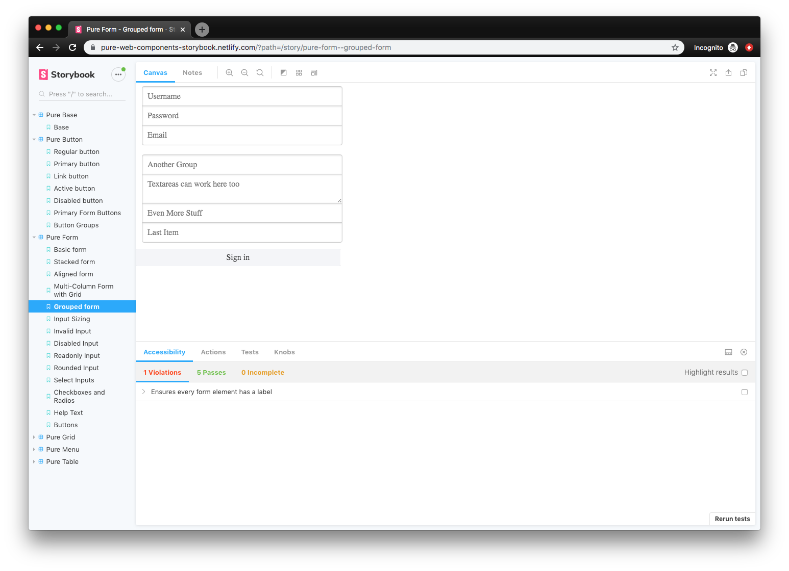
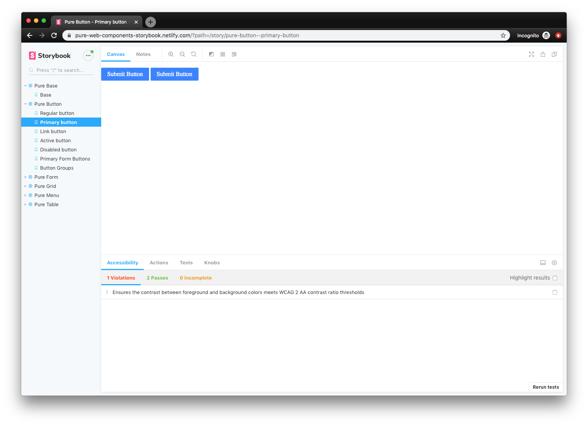

I've been diving deep recently into the world of Web Components using StencilJS. As a developer with plenty of experience designing React components, I wanted to try my hand at the native equivalent. And when I'm working with component libraries and design systems, I prefer to use StorybookJS, an isolated development environment, to receive instant feedback from my code (visuals, testing, and more).

Storybook supports React, Vue, Angular, and even "HTML" components out of the box, however, there is no official documentation as of yet for web components. After digging through Github issues, repos, and doing some testing myself — this is the process I found that works best integrating StencilJS web components with StorybookJS.



📓 Check out [my source code here](https://github.com/whoisryosuke/pure-web-components) if you prefer raw code over exposition.

## ✏️ What is StencilJS?

[StencilJS](https://stenciljs.com/) is a tool chain for building web components. It's like [lit-element](https://lit-element.polymer-project.org/), from Google and the Polymer team, which offers utilities and decorators to easily bootstrap Web Components to [the W3C standard](https://github.com/w3c/webcomponents). But StencilJS brings more to the party than lit-element, and handles every other part of the process: building components, auto-generating documentation, or even unit and E2E testing. With it's CLI, you can instantly create standard web components complete with Typescript component, CSS or SCSS, and E2E Typescript testing files - all with a single command. It's very intuitive, and takes away all the tedious boilerplate from every part of the process working with web components.

From someone who has had to setup new projects in the past and deal with the long and laborious process of configuring an entire build and test suite for an app or library — I never want to do it again if I can help it. That's why I love CLIs like create-react-app, [NextJS](http://nextjs.org), [GatsbyJS](http://gatsbyjs.org), StorybookJS (see below), [tsdx](https://github.com/jaredpalmer/tsdx), or [create-react-library](https://www.npmjs.com/package/create-react-library). You run a command and you have a project ready to go, whether it's React, Typescript, or in this case Web Components.

## 📖 What is StorybookJS?

[StorybookJS](https://storybook.js.org/) is a tool that allows you to develop UI components in isolation. It's often used with React, Vue, or Angular — but it can even be used with HTML and CSS. You write essentially integration tests that are called "stories" that import your components and display them separately (or in groups).

These components can be browsed in documentation-style site, where each is listed in the left sidebar and displayed in isolation on the right. There are a few plugins you can install to add more layers of analyzation and testing to the Storybook interface, like "knobs" to change the text or colors props of components, or an accessibility analyzer that reports WCAG/a11y violations (like color blindness or aria attributes).

I use Storybook for all my projects that have component libraries. It's a great way to work on an app's components without running the entire app and it's build process. You can build an output of your Storybook to upload online, I tend to set this up with Netlify to automatically deploy a new Storybook documentation site on every commit. This allows anyone on the team to see and play with the components, copy code snippets, and test it.

## 🔬 Integration Tests > HTML files

I prefer using Storybook over [Stencil's default setup](https://stenciljs.com/docs/www) of HTML files importing the the distribution bundle for a myriad of reasons. **Stories are essentially integration tests**, displaying components in isolation (alone or alongside others). You can mimic this with HTML files, but Stencil's build system is setup to create a web app. Meaning Stencil only builds a root `index.html` file that should contain a SPA (or single page web app), requiring you to "kitchen sink" all your components on one page to preview them.

The benefits of Storybook don't end there:

- **Dashboard for browsing all stories.** This is usually deployed to Netlify to allow any team member to browse the component library.
- **Background testing.** Allows you to quickly change the background color of the window to see how components look on different colors.
- **a11y/WCAG testing**. Developers receive warnings when components don't meet standards (like color contrast - see below).
- **Color blindness simulation.** Allows you to "see" what various forms of color blindness perceive.
- **"Knobs"** allow user-inputted content for fast dynamic testing or even mocking (see below).
- **Source code is displayed** for developers to quickly copy/paste.
- **"Component Story Format" or CSF** allows you to write stories as variables (e.g. `export const YourStory = <your-component></your-component>`), which enables you to **reuse the stories in other places** that can read JS (like other tests or tools).
- **Hot module reloading.** A _must_ for any fast paced project. Although this is easy to do with VSCode's Live Server extension and using Stencil's build system (`npm run start` aka `stencil build`). Using `npx http-server www` also works if you don't use VSCode or don't want to install an extension.



You can see the accessibility tab of Storybook in action here notifying that colors don't meet the WCAG standard.


Using "knobs", anyone with access to the Storybook can input custom content into designated areas of your components (like swapping a button's text or an input's number value).

Storybook also [offers a way to generate documentation based on MDX files](https://github.com/storybookjs/storybook/tree/master/addons/docs/html) now if you needed a quick solution for that.

## 🎛 Using Stencil Web Components with Storybook

There are two ways to use Web Components with Storybook, and depending on when you read this article, one will be better than the other.

The first option is using [**Storybook for HTML**](https://storybook.js.org/docs/guides/guide-html/), which works, but you'll see is _a little hacky._

The second option is to use (the currently alpha) [**Storybook for Web Components**](https://github.com/storybookjs/storybook/tree/next/app/web-components). Since it's in alpha, it's still being developed and unstable, but if you read this in a few months it may be in beta or better. Make sure to check the official Storybook website, if the docs aren't there, it's still in progress.

I used **Storybook for HTML** because it was the more common approach when I researched the issue, and the Web Components package was so far in alpha I couldn't bring myself to use it on my project (had to move fast, alpha means no docs lots of bugs).

Since I won't be covering it here, if you're interested in pursuing **Storybook for Web Components**, there's [a great write up and example repo from the Open WC.](https://open-wc.org/demoing/)

## ⬇️ Install Storybook for HTML

I followed [the guide on the Storybook docs for a manual setup.](https://storybook.js.org/docs/guides/guide-html/#manual-setup) You basically install Storybook, add a script to start Storybook in your `package.json`, and create a config file that points to your story files.

Here's a sample config that looks inside your `./src` folder (where Stencil keeps components) for any file appended with the `.stories.tsx` extension:

```js
const req = require.context('../src', true, /\.stories\.tsx$/)
function loadStories() {
  req.keys().forEach(filename => req(filename))
}
configure(loadStories, module)
```

## ⚙️ Setting up Storybook for Web Components

Once Storybook for HTML is installed

1. Use [concurrently](https://www.npmjs.com/package/concurrently) to start the Storybook server and `stencil build --watch` "in parallel"
2. Start `storybook` with the `-s dist` flag, so that your Stencil `dist` is served as static files.
3. Configure `.storybook/preview-head.html` to include a script tag like:

```js
<script type="module" src="/your-web-components/your-web-components.esm.js"></script>
<script nomodule="" src="/your-web-components/your-web-components.js"></script>
```

And... that's it! The out-of-the-box `html` support works for all your web component needs.

### 📦 Enjin method

Or if you prefer better hot reloading support, [try this setup by Enjin Web Components](https://github.com/MadnessLabs/enjin-components) (see below). It builds Storybook and Stencil in parallel using `npm-run-all` (similar to above), [then copies your distribution build using Webpack](https://github.com/MadnessLabs/enjin-components/blob/master/.storybook/webpack.config.js), and [integrates Jest testing with stories.](https://github.com/MadnessLabs/enjin-components/blob/master/.storybook/config.js#L3-L10)

1. Install dependencies we need for Webpack: `npm install copy-webpack-plugin npm-run-all write-file-webpack-plugin --save-dev`
2. Use [npm-run-all](https://www.npmjs.com/package/npm-run-all) to run the Storybook server and the "start" script (`stencil build --watch`) "in parallel":

```bash
npm-run-all --parallel start storybook
```

3. Create a Webpack config to copy your distribution component bundle and each component's JS/CSS distribution file in `/.storybook/webpack.config.js`:

```js
const fs = require('fs')
const path = require('path')
const CopyPlugin = require('copy-webpack-plugin')
const WriteFilePlugin = require('write-file-webpack-plugin')

module.exports = async ({ config }) => {
  // Replace pure-web-components with your web component libary name
  config.entry.push(path.join(__dirname, '../dist/pure-web-components.js'))
  fs.readdirSync(path.join(__dirname, '../dist/collection/components')).map(
    function(file) {
      jsFilePath = path.join(
        __dirname,
        `../dist/collection/components/${file}/${file}.js`
      )
      try {
        if (fs.existsSync(jsFilePath)) {
          config.entry.push(jsFilePath)
        }
      } catch (err) {
        console.error(err)
      }

      cssFilePath = path.join(
        __dirname,
        `../dist/collection/components/${file}/${file}.css`
      )
      try {
        if (fs.existsSync(cssFilePath)) {
          config.entry.push(cssFilePath)
        }
      } catch (err) {
        console.error(err)
      }
    }
  )

  config.plugins.push(
    new CopyPlugin([
      {
        from: '**/*',
        to: './',
        context: 'dist',
      },
    ])
  )

  config.plugins.push(new WriteFilePlugin())

  return config
}
```

4. Then import your stories inside `/.storybook/config.js` (I keep my stories co-located inside component folders with a `.stories.tsx` filename). This also includes configs for common plugins as well (make sure to also import and register them in `/.storybook/addons.js`):

```js
import { configure, addDecorator } from '@storybook/html'
// import { withKnobs } from "@storybook/addon-knobs";
// import { withA11y } from "@storybook/addon-a11y";
// import { withTests } from "@storybook/addon-jest";
// import results from "../jest-test-results.json";

// addDecorator(
//   withTests({
//     results,
//     filesExt: ".spec.ts"
//   })
// );

// Add a11y support
// addDecorator(withA11y);

// Add knobs to all stories
// addDecorator(withKnobs);

const req = require.context('../src', true, /\.stories\.tsx$/)
function loadStories() {
  req.keys().forEach(filename => req(filename))
}
configure(loadStories, module)
```

5. The `/.storybook/addons.js` for reference:

```js
import '@storybook/addon-a11y/register'
import '@storybook/addon-actions/register'
import '@storybook/addon-backgrounds/register'
import '@storybook/addon-jest/register'
import '@storybook/addon-knobs/register'
import '@storybook/addon-notes/register'
import '@storybook/addon-options/register'
import '@storybook/addon-viewport/register'
```

And you should be good to go! Storybook setup with a standard Stencil project — ready to design, test, and showcase web components in isolation!

## 🎨 Design in Isolation

Web Components, when combined with tools like Stencil or Storybook, enhance the user experience to a usable and even competitive point to frameworks like React or Vue. I hope this helps enhance your component design process, expedite development, and encourage more accessibility and collaboration with your team.

If you have any questions, feel free to ask in the comments or [hit me up on Twitter](https://twitter.com/whoisryosuke). And if you have any other methods for accomplishing this (or spot a bug 🐛👀) please share your thoughts 🙌

## References

- **[Pure Web Components](http://github.com/whoisryosuke/pure-web-components)** - StencilJS Design System using StorybookJS (and GatsbyJS for docs)
- [Getting Started with Storybook for HTML](https://storybook.js.org/docs/guides/guide-html/#manual-setup) - Official Storybook Documentation
- [Storybook Docs for HTML](https://github.com/storybookjs/storybook/tree/master/addons/docs/html) - Documentation plugin for Storybook HTML
- [StencilJS - Web App Output (aka HTML output)](https://stenciljs.com/docs/www) - Official documentation for StencilJS HTML/SPA output
- [Open WC - Storybook for Web Components Setup](https://open-wc.org/demoing/#demo) - Example project using Storybook for Web Components alpha
