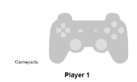
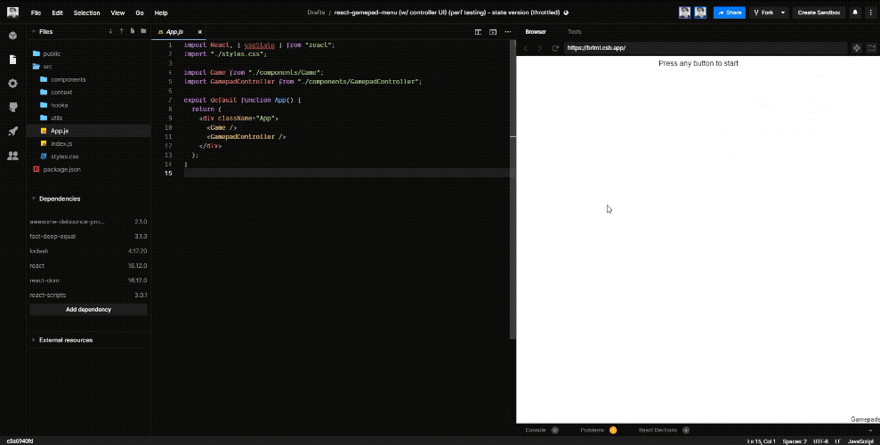

Recently I've been getting into game design in React and I had a thought: "What if I could get user input from a game controller and apply it to my apps and games?".

After a bit of research, I found that the web has a **[Gamepad API](https://developer.mozilla.org/en-US/docs/Web/API/Gamepad_API/Using_the_Gamepad_API)** you can use to do exactly this. [The MDN docs](https://developer.mozilla.org/en-US/docs/Web/API/Gamepad_API/Using_the_Gamepad_API) do a great job of covering the basic functionality, and even provide a great test project to get you started. The only problem? It's written in vanilla JS. I needed to be able to access the data within my React app. And rather than relying on something like global variables to grab the input, I wanted to be able to use React state.

This led me to create **[react-gamepads](https://github.com/whoisryosuke/react-gamepads)**, a set of utilities to integrate gamepad input into your React applications. With my library you can use either a hook or context provider to add plug-and-play gamepad support. The hook (or context provider) detects any gamepads, checks for any new input, and provides it to your component.

```jsx
import React, { useState } from 'react'
import { useGamepads } from 'react-gamepads'

export default function App() {
  const [gamepads, setGamepads] = useState({})
  useGamepads((gamepads) => setGamepads(gamepads))

  // Shows when the "fourth button" of "first gamepad" is pressed
  return <div>{gamepads[0].buttons[4].pressed ? 'Pressed' : 'Not Pressed'}</div>
}
```

I also created utilities like a React component for displaying and debugging button input:


This was a really interesting process to better learn about the React lifecycle and optimizing React code for high performance, since the hook has to run 60fps+. In this article I'll break down the process of creating the utilities, freezing my laptop (running bad React code), and then optimizing the library. I'll also show some examples and use cases of how to use the gamepad input (even a little game in React!)

# Learning the Gamepad API

The first step was to figure out how to even use the Gamepad API. Then I had to figure out how to take the Gamepad API event listeners and run them inside a React component.

## Using Gamepad API in JS

The Gamepad API uses event listeners to allow you to run code based on certain events, like a controller being connected.

You can connect to a gamepad, and discover it's name, buttons, etc using the `gamepadconnected` event:

```jsx
window.addEventListener('gamepadconnected', function (e) {
  console.log(
    'Gamepad connected at index %d: %s. %d buttons, %d axes.',
    e.gamepad.index,
    e.gamepad.id,
    e.gamepad.buttons.length,
    e.gamepad.axes.length
  )
})
```

Similarly, when it's disconnected, you can use that callback:

```jsx
window.addEventListener('gamepaddisconnected', function (e) {
  console.log(
    'Gamepad disconnected from index %d: %s',
    e.gamepad.index,
    e.gamepad.id
  )
})
```

So if you wanted a callback-based event handler that stored all controllers in a global `controllers` var, it'd look like this:

```jsx
var gamepads = {}

function gamepadHandler(event, connecting) {
  var gamepad = event.gamepad
  // Note:
  // gamepad === navigator.getGamepads()[gamepad.index]

  if (connecting) {
    gamepads[gamepad.index] = gamepad
  } else {
    delete gamepads[gamepad.index]
  }
}

window.addEventListener(
  'gamepadconnected',
  function (e) {
    gamepadHandler(e, true)
  },
  false
)
window.addEventListener(
  'gamepaddisconnected',
  function (e) {
    gamepadHandler(e, false)
  },
  false
)
```

## Displaying gamepad input

Putting it all together with the connecting functionality above, you look for gamepads when the connect, but also run the scan on a interval (using `setInterval`). This way, you're constantly checking the status of the controller by "adding" it.

The input is received by using `requestAnimationFrame`, which allows you to run a function before the next repaint. The update function runs `requestAnimationFrame` recursively (addGamepad runs requestAnimation which runs update which runs itself again), running it every frame basically.

[Working demo](http://luser.github.io/gamepadtest/) - [Full source code on Github](https://github.com/luser/gamepadtest)

```jsx
var haveEvents = 'ongamepadconnected' in window
var controllers = {}

function connecthandler(e) {
  addgamepad(e.gamepad)
}

function addgamepad(gamepad) {
  controllers[gamepad.index] = gamepad

  var d = document.createElement('div')
  d.setAttribute('id', 'controller' + gamepad.index)

  var t = document.createElement('h1')
  t.appendChild(document.createTextNode('gamepad: ' + gamepad.id))
  d.appendChild(t)

  var b = document.createElement('div')
  b.className = 'buttons'
  for (var i = 0; i < gamepad.buttons.length; i++) {
    var e = document.createElement('span')
    e.className = 'button'
    //e.id = "b" + i;
    e.innerHTML = i
    b.appendChild(e)
  }

  d.appendChild(b)

  var a = document.createElement('div')
  a.className = 'axes'

  for (var i = 0; i < gamepad.axes.length; i++) {
    var p = document.createElement('progress')
    p.className = 'axis'
    //p.id = "a" + i;
    p.setAttribute('max', '2')
    p.setAttribute('value', '1')
    p.innerHTML = i
    a.appendChild(p)
  }

  d.appendChild(a)

  // See https://github.com/luser/gamepadtest/blob/master/index.html
  var start = document.getElementById('start')
  if (start) {
    start.style.display = 'none'
  }

  document.body.appendChild(d)
  requestAnimationFrame(updateStatus)
}

function disconnecthandler(e) {
  removegamepad(e.gamepad)
}

function removegamepad(gamepad) {
  var d = document.getElementById('controller' + gamepad.index)
  document.body.removeChild(d)
  delete controllers[gamepad.index]
}

function updateStatus() {
  if (!haveEvents) {
    scangamepads()
  }

  var i = 0
  var j

  for (j in controllers) {
    var controller = controllers[j]
    var d = document.getElementById('controller' + j)
    var buttons = d.getElementsByClassName('button')

    for (i = 0; i < controller.buttons.length; i++) {
      var b = buttons[i]
      var val = controller.buttons[i]
      var pressed = val == 1.0
      if (typeof val == 'object') {
        pressed = val.pressed
        val = val.value
      }

      var pct = Math.round(val * 100) + '%'
      b.style.backgroundSize = pct + ' ' + pct

      if (pressed) {
        b.className = 'button pressed'
      } else {
        b.className = 'button'
      }
    }

    var axes = d.getElementsByClassName('axis')
    for (i = 0; i < controller.axes.length; i++) {
      var a = axes[i]
      a.innerHTML = i + ': ' + controller.axes[i].toFixed(4)
      a.setAttribute('value', controller.axes[i] + 1)
    }
  }

  requestAnimationFrame(updateStatus)
}

function scangamepads() {
  var gamepads = navigator.getGamepads
    ? navigator.getGamepads()
    : navigator.webkitGetGamepads
    ? navigator.webkitGetGamepads()
    : []
  for (var i = 0; i < gamepads.length; i++) {
    if (gamepads[i]) {
      if (gamepads[i].index in controllers) {
        controllers[gamepads[i].index] = gamepads[i]
      } else {
        addgamepad(gamepads[i])
      }
    }
  }
}

window.addEventListener('gamepadconnected', connecthandler)
window.addEventListener('gamepaddisconnected', disconnecthandler)

if (!haveEvents) {
  setInterval(scangamepads, 500)
}
```

So now I had a general idea of how to use the Gamepad API, the next step was integrating it into React.

# Integrating Gamepad API with React

## Rough React Implementation

Here's the first version I came up with using React functional components and hooks:

[react-gamepad](https://codesandbox.io/s/react-gamepad-3bujg)

```jsx
import React, { useContext, useEffect, useRef, useState } from 'react'
import useInterval from '../hooks/useInterval'

export default function GamepadController() {
  const [gamepads, setGamepads] = useState({})
  const requestRef = useRef()

  var haveEvents = 'ongamepadconnected' in window

  const addGamepad = (gamepad) => {
    // console.log(
    //   "Gamepad connected at index %d: %s. %d buttons, %d axes.",
    //   gamepad.index,
    //   gamepad.id,
    //   gamepad.buttons.length,
    //   gamepad.axes.length
    // );
    updateGlobalGamepads({
      ...gamepads,
      [gamepad.index]: {
        buttons: gamepad.buttons,
        id: gamepad.id,
        axes: gamepad.axes,
      },
    })

    setGamepads({
      ...gamepads,
      [gamepad.index]: {
        buttons: gamepad.buttons,
        id: gamepad.id,
        axes: gamepad.axes,
      },
    })
  }

  /**
   * Adds game controllers during connection event listener
   * @param {object} e
   */
  const connectGamepadHandler = (e) => {
    addGamepad(e.gamepad)
    // console.log("connecting gamepads", e, e.gamepad);
  }

  /**
   * Finds all gamepads and adds them to context
   */
  const scanGamepads = () => {
    // Grab gamepads from browser API
    var detectedGamepads = navigator.getGamepads
      ? navigator.getGamepads()
      : navigator.webkitGetGamepads
      ? navigator.webkitGetGamepads()
      : []

    // Loop through all detected controllers and add if not already in state
    for (var i = 0; i < detectedGamepads.length; i++) {
      if (detectedGamepads[i]) {
        addGamepad(detectedGamepads[i])
      }
    }
  }

  // Add event listener for gamepad connecting
  useEffect(() => {
    window.addEventListener('gamepadconnected', connectGamepadHandler)

    return window.removeEventListener('gamepadconnected', connectGamepadHandler)
  })

  // Update each gamepad's status on each "tick"
  const animate = (time) => {
    if (!haveEvents) scanGamepads()
    requestRef.current = requestAnimationFrame(animate)
  }

  useEffect(() => {
    requestRef.current = requestAnimationFrame(animate)
    return () => cancelAnimationFrame(requestRef.current)
  })

  // Check for new gamepads regularly
  useInterval(() => {
    if (!haveEvents) scanGamepads()
  }, 1000)

  // console.log("component rendering", gamepads);

  const gamepadDisplay = Object.keys(globalGamepads).map((gamepadId) => {
    // console.log("displaying gamepad", gamepads[gamepadId]);
    return (
      <div>
        <h2>{globalGamepads[gamepadId].id}</h2>
        {globalGamepads[gamepadId].buttons &&
          globalGamepads[gamepadId].buttons.map((button, index) => (
            <div>
              {index}: {button.pressed ? 'True' : 'False'}
            </div>
          ))}
      </div>
    )
  })

  // console.log(globalGamepads);
  return (
    <div className="Gamepads">
      <h1>Gamepads</h1>
      {gamepadDisplay}
    </div>
  )
}
```

Let's break down what's happening here:

- We use `useEffect` to run a function on each render. The first function handles the Gamepad API event listener by attaching it during render and removing it during dismount. The second function handles updating the gamepad input constantly by running the `requestAnimationFrame` recursively inside.
- We use a custom hook `useInterval` for applying a `setInterval` to check for new controllers regularly. This is basically `useEffect` under the hood, doing the same as above with the event listener.
- In order to update the component state with gamepad (and their input), we use the `addGamepad` method that gets called by `scanGamepads` during the recursive `requestAnimationFrame`. In the `addGamepad` function, we set the state using the gamepad `scanGamepads` detected and passed on.
- The render method shows `gamepadDisplay`, which goes through the gamepad state and maps the object's keys and values to text (so you can see each object property - like a button pressed).

This worked great, but I wanted a more modular solution that wasn't dependent on a single component (or using render props).

If you want a better breakdown of how to use `requestAnimationFrame` in React, check out [this article on CSS Tricks.](https://css-tricks.com/using-requestanimationframe-with-react-hooks/) It explains how it works and why in much greater detail.

## Context approach

To create a context provider with the same functionality, I just had to take my component logic and lift it up to the context provider itself:

```jsx
import React, { createContext, useEffect, useRef, useState } from 'react'
import useInterval from '../hooks/useInterval'
const GamepadsContext = createContext()

const GamepadsProvider = ({ children }) => {
  const [gamepads, setGamepads] = useState({})
  const requestRef = useRef()

  var haveEvents = 'ongamepadconnected' in window

  const addGamepad = (gamepad) => {
    setGamepads({
      ...gamepads,
      [gamepad.index]: {
        buttons: gamepad.buttons,
        id: gamepad.id,
        axes: gamepad.axes,
      },
    })
  }

  /**
   * Adds game controllers during connection event listener
   * @param {object} e
   */
  const connectGamepadHandler = (e) => {
    addGamepad(e.gamepad)
  }

  /**
   * Finds all gamepads and adds them to context
   */
  const scanGamepads = () => {
    // Grab gamepads from browser API
    var detectedGamepads = navigator.getGamepads
      ? navigator.getGamepads()
      : navigator.webkitGetGamepads
      ? navigator.webkitGetGamepads()
      : []

    // Loop through all detected controllers and add if not already in state
    for (var i = 0; i < detectedGamepads.length; i++) {
      if (detectedGamepads[i]) {
        addGamepad(detectedGamepads[i])
      }
    }
  }

  // Add event listener for gamepad connecting
  useEffect(() => {
    window.addEventListener('gamepadconnected', connectGamepadHandler)

    return window.removeEventListener('gamepadconnected', connectGamepadHandler)
  })

  // Update each gamepad's status on each "tick"
  const animate = (time) => {
    if (!haveEvents) scanGamepads()
    requestRef.current = requestAnimationFrame(animate)
  }

  useEffect(() => {
    requestRef.current = requestAnimationFrame(animate)
    return () => cancelAnimationFrame(requestRef.current)
  }, [])

  // Check for new gamepads regularly
  useInterval(() => {
    if (!haveEvents) scanGamepads()
  }, 1000)

  return (
    <GamepadsContext.Provider value={{ gamepads, setGamepads }}>
      {children}
    </GamepadsContext.Provider>
  )
}

export { GamepadsProvider, GamepadsContext }
```

[Here's an example app](https://codesandbox.io/s/react-gamepad-context-with-options-cuwdh) using this context provider to show each game controller and set actions based on button keys (like confirm = `button[4]`). You can also use the `useContext` hook to grab the gamepad input, instead of using the context consumer and render prop method.

[**Gamepad Context on CodeSandbox**](https://codesandbox.io/s/react-gamepad-context-with-options-cuwdh)

## Hook version

The context worked great, but I had some questions about it's scalability and performance. I was concerned about wrapping my entire app, or even a portion of it, in a context provider that was re-rendering every frame per second. In smaller apps, this works fine. But in larger apps, this quickly becomes an issue with complex or numerous nested components.

I started to migrate the logic from above into a hook, here's what I came up with at first:

```jsx
import React, { createContext, useEffect, useRef, useState } from 'react'

export default function useGamepads(callback) {
  const gamepads = useRef({})
  const requestRef = useRef()

  var haveEvents = 'ongamepadconnected' in window

  const addGamepad = (gamepad) => {
    gamepads.current = {
      ...gamepads.current,
      [gamepad.index]: {
        buttons: gamepad.buttons,
        id: gamepad.id,
        axes: gamepad.axes,
      },
    }

    // Send data to external callback (like React state)
    callback(gamepads.current)
  }

  /**
   * Adds game controllers during connection event listener
   * @param {object} e
   */
  const connectGamepadHandler = (e) => {
    addGamepad(e.gamepad)
    // console.log("connecting gamepads", e, e.gamepad);
  }

  /**
   * Finds all gamepads and adds them to context
   */
  const scanGamepads = () => {
    // Grab gamepads from browser API
    var detectedGamepads = navigator.getGamepads
      ? navigator.getGamepads()
      : navigator.webkitGetGamepads
      ? navigator.webkitGetGamepads()
      : []

    // Loop through all detected controllers and add if not already in state
    for (var i = 0; i < detectedGamepads.length; i++) {
      if (detectedGamepads[i]) {
        addGamepad(detectedGamepads[i])
      }
    }
  }

  // Add event listener for gamepad connecting
  useEffect(() => {
    window.addEventListener('gamepadconnected', connectGamepadHandler)

    return window.removeEventListener('gamepadconnected', connectGamepadHandler)
  })

  // Update each gamepad's status on each "tick"
  const animate = (time) => {
    if (!haveEvents) scanGamepads()
    requestRef.current = requestAnimationFrame(animate)
  }

  useEffect(() => {
    requestRef.current = requestAnimationFrame(animate)
    return () => cancelAnimationFrame(requestRef.current)
  })

  return gamepads.current
}
```

Here's an working example in CodeSandbox:

[**Gamepad Hook on CodeSandbox**](https://codesandbox.io/s/react-gamepad-menu-w-controller-ui-hook-version-working-nktve?file=/src/App.js)

Components will still be required to set their own state (or ref) based on gamepad data if they want to re-render accordingly:

```jsx
export default function App() {
  const [gamepads, setGamepads] = useState({})
  useGamepads((gamepads) => setGamepads(gamepads))

  return <div>{gamepads[0].buttons[4].pressed}</div>
}
```

This means that multiple components will have the state (or ref) of the entire gamepad state — updated constantly. You have to weigh this performance cost versus the alternative of holding it in context provider higher in the render tree, which re-renders all children on each change.

If you have a single component that needs to be aware of the gamepad, the hook is ideal. Or if you have an app with many elements and game elements aren't nested together, or in a close enough parent.

If you have a small app or segment of the app that needs gamepad data, the context is better.

# Optimization

Works great on my gaming PC, but had major performance issues when moving to Macbook laptop with internal GPU. Also doesn't run without hardware acceleration in Chrome (which uses GPU) - meaning it was intense.

## State vs Refs

The first mistake I made was using React state to store the gamepad input. This meant that every time the `requestAnimationFrame` ran, it was updating the component state, and causing a re-render. Instead of using React's state, I used "refs". So instead of `useState`, I ran `useRef` to create a new "ref". Then when updating the state, instead I updated the ref (`gamepad.current = newInput`).

## Memoization

Once I put my code into a proper linting environment with Typescript, I started to get errors from not using (and misusing) performance optimization techniques like React's `useCallback` and `useMemo`. You can compare [the context's source code](https://github.com/whoisryosuke/react-gamepads/blob/master/src/GamepadsContext.tsx) in the repo to the context example above and see the difference.

## Syncing Game Input

To handle things like controller input across components, I would use the hook to grab gamepad input, and shove it all into the component state. This happened every second (or 60fps?). This became clear when I ran a `console.log` inside the component and it crashed the browser every time.

To reduce this, I tried implementing a check before updating the controller input.

Ideally, you should only track what buttons you need for the component. For example, the "Press Start" screen should only update state when the "start button" is changed. And it should only contain the state of the button press, not the entire gamepad input.

```jsx
import React, { useState, useEffect } from 'react'
import useGamepads from '../hooks/useGamepads'

export default function StartScreen({ setGameStarted }) {
  useGamepads((gamepads) => {
    // If controller connected with buttons
    if (gamepads && gamepads[0] && gamepads[0].buttons.length > 0) {
      // Go through each button and check for pressed
      gamepads[0].buttons.forEach((button) => {
        if (button.pressed) {
          setGameStarted(true)
        }
      })
    }
  })

  return <div>Press any button to start</div>
}
```

### What not to do

For more advanced components that require all button input (even things like analog axes) - I tried implementing different ways to check for button input changes - then change state (rather than constantly syncing).

```jsx
// Go through buttons, find any pressed
// Not good because it leaves buttons pressed, and doesn't
// handle when button is "unpressed"
const buttonPressed =
  gamepads[0].buttons.filter((button) => button.pressed).length > 0
const buttonPressed = isEqual(gamepads, newGamepads)
if (!buttonPressed) {
  setGamepads(newGamepads)
}
```

I ended up using Lodash and it's `isEqual` method to compare the deeply nested objects of gamepad input. Ideally you'd use the comparison on a single gamepad at a time, so the object is less complex, but it's condensed here for clarity:

```jsx
import React, { useState } from 'react'
import useGamepads from '../hooks/useGamepads'
import GamepadSvg from './GamepadSvg'
import { isEqual } from 'lodash'

export default function GamepadController() {
  const [gamepads, setGamepads] = useState({})
  useGamepads((newGamepads) => {
    // Detect changes, if so, re-render component
    const buttonPressed = isEqual(gamepads, newGamepads)
    if (!buttonPressed) {
      setGamepads(newGamepads)
    }
  })
  return (
    <div
      className="Gamepads"
      style={{ position: 'fixed', bottom: 0, right: 0 }}
    >
      <small>Gamepads</small>
      {/* {gamepadDisplay} */}
      {gamepads && gamepads[0] && (
        <>
          <GamepadSvg
            directionUp={gamepads[0].buttons[12].pressed}
            directionDown={gamepads[0].buttons[13].pressed}
            directionLeft={gamepads[0].buttons[14].pressed}
            directionRight={gamepads[0].buttons[15].pressed}
            buttonDown={gamepads[0].buttons[0].pressed}
            buttonRight={gamepads[0].buttons[1].pressed}
            buttonLeft={gamepads[0].buttons[2].pressed}
            buttonUp={gamepads[0].buttons[3].pressed}
            select={gamepads[0].buttons[8].pressed}
            start={gamepads[0].buttons[9].pressed}
            analogLeft={
              gamepads[0].axes[0] > 0.3 ||
              gamepads[0].axes[0] < -0.3 ||
              gamepads[0].axes[1] > 0.3 ||
              gamepads[0].axes[1] < -0.3
            }
            analogRight={
              gamepads[0].axes[2] > 0.3 ||
              gamepads[0].axes[2] < -0.3 ||
              gamepads[0].axes[3] > 0.3 ||
              gamepads[0].axes[3] < -0.3
            }
          />
          <h3>Player 1</h3>
        </>
      )}
    </div>
  )
}
```

This didn't work for some reason, even targeting really specific parts of the gamepad (like only buttons of player 1) didn't work? Kept getting true/false flashing in console, despite no button being pressed. Maybe because gamepad object uses special classes (like GamepadButtonInput) to define properties, which can't be compared by lodash?

```jsx
const buttonPressed = isEqual(gamepads[0].buttons, newGamepads[0].buttons)
if (!buttonPressed) {
  setGamepads(newGamepads)
}
```

Basically, the take away here is that if you need the entire gamepad input (like displaying a controller), you can try doing checks for each button, but ultimately you might as well pass the gamepad input into state - or create a debounce to delay it to once per second or something if you don't want 1:1 visual feedback.

You can see all these performance failures here in the `GamepadController.jsx` file, just comment them out to test:

[**Horse game performance testing**](https://codesandbox.io/s/react-gamepad-menu-w-controller-ui-perf-testing-state-version-throttled-brlml?file=/src/components/GamepadController.jsx)

## Throttling input

Something that is incredibly common when using event listeners for events that get called constantly (like scrolling on a page), you use a function to "throttle" the callback. This is also known as a "debounce".

I was having an issue with some apps where I would run a function inside the game input hook and it ran every frame. This was intense, and not necessary in a lot of cases (unless you need high fidelity - fast feedback). So I wrapped the functions I had to run inside the game loop with a throttle (that was also memoized). In this case I used lodash's throttle utility, but you can also use libraries like awesome-debounce-promise.

```jsx
const increasePosition = useCallback(() => {
  // console.log("increasing");
  setPosition((prevPosition) => prevPosition + PLAYER_POSITION_ADJUST)
}, [setPosition])

const increasePositionDebounced = useMemo(
  () => throttle(increasePosition, 100),
  [increasePosition]
)

useGamepads((gamepads) => {
  if (started) {
    // If controller connected with buttons
    if (gamepads && gamepads[0] && gamepads[0].buttons.length > 0) {
      // Pressed Up
      if (gamepads[0].buttons[12].pressed) {
        // AwesomeDebouncePromise(() => increasePosition, 20000);
        // throttle(increasePosition, 10000);
        increasePositionDebounced()
      }
      // Pressed Down
      if (gamepads[0].buttons[13].pressed) {
        // AwesomeDebouncePromise(() => decreasePosition, 20000);
        // throttle(decreasePosition, 10000);
        decreasePositionDebounced()
      }
    }
  }
})
```

# Packaging the Project

Once I had figured out the core functionality using exclusively CodeSandbox to code in the browser, I wanted to migrate all the utilities to a git repo so I could publish it to NPM. I used TSDX to bootstrap the project using the React template. This gave me a solid Typescript setup that let me lint and test the code. Then I added Semantic Release and Commitzen CLI to provide a solution for automated versioning.

# 📦 Examples

Now that you've seen how it works under the hood, here's a few examples and use cases of using gamepad input for different purposes.

## 🎮 Gamepad Controller Debug UI



When you want to visualize the input while you're building your app, you can use the `<GamepadController />` component to grab gamepad input, display an SVG controller, and highlight the buttons you use.

Using the controller:

```jsx
<GamepadController />
```

The controller component:

```jsx
import React, { useState } from 'react'
import useGamepads from '../hooks/useGamepads'
import GamepadSvg from './GamepadSvg'

export default function GamepadController() {
  const [gamepads, setGamepads] = useState({})
  useGamepads((gamepads) => setGamepads(gamepads))

  const calcDirectionVertical = (axe) => {
    // Up
    if (axe < -0.2) {
      return 'up'
    }
    // Down
    if (axe > 0.2) {
      return 'down'
    }
  }

  const calcDirectionHorizontal = (axe) => {
    // Left
    if (axe < -0.2) {
      return 'left'
    }
    // Right
    if (axe > 0.2) {
      return 'right'
    }
  }
  return (
    <div
      className="Gamepads"
      style={{ position: 'fixed', bottom: 0, right: 0 }}
    >
      <small>Gamepads</small>
      {/* {gamepadDisplay} */}
      {gamepads && gamepads[0] && (
        <>
          <GamepadSvg
            directionUp={gamepads[0].buttons[12].pressed}
            directionDown={gamepads[0].buttons[13].pressed}
            directionLeft={gamepads[0].buttons[14].pressed}
            directionRight={gamepads[0].buttons[15].pressed}
            buttonDown={gamepads[0].buttons[0].pressed}
            buttonRight={gamepads[0].buttons[1].pressed}
            buttonLeft={gamepads[0].buttons[2].pressed}
            buttonUp={gamepads[0].buttons[3].pressed}
            select={gamepads[0].buttons[8].pressed}
            start={gamepads[0].buttons[9].pressed}
            analogLeft={
              gamepads[0].axes[0] > 0.3 ||
              gamepads[0].axes[0] < -0.3 ||
              gamepads[0].axes[1] > 0.3 ||
              gamepads[0].axes[1] < -0.3
            }
            analogRight={
              gamepads[0].axes[2] > 0.3 ||
              gamepads[0].axes[2] < -0.3 ||
              gamepads[0].axes[3] > 0.3 ||
              gamepads[0].axes[3] < -0.3
            }
            analogLeftDirection={[
              calcDirectionHorizontal(gamepads[0].axes[0]),
              calcDirectionVertical(gamepads[0].axes[1]),
            ]}
            analogRightDirection={[
              calcDirectionHorizontal(gamepads[0].axes[2]),
              calcDirectionVertical(gamepads[0].axes[3]),
            ]}
          />
          <h3>Player 1</h3>
        </>
      )}
    </div>
  )
}
```

The most interesting part was figuring out how to do movement with analog sticks.

Each analog stick is represented by two axes (top/down and left/right), so for a PS4/Xbox controller you'd have 4 axes (one for left stick, one for right). When the player pressed the analog stick to a certain direction (like left, up, etc) the corresponding axe goes maxes out at `1` or `-1` (depending on the direction). When it's not pressed, you'd think it stays at 0, but it's so sensitive, it ends up around `0.3`. So to determine direction, I created a function that checks if it's past `0.3` or `-0.3`.

## 🖲 Game Cursor


If you want to display a cursor on the screen, you can use the gamepad input to check if the directional buttons are pressed (in this case 12-15 for a PS4 controller) and change the cursor position via React state:

```jsx
import React, { useContext, useEffect, useLayoutEffect, useState } from 'react'
import { GamepadsContext } from '../context/GamepadsContext'
import Cursor from '../components/Cursor'

const GameCursor = () => {
  const [top, setTop] = useState(Math.round(window.innerHeight / 2))
  const [left, setLeft] = useState(Math.round(window.innerWidth / 2))
  const { gamepads } = useContext(GamepadsContext)

  useLayoutEffect(() => {
    const defaultGamepad = Object.keys(gamepads).length > 0 ? gamepads[0] : {}
    if ('buttons' in defaultGamepad) {
      // Up
      defaultGamepad.buttons[12].pressed && setTop((prevTop) => prevTop - 1)
      // Down
      defaultGamepad.buttons[13].pressed && setTop((prevTop) => prevTop + 1)
      // Left
      defaultGamepad.buttons[14].pressed && setLeft((prevLeft) => prevLeft - 1)
      // Right
      defaultGamepad.buttons[15].pressed && setLeft((prevLeft) => prevLeft + 1)
    }
  }, [gamepads])

  return <Cursor top={top} left={left} />
}

export default GameCursor
```

The game cursor is set to `position: fixed` and accepts the top and left property, set it as CSS properties.

[**Game Cursor on CodeSandbox**](https://codesandbox.io/s/react-gamepad-with-cursor-analog-support-better-perf-forked-sxls0)

I used framer-motion in the final version for the cursor to animate it more smoothly, as it's capable of imperatively animating (or "tweening") between different CSS properties.

## 🗄 Navigating Links (`<a>`) with Button Press


We create a list of `<a>` links based on a `items` array we pass.

To navigate through them, we have a state of `selectedItem` that stores the index of the current item in it's array. When we check for gamepad input, if the user presses a certain direction, we set this value appropriately to move forward and back through the array.

To make it clickable, we also create an array of "refs" in the state. We update the "refs" state with a `useEffect` to sync it with the length of the array, creating a new "ref" as needed (using the `createRef` method React provides). Then when we're detecting gamepad input, we can check for a button press, and then run the `click()` method on the currently selected item's "ref".

```jsx
import React, { createRef, useState, useEffect, useContext } from 'react'
import AwesomeDebouncePromise from 'awesome-debounce-promise'

import { GamepadsContext } from '../context/GamepadsContext'
import useGamepads from '../hooks/useGamepads'

const Menu = ({ items }) => {
  const [gamepads, setGamepads] = useState({})
  const [itemRefs, setItemRefs] = React.useState([])
  const [selectedItem, setSelectedItem] = useState(0)
  useGamepads((gamepads) => setGamepads(gamepads))

  useEffect(() => {
    if (gamepads && gamepads[0]) {
      // Pressed Up
      if (gamepads[0].buttons[12].pressed) {
        let increment = selectedItem - 1
        if (increment < 0) increment = items.length - 1
        return AwesomeDebouncePromise(() => setSelectedItem(increment), 300)
      }
      // Pressed down
      if (gamepads[0].buttons[13].pressed) {
        let increment = selectedItem + 1
        if (increment > items.length - 1) increment = 0
        return AwesomeDebouncePromise(() => setSelectedItem(increment), 300)
      }
      // Pressed down
      if (
        gamepads[0].buttons[0].pressed ||
        gamepads[0].buttons[1].pressed ||
        gamepads[0].buttons[2].pressed ||
        gamepads[0].buttons[3].pressed
      ) {
        itemRefs[selectedItem].current.click()
      }
    }
  }, [gamepads, items, selectedItem])

  useEffect(() => {
    // add or remove refs
    setItemRefs((elRefs) =>
      Array(items.length)
        .fill()
        .map((_, i) => elRefs[i] || createRef())
    )
  }, [items.length])

  return (
    <div>
      {items &&
        items.map((item, index) => (
          <a
            ref={itemRefs[index]}
            key={index}
            href={item.link}
            className={index === selectedItem && 'focused'}
          >
            {item.title}
          </a>
        ))}
    </div>
  )
}

export default Menu
```

[**Menu on CodeSandbox**](https://codesandbox.io/s/react-gamepad-menu-w-controller-ui-perf-testing-state-version-throttled-brlml?file=/src/components/GameScreen.jsx:0-4254)

## 🐴 Shenmue Horse Game



After doing some basic tasks with the gamepad input, I wanted to try to create an actual game. Something with a start screen, game loop, and a game over screen. I decided to build the "horse" game from Shenmue, where the character is required to maintain a squat using button input.

For this app, I'd grab the up/down input from the buttons and analog sticks and use them to increase or decrease the position of the player. You start at 500 and try to maintain it with the button input. The game decays the position over time, making it drop to 0 without input. The closer the character stays to 500 the larger score they generate.

This is a great example of handling input in different ways, handling game logic in React, and how transition (or routing) between "screens" (like start vs game vs game over).

[**Horse Game on CodeSandbox**](https://codesandbox.io/s/react-gamepad-menu-w-controller-ui-hook-version-shenmue-horse-working-oioei)

# Build controller-powered apps!

I hope this helps you build apps with React and accept gamepad input. I see a lot of potential with this library and I'm excited to build a few apps that utilize it. Anytime I play a game now I'm constantly analyzing the UI and seeing how I could implement it on the web, and now it's that much easier to do one of the key features required for it.

I've also got some big ideas on how to integrate this into existing frameworks to provide controller-based navigation to most web apps 🤔💭🔥 Looking forward to exploring this territory.

Blaze it,
Ryo

# 📚 References

- [https://github.com/whoisryosuke/react-gamepads](https://github.com/whoisryosuke/react-gamepads)
- [https://www.framer.com/api/motion/](https://www.framer.com/api/motion/)
- [https://developer.mozilla.org/en-US/docs/Web/API/Element/getBoundingClientRect](https://developer.mozilla.org/en-US/docs/Web/API/Element/getBoundingClientRect)
- [https://gist.github.com/jtsternberg/c272d7de5b967cec2d3d](https://gist.github.com/jtsternberg/c272d7de5b967cec2d3d)
- [https://stackoverflow.com/questions/12066870/how-to-check-if-an-element-is-overlapping-other-elements](https://stackoverflow.com/questions/12066870/how-to-check-if-an-element-is-overlapping-other-elements)
- [https://reactjs.org/docs/refs-and-the-dom.html](https://reactjs.org/docs/refs-and-the-dom.html)
- [https://swizec.com/blog/ref-callbacks-measure-react-component-size/swizec/8444](https://swizec.com/blog/ref-callbacks-measure-react-component-size/swizec/8444)
- [https://css-tricks.com/using-requestanimationframe-with-react-hooks/](https://css-tricks.com/using-requestanimationframe-with-react-hooks/)
- [https://www.samanthaming.com/tidbits/33-how-to-compare-2-objects/#deep-nested-comparison](https://www.samanthaming.com/tidbits/33-how-to-compare-2-objects/#deep-nested-comparison)
- [https://www.npmjs.com/package/lodash.isequal](https://www.npmjs.com/package/lodash.isequal)
- [https://github.com/epoberezkin/fast-deep-equal](https://github.com/epoberezkin/fast-deep-equal)
- [https://gist.github.com/nicbell/6081098](https://gist.github.com/nicbell/6081098)
- [https://codeburst.io/throttling-and-debouncing-in-javascript-b01cad5c8edf](https://codeburst.io/throttling-and-debouncing-in-javascript-b01cad5c8edf)
- [https://lodash.com/docs/#throttle](https://lodash.com/docs/#throttle)
- [https://dev.to/pulkitnagpal/using-throttling-and-debouncing-with-react-hooks-57f1](https://dev.to/pulkitnagpal/using-throttling-and-debouncing-with-react-hooks-57f1)
- [https://github.com/facebook/react/issues/19240](https://github.com/facebook/react/issues/19240)
  - useMemo not callback for throttle (but still need callback for the function throttle uses lol)

## Similar projects

- [https://github.com/SBRK/react-gamepad#readme](https://github.com/SBRK/react-gamepad#readme)
