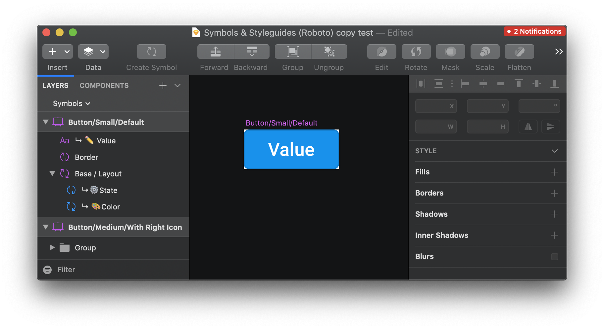
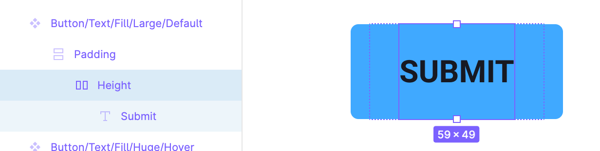
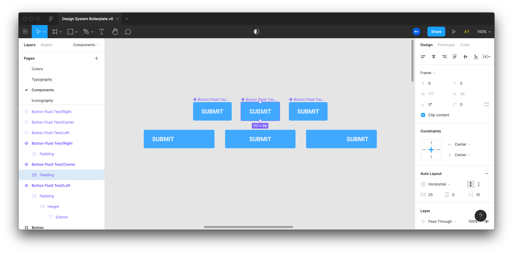
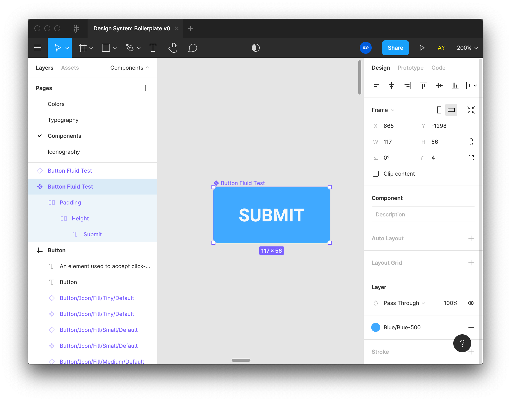
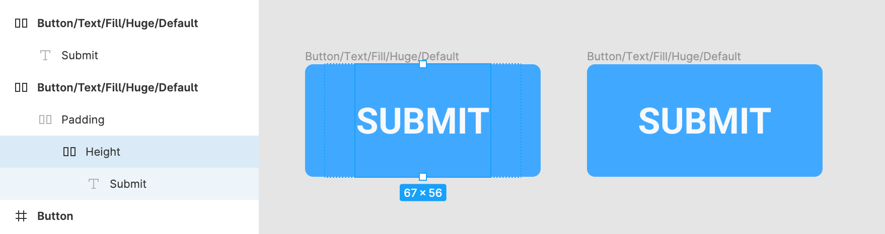

There are a lot of ways to create components, but what is the best way to do in Figma? At the end of the day, you want the simplest component structure that obeys the constraints of the style guide.

In this article I cover the two different ways to create Figma components and what are the best practices I've discovered for composing them. You'll learn to create a fluid and responsive component, as well as a properly padded "auto layout" component.

Want to see the components in action? [Check out the Figma source file here.](https://www.figma.com/file/WluEdHETqx9XyWDX4Pbqd5/Auto-Layout-vs-Fluid-Button-Example?node-id=0%3A1)

I give a brief overview of Figma concepts auto layout, constraints, etc — but if you're new to Figma, I highly recommend checking out [the Figma help guide](https://help.figma.com/hc/en-us) or [YouTube channel](https://www.youtube.com/channel/UCQsVmhSa4X-G3lHlUtejzLA) to learn more before diving in.

# Coming from Sketch world

Up until recently, Sketch has had a very **different** methodology for creating components (or "_symbols_" as they were called).

You would create a **"base" layout component** that acted as the background for all components. It had 2 layers, the **background color** and a **state color** (usually like a black layer with 10% opacity to convey a "hover" state). You'd also use a **"border" component** that provided you all the different border styles as sub-components (like a 1px red solid stroke for errors). Then on top of both of these, you'd finally have the **component elements**, like button text.

Here's an example of a small button in Sketch from [the Symbols and Styleguides UI kit](https://www.janlosert.com/symbols-styleguides):

Now with Sketch you can benefit from a lot of the same features you get from Figma, like [shared color styles](https://medium.com/sketch-app-sources/using-shared-styles-and-symbols-in-sketch-8cab4650dc55), but many legacy Sketch files (and designers) will use this component architecture.

# What's the Figma difference?

This component would require a bit of adapting to the Figma component model:

- **Base component** becomes **[color styles](https://help.figma.com/hc/en-us/articles/360038746534-Create-Styles-for-Colors-Text-Effects-and-Layout-Grids)**. You keep color styles for all the background colors, as well as the background colors mixed with state (like a "hovered" blue). Then you create all the component variants based on things like state, which can quickly be toggled between or used.
- **Border component** also becomes a **color style**. You keep all the variations organized in a separated "Border/" prefixed color, and that can be applied to the component directly to override the background style. If it needs to stack with the background, this is the only time you'd need a separate layer/group/frame for it, but it still wouldn't require you to make the border element a separate component.

## Simpler Components = Better

As you can start to see, the Figma components make the process of composing and customizing components much easier. It eliminates much of the boilerplate and tedium behind crafting countless base "style" orientated components. And by taking these styles and making them available on a team-level, you can more easily share these design tokens across files without having to keep duplicating a master style guide.

# Creating Figma components

## What is auto layout?

Auto layout components are components that use [Figma's "auto layout" feature](https://www.youtube.com/watch?v=NrKX46DzkGQ) to create a "flexbox" type layout. Auto layout is applied to a "frame" (basically a layer "group") nested inside the component. When you apply auto layout to a frame, you get access to properties like margin, padding, and flex direction (show items horizontally or vertically).

When speaking about auto layout, it's easy to make it sound like it's going to contain **multiple elements** (like lining up two text boxes). It definitely does this, but it's important to look at auto layout as what it truly is — **a way to add strict padding and margin to elements**.

Before auto layout, you'd have to: create a component with a fixed width and height, add the padding/margin manually, and then hope the user doesn't try stretching the component. Auto layout locks the component width, so the content + margin + padding dictate the components sizing.

This lets the developer inspecting your design to quickly discern the component spacing without having to analyze spacer components or measure things manually (or look at your measurements). This also allows designers to quickly compose layouts that automatically "stack" horizontally or vertically, while the components space themselves accordingly.

## How to create auto layout components

Auto layout components are composed of three different frames (or combined into 1-2):

- **Height Frame** - Auto layout frame that defines the minimum height of the component. You make this by creating a frame with a set height, then converting it to auto layout. You can't change the height of frames with auto layout already applied, so you need to set the height first - then apply auto layout. There's a Figma plugin that [lets you easily change auto layout height if needed afterwards.](https://www.figma.com/community/plugin/801366561098649280/Resize-Auto-Layout)
- **Padding Frame** - Auto layout frame that defines the horizontal padding of the component. You create a group around your content, convert it to a frame, then add auto layout. This ensure your frame is exactly the size of the content (without manually drawing it using the Frame tool). Set the padding as needed, and make sure the direction is horizontal (or else it'll pad the top/bottom).
- **Component frame** - The "styles" applied to the component, such as color, border, and/or shadow. This frame has auto layout applied with an additional padding.

I broke these out into 3 separate frames, but you can combine them into the component frame (see an example below). It creates a much cleaner component structure with a single auto layout frame in control.

## How to create fluid components

The problem with auto layout components is the exact reason they're awesome — **they don't let you change their width or height**. It's defined by the content (and the spacing applied by the auto layout). This means **when you need to create a responsive layout** where a component can "_stretch_" to the width or height of it's parent container (like a button set to `width: 100%` in the browser) — **auto layout components don't work.**

Instead, you have to resort to the more traditional way to create components: **[constraints](https://help.figma.com/hc/en-us/articles/360039957734-Apply-Constraints-to-define-how-layers-resize)**. Instead of using auto layout, you use set the "constraints" of a component's children. In the constraints you can define how the content is aligned inside the container, like keeping an "icon" component aligned to the right.

Because you're using the constraints though, you end up with 3 different component variations at minimum (one for left, right, and centered). And depending on the component, it can create more derivative iterations (like `Button/Fluid/Large` vs `Button/Fluid/Small`). This leads to 3x the number of component variations for each one - on top of any auto layout variations.

Maybe a base component that is built using the auto layout would be key, then use that to compose a "styled" version for "fixed" and "responsive" components. The "fixed" version would be auto layout with no spacing (margin/padding), and kinda "fallback" to the nested padding of the base component's auto layout spacing. This eliminates a few variations, rather than having to replicate them in fixed vs responsive versions.

Even though I say these aren't "auto layout" components, I still recommend using auto layout to enforce things like a minimum height or width when ideal (like a design system where buttons never change height — but can be fluid width). You can also use an auto layout frame to enforce a minimum padding to ensure a button doesn't get stretched smaller than it should.

### Fluid component structure

Here's what a fluid component would look like:

- Optional **padding frame** with auto layout to create a minimum padding around text
  - This frame has it's **constraints** set to "**left**" and "**top**" (or "center" — doesn't matter if you have a height frame), which create a left-aligned button.
  - You can change it from "**left**" to "**center**" or "**right**" to change the alignment of the content. You shouldn't have to set the alignment of the actual text if you use this padding frame.
  - If the user resets the component instance, it'll reset to it's original padding, allowing them to use the responsive component as an auto-layout one. If you don't provide this padding frame, the component will still reset to it's original size, but it's just easier to manage the spacing through auto layout instead of manually spacing (or using spacing components).
- **Height frame** with auto layout enabled to enforce min height
- **Component frame** _is not_ auto layout. It has styles applied (like background, border radius, etc).

# Benefits and limitations

Now that we understand how to make these, let's overview the pros and cons of each setup:

## Full Auto Layout

- Best option for enforcing style guide's spacing, and keeps things dynamic to content.
  - **For example:** Checkboxes, Toggles, etc are all components that should never be stretched by width/height — only scaled (x + y equally). So these components benefit from adding auto-layout to the component frame, as this prevents users from resizing components. This way, you can enforce set sizes of checkboxes, and have the user switch between those set components (vs resizing or scaling manually).
- Depending on the setup though, can often be strict and not as responsive as necessary (like needing to stretch something). Kinda easy to "eject" by detaching the component, but you lose the component link, and the design can become left behind and require manual upkeep.

## Fluid (with nested auto layout)

- Works great responsively when you need more fluid components (like a button that fits 100% in a container).
- Easy for someone to accidentally create a spacing situation that doesn't abide by style guide (like shrinking a button slightly past padding) — requires you to enforce fluid vs non-fluid component variations (where non-fluid are straight up auto-layout components). This way you accommodate for non-fluid use cases.

# Best practices for Figma components

Whichever type of component you're creating, here are some guidelines to follow that'll help you craft the best component possible:

- Ditch layers for fills/strokes if possible and style the component frame. Lets users just click the component and quickly reveal the base styles.
- **Use frames** when you need **to enforce height** without stretching the interior content (like a nested icon). **Groups** will often stretch the content inside, while **frames** just contain them.
- Make sure your text is set to **auto width** when creating auto layout components with text. This will allow your text to make the component grow — instead of being fixed width and wrapping. Unless the text is supposed to be a fixed width, then keep it that way.
  - If you create auto layout components with auto width text, you need a separate height frame. If you don't and try changing your text to auto width later, the component height will reset to the text height, breaking all your components. You can try using the "Reset Auto Layout" plugin here, but the text will reset to set width — requiring you to create the height frame.
- Use auto layout to control padding and margin on components.
  - You can use spacer components combined with auto layout, but it's best to leverage the padding/margin/spacing-between properties that auto layout provides. It keeps things equal and easier to manage. If however, you need differing spacing between elements, you can use spacers, might be easier than using multiple auto layout frames with differing padding (gets more confusing looking at a nested mess than just looking at a few "Spacer" components). Try to avoid spacer components when possible, because they can and will add an extra layer of responsibility on top of auto layout.
- When creating padding for components with auto layout, it's best to set the auto-layout frame to the minimum/set height of the component. This can be the component frame, or a nested frame inside the component. The minimum height can often be different than the horizontal padding (like a button that's wider than it is taller), so it can depend on what it's set to.
- Not sure if it's good to stack frames. You can sometimes stack a few auto-layout frames to create multiple padding, which is ok if you want the design to reflect the code more (like the DOM's box model), but it's much easier to use a single auto layout frame, set it to the appropriate height (before auto-layout is applied), and then add all the padding there.

  - I created a button following the Chakra UI Figma file, which used 3 auto layout frames to simulate min height, padding around the text, and a second padding (inside the entire component). This worked great.
  - I was able to replicate this using one auto layout frame, set to the same min height, and with the combined padding. I haven't noticed any difference in functionality, you get all the same benefits without the nested frames.

    

- There are times to use nested auto layout.
  - Auto width text. As I mention above, if you try using auto width text without nesting it in an auto layout frame with set height, the component height resets to the text height (instead of your minimum height).
  - Another example, I had to create an icon button - a button with only an icon inside. The icon is a separate component (to allow for easily swapping between icons). This caused issues with auto layout, where the component height was fixed to the icon height (unlike with the button where the component frame decides height). I got around this issue by applying auto layout padding to the top and bottom (as well as the left/right as with the button).
  - BUT! There are some random occasions where nested components inside an auto layout don't retain the fixed height.

# Making components easier

At the end of the day, this process streamlines your process and ensures your components are:

- easier to edit (auto layout properties vs manually spacing)
- easier to compose with (stack elements)
- easier to understand (no more measuring or guessing spacing)

Let me know what you think of this component structure and if you have any other tips to share with the design community! [Hit me up on Twitter](https://twitter.com/whoisryosuke) or in the comments below.

# References

- [https://www.figma.com/file/WluEdHETqx9XyWDX4Pbqd5/Auto-Layout-vs-Fluid-Button-Example?node-id=0%3A1](https://www.figma.com/file/WluEdHETqx9XyWDX4Pbqd5/Auto-Layout-vs-Fluid-Button-Example?node-id=0%3A1)
- [https://www.figma.com/file/MIjEuwu8k8M36yRy98h0OU/Design-System-Boilerplate-v0?node-id=42%3A2471](https://www.figma.com/file/MIjEuwu8k8M36yRy98h0OU/Design-System-Boilerplate-v0?node-id=42%3A2471)
- [https://www.figma.com/file/crFV3ZiWpQf1dUqub5uCIx/Figma-Chakra-UI-Community](https://www.figma.com/file/crFV3ZiWpQf1dUqub5uCIx/Figma-Chakra-UI-Community)
- [https://help.figma.com/hc/en-us/articles/360038746534-Create-Styles-for-Colors-Text-Effects-and-Layout-Grids](https://help.figma.com/hc/en-us/articles/360038746534-Create-Styles-for-Colors-Text-Effects-and-Layout-Grids)
- [https://www.janlosert.com/symbols-styleguides](https://www.janlosert.com/symbols-styleguides)
- [https://medium.com/sketch-app-sources/using-shared-styles-and-symbols-in-sketch-8cab4650dc55](https://medium.com/sketch-app-sources/using-shared-styles-and-symbols-in-sketch-8cab4650dc55)
- [https://www.youtube.com/watch?v=NrKX46DzkGQ](https://www.youtube.com/watch?v=NrKX46DzkGQ)
  - Figma tutorial on using auto layout
- [https://www.figma.com/community/plugin/801366561098649280/Resize-Auto-Layout](https://www.figma.com/community/plugin/801366561098649280/Resize-Auto-Layout)
  - Figma plugin for resizing auto layout components.
- [https://help.figma.com/hc/en-us/articles/360039957734-Apply-Constraints-to-define-how-layers-resize](https://help.figma.com/hc/en-us/articles/360039957734-Apply-Constraints-to-define-how-layers-resize)
