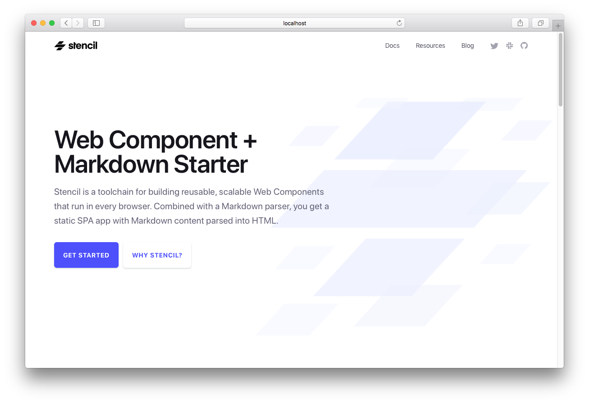
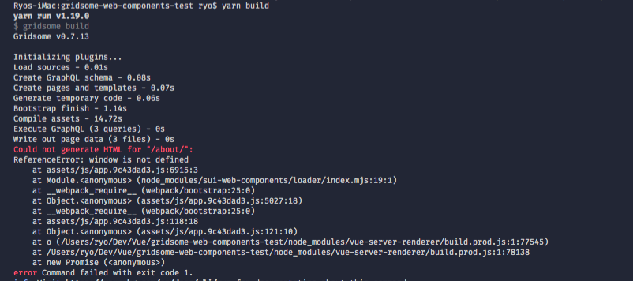

Markdown is my jam. I'm always looking for ways to integrate it into my workflows to make authoring content easier for myself (and ideally others). When I started using Web Components, I used them with other SSG (static-site generator) solutions like GatsbyJS, Gridsome, or Eleventy to create landing pages, blogs, or documentation websites. But none of them actually pre-rendered my web components, something integral for SEO. When you use web components with SSG's like Gatsby, the web components don't get pre-rendered on the build server, so you just see the `<web-component>` inside the production code instead of the HTML elements it ultimately returns.

I looked into prerendering web components, and I found that StencilJS not only has a solution for it, they had [fantastic example](https://github.com/ionic-team/stencil-site) of an app built with web components and Markdown. The only issue? None of it was documented 😅 So I took the time to go through the repo, reverse engineer it, and write a guide on how to use it as a template for creating your own Markdown-based web component app.



Check out [the source code here](https://github.com/whoisryosuke/stencil-markdown-starter), or read on to discover my process and learn how to use it!

# How it works

The problem with web components is that they're a browser/DOM implementation. And NodeJS, which Gatsby and many frameworks use to generate static HTML, doesn't have access to some of these features (e.g. trying to use the `window` in Node).

When you "prerender" React on the server to generate static HTML, it uses a JS function [from the React library](https://reactjs.org/docs/react-dom-server.html#rendertostring) (`ReactDOMServer.renderToString()`). [Similar with Vue](https://ssr.vuejs.org/#what-is-server-side-rendering-ssr), which leverages `vue-server-renderer`. This process of prerendering makes your app more complex, because you have to consider when the app is server-side (using NodeJS) or client-side (browser's JS).

The simplest issue you begin to encounter in this process is trying to use `fetch()` in a prerendered app, and it breaks server-side because NodeJS doesn't have a `fetch()` module (since it uses an older version of JS). You end up using `isomorphic-fetch` to give you a NodeJS friendly `fetch()` method.

This issue arises with web components when the server (or NodeJS) tries to run web component code and breaks — because it doesn't have an actual DOM. You have to somehow polyfill the missing DOM methods and elements for NodeJS so it can parse the web components correctly.



Here you can see an error from Gridsome's build process where it breaks because the web component's reference the `window` (which NodeJS doesn't have).

StencilJS solved this issue by [creating their own "pre-rendering" process](https://github.com/ionic-team/stencil/tree/master/src/prerender) that NodeJS can utilize to parse the components properly.

# The Hunt for Markdown

Once I knew I wanted to use StencilJS as the primary utility for developing a pre-rendered Markdown site, I started to research how to either: use it with Gatsby, or how people generally use Markdown with Stencil.

## Gatsby Plugin?

I thought about creating a Gatsby plugin that hooks in the StencilJS prerendering process (or derivative of it) to render web components when detected in the React DOM or ideally AST. This sounded incredibly daunting however, so I tried to think of a faster way to get projects off the ground.

## Stencil Markdown plugin?

I found a plugin for StencilJS that allows you to import Markdown and display it inside web components. It hooks into StencilJS' Rollup build process, [checks if](https://github.com/natemoo-re/stencil-markdown/blob/master/src/index.ts#L9) [the imported file is Markdown](https://github.com/natemoo-re/stencil-markdown/blob/master/src/util.ts#L7-L9), and [runs it's parsing](https://github.com/natemoo-re/stencil-markdown/blob/master/src/index.ts#L16) using [the `marked` library.](https://github.com/natemoo-re/stencil-markdown/blob/cac7d1c7f6a6fbeebcf5b95a956bae29b52c6a76/src/parse.ts#L4) I setup a new StencilJS project with the plugin and immediately started to battle build errors. I opted to move on, since I wanted a faster solution if possible.

Ideally this would be the best method ultimately to accomplish this within StencilJS, since it hooks into the build process. You'll see below that we don't truly achieve a "hot reload" because we work around the Rollup build (instead of extending it like this plugin).

## StencilJS Docs

I discovered that the StencilJS' own documentation was created using their framework, allowing them to leverage the pre-rendering. Rather than creating a Markdown plugin, they parse the Markdown into JSON separately using a Node script. Then the JSON is used inside the app to display the content.

After reverse engineering the repo, I created a repo that strips away most of the content, optimizes the Markdown workflow, and offers guides on navigating and customizing the site.

# Using the Template

## 🚀 Getting Started

1. Clone the repo: `git clone https://github.com/whoisryosuke/stencil-markdown-starter.git`
2. Install dependencies: `npm i` or `yarn`
3. Parse the Markdown and start the dev server: `npm run dev` or `yarn dev`

## 🧐 How does it work?

- When you run `npm run site.structure`, a JS script crawls your `src/docs/README.md` and creates `src/assets/docs-structure.json` which is used to generate the documentation sidebar and routes.
- When you run `npm run docs`, two scripts are run to generate JSON files from Markdown files in the docs and blog folders. The JSON files are placed in the `./src/assets/` folder, nested in a docs or blogs folder. The JSON files contain parsed Markdown and frontmatter, and are used by the `<doc-component>` and `<blog-component>` to import and display the content.
- When you run `npm run start`, the StencilJS build process is run in development mode. This boots a local server with hot reloading of the application. Note, this does not hot reload the Markdown content directly, because it's parsed by another script (`npm run docs`) before this.

## 📝 Adding Markdown content

Markdown content can be created inside the `src/blog` and `src/docs` folders. Make sure to include the following frontmatter, depending on post type:

### Blog content:

```md
---
title: How Lazy-Loading Web Components Work with Stencil
date: August 15, 2019
url: /blog/how-lazy-loading-web-components-work
author: Adam Bradley
twitter: adamdbradley
description: When you’re building an app that requires a large library of components in a single file download, you’re often forced to sacrifice performance - and specifically startup time - for the sake of accessing all those components. The two are often mutually exclusive. Choose to easily have all the components available, or choose blazing fast startup, but it’s difficult to get both. At least that’s the experience for many.
img: /assets/img/blog/posts/stencil-lazy-loading.png
---
```

### Documentation content:

```md
---
title: Stencil Web Component Browser Support
description: Out-of-the-box browser support provided by Stencil web components.
url: /docs/browser-support
contributors:
  - adamdbradley
  - kevinports
  - jthoms1
  - arjunyel
---
```

## ♻️ "Hot reloading" Markdown Content

Run `npm run markdown.sync` in a separate Terminal next to your `npm run start` script.

Since the Markdown parsing occurs using a Node script (`npm run docs`) outside of the Stencil build process, we have to re-run the script each time we make a change to Markdown files. Thanks to nodemon, it checks for any changes that occur in Markdown files in your docs and blog folders, and restarts the Markdown parsing.

It's not exactly hot reloading, since Stencil's build process will run - but won't refresh the page with changes, but it's better than manually running the script.

The URL of the page is determined by the URL property in the Markdown frontmatter. You can organize or name the Markdown files however you'd like, since nesting them inside folders won't effect the URL.

To add links to documentation, see the section "Adding pages to docs sidebar".

## 📄 Adding static pages

Instead of creating pages with Markdown, you could also create pages using web components.

Add your route inside `src/components/app-root/app-root.tsx` inside the `<stencil-route-switch>` component. The component prop should be the same as your component name (e.g. `<resources-page>` inside `src/components/resources-page/resources-page.tsx`).

    <stencil-route url="/resources" component="resources-page" />

Make sure to add a link to the page in the main navigation or sidebar.

a. For the main navigation, you add it to `src/components/site-header/site-header.tsx`:

```js
<stencil-route-link
  url="/resources"
  exact={true}
  onClick={() => {
    this.hideNav()
  }}
>
  Resources
</stencil-route-link>
```

b. See the section "Adding pages to docs sidebar"

## 🔗 Adding pages to sidebar

The sidebar is the navigational menu that's displayed on the left of documentation. You add your link to `src/docs/README.md` as an Markdown list item with an external link or relative markdown file (for docs):

```md
- [My First Component](introduction/my-first-component.md)
- [Resources](/resources)
- [Stencil on Twitter](https://twitter.com/stenciljs)
```

# Web Components + Markdown = ✅

I hope this guide helped provide insight into the process of integrating Markdown with web components. This template should simplify your workflow and help you create your own blogs and documentation sites (or even templates!).

If you have any questions or feedback, feel free to leave a comment or [hit me up on Twitter](http://twitter.com/whoisryosuke). Would love to see what you build with this, send me a link to your project! 🔧💻✨

Kanpai 🍻
Ryo

# References

- [https://github.com/whoisryosuke/stencil-markdown-starter](https://github.com/whoisryosuke/stencil-markdown-starter)
- [Stencil Documentation](https://stenciljs.com/)
- [https://github.com/ionic-team/stencil-site](https://github.com/ionic-team/stencil-site)
- [https://github.com/ionic-team/stencil/tree/master/src/prerender](https://github.com/ionic-team/stencil/tree/master/src/prerender)
- [Stencil Worldwide Slack](https://stencil-worldwide.herokuapp.com/)
- [Ionic](https://ionicframework.com/)
- [Ionic Worldwide Slack](http://ionicworldwide.herokuapp.com/)
- [Ionicons](http://ionicons.com/)
- [Capacitor](https://capacitor.ionicframework.com/)
