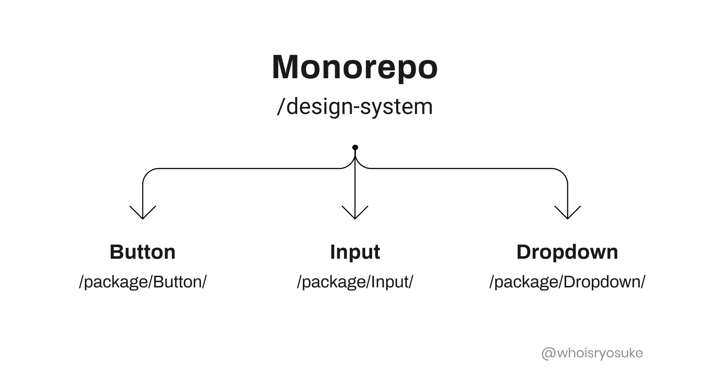
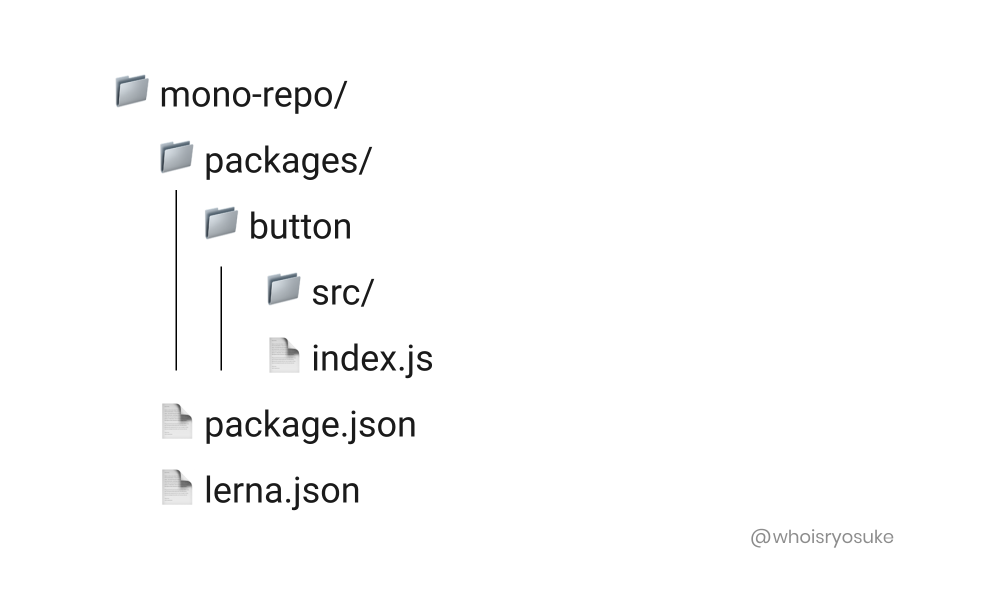
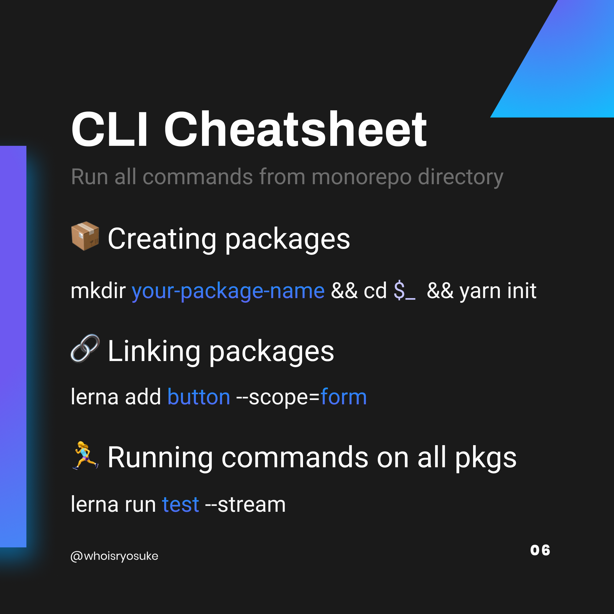

When creating a design system, it's often **useful** to break things up in to _smaller_, **separate modules** (or packages). When you decide to **deliver each component separately**, or utility modules alongside your components, you'll find yourself in a _sticky_ situation.

Do you refactor it out into a separate git repo and NPM package? How does that get managed - like sharing builds/testing flows? How do you create a development environment that can be spun up easily without fussing _too much_ with `npm link`? **This is where Lerna comes in.**

In this article we'll go through what **Lerna** and **monorepo's** are and how to use them to **create** and **manage a new design system**. Or skip ahead and [check out the source code here](https://github.com/whoisryosuke/design-systems-monorepo).

# What are we building?

Here's a quick overview of what we'll be building and what technology we'll be using to make it happen:

- **[Monorepo](https://en.wikipedia.org/wiki/Monorepo)**
- Powered by **[Lerna](https://lerna.js.org/)** (most popular option)
- Requires **[Yarn](https://yarnpkg.com/)** (for managing linked dependencies across packages or "workspaces")
- **[React](https://reactjs.org/) UI Component Library** (but it can be anything, see Examples for more)

# What is Lerna?

Lerna is a tool for managing JavaScript projects with multiple packages.

When I say Javascript project, that means **one single git repo**. And when I say that project has multiple packages, I mean that there's **multiple modules** (like NPM, Severless Functions, maybe even Composer or other languages) inside one git repo.

# What is a monorepo?

This is what a **monorepo** is. One repo for many projects/modules/etc.



Many larger companies like **Google** and **Facebook**, as well as smaller companies like **Gatsby** or **Vercel**, use monorepos to help manage large scale projects. In Gatsby's case for example, their monorepo contains the Gatsby CLI, starter templates, and even their plugins — **all within one repo**, ensuring that you can tinker with any particular package locally.

# Why use Lerna?

When you want to create a monorepo and more easily manage multiple packages simultaneously.

- You can link packages together (like a `core` package used by other packages - similar to Yarn Workspaces or `npm link`)
- Import a package and it's commit history into a monorepo
- Publish multiple packages at once and increment their package versions

_You can_ often do all of this **without Lerna** by leveraging the same dependencies (like Yarn Workspaces), but Lerna gives you a lot of this functionality out of the box. This eliminates the time spent writing common scripts and workflows.

# Creating your first monorepo

Now that we understand what Lerna and monorepos are, let's actually bootstrap one!

1. Create a new folder for the monorepo: `mkdir your-monorepo && cd $_`
2. Run the Lerna install: `npx lerna init`

   This will bootstrap your project with the following files and structure:

   ```bash
   lerna-repo/
     packages/
     package.json
     lerna.json
   ```

3. To enable Yarn Workspaces (which manages shared dependencies and linked packages) add the following to the `package.json`:

   ```json
   {
     "name": "my-design-system",
     "private": true,
     "workspaces": ["packages/*"]
   }
   ```

4. Make sure the `lerna.json` is picking up packages in the `/packages/` folder, where we'll place each design system module (or package):

   ```json
   {
     "packages": ["packages/*"],
     // Doesn't version the monorepo - keeps version to packages
     "version": "independent",
     "npmClient": "yarn",
     "useWorkspaces": true
   }
   ```

# Folder Structure

After you run the `lerna init` process and the configurations above, you should be using a folder structure similar to below:



Inside the `/packages` folder you can place any packages (aka NPM modules) that you'd like to split your project into. For example, you could have `website` and `components` folders, where one contains the site and the other contains the components and design system.

All packages should be on the same folder level. This means you shouldn't nest packages (like a `components/button` folder). Each folder inside the `/packages` folder should represent a needed NPM module.

If you want to nest modules, the parent folder should be one module, and ideally the nested modules should be linked (from modules inside the root `/packages`). The nested modules can be unlinked, but they won't be available inside other modules (unless you link the parent module).

Keep in mind that you're not required to use the `/packages` folder or name. If you change the configuration in your `package.json` and `lerna.json` you can have your NPM modules located in any folder (or subfolder).

# Common Commands

Now that you have your first monorepo, let's learn some common commands you'll use on a regular basis with Lerna.

First you'll definitely want to use Lerna to create new packages and link them together. Then you can dig deeper by running commands on all packages, or publishing to NPM (even using conventional commits if that's your thing).

## Creating new packages

1. Go into the packages folder: `cd packages`
2. Create a folder for the package and navigate to it: `mkdir your-package-name && cd $_`
3. Start a new project with npm or yarn: `yarn init` (start the version at 0.0.0 — Lerna will increment auto on first publish)

If you have an NPM Org Account which supports private packages, you can add the following to your module’s individual `package.json`:

```json
"publishConfig": {
    "access": "restricted"
}
```

## Installing a local package as dependency

Often you'll find yourself wanting to use one of your design system's packages inside another (like using a `core` package inside your `components` package, or `button` inside a `form`).

In this case, Lerna has a command `lerna add` that handles adding the process of linking the local package to another package (using `yarn link` to add to the `package.json`).

1. Go to the Lerna project root: `cd my-monorepo`
2. Run the following command where the **_first_ package** **gets added** to the **_second_ package**:

   ```bash
   lerna add button --scope=form
   ```

In this case, `form` will have the `button` as a dependency.

You can install a package to **all packages** in the monorepo by running `lerna add package-name`.

## Run command on all packages

Lerna has a command you can use to [run the same command in every package](https://github.com/lerna/lerna/tree/master/commands/run#readme). By running `lerna run test`, this command runs a script that goes through each package and runs the test script declared in `package.json`.

```bash
lerna run test --stream
```

It's recommended you create a separate package that contains all the testing dependencies and add it to all your other modules, this makes it easier to manage testing across all packages by isolating dependencies to one location.

1. Ideally you can setup testing to be in a `utils` or `testing` package.
2. Add `testing` package to all components (use `lerna add` to [add to multiple packages at once](https://github.com/lerna/lerna/tree/master/commands/add#readme))
3. Add `test` script to `package.json` of each component
4. Run test using `lerna run test`

## Remove dependency from all packages

If you added a dependency that you no longer need in a certain package, Lerna comes with a command to remove them from the Yarn workspace (and thus shared dependencies).

1. Go to the Lerna project root
2. Run the following command: `lerna exec -- yarn remove dep-name`

## Publish all packages

When it comes time to publish your packages to NPM, Lerna can handle this process for you. Once you're logged in, you can run Lerna's publish command to create a new release containing any packages that have been updated, as well as updating any packages on NPM.

1. Login to NPM: `npm login`
2. Run the publish script: `lerna publish`

### **Split Versioning and Publishing**

If for whatever reason you want full control of the versioning, Lerna has the ability to split versioning and publishing into two commands. This can help with if you're looking to have more control between version and release,

You can manually run:

```bash
lerna version
```

Then follow the prompts to update the individual version numbers.

Then you can have a publish script that will read the latest tag (that was manually updated) to publish to NPM:

```bash
lerna publish from-git --yes
```

## Configurations

### Automatic Conventional Commits

Lerna supports the use of the [Conventional Commits Standard](https://www.conventionalcommits.org/en/v1.0.0-beta.2/) to automate Semantic Versioning in a CI environment.

This gives developers the ability to commit messages like

```bash
git commit -m "fix: JIRA-1234 Fixed minor bug in foo"
```

Then in a CI environment, the packages version’s can be updated and published to NPM based on commits like the one above. This is done by configuring your CI environment to run:

```bash
lerna publish --conventional-commits --yes
```

If you don’t want to pass the flags on each publish, add the following to your lerna.json file

`lerna.json`:

```json
"command": {
    "publish": {
       "conventionalCommits": true,
       "yes": true
    }
}
```

### **Enforcing Conventional Commits**

It's one thing to use conventional commits, but it's a completely other thing to actual enforce them.

Enforcing them means using a commit linting process to parse all commits and ensure they meet the conventional commits standard.

And since it can be a pain to remember the exact syntax of commits, it's highly recommended you setup a commit CLI flow (like commitzen) to walk devs through a conventional commit and ensure it's up to spec each time.

This process is a bit involved, so I cover it in a separate article.

# Not That Scary 👻

Hopefully this helps demystify monorepos and how to create and work with them. It's an empowering workflow that helps simplify and scale development. And it's a great skill to learn in and out of the design system world, since most large projects tend to learn towards a monorepo structure.

I used this workflow to [create a monorepo that contains multiple Storybooks](https://github.com/whoisryosuke/design-systems-notebook) so I could have a kind of "design systems notebook". This way I could write notes on any frontend framework, like React or Vue, and contain all the notes in one place.

Is there anything I missed that you still don't understand? Let me know in the comments or [on Twitter](https://twitter.com/whoisryosuke) and I'll try to fill in the gaps 👍

Make sure to check out my Instagram post for a quick reference you can save for later:



# References

## Examples

- [https://github.com/whoisryosuke/design-systems-monorepo](https://github.com/whoisryosuke/design-systems-monorepo)
  - Example project for creating a basic design system.
- [https://github.com/whoisryosuke/design-systems-notebook](https://github.com/whoisryosuke/design-systems-notebook)
  - Using a monorepo to create multiple Storybooks (React, Vue, etc)

## Official Documentation

- [https://lerna.js.org/](https://lerna.js.org/)
- [https://github.com/lerna/lerna#readme](https://github.com/lerna/lerna#readme)

## Tutorials

- [https://medium.com/@jsilvax/a-workflow-guide-for-lerna-with-yarn-workspaces-60f97481149d](https://medium.com/@jsilvax/a-workflow-guide-for-lerna-with-yarn-workspaces-60f97481149d)
