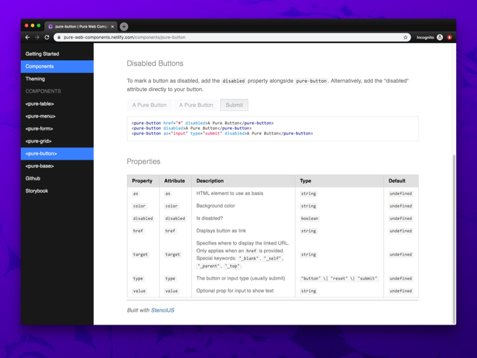

Web Components seem to be trending recently now that the specification is approved and all evergreen browsers support them. Rather than relying on a framework to achieve a componentized architecture, you can create reusable elements that have their own styles and functionality using _only_ vanilla JavaScript. By just including a JS script into your page you can use a web component anywhere, complete with scoped CSS and a shadow DOM (like React or Vue) 🤯

The **beauty** and **_bane_** of web components is they truly are that simple to use in some cases, but difficult to work with in others. In this article I'll explore using Web Components for a design system and what kind of benefits and limitations it introduces. Then I'll explore creating various component types using StencilJS.

I won't be going into detail about what Web Components are. I would recommend reading a few guides and playing with them a bit. It'll help understand the implementation behind the limitations I'll describe (like the Shadow DOM).

# Why use Web Components?

With all the JavaScript framework fatigue going on, you might ask yourself: why am I learning yet another way to write components? There are a few benefits to using web components instead of a framework.

- Web components are a standard built into the web itself (equivalent of using a new HTML element, new Javascript method like `.map` or `.reduce`, etc). Especially when combined with using `<script type="module">` specification, you use much less code to serve components.
- Web components are highly supported across evergreen browsers. All support currently except IE11 and Edge. You can learn more about the limitations and how to polyfill below.
- There's high compatibility across libraries. You can use them in React, Vue, Angular, Svelte, and many other projects. Basically any framework that is JS-based, or can render DOM with JS (like Laravel's Blade) can use Web Components since they're a natively supported JavaScript feature.
- Web components are comprised of a lot of vanilla JS functions. If you know JS well, or come from a classically trained background without modern frameworks, it'll seem really familiar adding event listeners and using `this`. You can also modernize the experience with tools like lit-element or StencilJS, which add decorators to your components and streamline the boilerplate out of code.

# What are the limitations?

Before we delve too deep into actually using Web Components, I'd like to save you any frustration you initially discover from your first foray. Here are some of the major issues holding web components back from being the ubiquitous choice.

## Browser Support

If you're interested in browser support, check out [the Can I Use for Web Components.](https://caniuse.com/#search=web%20components) Web components in general are widely supported in all evergreen browsers and only requires polyfilling in IE11 and older. [The polyfill is available here.](https://github.com/webcomponents/polyfills/tree/master/packages/webcomponentsjs)

Web Components usually use the shadow DOM (they don't _always_, but often do when made with lit-element, Stencil, Vue, etc). The shadow DOM is fairly supported across browsers, except for IE11, Edge, and even Firefox (it has it, but requires manual enabling on the user end). This means you will have to polyfill it for those browsers. [You can find the polyfill here.](https://github.com/webcomponents/polyfills/tree/master/packages/webcomponentsjs)

## Framework Support

Check out the [Custom Elements Everywhere](https://custom-elements-everywhere.com/) website to see what JavaScript frameworks support it. Basically everything _(except React)_ has full support. [Preact just recently announced full support](https://twitter.com/rob_dodson/status/1197205451827343360). And despite not having full support, there are workarounds for the React issues _(albeit hacky)_.

### What's wrong with React?

Basically the issues with React lie in the way React handles events and props.

For events, React has it's own synthetic event system it uses, requiring you to add event listeners inside a React component. This hooks the web component events into the React component.

React also has an issue passing arrays and objects as props - inside your web component you'll see "Array (4)" instead of the actual array value. This requires you to `JSON.stringify()` and `JSON.parse()` any prop that uses an array or object type.

If you're interested in seeing the workarounds, scroll below to the **"Using in React"** section.

## Server Side Rendering (SSR)

The way Web Components work is you see a custom element in the DOM (i.e. `<my-button>`) and a JavaScript file runs and lets the browser know how to handle it. Without JavaScript, you wouldn't see your component render, you only see any un-styled content inside. Ideally, when you're creating an app, you want to ensure it works as best as possible without JS. It ensures users without JS can use the site, and better for SEO when spiders don't have to run scripts to see content.

The only way I've found to pre-render Web Components is [StencilJS](https://stenciljs.com/docs/prerendering), which offers [a static rendering option](https://stenciljs.com/docs/prerendering) to their build process.

### GatsbyJS and Node-based SSGs

Because Gatsby generates static HTML for it's React components, [it uses Node to do this, which only supports a subset of the actual web JS](https://vaadin.com/forum/thread/17805764/using-vaadin-webcomponents-in-gatsby). **This means Gatsby can't import Web Components _unless_ they're pre-compiled** and included as a client-side `<script>` tag in your HTML (much like a lot of React apps).

If you want an easier time using a static site generator with Web Components, find one that's HTML based, like [11ty](https://www.11ty.io/).

# Design Systems using Web Components

But who actually uses Web Components? And how do they actually implement them? There's basically two schools: **lit-element** and **StencilJS**. You'll notice that the lit-element setups will range from simple to more complex to allow for decorators, while the StencilJS projects follow the framework-like structure of the tool chain.

You can find a link to a CodeSandbox example with a sampling of each design system's components underneath each project.

- [Material Design Web Components](https://github.com/material-components/material-components-web-components)
  - lit-element and lit-html with separate packages created by Lerna
  - Very early release as of writing (0.1) with a few missing components.
  - [Example of a few components](https://codesandbox.io/s/aged-sound-intm5?fontsize=14&hidenavigation=1&theme=dark)
- [Bolt Design System (more Twig based)](https://boltdesignsystem.com/pattern-lab/?p=viewall-components-button)
  - lit-element, lit-html, and even Polymer
- [aybolit](https://github.com/web-padawan/aybolit/)
  - lit-element
  - Bootstrap, Material, Bulma, and unstyled themed components
  - [Example of a few components](https://codesandbox.io/s/elastic-platform-w6phh?fontsize=14&hidenavigation=1&theme=dark)
- [Ionic Web Components](https://github.com/ionic-team/ionic/tree/master/core/src/components)
  - StencilJS
  - IOS and Material Design components that mimic native elements
  - [Example of a few components](https://codesandbox.io/s/wonderful-silence-e2j0c?fontsize=14&hidenavigation=1&theme=dark)
- [Vaadin](https://vaadin.com/tutorials/using-web-components-in-react)
  - lit-element, React, Vue, Angular — Paid
- [WiredJS](https://github.com/wiredjs/wired-elements)
  - lit-element
  - [Example of a couple components](https://codesandbox.io/s/wired-web-components-rtwqk)
- [Bulmil](https://github.com/Gomah/bulmil#vue)
  - Bulma CSS built with StencilJS
  - [Example of buttons](https://codesandbox.io/s/bulmil-bulma-web-components-qb3kd)

# Exploring Implementation Options

As you can see above, there's basically two avenues that make it easier to develop web components. You can use lit-element or StencilJS. I'll compare both below on a very rudimentary level (a simple component with a few props).

Keep in mind there's way more to each library for handling things like methods, state, etc. Covering all the options would be the topic of discussion for a dedicated article. I encourage you to explore each option yourself and see what syntax you prefer.

## Lit Element

It's not terrible, but despite using a library and extending another class, we still have a bit of boilerplate to do to accomplish a simple component with props:

```js
import { LitElement, html } from 'lit-element'

class MyElement extends LitElement {
  static get properties() {
    return {
      prop1: { type: String },
      prop2: { type: Number },
      prop3: { type: Boolean },
      prop4: { type: Array },
      prop5: { type: Object },
    }
  }

  constructor() {
    super()
    this.prop1 = 'Hello World'
    this.prop2 = 5
    this.prop3 = false
    this.prop4 = [1, 2, 3]
    this.prop5 = { subprop1: 'prop 5 subprop1 value' }
  }

  render() {
    return html`
      <p>prop1: ${this.prop1}</p>
      <p>prop2: ${this.prop2}</p>
      <p>prop3: ${this.prop3}</p>
      <p>prop4[0]: ${this.prop4[0]}</p>
      <p>prop5.subprop1: ${this.prop5.subprop1}</p>
    `
  }
}

customElements.define('my-element', MyElement)
```

Here is the same component and props using **decorators** instead. Here you don't have to define the properties in the constructor:

```js
import { LitElement, html, customElement, property } from 'lit-element'

@customElement('my-element')
export class MyElement extends LitElement {
  @property({ type: String }) prop1 = 'Hello World'
  @property({ type: Number }) prop2 = 5
  @property({ type: Boolean }) prop3 = true
  @property({ type: Array }) prop4 = [1, 2, 3]
  @property({ type: Object }) prop5 = { subprop1: 'prop 5 subprop1 value' }

  render() {
    return html`
      <p>prop1: ${this.prop1}</p>
      <p>prop2: ${this.prop2}</p>
      <p>prop3: ${this.prop3}</p>
      <p>prop4[0]: ${this.prop4[0]}</p>
      <p>prop5.subprop1: ${this.prop5.subprop1}</p>
    `
  }
}
```

### Using StencilJS

[StencilJS](https://stenciljs.com/docs/getting-started) is a framework by Ionic for developing web components. It’s a CLI that bootstraps your project with the appropriate dependencies, node scripts, and an example project to get started. You can pick from 3 different options, an Ionic PWA, a blog, or component library.

```js
import { Component, Prop, h } from '@stencil/core'

@Component({
  tag: 'my-first-component',
})
export class MyComponent {
  // Indicate that name should be a public property on the component
  @Prop() name: string

  render() {
    return <p>My name is {this.name}</p>
  }
}
```

You can see it's only a small bit shorter syntax than lit-element. The benefit of StencilJS is that it's integrated with Typescript, so rather than working with the standard set of types that come with JS, you can define your own. This allows you to create a better development experience by offering features like auto-completion for component props. You can also accomplish this with lit-element and your own TS setup, it's just not as _"out of the box"_.

### Comparison of using Stencil vs Lit-Element

Stencil is more of a framework for developing Web Components (even though they don't like that phrase), with preferences towards the Ionic platform (yet still fairly agnostic). lit-element is similar, in that it offers a solid template for creating components, but it doesn't come with all the extra bells and whistles of Stencil. With Stencil, you get the ability to generate everything to a component's structure (the TSX, the CSS, and even a sample E2E test).

Another big difference is that Stencil employs JSX, while lit-element has to use lit-html as it's templating language to render to the shadow DOM. The syntax is slightly different, but similar enough that it's not a huge barrier.

Stencil allows you to build your Web Components [as various different distribution methods](https://stenciljs.com/docs/distribution) (ES6, MJS, etc) and easily integrate with other libraries. While you have to roll your own solution with lit-element.

**Ultimately**, if you want something as close to the standard as possible, with no extra baggage — go for **lit-element**. If you don't want to setup testing, go through as much boilerplate, or develop a build process — use **Stencil**.

## Using inside React

You're able to just use Web Components inside React, and pass them props like you would any component. Add your components bundle to the HTML file that renders your app, add polyfills if necessary, and you're good to go! You can also use ES6 imports for web components if the library supports that distribution method.

To ensure **backwards compatibility** with browsers that don't support Web Components, make sure to [install the **polyfill**](https://github.com/webcomponents/polyfills/tree/master/packages/webcomponentsjs): `npm install @webcomponents/webcomponentsjs`

From the [ReactJS Official Guide to Using Web Components](https://reactjs.org/docs/web-components.html):

> Web Components often expose an imperative API. For instance, a `video` Web Component might expose `play()` and `pause()` functions. To access the imperative APIs of a Web Component, you will need to use a ref to interact with the DOM node directly. If you are using third-party Web Components, the best solution is to write a React component that behaves as a wrapper for your Web Component.

So to work with fucntions/methods on the web component, you have to attach a `ref` to the web component. This lets React keep track of this component (similar to an old school querySelector but more _memoized_).

> Events emitted by a Web Component may not properly propagate through a React render tree. You will need to manually attach event handlers to handle these events within your React components.

This is another side effect of working in React-land that many of us will be all too familiar with if you've ever had to work with a form and bind methods to it. React can't keep track of events unless you instruct it when and where, so we add an event listener when the component mounts. This keeps track of an event that you know the component will emit, like a "closed" or "open" event.

You can see this in action here in this [example from CSS Tricks:](https://css-tricks.com/advanced-tooling-for-web-components/)

```js
import React, { Component, createRef } from 'react'

export default class MyComponent extends Component {
  constructor(props) {
    super(props)
    // Create the ref
    this.dialog = createRef()
    // Bind our method to the instance
    this.onDialogClosed = this.onDialogClosed.bind(this)

    this.state = {
      open: false,
    }
  }

  componentDidMount() {
    // Once the component mounds, add the event listener
    this.dialog.current.addEventListener('dialog-closed', this.onDialogClosed)
  }

  componentWillUnmount() {
    // When the component unmounts, remove the listener
    this.dialog.current.removeEventListener(
      'dialog-closed',
      this.onDialogClosed
    )
  }

  onDialogClosed(event) {
    /** Omitted **/
  }

  render() {
    return (
      <div>
        <one-dialog open={this.state.open} ref={this.dialog}>
          <span slot="heading">Heading text</span>
          <div>
            <p>Body copy</p>
          </div>
        </one-dialog>
      </div>
    )
  }
}
```

# Creating a design system

I set out to create a very small, yet flexible design system based off the Pure CSS framework by Yahoo. It only contains 5-6 "components", and none have any intense JavaScript functionality (beyond the dropdown, which can be mostly CSS nowadays anyway). I used StencilJS as the basis for my project, which created a sample component for me, a CSS stylesheet, and E2E test. And it gave me any scripts I needed for building components in development and production environments.

The next step was installing Storybook to develop the components. You can check out my article here on that for the various methodologies I discovered.

I started with the button, and immediately started to discover the many quirks of working with slots, the shadow DOM, and the Host element. I tried my best to document all my issues here so you can possibly forego the shock I had to endure when I made each of these discouraging discoveries.

## Styling

Styling can be a bit tricky with Web Components because of how they mix the shadow and "light" DOM. Web Components are often rendered in the "shadow DOM", which is a separate virtual representation of the DOM that sits "behind" (or shadows) the regular (or "light") DOM.

Since the shadow DOM is separate and scopes it's CSS within itself, you're not able to define CSS inside a Web Component's scoped styles that's globally available. So you can write `p { color:red; }` and only `<p>` elements inside the component's shadow DOM will be styled. Note that last part. Any `<p>` element that's used inside a `<slot>` **will not** be styled.

```js
import { Component, Host, h, Prop } from "@stencil/core";

@Component({
  tag: "pure-menu",
  styleUrl: "pure-menu.css",
  shadow: true
})
export class PureMenu {
  render() {
    return (
      <Host>
        <slot></slot>
        <p>This should be red, because it's the shadow DOM</p>
      </Host>
    );
  }
}

p {
  color:red;
}

<pure-menu><p>This isn't red because it's "light" DOM</p></pure-menu>
```

Slots, which are used by Web Components to display nested elements and components, live in the light DOM. It's a bit confusing, but the slots are just templates that already exist in the (light) DOM and are placed inside the Web Component (rather than content defined inside the Web Component, which is rendered separately to the shadow DOM).

This intense level of scoping prevents Web Components from polluting the semi-global CSS namespace (the CSS of higher-level components would have the highest priority). But it prevents you from creating components that are more dynamic and flexible, enforcing you to to either:

- Use the Web Components and a strict props API that generates all data in the shadow DOM. If you need interactions based on props, you can add the prop to the `<Host>` class and reference any shadow DOM children.
- Apply styles globally _(not desirable, no scoping)_
- Use CSS variables to manage properties

The nuances don't end there with styling I'm afraid. Things get very mucky when you mix the light and shadow DOM. Here are some of the common issues I encountered when styling my design system.

### Inline Styles

When you're using components, you'll often want to override styles on them using the style HTML attribute (`<pure-button style="color:red">`). It works on Web Components by applying to the "host" element (`<Host>` in Stencil). This will work fine, if you use your host element as the basis for your component. But if you need to use a specific HTML type (like `<pure-button>` has to be a `<button>` or `<input>` depending), your component will use a nested `<TagType>` element that changes the HTML element based on props/input. And if any logic is contained in a nested element, there's no way to alter it using inline styles.

```js
import { Component, Host, h, Prop } from '@stencil/core'

@Component({
  tag: 'pure-menu',
  styleUrl: 'pure-menu.css',
  shadow: true,
})
export class PureMenu {
  render() {
    return (
      <Host>
        <nav style="color:blue">
          <slot></slot>
          <p>This will be blue, not red.</p>
        </nav>
      </Host>
    )
  }
}

;<pure-menu style="color:red"></pure-menu>
```

I wasn't able to use the style prop directly, and when I tried to define one, I would get an error stating I couldn't define props for default element attributes. So there was no way to pass the inline styles down from the Host to a wrapper element (like TagType).

### Host vs Wrapper Width

Best way to handle the Host and wrapper relationship is to set the Host to `display:inline-block`, and the wrapper as `width:inherit`. This ensures the inner element (wrapper/TagType) fills out the Host, even if the user changes the width of the Web Component (or Host element) using inline styles or other overrides. It's also best to name the component with a unique class name, allowing you to reference it (depending on light/shadow DOM usage). Only use a nested `<TagType>` component when necessary for accessibility or functionality reasons (since it's so difficult to override).

### Scope is real!

Needed to pass a CSS class to another Web Component (`<pure-button`) that was nested inside a `<pure-form>`. The class is used to create a grid and size the element. When I applied the class to the component itself, it worked. But when I passed the class inside (using a secondary `xclass="pure-input-1-3"` prop) the styles weren't applied from the parent Web Component, since the new Web Component created a new scope inside the shadow DOM. React wouldn't have this issue, I could pass a class to any nested component and have it printed out and read.

**Don't do this**, _unless_ the CSS class you're passing is globally scoped:

```js
@Component({
  tag: 'pure-button',
  styleUrl: 'pure-button.css',
  shadow: true,
})
export class PureButton {
  // other props
  /**
   * Additional CSS Class names
   */
  @Prop() xclass: string

  render() {
    const { xclass, color, disabled, href, type, value } = this
    // Determine what element will be displayed
    // Defaults to button, `as` prop takes precedence
    let TagType = 'button'
    if (href !== undefined) {
      TagType = 'a'
    }
    if (this.as !== undefined) {
      TagType = this.as
    }
    return (
      <Host>
        <TagType
          class={{
            'pure-button': true,
            [color]: color !== undefined,
            [xclass]: xclass !== undefined,
          }}
          aria-disabled={disabled ? 'true' : null}
          type={type}
          value={value}
        >
          {value === undefined && <slot />}
        </TagType>
      </Host>
    )
  }
}
```

## Styling Slots

`<slot>` elements are part of the "light DOM" and not "shadow DOM". This means you can't style them using any shadow DOM elements as a basis. For example, you might have a `<pure-table><tr><td>Test</td></tr></pure-table>` component that creates a web component and a table wrapper, with a slot inside for the table data. If you want to reference a nested child using a CSS selector such as `pure-table>td>tr`, it won't work because the table contents are not collocated with the web component and it's shadow DOM contents.

⏹ [See this article for more info on how slots work (warning Medium paywall).](https://medium.com/stencil-tricks/a-practical-introduction-to-styling-a-shadow-dom-and-slots-879565a2f423)

In order to properly select the slot elements, you should:

- Don't use the shadow DOM for styling. ~~That's how broken it is.~~
- `::slotted(p)` CSS class selector will grab any `<p>` tags inside a slot. ([see this SO post](https://stackoverflow.com/questions/38976819/composing-v1-nested-web-components)). Still doesn't allow complex selectors (e.g. `tr>td>p`).
  - Ionic uses this for some components where it uses a `::slotted(*) ion-nested-element` to target any elements nested inside that match the selector (`<ion-nested-element>`). Specifically it uses it in the `buttons.tsx` to create a "button group" and select any nested buttons. _Note: Using `_` in CSS can be intensive depending on the number of children.\*
- Use CSS variables inside child component and control them with parent component based on state. You can see this in action in the Ionic Design System's button SCSS, where the class is changed on the master component (directly on the `<Host>`), then inside the CSS that class redefines CSS variables to new values. For example, if I add `<pure-button class="clear">` and use the CSS `:host(.clear) { --background:transparent; }`, any other CSS class inside the shadow or light DOM that uses that variable will receive the new value.
  - Not sure why Ionic doesn't scope their variables, and has a lot of generics like "background", unless they're looking for very global changes (rather than having variables of variables - i.e. `--button: var(--background-color)`
  - This still doesn't solve the issue of more complex CSS interactions. Take for example a `<pure-table horizontal>` component that attaches a `.horizontal` class to the web component (the Host specifically). This component also has a slot, which allows users to input any data. If I wanted to style the light DOM based on a class in the shadow DOM, I wouldn't be able to reference it using a relative selector like `.horizontal > tr > td` (since they're technically not near each other). CSS variables work fine for set properties that need to transition (like the table width), but when you just want to add a new interaction (like using an `:after` to display an icon), it falls apart. You'd have to code variables for each state.
- Use the Web Components properties to render data into areas (see example below). _Causes issues with React, since it struggles to use Array or Object based props with Web Components._

  Example of using an Array based prop for passing in a list (similar to React):

```js
<pure-menu
  horizontal
  heading="BRAND"
  headingUrl="#"
  headingPosition="left"
  list={[
    {
      name: 'News',
      url: '#',
      selected: true,
    },
    {
      name: 'Contact',
      url: '#',
      dropdown: [
        {
          name: 'Email',
          url: '#',
        },
        {
          name: 'Twitter',
          url: '#',
        },
      ],
    },
  ]}
></pure-menu>
```

    This is much easier in Styled Components or Emotion. You reference the props inside the style block (`color: ${props ⇒ props.theme.color.primary}`) and it can target nested children fine since everything is rendered with the shadow DOM in React, Vue, etc. Styled Components also handles scoping the CSS properly (as long as you don't globally define anything and use the SASS `& .nested-class` syntax.

## SASS/SCSS Variables

Web Components can be combined with SASS and SCSS, since it's built to CSS anyway. Stencil allows you to use SASS/SCSS inside of components if you prefix your files and install the appropriate plugin ([@stencil/sass](https://www.npmjs.com/package/@stencil/sass)). Makes the process much simpler than running your own Gulp build.

### When to use SASS

As powerful as native CSS is, it's difficult to beat features like using SASS variables in breakpoints, or mixins alone. I found myself leaning towards SASS when I needed to perform operations like generating grid classes (per breakpoint!), generating shades/variations of colors, and array-like variables I need to loop through (like breakpoints).

### Mixing SASS/SCSS and CSS Variables

Define your SASS/SCSS variables before your CSS variables, then use them inside some variables. Make sure to wrap your SASS variables in `#{$var}` when you want them to actually render in the CSS. The dollar sign syntax (`$var`) is valid for a custom property, so recent versions of SASS now require you to wrap it to distinguish it.

```scss
$button-sml: 1em;
$button-med: 1.5em;
$button-lrg: 2em;

.btn {
  --button-size: #{$button-sml};
}

@media screen and (min-width: 600px) {
  .btn-med {
    --button-size: #{$button-med};
  }
  .btn-lrg {
    --button-size: #{$button-lrg};
  }
}

.btn {
  font-size: var(--button-size);
}
```

## Documenting your components CSS variables

Ionic's compiler will parse your component CSS/SASS/SCSS for comments that contain `@prop` declarations and include them in your components documentation (autogenerated [README.md](http://readme.md) or JSON). This is a great way to keep track of all the various variables used in a design system, what their use it, and even collocate it with the rest of the component's docs.

```css
:host {
  /**
   * @prop --border-color: Border color of table cells
   */
  --border-color: #cbcbcb;
}
```

## Architecting Props APIs

Since styling requires a fairly strict props API to accomplish what it needs, you have to really take time when composing components and think about every edge case (more so than say React). This became even more evident when I started to design some simple, yet flexible components, and hit some restrictions with the web component specification.

### No Undefined Props

When creating a simple `<pure-button>` component, I needed to accommodate for various different button types. Pure CSS allows for `<button>`, `<a>`, `<input type="button" />`, and even `<div>` elements to be styled like a button. It was easy enough to create a `as` prop (`<pure-button as="input" />`), where inside the component I used the power of JSX to define a `TagType` variable with the value. All great — until I needed to pass more props along to the component. In React, I would use ES6 object separator syntax to grab the rest of the props (`const Button = ({ as, color, ...restProps }) = {}`).

I tried to reference a prop without defining it (using the decorator syntax) and it didn't work. Once I defined each prop by hand, I was able to use it. So to properly create a `<button>` that can also accommodate for being an `<input>`, I had to define `type` and `value` props (since the input element uses this to display button text). And since I was using a slot to display data inside the button, I had to make sure to disable the slot when the value prop was in use, or you'd get double the text displaying in the DOM. This process makes defining props very absolute, and limits the extensibility of components to the number of props it has strictly typed.

## Host vs Element Wrapper

One concept that's a little weird to understand is the difference between the `<Host>` component, and wrapping the component in an HTML tag (like `<form>`). You can add CSS classes to the `<Host>` element, which isn't displayed in the DOM directly, but still applies the scoped styled to nested elements inside. But if you want to actually wrap the components "children" around an element, you have to define one, and can't assume the `<Host>` will be replicate an element's functionality (like a `<form>` or `<button>`). It simply acts as a kind of JSX "fragment" (similar to React's `<><div id="one"></div><div id="two"></div></>` syntax).

But you can style the Host component using the CSS `:host` selector. So it can get confusing about the limitations of the Host component since it is so robust. [You can read this FAQ on whether or not you can set the width using the `:host` CSS selector](https://open-wc.org/faq/#how-can-i-set-host-width-via-a-property) to see how confusing it is at first.

# Creating your first component

I recommend the first component you create, even if you have experience, should be something simple. The easier it is to accomplish, the faster you get validation that your stack/build process works. Then you can iterate on that small victory and keep momentum.

I started with a simple button, and I was using [Pure CSS](https://purecss.io/) as the basis for my styling. In terms of props/attributes, I needed to be able to: change the color of the button, display as a link, display as an input button, and also take into account any props/attributes those elements may need (like type for input or href for buttons links).

I created a new design system using StencilJS and started to edit the example component provided in the template:

```js
import { Component, Host, Prop, h } from "@stencil/core";

@Component({
  tag: "pure-button",
  styleUrl: "pure-button.css",
  shadow: true
})
export class PureButton {
  /**
   * Background color
   */
  @Prop() color: string;

  /**
   * Displays button as link
   */
  @Prop() href: string | undefined;

  /**
   * Specifies where to display the linked URL.
   * Only applies when an `href` is provided.
   * Special keywords: `"_blank"`, `"_self"`, `"_parent"`, `"_top"`.
   */
  @Prop() target: string | undefined;

  /**
   * Is disabled?
   */
  @Prop() disabled: boolean;

  /**
   * HTML element to use as basis
   */
  @Prop() as: string;

  /**
   * The button or input type (usually submit)
   */
  @Prop() type: "submit" | "reset" | "button";

  /**
   * Optional prop for input to show text
   */
  @Prop() value: string;

  render() {
    // Grab all the props from the component
    const { color, disabled, href, target, type, value } = this;
    // @see: **Handling different wrapper elements**
    // Determine what element will be displayed
    // Defaults to button, `as` prop takes precedence
    let TagType = "button";
    // If a href is provided, change to <a> link
    if (href !== undefined) {
      TagType = "a";
    }
    // If as prop is used, takes precedence over all
    if (this.as !== undefined) {
      TagType = this.as;
    }
    return (
      <Host>
        {{ @see: **Handling different wrapper elements --}}**
        {{-- Dynamic tag derived above --}}
        <TagType
          class={{
            // @see: **Handling style props**
            "pure-button": true, // no matter what element, gives us selector
            [color]: color !== undefined, // displays color as CSS class name
            disabled: disabled // bpolean based CSS class (similar to above)
          }}
          aria-disabled={disabled ? "true" : null}
          type={type}
          value={value}
          target={target}
        >
          {{ -- @see: **Handling edge cases --}}**
          {{-- If we don't have a value prop, assume text/content is slotted --}}
          {value === undefined && <slot />}
        </TagType>
      </Host>
    );
  }
}
```

Lets break this down a bit:

- **Handling different wrapper elements (button vs input vs a link)**: Thanks to the way Stencil uses JSX, you can simply define your element as a variable (`TagType`) and use it like a component (`<TagType>`). In this case, we default the TagType to button, and then do a few if statement to change it if needed. This is a common practice for React developers, and you'll see it in Ionic Web Components as well.
- **Handling style props:** In order to make props work, like passing a color (e.g. `<pure-button color="primary">`), you apply the prop as a class name (you'd select in CSS like this `pure-button.primary`). You can see this in the CSS below. Since we have a dynamic wrapper element, we also apply a class name (`.pure-button`) to the wrapper, allowing us to target it in the CSS (and add modifiers like the color props).
- **Passing props:** Unlike React, there's no way to use the ES6 rest parameter (`{...rest}`) to pull any additional props you missed from the component (e.g `const MyComponent = ({title, header, ...restProps}) = ()`). Web components require you to explicitly define all props, and if you don't, they won't be available. This blew my mind coming from React world. So it's best practice to define each prop and manually apply if necessary to your component (like the type, value, or target above).

You'll find however, that this limits a components extensibility to how large your API spread is. If you don't accommodate for something, there's no catch-all that passes them down (like passing inline styles down, or random props you may not know needed for the component that pass in the `as` prop). If a user was in Gatsby for instance, they couldn't pass the Gatsby `<Link>` component down into the button, since it requires a `to={url}` prop that may not be defined in the web components API (`<pure-button as={GatsbyLink} to="/url">`).

- **Handling edge cases:** Since the user can make this web component a button or input, we have to make sure that if the user defines a "value" prop, we don't show the nested slot (which may contain text/elements). This prevents the user from accidentally doing something like `<pure-button as="input" type="text" value="First Name">Email address</pure-button>` and seeing both "First Name" and "Email Address" appearing in the DOM.

Here is a snippet of the associated CSS stylesheet, so you can see how the interactions work with the color prop if you pass "active", "primary", or "selected". You can also see the use of some CSS variables that are defined as global values in the app.

```css
.pure-button.active,
.pure-button:active {
  box-shadow: 0 0 0 1px rgba(0, 0, 0, 0.15) inset, 0 0 6px rgba(0, 0, 0, 0.2) inset;
  border-color: #000;
}

.pure-button.primary,
.pure-button.selected,
a.pure-button.primary,
a.pure-button.selected {
  background-color: var(--pure-color-primary);
  color: var(--pure-color-light-100);
}
```

# Creating complex components

A button is fantastic, and as you can see, can be complicated despite it's simplistic nature. But there are a myriad of different components necessary to create common or unique user interfaces. How do web components hold up with more complex functionality? What are some of the common patterns that are used to accomplish these?

I was able to hit some edge cases myself, and I've been knee deep in other web component repos analyzing how they achieve more elaborate components.

## Working with nested elements

You need to create a `<table>` component, say `<pure-table>`. How do you handle the content of a table?

```js
<pure-table
  columns={[
    'name',
    'title'
  ]}
  content={[
    {'Eric Cartman', '4th Grader'},
    {'Stan Marsh', '4th Grader'}
  ]}
>
```

**Do you accept content via props**, and create new elements (`<tr><td>`) or web components (`<pure-row><pure-cell>`) for each element type? Allows you to pass down props to components, since they're defined inside the component. This method makes defining components more JS-based, since it requires an array. Very strict API that doesn't allow much user customization or embedding (if they wanted to nest a random `<span>` in a cell). You also have to consider the difficulty working in React.

```js
<pure-table>
  <thead>
    <th>
      <td>Name</td>
      <td>Title</td>
    </th>
  </thead>
  <tbody>
    <tr>
      <td>Eric Cartman</td>
      <td>4th Grader</td>
    </tr>
    <tr>
      <td>Stan Marsh</td>
      <td>4th Grader</td>
    </tr>
  </tbody>
</pure-table>
```

**Or do display content using slots,** **and sacrifice scoped styling** via the shadow DOM for global styles (since slots mix light and shadow DOMs)? This method sacrifices one of the major benefits of using web components, the shadow DOM. Without scoped styles, we might as well just use the same CSS frameworks of yore, and welcome all the leaky abstractions that come with CSS.

```js
<pure-table>
  <thead>
    <pure-row>
      <pure-cell>Name</pure-cell>
      <pure-cell>Title</pure-cell>
    </pure-row>
  </thead>
  <tbody>
    <pure-row>
      <pure-cell>Eric Cartman</pure-cell>
      <pure-cell>4th Grader</pure-cell>
    </tr>
    <pure-row>
      <pure-cell>Stan Marsh</pure-cell>
      <pure-cell>4th Grader</pure-cell>
    </pure-row>
  </tbody>
</pure-table>
```

**Or do you display content using slots, and _keep scoped styling_**. Wait _what_? Yes! This is a method that Ionic employs where they use the shadow DOM for every element. When they have something like a table with nested components (rows and cells), each component has it's own scoped styles that don't (or rarely) bleed into another. This means the table doesn't have CSS that effects nested elements, because anything nested in slots/light DOM wouldn't be effected anyway. The row and cell each have their own styles. In rare cases when they need to target slotted content, they use CSS variables to change values, or the `::slotted(*) pure-row` selector to target components. This would be the only way to handle parent props effecting children, since you can't pass props to slotted content.

I personally ended up using the slots with global styling since I was copying CSS from Pure CSS (a very OOCSS library that required strict selectors like `table > tr > td`), but if I could do it again, I'd refactor in a more Ionic fashion and write my CSS more modular in separate components. It's difficult to accomplish complex interactions with just CSS variables, but if you abuse the `::slotted()` selector a bit, you can achieve results similar to standard CSS.

## Controlling components

Ionic has a menu component that creates a sliding sidebar menu. This component has internal state that determines whether it's open or closed. It has methods that handle this state (setters/getters). But since there can be more than one sliding sidebar menu, they created a `<ion-menu-controller>` component that you reference to find a menu, and then run methods on it (like opening/closing).

This component is basically a wrapper around a "controller" class. The controller handles all the heavy lifting of finding menu elements, adding them to a Map (fancy perf Array), checking component state (disabled or not), etc.

Controller (code truncated for length):

```js
const createMenuController = () => {
  const menuAnimations = new Map<string, AnimationBuilder>();
  const menus: MenuI[] = [];

  const open = async (menu?: string | null): Promise<boolean> => {
    const menuEl = await get(menu);
    if (menuEl) {
      return menuEl.open();
    }
    return false;
  };

  const close = async (menu?: string | null): Promise<boolean> => {
    const menuEl = await (menu !== undefined ? get(menu) : getOpen());
    if (menuEl !== undefined) {
      return menuEl.close();
    }
    return false;
  };

  const enable = async (shouldEnable: boolean, menu?: string | null): Promise<HTMLIonMenuElement | undefined> => {
    const menuEl = await get(menu);
    if (menuEl) {
      menuEl.disabled = !shouldEnable;
    }
    return menuEl;
  };

  // ... truncated

  const get = async (menu?: string | null): Promise<HTMLIonMenuElement | undefined> => {
    await waitUntilReady();

    if (menu === 'start' || menu === 'end') {
      // there could be more than one menu on the same side
      // so first try to get the enabled one
      const menuRef = find(m => m.side === menu && !m.disabled);
      if (menuRef) {
        return menuRef;
      }

      // didn't find a menu side that is enabled
      // so try to get the first menu side found
      return find(m => m.side === menu);

    } else if (menu != null) {
      // the menuId was not left or right
      // so try to get the menu by its "id"
      return find(m => m.menuId === menu);
    }

    // return the first enabled menu
    const menuEl = find(m => !m.disabled);
    if (menuEl) {
      return menuEl;
    }

    // get the first menu in the array, if one exists
    return menus.length > 0 ? menus[0].el : undefined;
  };

  const find = (predicate: (menu: MenuI) => boolean): HTMLIonMenuElement | undefined => {
    const instance = menus.find(predicate);
    if (instance !== undefined) {
      return instance.el;
    }
    return undefined;
  };

  const _register = (menu: MenuI) => {
    if (menus.indexOf(menu) < 0) {
      if (!menu.disabled) {
        _setActiveMenu(menu);
      }
      menus.push(menu);
    }
  };

  const _unregister = (menu: MenuI) => {
    const index = menus.indexOf(menu);
    if (index > -1) {
      menus.splice(index, 1);
    }
  };

  const _setActiveMenu = (menu: MenuI) => {
    // if this menu should be enabled
    // then find all the other menus on this same side
    // and automatically disable other same side menus
    const side = menu.side;
    menus
      .filter(m => m.side === side && m !== menu)
      .forEach(m => m.disabled = true);
  };

  const _setOpen = async (menu: MenuI, shouldOpen: boolean, animated: boolean): Promise<boolean> => {
    if (isAnimatingSync()) {
      return false;
    }
    if (shouldOpen) {
      const openedMenu = await getOpen();
      if (openedMenu && menu.el !== openedMenu) {
        await openedMenu.setOpen(false, false);
      }
    }
    return menu._setOpen(shouldOpen, animated);
  };

  return {
    registerAnimation,
    get,
    getMenus,
    getOpen,
    isEnabled,
    swipeGesture,
    isAnimating,
    isOpen,
    enable,
    toggle,
    close,
    open,
    _getOpenSync,
    _createAnimation,
    _register,
    _unregister,
    _setOpen,
    _setActiveMenu,
  };
}
```

Wrapper Component (`<ion-menu-controller>`):

```js
import { menuController } from '../../utils/menu-controller'

@Component({
  tag: 'ion-menu-controller',
})
export class MenuController {
  /**
   * Open the menu. If a menu is not provided then it will open the first
   * menu found. If the specified menu is `start` or `end`, then it will open
   * the enabled menu on that side. Otherwise, it will try to find the menu
   * using the menu's `id` property. If a menu is not found then it will
   * return `false`.
   *
   * @param menu The menuId or side of the menu to open.
   */
  @Method()
  open(menu?: string | null) {
    return menuController.open(menu)
  }

  /**
   * Close the menu. If a menu is specified, it will close that menu.
   * If no menu is specified, then it will close any menu that is open.
   * If it does not find any open menus, it will return `false`.
   *
   * @param menu The menuId or side of the menu to close.
   */
  @Method()
  close(menu?: string | null) {
    return menuController.close(menu)
  }
}
```

You can accomplish all of this without the controller and just referencing the methods directly inside the component that alter it's state, but the controller class gives you the ability to manage the menus without adding that logic to your own app, and it also validates everything for you (instead of writing your own functionality using a `querySelector`).

The wrapper component (`<ion-menu-controller>`around the controller has been **deprecated** and now they just reference the controller directly (honestly better, and doesn't pollute DOM with unnecessary components that are blank and accessibility risks.

# The Result




6 web components weighing in at about ~160kb uncompressed, complete with loader + CSS. Compared to the original CSS framework, Pure CSS, it's 53x as large. In exchange, it provides a convenient component-based API for accessing many of the properties that were CSS classes before. And much of the CSS is scoped where possible, meaning using these components won't cause unwanted style changes somewhere in the app (where class names may conflict).

[Check out the documentation here.](https://pure-web-components.netlify.com/) It's automatically generated thanks to Stencil and Gatsby. Stencil creates Markdown files from the Typescript props table, and Gatsby renders the Markdown into an entire documentation site. You can see [the process behind it here](https://whoisryosuke.com/blog/2019/automatic-web-component-docs-using-gatsby-stencil/) in a previous blog post.

You can also [see the components live on the Storybook.](https://pure-web-components-storybook.netlify.com/) And the final [source code on Github.](https://github.com/whoisryosuke/pure-web-components)

# Should you Web Component? 🔌

With Stencil it seems simple enough to spin up your own Web Components. It's fairly easy to use them across apps (unless you need SSR, then it gets tricky). And they accomplish a lot of functionality that you get from frameworks like React or Vue, without needing the baggage of the framework's bundle.

When it comes to **design systems**, it's difficult to recommend web components versus any other approach (CSS/SASS, React/Vue, etc). The issues they introduce with the shadow DOM and scoped style logic are immense hurdles to tackle for designers. It can feel more limiting and get hacky when you want to get creative.

Web components are a fantastic way to **encapsulate complex component logic**, like the `<video>` tag or a 3D model viewer. If your focus is to modularize scripts and not styles, web components are a great way to create a framework agnostic component.

# Code Snippets

After working on the design system for a while, I noticed some patterns emerging in my code as I would recycle certain bits. I figured I'd share these here as well to make your life easier or inspire you to see the potential of web components.

## Set component element using as prop (as="button")

```js
    // Make sure to never destructure the `as` from `this`
    // `as` is a protected JS word on it's own
    const TagType = this.as === undefined ? "nav" : (this.as as any);
    return ( <TagType><slot /></TagType> )
```

## Setting classes based on properties

```js
    <Host
      class={{
        "pure-menu": true, // hard-code a class
        scrollable: scrollable !== undefined, // string prop
        horizontal: horizontal // boolean prop
        [color]: color // string prop used as classname
      }}
    >
```

Hope this all helps in your journey with Web Components and creating your own progressive design system!

# References

### Standards / Specification

- [Web Components specification breakdown](https://www.webcomponents.org/specs)

### Compatibility

- [Can I Use for Web Components](https://caniuse.com/#search=web%20components)
- [Custom Elements Everywhere](https://custom-elements-everywhere.com/) - Guide to using WC with frameworks
- [ReactJS Official Guide to Using Web Components](https://reactjs.org/docs/web-components.html)
- [Advanced Tooling for Web Components](https://css-tricks.com/advanced-tooling-for-web-components/)
- [Using Web Components in React by Vaadin](https://vaadin.com/tutorials/using-web-components-in-react) - [Polyfill Github](https://github.com/webcomponents/polyfills/tree/master/packages/webcomponentsjs)

### LitElement

- [Lit Element - Writing Components](https://lit-element.polymer-project.org/guide/templates)
- [Examples of LitElement from the open-wc](https://open-wc.org/developing/code-examples.html#lit-html-and-lit-element)

### Design Systems

- [List of Design Systems using Web Components by open-wc](https://open-wc.org/faq/component-libraries.html)
- [7 frameworks for Web Components](https://blog.bitsrc.io/7-tools-for-developing-web-components-in-2019-1d5b7360654d)

### Stencil

- [StencilJS](https://stenciljs.com/docs/getting-started)
- [Guide to Making Web Components with Stencil - Auth0](https://auth0.com/blog/creating-web-components-with-stencil/)
- [awesome-stencil](https://github.com/mappmechanic/awesome-stenciljs#component-libraries)
- [CodeSandbox: Stencil Component Starter](https://codesandbox.io/s/stencil-component-starter-lgvp7)

### 3rd Party Integrations

- [Storybook for Web Components (in Alpha)](https://github.com/storybookjs/storybook/tree/next/app/web-components)
- [Using Web Components in Gatsby - Vaadin Forums](https://vaadin.com/forum/thread/17805764/using-vaadin-webcomponents-in-gatsby) — see [Gatsby: Using Client-Side Only Packages](https://www.gatsbyjs.org/docs/using-client-side-only-packages/)

### Article Software Requirements

| Software      | Version |
| ------------- | ------- |
| @stencil/core | 1.7.5   |
