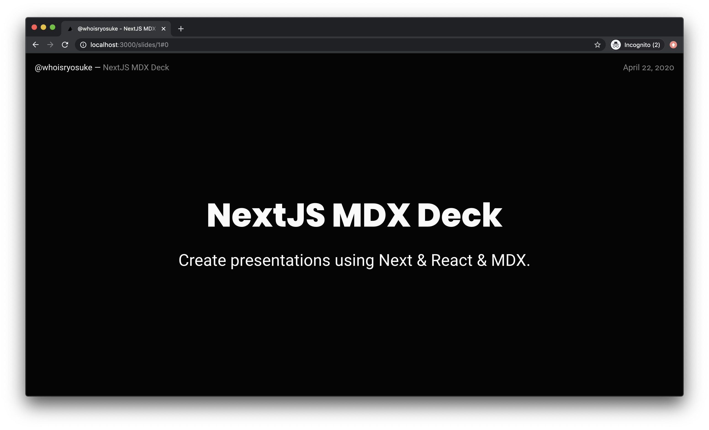
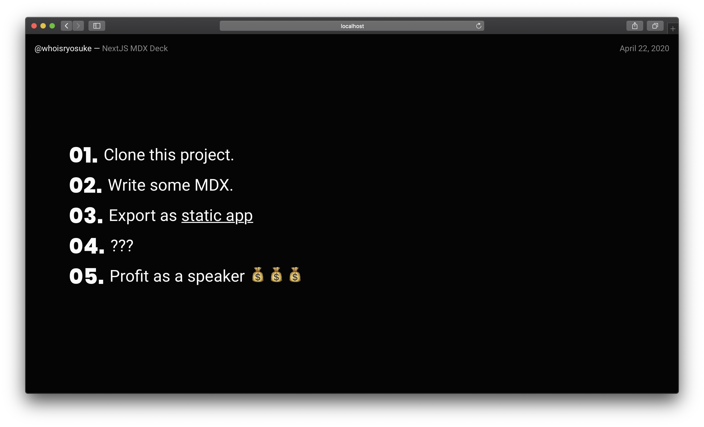
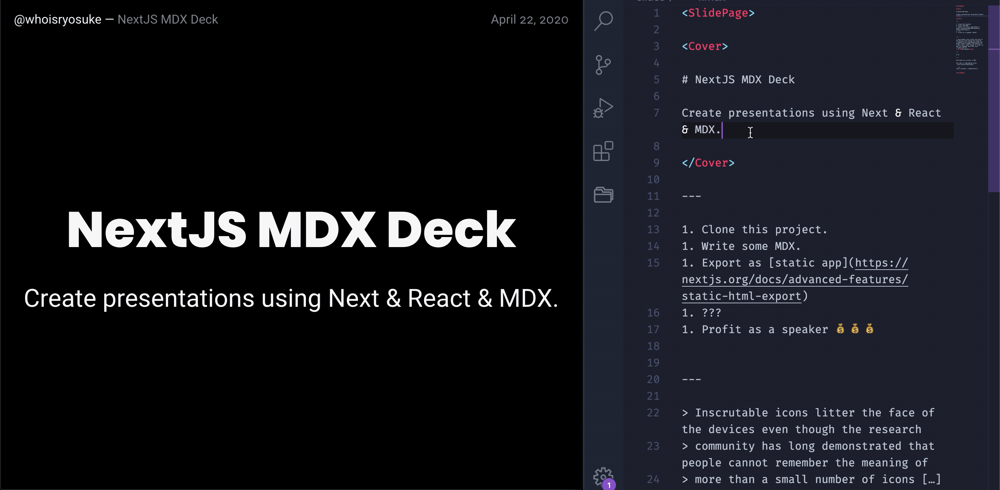
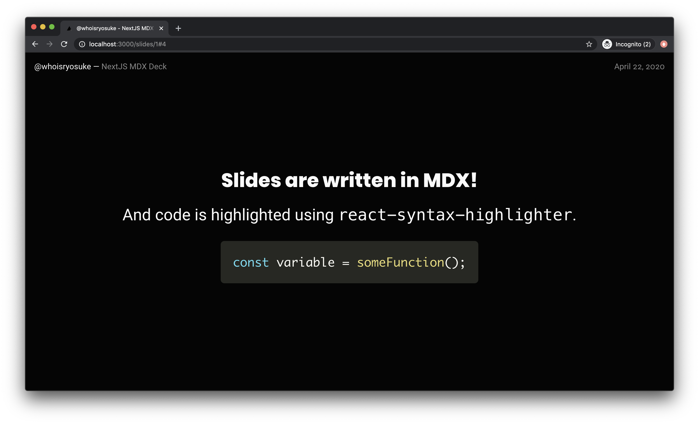

I've been gradually building content for my upcoming [Twitch](http://twitch.tv/whoisryosuke) and [YouTube](https://www.youtube.com/channel/UCmh1bbZam0zBCORypFtf8ig?view_as=subscriber) channels, and part of that process is creating presentation "decks" or slideshows as visuals for videos. There's plenty of solutions out there, from Figma to Keynote to Google Slides. And there's even more code-driven presentation frameworks, like [reveal.js](https://revealjs.com/#/). 

But I had some specific requirements for my presentation: I need to be able to export it as pure text (or an accessible non-visual format), and...I wanted to use React components 🙈 



So after searching for the perfect deck solution, I ended up creating my own using MDX + NextJS: [next-mdx-deck](https://github.com/whoisryosuke/next-mdx-deck). I'll go over how to use it and why I built this framework using Next.

*I also mentioned Figma for presentations, I created [a free presentation template for Figma](https://www.figma.com/file/oKn7GYJFfKcaGP6MxxPTpR/Black-Modern-Presentation-Template?node-id=1%3A2) too. If MDX doesn't float your boat, I'd check that one out too.*

# Using the template



Before I break down how I made it, I figured I'd show you how to use it!

1. Clone the project: `git clone https://github.com/whoisryosuke/next-mdx-deck`
2. Install dependencies: `npm i` or `yarn`
3. Run the dev server: `npm run dev` or `yarn dev`
4. Edit the first slide in `/slides/1.mdx` and save to [see changes](http://localhost:3000/)!
5. When you're done, run `npm run build` or `yarn build` will create a static app you can deploy anywhere (or use locally)

## ✍️ Writing with JSX



You can use JSX in [a few ways](https://mdxjs.com/getting-started) in your MDX files:

- You can use the syntax with HTML (`<button style={{ color: "red" }}>`)
- You can import React component from other files (`import Button from "../components/Button"`). Then you can use that component anywhere in that MDX file. The path to the component is relative to the MDX file.
- You can use any React component imported into the `<MDXProvider>` (inside `/components/MDXProvider.js`). This allows you to use the component without importing it inside each MDX file.
- You can define React components inside MDX files and then use them. MDX supports the use of JS inside files, like exporting variables, or in this case — defining new functions. `const Button = () => <button style={{ color: "red" }}>`

[Check out the MDX docs](https://mdxjs.com/getting-started) for more information on the syntax.

## 📃 Creating Slide Pages

Slide pages are incremental, starting at 1. If you need a new page, create a new MDX file that is named one number higher than the last page (e.g. `3.mdx` if there's 2 pages).

## 🎨 Theming the Slideshow

Theming is accomplished with CSS custom properties and/or Styled Components. 

Design tokens are stored as CSS custom properties inside the SlidePage layout (`/layouts/SlidePage.jsx`), which are injected into the app using Styled Component's global styling utility. There you can change the color of text, background colors, fonts, etc.

The actual CSS styles of the Slideshow are also stored in the SlidePage layout. There you can change the padding of slides, alignment of quotes, etc.

When the Markdown is parsed into HTML, you can replace HTML with React components. These "swaps" are handled by the `<MDXProvider>` component. You can import custom components and swap elements (like a `<button>` with `<Button>`), or import components to use inside MDX (great for creating things like 2-col layouts with component). Here you can change the syntax highlighting or find any custom MDX components. It's recommended to use Styled Components here to create custom components.

Now let's get to how this framework came to be!

# So why not use "X"?

One of the closest solutions I could find that fit that mark was [mdx-deck](https://github.com/jxnblk/mdx-deck). It allows you to write an MDX file, run a Node CLI script, and get a hot-reloading server (or statically built PWA deck). It uses GatsbyJS under the hood to accomplish this. 

The thing that held me back from utilizing it seriously was the workflow. With MDX, you're encouraged to import or even create inline React components alongside your Markdown. Whenever I tried to create a new React component (a new JS file inside the project) and import it into MDX, the website would break with an error stating the component didn't exist. I'd have to restart the dev server (which clears the **cache**), and *whala!* It worked again. The issue? This process takes 2-3 minutes or more each time because it goes through Gatsby's entire build process for a dev server. It felt like I was working with a machine moving a slow, chuggish pace, instead of authoring with the same speed I get with normal React app hot reloading.

# NextJS to the rescue

Recently I started to experiment with NextJS and it's [static build process](https://nextjs.org/docs/deployment#static-html-export), and I specifically researched the process of [integrating MDX](https://github.com/zeit/next.js/tree/master/packages/next-mdx). During this process I noticed that MDX worked a bit *differently* with Next than Gatsby. 

Whereas Gatsby would process the JSX part of MDX in the initial build process, **Next builds it on the fly for each file**. This allows you to import new files that are outside the MDX cache without restarting the server. 

It also means that spinning up the Next dev server is much faster than Gatsby's, because Gatsby has to process all the data and pages up front, while Next does it on demand (which can chug itself, but makes it overall faster).

With these findings in mind, I felt confident moving forward developing the speaker deck framework using Next.

# Making the MVP

I set out a list of MVP features I wanted to achieve for a MDX slideshow solution before coding:

- Header
- Keyboard navigation
- Touch navigation
- Syntax highlighting
- Replace MD elements (h1, p, etc) with React components

Then I used one of the templates I created during my research process ([the Styled Components + Linting setup](https://github.com/whoisryosuke/next-mdx-boilerplate/tree/styled-and-prettier)) and starting hacking away at some ideas on implementation.

I'll break down the difference between the way Gatsby and Next handle MDX, how the other Gatsby-based deck templates work, and how I migrated some components across paradigms.

## Switching from Gatsby to Next

Both [mdx-deck](https://github.com/jxnblk/mdx-deck) and [Gatsby Markdown starter](https://www.gatsbyjs.org/starters/fabe/gatsby-starter-deck/) take advantage of Gatsby's build process and GraphQL data layer to break the Markdown (or MDX) down into different slides. They do this based on page breaks (or `---` in Markdown, which translates to `<hr>` in HTML). When Gatsby spins up, it runs any "page creation" scripts that are provided in `gatsby-node.js`. Here, the Markdown/MDX content is broken up by page breaks and made into separate pages. Gatsby also allows you to specify page templates, so the content is placed inside a slideshow template.

### MDX the Next Way

You can approach MDX in Next with two (maybe three?) different directions:

1. You can place MDX files [directly inside the page directory](https://github.com/zeit/next.js/tree/canary/examples/with-mdx) and see them. 
2. Or you can create a JS page with [dynamic routing](https://nextjs.org/docs/routing/dynamic-routes), so [you grab a slug or filename](https://github.com/whoisryosuke/next-mdx-boilerplate/blob/import-example/pages/blog/post/%5Bslug%5D.js#L21) and [grab the MDX file](https://github.com/whoisryosuke/next-mdx-boilerplate/blob/import-example/pages/blog/post/%5Bslug%5D.js#L7) (using Next's  `getStaticProps` and `dynamic` import). 
3. You can also [import MDX directly into JS files](https://github.com/whoisryosuke/next-mdx-boilerplate/blob/import-example/pages/import-example.js) (`import MDXContent from "../../filename.mdx`). But you can only import 1 file, meaning you can't get different blog posts based on a page URL.

With the **first direct page method** (MDX in `/pages/`), the only way to wrap the content in a page layout is to import the layout as a React component. I didn't like this kind of API for the framework.

With the **second dynamic routing method** (`/page/[slug].js`), you can wrap the content in anything you need (from page layouts to context providers). This allows any content to be imported, and be independent of styling logic. Much better API where users can only write MDX and have no knowledge of framework.

I can export a `getStaticProps` function from the page file that only runs during build. This function accesses the local Node filesystem to read MDX files. The data (or MDX filename) is passed through to the page component. Here we dynamically load the MDX content using Next's `dynamic` utility. Then the content will be rendered during build (no client-side API calls or server needed). 

```jsx
// pages/slides/[slide].js

const SlideshowPage = ({ currentSlide, filename }) => {
	// Dynamically import the file (relative to this file)
  const MDXContent = dynamic(() => import(`../../${filename}`))
	
	// Display the dynamic component
  return (
      <MDXContent />
  )
}

export async function getStaticProps({ params }) {
	// Grab MDX file from local filesystem using URL parameter as filename
  const filename = path.join('slides', `${params.slide}.mdx`)

	// Pass the filename to the page component
  return {
    props: {
      currentSlide: params.slide,
      filename,
    },
  }
}
```

## Creating slides

Since the Gatsby template's benefited from it's build hooks and data layer, I had figure out a way to break up the MDX during Next's process. The MDX content had to be split up after being parsed and placed into the page (or I'd have to manually parse it for an AST — which would be excessive). So how do you split up rendered content? 

### `<Slide>` component

My first instinct was to create a `<Slide>` component and break up the MDX content with that. Since MDX supports JSX, I can detect any `<Slide>` components and display them as needed. 

```jsx
<Slide>

# First slide

</Slide>

<Slide>

# Second slide

</Slide>
```

I passed the `<Slide>` component through the `<MDXProvider>`, allowing me to reference it in MDX without importing it in every file.

```jsx
import React from 'react'
import { MDXProvider } from '@mdx-js/react'
import Slide from '../components/Slide'

const mdComponents = {
  h1: (props) => <h1 {...props} />,
  Slide,
}

export default ({ children }) => (
  <MDXProvider components={mdComponents}>{children}</MDXProvider>
)
```

It worked, but I didn't like how declarative/invasive the API was. The user shouldn't need to add a special component to their code to make it work, there had to be a more seamless solution that allowed for compatibility with other Markdown-based deck frameworks. 

### Discovering `<MDXElement>`

While I was traversing (and debugging) the DOM (or VDOM) using `React.Children()` and checking for a certain type of component, I noticed that the MDX parser creates `<MDXElement>` components. These components represented any Markdown parsed into HTML, and if you observed it's properties, you'd find a `mdxType` property that contains the name of the HTML element. Instead of checking for the `<Slide>` component I was forcing into the code, I checked for the `<MDXElement>` and if it's `mdxType` was a page break. 

Since `React.Children()` [doesn't support filter](https://github.com/facebook/react/issues/2956), and because of the way the content was structured, I created a new array (`generatedSlides`) to add slides to. I'd loop through every top level element, and if it wasn't a page break, it'd get shoved into an array. When a page break was detected, I'd create a new array entry inside `generatedSlides`. Then when rendering, I'd do this filtering process, and use the `currentSlide` from the component state to display the right slide number (using array indexing `generatedSlide[currentSlide]`). 

```jsx
const renderSlide = () => {
    let generatedSlides = []
    let generatorCount = 0

    // Filter down children by only Slides
    React.Children.map(children, (child) => {
      // Check for <hr> element to separate slides
      const childType = child && child.props && (child.props.mdxType || [])
      if (childType && childType.includes('hr')) {
        generatorCount += 1
        return
      }

      // Add slide content to current generated slide
			// If current index doesn't have array, make one to push into
      if (!Array.isArray(generatedSlides[generatorCount])) {
        generatedSlides[generatorCount] = []
      }
      generatedSlides[generatorCount].push(child)
    })

    // Get total slide count
    slideCount = generatorCount

    // Change to last slide if we nav'd from a prev page
    if (currentSlide === 999) {
      window.location.hash = `#${slideCount}`
      setSlide(slideCount)
    }
    // Return current slide
    return <Slide>{generatedSlides[currentSlide]}</Slide>
  }
```

This makes the `generatedSlides` array all the "discovered" slides. Then if we need a specific slide, we could select one using array indexing. Then the actual "slide" is an array itself of components, allowing us to pass it to React (which parses it down). The slide data would look something like this:

```jsx
generatedSlides = [
	[
		<MDXElement />,
		<MDXElement />,
		<MDXElement />
	],
	[
		<CustomReactComponent />,
		<MDXElement />
	]
]
```

This worked great. I could even count the number of slides I detected (`generatedSlides`) and figure out what the "max" was (so I could stop the user from going past the last slide — or switch to the last slide when needed).

Only thing that didn't work was animations between slides! Because of the way I filter the children, I don't trigger a dismount and re-mount of the `<Slide>` component properly, which is required for framer-motion's `<AnimatePresence>` to detect it (and trigger animation). Animation works between pages, as the component unmounts properly. 

## Reuse recycle

Once I was able to figure out how I was importing and using the MDX content, I was able to start working on the "slideshow" features (like navigating between slides). 

Thanks to how modular React is, I was able to use much of [the Slideshow component logic](https://github.com/fabe/gatsby-starter-deck/blob/master/src/layouts/index.js) from a Gatsby Markdown Deck template. I found it after mdx-deck, and it served as a great foundation [much](https://github.com/fabe/gatsby-starter-deck/blob/master/src/layouts/index.css) of the slideshow. 

I brought in most of the logic into the layout component that wraps MDX content in the Next app. Here's what I referenced:

```jsx
class TemplateWrapper extends Component {
  NEXT = [13, 32, 39];
  PREV = 37;

  swipeLeft = () => {
    this.navigate({ keyCode: this.NEXT[0] });
  };

  swipeRight = () => {
    this.navigate({ keyCode: this.PREV });
  };

  navigate = ({ keyCode }) => {
    const now = this.props.data.slide.index;
    const slidesLength = this.props.slidesLength;

    if (now) {
      if (keyCode === this.PREV && now === 1) {
        return false;
      } else if (this.NEXT.indexOf(keyCode) !== -1 && now === slidesLength) {
        return false;
      } else if (this.NEXT.indexOf(keyCode) !== -1) {
        navigate(`/${now + 1}`);
      } else if (keyCode === this.PREV) {
        navigate(`/${now - 1}`);
      }
    }
  };

  componentDidMount() {
    document.addEventListener('keydown', this.navigate);
  }

  componentWillUnmount() {
    document.removeEventListener('keydown', this.navigate);
  }

  render() {
    const { location, children, site } = this.props;

    return (
      <div>
        <Helmet
          title={`${site.siteMetadata.title} — ${site.siteMetadata.name}`}
        />
        <Header
          name={site.siteMetadata.name}
          title={site.siteMetadata.title}
          date={site.siteMetadata.date}
        />
        <Swipeable
          onSwipedLeft={this.swipeLeft}
          onSwipedRight={this.swipeRight}
        >
          <Transition location={location}>
            <div id="slide" style={{'width': '100%'}}>{children}</div>
          </Transition>
        </Swipeable>
      </div>
    );
  }
}
```

And here's what the layout component ended up looking like:

```jsx
import React, { useState } from 'react'
import { Swipeable } from 'react-swipeable'
import { useRouter } from 'next/router'
import { createGlobalStyle } from 'styled-components'
import Slide from '../components/Slide'
import useEventListener from '../hooks/useEventListener'
import { useTotalPages } from '../context/TotalPagesContext'
 
export default function SlidePage({ children }) {
	// Grab the current slide from the URL hash (/slide/1#3)
  const initialSlide = window.location.hash
    ? parseInt(window.location.hash.replace('#', ''))
    : 0
  const [currentSlide, setSlide] = useState(initialSlide)
  const router = useRouter()
  const totalPages = useTotalPages()

	// Index of keyboard keys for navigation
  const NEXT = [13, 32, 39]
  const PREV = 37

  let slideCount = 0

  const navigate = ({ keyCode }) => {
    if (keyCode === PREV && currentSlide === 0) {
      if (router.query && router.query.slide) {
        if (router.query.slide > 1) {
          router.push(`/slides/${parseInt(router.query.slide) - 1}#999`)
        }
      }
      return false
    }
    if (NEXT.indexOf(keyCode) !== -1 && currentSlide === slideCount) {
      if (router.query && router.query.slide) {
        // Check for max page count
        if (router.query.slide < totalPages) {
          router.push(`/slides/${parseInt(router.query.slide) + 1}`)
        }
      }
      return false
    }
    if (NEXT.indexOf(keyCode) !== -1) {
      setSlide((prevState) => {
        window.location.hash = `#${prevState + 1}`
        return prevState + 1
      })
    } else if (keyCode === PREV) {
      setSlide((prevState) => {
        window.location.hash = `#${prevState - 1}`
        return prevState - 1
      })
    }
  }

  useEventListener('keydown', navigate)

  const swipeLeft = () => {
    navigate({ keyCode: NEXT[0] })
  }

  const swipeRight = () => {
    navigate({ keyCode: PREV })
  }

  const renderSlide = () => {
		// See code above
  }

  return (
    <Swipeable onSwipedLeft={swipeLeft} onSwipedRight={swipeRight}>
      <GlobalStyle />
      <div id="slide" style={{ width: '100%' }}>
        {renderSlide()}
      </div>
    </Swipeable>
  )
}
```

I migrated any use of Gatsby to Next (like the router). This was a little trickier with figuring out the total number of slides. Like I mentioned before, Gatsby processes the slides during the build process into GraphQL. This allows the Gatsby templates to query GraphQL to figure out how many slides there are. In our case, we have to count them inside the `React.Children` loop. And I dropped the use of `react-transition` for `framer-motion`.

## Total Number of Pages

Similar to the total number of slides, we also have to determine the total number of slide "pages" in our app (if have multiple MDX files). This way we can prevent our slideshow from navigating to a slide page that doesn't exist (after it's exhausted the current slides in the page). 

In Gatsby, we can query GraphQL and find the number of pages. In Next however, we have to query the Node filesystem manually.

Only page level components have access to things like the local filesystem, because they're the only place you can use the `getStaticProps` function. Because of this, I had to create a React Context that I wrapped the slide page in. When the page renders, the `getStaticProps` method passes the total slide count to the page, and it passes it to the context provider. Then inside the `<SlidePage>` component, where the logic for handling next/prev slides is, I use the context consumer hook to get the total count. 

Here was the Context:

```jsx
import React from 'react'

export const TotalPagesContext = React.createContext(0)

export const useTotalPages = () => React.useContext(TotalPagesContext)
```

And the use of the Context Provider wrapping the page component (`/pages/slides/[slide].js`):

```jsx
import fs from 'fs'
import path from 'path'
import Head from 'next/head'
import dynamic from 'next/dynamic'
import Header from '../../components/Header'
import { TotalPagesContext } from '../../context/TotalPagesContext'
import { siteConfig } from "../../site.config.js"

const SlideshowPage = ({ totalSlidePages, currentSlide, filename }) => {
  const MDXContent = dynamic(() => import(`../../${filename}`))
  return (
    <TotalPagesContext.Provider value={totalSlidePages}>
			{/* Truncated for space */}
      <MDXContent />
    </TotalPagesContext.Provider>
  )
}

export async function getStaticProps({ params }) {
  const filename = path.join('slides', `${params.slide}.mdx`)

	// Grab all the MDX files (or "pages") and count them
  const slidesDirectory = path.join(process.cwd(), 'slides')
  const mdxFiles = fs.readdirSync(slidesDirectory)
  const totalSlidePages = mdxFiles.length

  return {
    props: {
      totalSlidePages,
      currentSlide: params.slide,
      filename,
    },
  }
}

export default SlideshowPage
```

Then inside the Slide page component, we can get the total number of slides using a hook:

```jsx
import { useTotalPages } from '../context/TotalPagesContext'

export default function SlidePage({ children }) {
	const totalPages = useTotalPages()
}
```

This allows us to query the total pages anywhere in the app, even inside the MDX content.

### Compromises

Because of this though, I had to wrap every MDX page in a `<SlidePage>` component to make it work (meaning all MDX files had to have this component). This broke one of the rules I initially established, but was inevitably essential to the process.

I tried to implement a version where the `<SlidePage>` was wrapping the `<MDXContent>`, but because my content has to be loaded dynamically, I didn't have access to the MDX content inside `<SlidePage>` (because it wasn't fully loaded/mounted yet). Trying to use `React.Children` resulted in only one component, a "loadable" component that represented the pending MDX content.

I don't often work with dynamically loaded components (still waiting on React Suspense to drop officially) — but I could possible figure out a way to query the component when it's loaded. My issue was a conditional statement failing because it didn't recognize the loadable component. It'd break the first render (when the dynamic component was loading) — but it could have appeared during a subsequent re-render. Which would work fine, since my slide function runs during each render anway. 

### The Quick Fix

I could get around this by enforcing one MDX file (or slide page), similar to mdx-deck. I create the slide page the same way, but instead of dynamically importing the MDX using dynamic routing, I can import the MDX file directly (`import MDXContent from "../../slides.mdx"`). The content would be available immediately (instead of delayed with the dynamic method), and I could wrap the `<SlidePage>` around it. This allows me to write MDX as I please, and import even old Markdown decks, without needing to wrap them in `<SlidePage>`. 

But decks are limited to one page, which may get intensive, especially with images/gifs/lots of code? I envision my decks to be on the shorter side, but I didn't want to limit users if possible. I'm thinking of creating a separate branch with that logic, so I can have a template that I could easily import MDX files into without wrapping them in the `<SlidePage>` component.

# The Roadmap

There are a few features I'd like to implement if I'd like (and expect others) to start seriously using this template.

- Presenter mode
- Layout components / slide layouts
    - 2 column
    - 3 column
- Themes
    - Light mode (easy)
    - Other styles??
        - Handwritten  (maybe use that sketchy JS UI library too)
- Guides
    - Keyboard shortcuts

# Let me see those decks! 👀



I hope this inspires you get started writing your own deck in MDX, and ideally eases the process for you immensely. I'd love to see if you create something with this template, hit me up here or [on Twitter!](https://twitter.com/whoisryosuke) And shoutout to all the open source code (and contributors) that made this happen!

# References

- [https://github.com/whoisryosuke/next-mdx-deck](https://github.com/whoisryosuke/next-mdx-deck)
- [https://next-mdx-deck.netlify.app/](https://next-mdx-deck.netlify.app/)
- [https://codesandbox.io/s/github/whoisryosuke/next-mdx-deck](https://codesandbox.io/s/github/whoisryosuke/next-mdx-deck)
- [https://github.com/whoisryosuke/next-mdx-boilerplate/](https://github.com/whoisryosuke/next-mdx-boilerplate/)
- [Free Figma Presentation Template](https://www.figma.com/file/oKn7GYJFfKcaGP6MxxPTpR/Black-Modern-Presentation-Template?node-id=1%3A2)
- [https://www.gatsbyjs.org/starters/fabe/gatsby-starter-deck/](https://www.gatsbyjs.org/starters/fabe/gatsby-starter-deck/)
- [https://github.com/whoisryosuke/gatsby-deck-template](https://github.com/whoisryosuke/gatsby-deck-template)
- [https://www.gatsbyjs.org/packages/gatsby-remark-prismjs/](https://www.gatsbyjs.org/packages/gatsby-remark-prismjs/)
- [http://github.com/zeit/now/tree/master/examples/mdx-deck](http://github.com/zeit/now/tree/master/examples/mdx-deck)
    - [https://docs-git-sarup-fixog-image-urls.zeit.sh/docs/v2/deployments/official-builders/mdx-deck-now-mdx-deck.amp](https://docs-git-sarup-fixog-image-urls.zeit.sh/docs/v2/deployments/official-builders/mdx-deck-now-mdx-deck.amp)
    - [https://github.com/zeit/now/tree/now%4017.0.4/examples/mdx-deck](https://github.com/zeit/now/tree/now%4017.0.4/examples/mdx-deck)
    - Deprecated version of mdx-deck deployed on Now. Not actually made with NextJS.
- [https://github.com/whoisryosuke/pure-components/blob/master/src/components/Menu/Menu.js](https://github.com/whoisryosuke/pure-components/blob/master/src/components/Menu/Menu.js)
    - First iteration of my NextJS Deck used `<Slide>` components inside MDX to break up the content. Used the code above from a previous project to detect certain React components in the children props.
    - Ended up using a similar method, but detecting `<hr>` elements (created by `<MDXElement>`).
- [https://nextjs.org/docs/api-reference/next/router](https://nextjs.org/docs/api-reference/next/router)
    - How to change the route using input
    - Also used to check for the current page slide
    - Can't be used to check for hash, had to use `window.location.hash`
        - [https://github.com/zeit/next.js/issues/779](https://github.com/zeit/next.js/issues/779)
- [https://github.com/styled-components/styled-components/issues/2670](https://github.com/styled-components/styled-components/issues/2670)
    - Can't use various CSS methods in Styled Components (like `@font-face`).
    - Also had an issue with CSS unicode and properly escaping them. `content: '\0203'` becomes `content: '\\0203'` - you just have to "escape" the one backslash by adding another backslash.
    - Broke code at first, had to remove references.
- [https://code.whoisryosuke.com/docs/js/react/context](https://code.whoisryosuke.com/docs/js/react/context)
    - Used Context API for storing total page counts (since it can only be derived in the page component, and can't be easily passed down to MDX content where it's used)
- [https://github.com/conorhastings/react-syntax-highlighter](https://github.com/conorhastings/react-syntax-highlighter)
    - Setup with MDX using the official docs
        - [https://mdxjs.com/guides/syntax-highlighting](https://mdxjs.com/guides/syntax-highlighting)