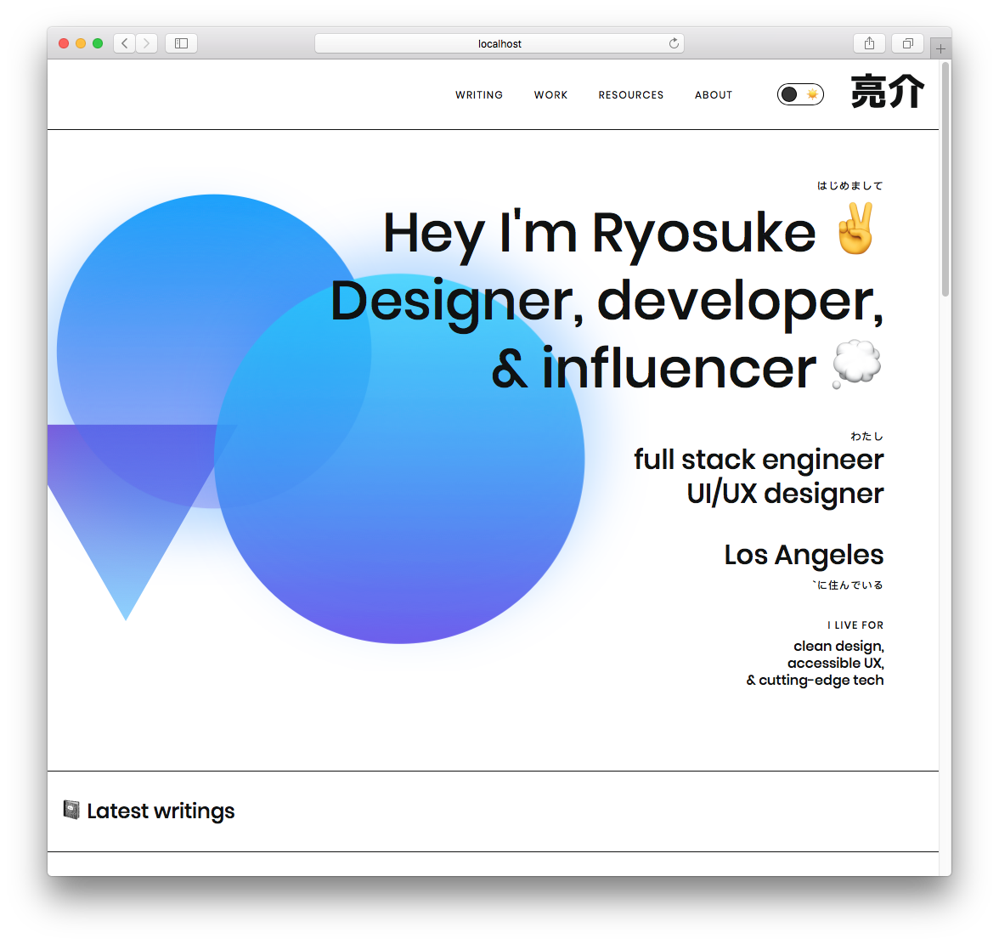
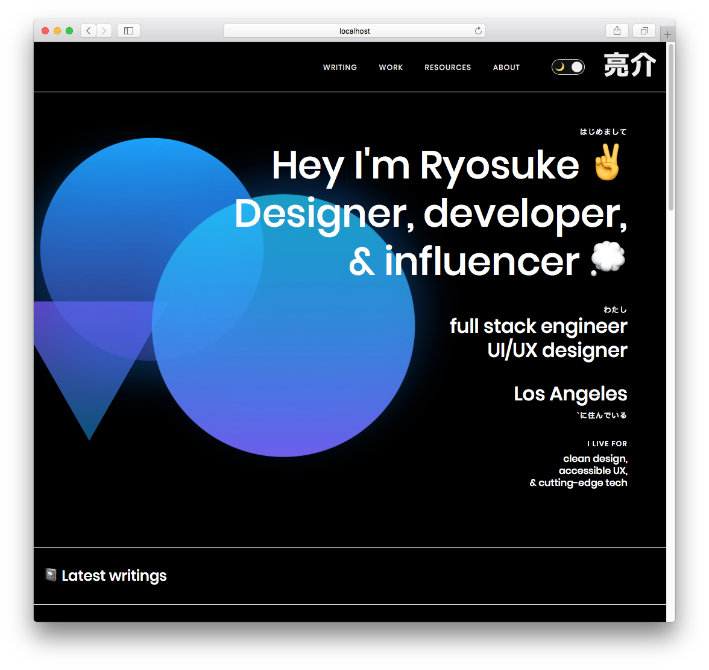
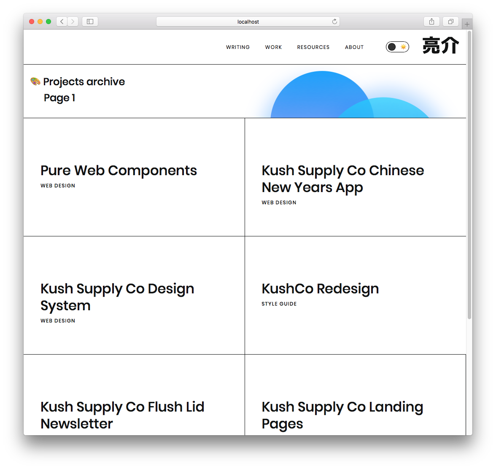
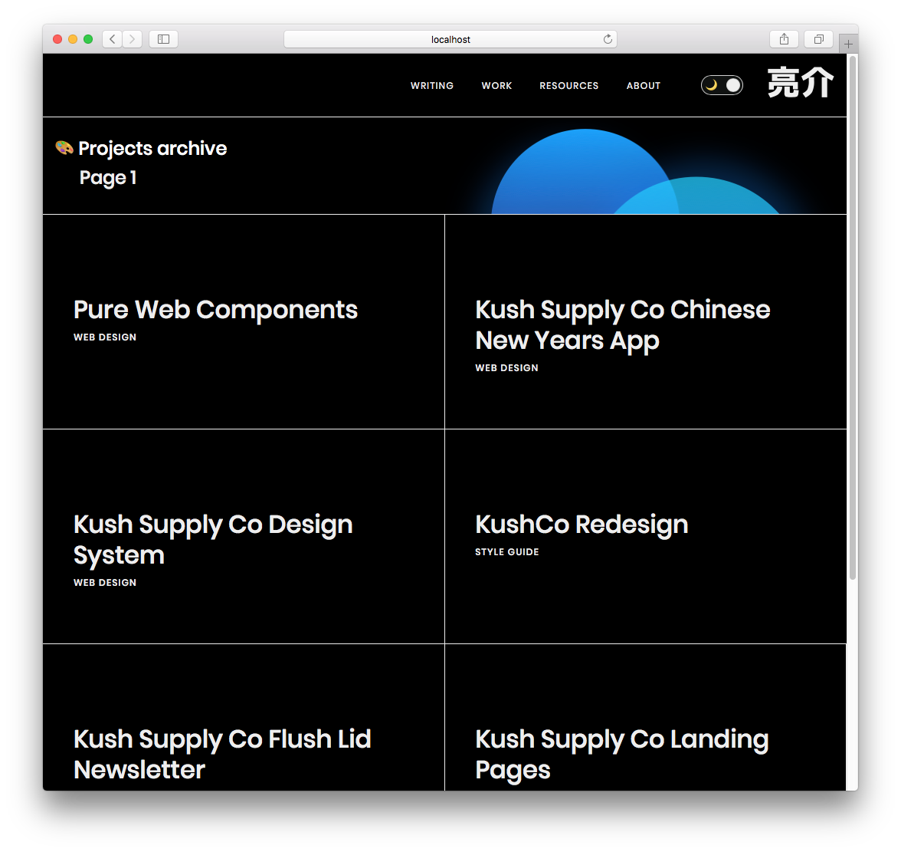

I've been bitten by the dark mode bug, and I'm here to inevitably add theming to my website and let users swap between a light and dark variation. My website is a Gatsby and React-based blog that uses a small, custom design system that's built on Styled System and Styled Components. Using Styled Components, I already implement a theme file to organize and access my design tokens across all components (and avoid duplicate logic). This was my process adding a dark mode to my site using React's Context API and Styled Components theme API.

I thought I'd share what happened along the way, and what mistakes when establishing my design system and website that created complications with theme integration.

# The Result

<div style={{display: 'flex'}}>
  <div style={{width: '50%'}}>
    
  </div>
  <div style={{width: '50%'}}>
    
  </div>
  <div style={{width: '50%'}}>
    
  </div>
  <div style={{width: '50%'}}>
    
  </div>
</div>

# Process

## The current state of my theme

Colors, spacing, gradients, sizing, breakpoints — essentially any **design token** can be found in my blog's `theme.ts` file. Inside that file, the default export is a `theme` variable. I keep each set of tokens, like colors, in a separate variable - then I reference these inside the `theme` variable. This allows me to cross reference values across tokens (or even inside the theme object itself). For example, I have gradients that reference the colors. If these were located in one theme object, they couldn't reference each other easily.

To use this theme with Styled Components, I have to pass it to a `<ThemeProvider>` component, and wrap my app in it (applying the theme to nested elements). Gatsby lets you to wrap the your app with a component using the `gatsby-browser.js` and `gatsby-ssr.js` files. I export a `<Boot>` component here as `wrapRootElement` , which receives the entire app using the React "children" prop. In this `<Boot>` component, I handle any process that needs to happen top-level, and across the whole app. In this case, I have a couple context providers (MDX and Theme), used by React to access values down the app without passing props directly.

## Planning the feature

To accomplish a dark mode, I need to create a new component that will replace the current instance of the `<ThemeProvider>`. This new component, `<ThemeSwitcher>`, will handle the state of the theme (dark or light) and pass the current theme selection to the `<ThemeProvider>`.

Here is where I have a choice to make: 

- Do I create **a new context provider** to hold the state of the theme selection?
- Or do I **handle the state in the new wrapper**, and pass that to the current `<ThemeProvider>`, which will notify any themeable components of the change?

The only reason I would need to have the theme selection as a separate context, would be to show it somewhere in the app. Since I would like some sort of toggle (toggle switch or dropdown), probably nested deeply within the app, I'll need to **use a new context provider** to pass the state to that.

## Implementation

### Creating the Context provider

I made a new Context provider that is Redux-like, using **reducers** and a "**dispatch**" method. This will allow us to run or ***dispatch*** commands like "toggle" or theme-specific names, and each case will be handled by a ***reducer*** (basically a giant switch statement). Rather than using a regular context object, reducers allow us to set a strict structure for our theming (only dark/light — and we provide the values). The entire theme is placed in the context, rather than importing it separately in each component (maybe a little overkill).

I also export an easy to use hook so I can worry about importing one less method (in this case, `useContext` from React).

`ThemeContext.js`:

```jsx
import React, { createContext, useContext, useReducer } from 'react'
export const ThemeContext = createContext()
export const ThemeProvider = ({ reducer, initialState, children }) => (
  <ThemeContext.Provider value={useReducer(reducer, initialState)}>
    {children}
  </ThemeContext.Provider>
)
export const useThemeValue = () => useContext(ThemeContext)
```

`providers.js` (or `<ThemeSwitcher>` mentioned above):

```jsx
import React from 'react'
import { ThemeProvider } from './ThemeContext'
import { ThemeOptions, THEME_OPTIONS } from '../layouts/Theme'

export default ({ children }) => {
  const initialState = {
    theme: ThemeOptions.light,
    selectedTheme: 'light',
  }
  const reducer = (state, action) => {
    switch (action.type) {
      case THEME_OPTIONS.DARK:
        return {
          ...state,
          theme: ThemeOptions[THEME_OPTIONS.DARK],
          selectedTheme: THEME_OPTIONS.DARK,
        }
      case THEME_OPTIONS.LIGHT:
        return {
          ...state,
          theme: ThemeOptions[THEME_OPTIONS.LIGHT],
          selectedTheme: THEME_OPTIONS.LIGHT,
        }

      default:
        return state
    }
  }
  return (
    <ThemeProvider initialState={initialState} reducer={reducer}>
      {children}
    </ThemeProvider>
  )
}
```

Using the context inside a component:

```jsx
import { useThemeValue, THEME_OPTIONS } from "../context/ThemeContext"

const Header = ({ siteTitle }) => {
  const [{ theme, selectedTheme }, dispatch] = useThemeValue()
  const toggleTheme =
    selectedTheme == THEME_OPTIONS.DARK
      ? THEME_OPTIONS.LIGHT
      : THEME_OPTIONS.DARK

  return (
      <button
        onClick={() =>
          dispatch({
            type: toggleTheme,
          })
        }
      >
        {selectedTheme == THEME_OPTIONS.DARK && `De-`}Activate Dark Mode (
        {selectedTheme})
      </button>
  )
}
```

I created a new constant (`THEME_OPTIONS`) which will act as an object to access the names of themes (dark, light, rainbow, etc). This ensures that the theme names stay the same across the app without worrying about typing issues, and makes re-assigning values as easy as changing the main constant. 

I also created a `ThemeOptions` object that uses the constant values as keys, and the actual theme as the value. 

And finally, we use a hook to access the theme context and pass the current theme to the Styled Components provider (from one context to another 😂).

`theme.ts`:

```js
import { DarkTheme, LightTheme } from "../assets/themes/"
import { useThemeValue } from '../context/ThemeContext'

export const THEME_OPTIONS = {
  DARK: 'dark',
  LIGHT: 'light'
}

export const ThemeOptions = {
  [THEME_OPTIONS.DARK]: DarkTheme,
  [THEME_OPTIONS.LIGHT]: LightTheme
}

export const Theme = ({ children }) => {
  const [{ theme, selectedTheme }, dispatch] = useThemeValue()
  return (
    <ThemeProvider theme={theme}>
      <Fragment>
        <GlobalStyle />
        {children}
      </Fragment>
    </ThemeProvider>
  )
}
```

And with that, I was able to get a button that switched the theme on my website from dark to light and vice versa.

### We need more theme variables

The second I was able to activate the theme swap, I noticed a lot of the variables weren't working as intended. I set the background to black, and nothing happened. It made me think something was broken before I realized I just never used that variable in my code 😅.

I also noticed I was abusing the Styled System's `sx` prop to handle some inline styling, but it didn't change colors with the theme. This was because I used a `borderBottom` property to set multiple values (in this case: `1px solid black`). Usually, Styled System is smart enough to take your color properties in the `sx` prop and replace any names with actual themed properties. For instance, if I do `<Box sx={{color: 'black'}}>` and I have a property `theme.colors.black`, it'll grab from there, instead of the standard HTML "black" (which converts to `#000`). 

But because I was using a property that's more complex, Styled System didn't kick in, and I wasn't getting my colors swapped with my theme change. To fix this, I had to just add another property to each `sx` prop with a `borderColor: 'black'`. This one gets swapped by Styled System, and takes precedence over the previous one-liner. This allows me to keep the simplicity of one-liners like `borderBottom` without having to break it out into the 3 separate properties it actually contains (`borderBottomWidth`, `borderBottomStyle`, `borderBottomColor`).

### Naming Conventions

I also had issues with the way I named my variables. When I need to use a light, white background color as a theme variable — I named it white. Now that I have a dark theme, the white variable, is actually black. So semantically, it doesn't make sense if you're looking at things from a dark mode perspective. It would have been wiser to use a name like "elementBackground" to define the BG color, which is what I was actually defining, rather than referring to it's themed state (at the time: white). Or use the color variables on another background variable, and create a separation of the logic.

### Themed SVG Backgrounds

Don't exist. I have an SVG image I use as a background image for my `<Featured>` card. It's an SVG pattern of black triangles on a transparent background. Because of the way things work together, you can't have a Styled Component wrapped SVG work inside a Styled Component CSS block. This is because the `background-image` property leverages Webpack's build process to convert SVG elements into URI encoded data (long string prefixed by `data:image/svg+xml;base64,` with escaped HTML characters).


<div style={{display: 'flex'}}>
  <div style={{width: '50%'}}>
    
  </div>
  <div style={{width: '50%'}}>
    
  </div>
</div>

Since I was only using a single SVG element, I just created a "dark" version, duplicating the SVG file and replacing the fill colors with lighter versions. Then in Styled Components, I used a `selectedTheme` prop to check for a "dark" theme and swap out the other BG. 

```js
import TriangleBG from '@assets/svg/bg-triangle.svg'
import TriangleBGDark from '@assets/svg/bg-triangle-dark.svg'

const StyledBox = styled(Box)`
  box-shadow:none;
  border-bottom:1px solid ${(props) => props.theme.colors.black};
  background:url(${TriangleBG});
  background-size:200px 200px;
  position:relative;
  z-index:10;

  ${props =>
    props.selectedTheme === 'dark' &&
    `
  background-image:url(${TriangleBGDark});
  `}
`
```

I found [an answer on StackOverflow](https://stackoverflow.com/a/53315430/10097916) that swaps the fill color using a utility function. The utility function searches the SVG text and swaps your color, and then encodes it properly. Not sure if this technique works, but I'd consider it if I had more than one SVG to work with.

### Theming 3rd Party Libraries

I don't use many, but there are a couple third party components on my blog. For example, the data table used on my Resources page is `react-data-table-component`. This component has theming built in, and offers an API for adding custom themes and styles. Thankfully, I was just able to pass in my "selected theme" context into the component, since we used the same terminology (light and dark).

### Themed Code Examples

Similarly, I had to ensure that my code example theme was being swapped appropriately, since I was using a fairly light code theme (to match the light site theme). This was very simple and in the same vein as the SVG background swap. I imported both light and dark code themes and swapped based on the theme context. Luckily enough too, the theme I was using (Night Owl Light) also had a dark mode, making the switch fairly seamless.

`CodeBlock.js`:

```javascript
import { UIComponents, THEME_OPTIONS } from '@layouts/Theme'
import LightTheme from 'prism-react-renderer/themes/nightOwlLight'
import DarkTheme from 'prism-react-renderer/themes/nightOwl'

export const CodeBlock: React.FC<Props> = ({ children, className, live }) => {
  const [copyStatus, setCopyStatus] = useState(false)
  const [codeVisibility, setCodeVisibility] = useState(false)
  const [{ theme, selectedTheme }, dispatch] = useThemeValue()

  const codeTheme = {
    [THEME_OPTIONS.LIGHT]: LightTheme,
    [THEME_OPTIONS.DARK]: DarkTheme,
  }

  return(
    <CodeBlockBox mb={3}>
      <LiveProvider
        code={children}
        scope={UIComponents}
        theme={codeTheme[selectedTheme]}
      ></LiveProvider>
    </CodeBlockBox>
  )
}
```

### Animation Issues

My buttons are white boxes with a 1px solid black border, but when you hover over them, the blue background slides in like a clipping mask. This is accomplished by using the CSS pseudo selector `:after` to create a shape behind the button that animates from a scale of 0 to 1 (nonexistent to normal full width). This works by slightly abusing the `z-index` property, applying a value of `-1`. This pushes the sliding blue background behind the button text, and even behind the background itself.

This wasn't an issue with my blog before, since I never applied a background color to the body. Most elements, despite looking white, were actually transparent. This let me accomplish tricks more easily like the button animation, or SVG shapes bleeding into other content areas.

Now that I have a dark and light mode (and actually apply a background), the sliding blue box disappears completely on both themes. It doesn't actually disappear, but rather is hiding behind the big white box that is the `<body>` element.

A workaround to ensure this still works would be to wrap the text in another element, such as a `<span>`, and ensure that the `z-index` of that element is larger than the `:after` blue sliding box. With 4 lines of code, we have a working fix that doesn't radically alter the API of the component:

`ButtonOutline.tsx`:

```jsx
const StyledButton = styled.button`
  /* CSS truncated */

  & > span {
    position:relative;
    z-index:2;
  }

  /* CSS truncated */
`

export const ButtonOutline: React.FC<Props> = ({ children, ...props }) => {
  return (
    <Button as={StyledButton} variant="outline" {...props}>
      <span>
        {children}
      </span>
    </Button>
  )
}
```

## Theming takes thought 💭

It goes to show that if you really want to accomplish theming in your design system, it takes a significant amount of planning from the start to create the proper infrastructure. Then it requires a bit more labor handling edge cases and 3rd party components. I hope this article shows you some of the pitfalls you'll encounter, and how to overcome them.

Cheers,
Ryo

### Software Requirements

| Software                 | Version |
| ------------------------ | ------- |
| styled-components        | 4.4.0   |
| gatsby                   | 2.15.28 |
| react                    | 16.10.1 |
