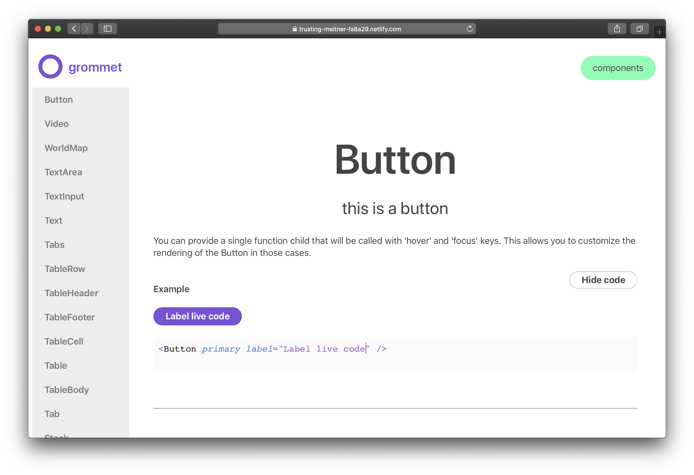
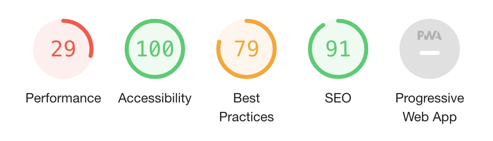
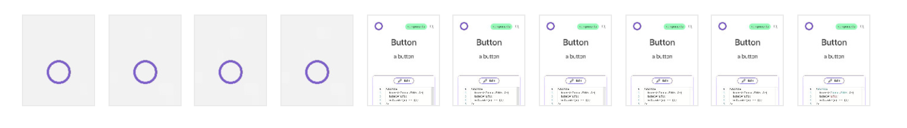
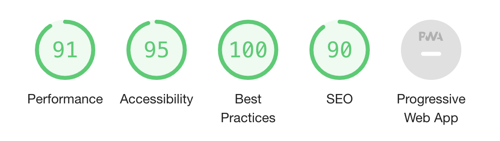
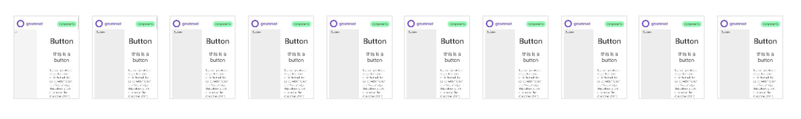

Recently I've been on the hunt for React UI libraries that handle theming in an easy and extensible way. After a bit of comparison, Grommet ended up utilizing one of the most ideal architectures for styling and theming components. Grommet uses Styled Components (instead of object-based syntax like JSS), it handles theming properly (design tokens + minimal component tokens/styles), and it has many of the base components you need (from buttons to inputs). 

I started this project because I wanted to use Grommet as a basis for a design system and contribute to the library. However, the documentation for Grommet is a bit lacking. And after looking into the source code, I wasn't happy with the way the code was actually documented. So I set out to create a more robust documentation website that was more inclusive for contributions, included more content, and faster overall.

## The current state of Grommet docs

The docs only contain documentation for each component in the library. There are also a few other pages that go over "getting started" with Grommet, or browser usage. These additional pages can only be found on the frontpage, and there's no navigation to get to them. Pages such as theming are relegated to [outdated Wiki pages](https://www.notion.so/whoisryosuke/87ac2b52857b44cb9b8ab7bc0039d5be?v=5b7b4feaf759469abc86f844f729d03e) on the Github. Even the official Grommet post on the HPE (Hewlett-Packert Enterprise) website [admits that the docs are lacking](https://www.hpe.com/us/en/insights/articles/getting-to-know-grommet-an-open-source-ui-dev-tool-1808.html):

> One weakness is a lack of extensive documentation; it is pretty light in some cases. - John Paul Mueller, [HPE Blog](https://www.hpe.com/us/en/insights/articles/getting-to-know-grommet-an-open-source-ui-dev-tool-1808.html)

## How do the Grommet docs currently work?

### Grommet Library

- Each component has a `doc.js` file that contains documentation in the form of a custom library called [react-desc](https://www.npmjs.com/package/react-desc) created by Grommet. In this file, the component is "described" like a standard Jest test, with a description and code snippet/example of it in use. Then each prop type is also defined (similar to how you would inside a normal component file), but they also interlace more metadata (like a description and default value) using the `react-desc` library.
- A tooling script called `tools/generate-readme.js` scans all the component's source and `doc.js` files. It passed the components through to the `docs.js` function. The result of the docs function is converted to Markdown, then passed into a README file collocated with the component. This generates a Markdown file with the component name, description, a single example, and a props table.

### Grommet Docs

This is the version of the documentation that's visible on the [official v2 Grommet website](http://v2.grommet.io).

- The documentation website's content is generated from [the `grommet-site` repo](https://github.com/grommet/grommet-site). The documentation content is pulled in as a dependency from `doc.js` files (collocated with components).
- The `doc.js` file contains documented component prop and theme prop values (with descriptions and default values):

```js
import { describe, PropTypes } from 'react-desc';

import {
  colorPropType,
  genericProps,
  getAvailableAtBadge,
  hoverIndicatorPropType,
  themeDocUtils,
} from '../../utils';

export const doc = Button => {
  const DocumentedButton = describe(Button)
    .availableAt(getAvailableAtBadge('Button'))
    .description('A button.')
    .details(
      `You can provide a single function child that will be called with
      'hover' and 'focus' keys. This allows you to customize the rendering
      of the Button in those cases.`,
    )
    .usage(
      `import { Button } from 'grommet';
<Button primary label='Label' />`,
    )
    .intrinsicElement('button');

  DocumentedButton.propTypes = {
    ...genericProps,
    active: PropTypes.bool
      .description('Whether the button is active.')
      .defaultValue(false),
    color: colorPropType.description(
      'Fill color for primary, label color for plain, border color otherwise.',
    ),
    disabled: PropTypes.bool
      .description('Whether the button is disabled.')
      .defaultValue(false),
    fill: PropTypes.oneOfType([
      PropTypes.oneOf(['horizontal', 'vertical']),
      PropTypes.bool,
    ])
      .description(
        `Whether the button expands to fill all of the available width and/or 
        height.`,
      )
      .defaultValue(false),
    // ... Props Continued
  };

  return DocumentedButton;
};

export const themeDoc = {
  'global.active.background.color': {
    description: 'The background color when using active prop.',
    type: 'string | { dark: string, light: string }',
    defaultValue: 'active',
  },
  'button.border.color': {
    description: `The color of the border.`,
    type: 'string | { dark: string, light: string }',
  },
  // ... Theme Docs Continued
  ...themeDocUtils.focusStyle,
  ...themeDocUtils.disabledStyle,
};
```

- The documentation site is built using [a custom Webpack config.](https://github.com/grommet/grommet-site/blob/master/webpack.config.js)
- Each component's documentation page is manually created using a `<Router>`, and they're listed in the `src/screens/Components/index.js` file. This pulls in each individual component documentation (`src/screens/Button.js`).
- A `<Doc>` component is used to compose each page. It accepts props like a name, code example, etc.

```jsx
import React from 'react';
import { Box } from 'grommet';
import { doc, themeDoc } from 'grommet/components/Box/doc';
import Page from '../components/Page';
import Doc from '../components/Doc';
import { genericSyntaxes } from '../utils/props';
import Item from './Components/Item';

const desc = doc(Box).toJSON();

export default () => (
  <Page>
    <Doc
      name="Box"
      desc={desc}
      code={`<Box
  direction="row"
  border={{ color: 'brand', size: 'large' }}
  pad="medium"
>
  <Box pad="small" background="dark-3" />
  <Box pad="medium" background="light-3" />
</Box>`}
      example={
        <Box flex border={{ color: 'brand', size: 'large' }} pad="medium" />
      }
  />
</Page>
)
```

### Problems with docs (and solutions)

- Not enough examples. There are [examples outlined in the component docs](https://github.com/grommet/grommet-site/blob/master/src/screens/Button.js#L33-L44) (in the `grommet-site` repo), but they aren't actually used in frontend anywhere.
    - New documentation site would include more examples.
    - MDX would allow for examples to be written in a more isolated place (away from page logic). And more copy can be included to describe the examples.
- Very explicit. Each component has to have it's own [manually created page in the docs](https://github.com/grommet/grommet-site/blob/master/src/screens/Button.js), it has to be added to [the route list](https://github.com/grommet/grommet-site/blob/master/src/components/Content.js), [component list config](https://github.com/grommet/grommet-site/blob/master/src/structure.js), and [component list page](https://github.com/grommet/grommet-site/blob/master/src/screens/Components/index.js) — there are just several manual points that could be replaced with automated or dynamic methods.
    - Gatsby replaces this with GraphQL and `gatsby-node`, which can generate pages/routes from content it imports into GraphQL.
- The documentation content is appended with a custom library. Rather than conforming to a standard convention like JSDoc, the Grommet library documents the source code by using `react-desc`, a custom integration for Prop Types. This made the documentation of props inaccessible unless you created an adapter or custom import for the special syntax.
    - Converting to JSDoc format allows easier integration with frameworks (like Gatsby or Docz), since JSDoc is commonly integrated into documentation frameworks.
- Docs are also written in JSX. Any documentation that's written in JSX is unapproachable for most to contribute to. It requires a knowledge of React, Javascript, and JSX. And it makes reading the actual content of docs through source code more difficult, since it's all wrapped around React components and HTML/JSX syntax.
    - MDX would resolve this by allowing users to write more naturally with minimal syntax, yet still have the option to incorporate more complex elements using HTML or JSX.
- Split data. If I need to edit the docs for a component props or theme values, I need to go to the source code and edit the `docs.js` file there. Or if I want to  I need to edit the corresponding file in the `grommet-site` repo. Ideally I should be able to keep all docs together, or pull from a single source. Whether it's JSDoc blocks, PropTypes, or MDX — there should be less context switching when composing docs. The documentation site should just pull all the data from the source code, and only contain logic for the docs themselves (layout, doc-specific components like code blocks, etc).
    - MDX files could be collocated with component source code, which would isolate all documentation content (props, theme values, examples, etc) to a single repo.
    - This allows you to incorporate other libraries, like Storybook for example, which can utilize MDX through Storybook Docs. Rather than reaching for the documentation website, Storybook devs can tab over to the same README content.
- Current navigation only allows you to search for what's available. It physically won't let you type letters if there isn't a component that matches it. It feels broken, and pushes back against the user more than educating them. Also includes categories, which take you to the component listing page? Confuses you as to what is a component and what's not.
    - v1 of the Grommet docs included a sidebar navigation that was hidden (with a toggle) on mobile. Not sure why this was abandoned in the v2 revision.
    - A happy marriage of these two would be desirable. Sidebar for quick access on desktop or easy browsing on mobile, and a search for mobile and power users. Not sure if it's currently enabled, but a keyboard shortcut for accessing search would be fantastic and reduce navigational time on site.
- Font size is excessive. Particularly on desktop, it looks oversized. Gives [the frontpage](https://www.notion.so/whoisryosuke/Documentation-for-Grommet-6ea7b4bbba1241fc98bd416569735700) the effect that there's no content text, only headers. The component pages go on endlessly because of the size of the table font (used for headers, descriptions, and even code examples).
    - Needs to get kicked back 10-20%.
    - The v1 version of the docs were more difficult to read, with a smaller and lighter font that had a poor color contrast. Definitely a step forward in terms of legibility. Just too large.

## Ideal setup

- PropTypes descriptions are pulled from comment blocks.

```js
Button.propTypes = {
  ...genericProps,
  /**
   * Whether the button is active.
   */
  active: PropTypes.bool,

  /**
   * Fill color for primary, label color for plain, border color otherwise.
   */
  color: colorPropType,

  /** Rest of props**/
}
Button.defaultProps = {
  active: false,
  as: 'button',
  /** rest of props **/
}
```

- Examples and any extra documentation copy are written in MDX files.

```md
        ---
        title: Button
        date: '2019-10-14'
        section: component
        ---
        
        import { Button } from 'grommet';
        
        You can provide a single function child that will be called with 'hover' and 'focus' keys. This allows you to customize the rendering of the Button in those cases.
        
        ```jsx live
        <Button primary label="Label" />
        ```
        
        ## Active:
        
        ```jsx live
        <Button active label="Submit" onClick={() => {}} />
        ```
```

- Design tokens, utilities, etc are separate from component definitions. Right now the main site navigation is just a list of components + design tokens (color, spacing, etc). It makes it seem like Color is a component, when it's just a doc page for defining the design tokens.
    - No need to change anything here. Gatsby makes a list of components by reading the `/src/js/components/` folder for any MDX files. Since there is no `<Color>` component, a "component-style" page won't be created for it, and it won't be grouped similarly in listings. Instead, a new MDX "page" is created inside the docs `docs/src/pages/` that contains the color token documentation.

It's honestly not too different from the current setup. There's just more examples, more documentation (on theming, general use, architecture and semantics), and less code — all sitting on a better stack that enables better UX on the frontend and contribution side.

### How to accomplish

- Remove `react-desc` and replace with JSDocs.
    - Because `react-docgen` (the new docs parsing libary) doesn't pick up separate files with PropType definitions. Need to combine them back into the main file. Move props from `doc.js` to component file, underneath component.
    - Copy over all descriptions and default values from `doc.js` and `react-desc` format into JSDoc blocks with classic prop types.
- Create MDX files in each component's source folder with a description, examples, and any other necessary documentation.
- Create MDX files for other docs topics, like theming, getting started, etc in the docs repo
- Create a navigation that contains all the doc pages, from components to single-pages (like getting started).
    - Separate components into their own section?
    - New doc design that accommodates new navigational menu
- Remove any auto-generated MD files (see below)
- Use [this GatsbyJS setup](https://github.com/whoisryosuke/grommet-gatsby-docs-example) to generate documentation website based on Grommet UI repo.
    - This setup is configured to be nested inside the Grommet folder for development. For production, Gatsby can pull the content from the Grommet folder in the node modules instead.

### Other problems

After a bit of initial exploration and experimentation using Gatsby and Docz (a docs template based on Gatsby), I started to notice some other strange issues with the code base.

- MDX getting picked up from random source files.
    - Doesn't allow for Gatsby to scan the source code for MD/MDX. Blank/null pages get inserted into GraphQL.
    - I created a "check" (GraphQL filter in the query) during Gatsby's page creation to ensure pages aren't blank when created, but it still bloats local GraphQL with inaccurate data that has to be filtered through properly.
- MD is malformed
    - Using Docz, I was able to discover that much of the compiled MD that's generated in the Grommet source is buggy. They reference images or media that doesn't exist — or do funky things that make the MD parser fail.
        - [Had to submit issue to the Docz repo about it.](https://github.com/doczjs/docz/issues/1337)
    - Not sure how to fix this, since I wasn't able to diagnose while specific files caused the issue. Maybe hand-written MDX docs (vs generated MD docs) would fair better.
- Test keep failing?
    - Couldn't commit to repo because 100+ snapshot tests would fail. Not sure what I was doing wrong here, could totally be on my end. Didn't change anything in repo except moving prop types in the Button component, and apparently broke several other component's snapshots.

        Had to make commits with the `--no-verify` flag enabled.
          
          ```
            🔍  Finding changed files since git revision 28efecc43.
            🎯  Found 2 changed files.
            ✍️  Fixing up src/js/components/Button/Button.mdx.
            ✅  Everything is awesome!
            FAIL docs/.cache/__tests__/loader.js
              ● Test suite failed to run
            
                /Users/ryo/Development/References/grommet/docs/.cache/__tests__/loader.js:3
                import mock from "xhr-mock";
                ^^^^^^
            
                SyntaxError: Cannot use import statement outside a module
            
                  at ScriptTransformer._transformAndBuildScript (node_modules/@jest/transform/build/ScriptTransformer.js:537:17)
                  at ScriptTransformer.transform (node_modules/@jest/transform/build/ScriptTransformer.js:579:25)
            
            FAIL docs/.cache/__tests__/dev-loader.js
              ● Test suite failed to run
            
                /Users/ryo/Development/References/grommet/docs/.cache/__tests__/dev-loader.js:9
                import mock from "xhr-mock";
                ^^^^^^
            
                SyntaxError: Cannot use import statement outside a module
            
                  at ScriptTransformer._transformAndBuildScript (node_modules/@jest/transform/build/ScriptTransformer.js:537:17)
                  at ScriptTransformer.transform (node_modules/@jest/transform/build/ScriptTransformer.js:579:25)
            
            FAIL src/js/components/Select/__tests__/Select-test.js (16.197s)
              ● Console
            
                console.error node_modules/prop-types/checkPropTypes.js:20
                  Warning: Failed prop type: Button: prop type `a11yTitle` is invalid; it must be a function, usually from the `prop-types` package, but received `object`.
                      in Button (created by DropButton)
                      in DropButton (created by DropButton)
                      in DropButton (created by Context.Consumer)
                      in StyledComponent (created by Select__StyledSelectDropButton)
                      in Select__StyledSelectDropButton (created by Select)
                      in Keyboard (created by Select)
                      in Select (created by Select)
                      in Select (created by Context.Consumer)
                      in WithTheme(Select)
                console.error node_modules/prop-types/checkPropTypes.js:20
                  Warning: Failed prop type: Button: prop type `alignSelf` is invalid; it must be a function, usually from the `prop-types` package, but received `object`.
                      in Button (created by DropButton)
                      in DropButton (created by DropButton)
                      in DropButton (created by Context.Consumer)
                      in StyledComponent (created by Select__StyledSelectDropButton)
                      in Select__StyledSelectDropButton (created by Select)
                      in Keyboard (created by Select)
                      in Select (created by Select)
                      in Select (created by Context.Consumer)
                      in WithTheme(Select)
                console.error node_modules/prop-types/checkPropTypes.js:20
                  Warning: Failed prop type: Button: prop type `gridArea` is invalid; it must be a function, usually from the `prop-types` package, but received `object`.
                      in Button (created by DropButton)
                      in DropButton (created by DropButton)
                      in DropButton (created by Context.Consumer)
                      in StyledComponent (created by Select__StyledSelectDropButton)
                      in Select__StyledSelectDropButton (created by Select)
                      in Keyboard (created by Select)
                      in Select (created by Select)
                      in Select (created by Context.Consumer)
                      in WithTheme(Select)
                console.error node_modules/prop-types/checkPropTypes.js:20
                  Warning: Failed prop type: Button: prop type `margin` is invalid; it must be a function, usually from the `prop-types` package, but received `object`.
                      in Button (created by DropButton)
                      in DropButton (created by DropButton)
                      in DropButton (created by Context.Consumer)
                      in StyledComponent (created by Select__StyledSelectDropButton)
                      in Select__StyledSelectDropButton (created by Select)
                      in Keyboard (created by Select)
                      in Select (created by Select)
                      in Select (created by Context.Consumer)
                      in WithTheme(Select)
                console.error node_modules/prop-types/checkPropTypes.js:20
                  Warning: Failed prop type: Button: prop type `color` is invalid; it must be a function, usually from the `prop-types` package, but received `object`.
                      in Button (created by DropButton)
                      in DropButton (created by DropButton)
                      in DropButton (created by Context.Consumer)
                      in StyledComponent (created by Select__StyledSelectDropButton)
                      in Select__StyledSelectDropButton (created by Select)
                      in Keyboard (created by Select)
                      in Select (created by Select)
                      in Select (created by Context.Consumer)
                      in WithTheme(Select)
                console.error node_modules/prop-types/checkPropTypes.js:20
                  Warning: Failed prop type: Button: prop type `hoverIndicator` is invalid; it must be a function, usually from the `prop-types` package, but received `object`.
                      in Button (created by DropButton)
                      in DropButton (created by DropButton)
                      in DropButton (created by Context.Consumer)
                      in StyledComponent (created by Select__StyledSelectDropButton)
                      in Select__StyledSelectDropButton (created by Select)
                      in Keyboard (created by Select)
                      in Select (created by Select)
                      in Select (created by Context.Consumer)
                      in WithTheme(Select)
                console.error node_modules/prop-types/checkPropTypes.js:20
                  Warning: Failed prop type: Invalid prop `target` of value `self` supplied to `Button`, expected one of ["_self","_blank","_parent","_top"].
                      in Button (created by DropButton)
                      in DropButton (created by DropButton)
                      in DropButton (created by Context.Consumer)
                      in StyledComponent (created by Select__StyledSelectDropButton)
                      in Select__StyledSelectDropButton (created by Select)
                      in Keyboard (created by Select)
                      in Select (created by Select)
                      in Select (created by Context.Consumer)
                      in WithTheme(Select)
                console.error node_modules/prop-types/checkPropTypes.js:20
                  Warning: Failed prop type: Invalid prop `icon` of type `array` supplied to `Button`, expected a single ReactElement.
                      in Button (created by DropButton)
                      in DropButton (created by DropButton)
                      in DropButton (created by Context.Consumer)
                      in StyledComponent (created by Select__StyledSelectDropButton)
                      in Select__StyledSelectDropButton (created by Select)
                      in Keyboard (created by Select)
                      in Select (created by Select)
                      in Select (created by Context.Consumer)
                      in WithTheme(Select)
                console.warn src/js/components/Button/Button.js:59
                  Button should not have children if icon or label is provided
                console.warn src/js/components/Button/Button.js:59
                  Button should not have children if icon or label is provided
                console.warn src/js/components/Button/Button.js:59
                  Button should not have children if icon or label is provided
                console.warn src/js/components/Button/Button.js:59
                  Button should not have children if icon or label is provided
                console.warn src/js/components/Button/Button.js:59
                  Button should not have children if icon or label is provided
                console.warn src/js/components/Button/Button.js:59
                  Button should not have children if icon or label is provided
                console.warn src/js/components/Button/Button.js:59
                  Button should not have children if icon or label is provided
                console.warn src/js/components/Button/Button.js:59
                  Button should not have children if icon or label is provided
                console.warn src/js/components/Button/Button.js:59
                  Button should not have children if icon or label is provided
                console.warn src/js/components/Button/Button.js:59
                  Button should not have children if icon or label is provided
                console.warn src/js/components/Button/Button.js:59
                  Button should not have children if icon or label is provided
                console.warn src/js/components/Button/Button.js:59
                  Button should not have children if icon or label is provided
                console.warn src/js/components/Button/Button.js:59
                  Button should not have children if icon or label is provided
                console.warn src/js/components/Button/Button.js:59
                  Button should not have children if icon or label is provided
                console.warn src/js/components/Button/Button.js:59
                  Button should not have children if icon or label is provided
                console.warn src/js/components/Button/Button.js:59
                  Button should not have children if icon or label is provided
                console.warn src/js/components/Button/Button.js:59
                  Button should not have children if icon or label is provided
                console.warn src/js/components/Button/Button.js:59
                  Button should not have children if icon or label is provided
                console.warn src/js/components/Button/Button.js:59
                  Button should not have children if icon or label is provided
                console.warn src/js/components/Button/Button.js:59
                  Button should not have children if icon or label is provided
                console.warn src/js/components/Button/Button.js:59
                  Button should not have children if icon or label is provided
                console.warn src/js/components/Button/Button.js:59
                  Button should not have children if icon or label is provided
                console.warn src/js/components/Button/Button.js:59
                  Button should not have children if icon or label is provided
                console.warn src/js/components/Button/Button.js:59
                  Button should not have children if icon or label is provided
                console.warn src/js/components/Button/Button.js:59
                  Button should not have children if icon or label is provided
                console.warn src/js/components/Button/Button.js:59
                  Button should not have children if icon or label is provided
                console.warn src/js/components/Button/Button.js:59
                  Button should not have children if icon or label is provided
                console.warn src/js/components/Button/Button.js:59
                  Button should not have children if icon or label is provided
                console.warn src/js/components/Button/Button.js:59
                  Button should not have children if icon or label is provided
                console.warn src/js/components/Button/Button.js:59
                  Button should not have children if icon or label is provided
                console.warn src/js/components/Button/Button.js:59
                  Button should not have children if icon or label is provided
                console.warn src/js/components/Button/Button.js:59
                  Button should not have children if icon or label is provided
                console.warn src/js/components/Button/Button.js:59
                  Button should not have children if icon or label is provided
                console.warn src/js/components/Button/Button.js:59
                  Button should not have children if icon or label is provided
                console.warn src/js/components/Button/Button.js:59
                  Button should not have children if icon or label is provided
                console.warn src/js/components/Button/Button.js:59
                  Button should not have children if icon or label is provided
                console.warn src/js/components/Button/Button.js:59
                  Button should not have children if icon or label is provided
            
              ● Select › basic
            
                expect(received).toMatchSnapshot()
            
                Snapshot name: `Select basic 1`
            
                - Snapshot
                + Received
            
                @@ -1,39 +1,5 @@
                - .c8 {
                -   display: inline-block;
                -   -webkit-flex: 0 0 auto;
                -   -ms-flex: 0 0 auto;
                -   flex: 0 0 auto;
                -   width: 24px;
                -   height: 24px;
                -   fill: #7D4CDB;
                -   stroke: #7D4CDB;
                - }
                - 
                - .c8 g {
                -   fill: inherit;
                -   stroke: inherit;
                - }
                - 
                - .c8 *:not([stroke])[fill="none"] {
                -   stroke-width: 0;
                - }
                - 
                - .c8 *[stroke*="#"],
                - .c8 *[STROKE*="#"] {
                -   stroke: inherit;
                -   fill: none;
                - }
                - 
                - .c8 *[fill-rule],
                - .c8 *[FILL-RULE],
                - .c8 *[fill*="#"],
                - .c8 *[FILL*="#"] {
                -   fill: inherit;
                -   stroke: none;
                - }
                - 
                  .c2 {
                    display: -webkit-box;
                    display: -webkit-flex;
                    display: -ms-flexbox;
                    display: flex;
                @@ -47,56 +13,16 @@
                    min-width: 0;
                    min-height: 0;
                    -webkit-flex-direction: row;
                    -ms-flex-direction: row;
                    flex-direction: row;
                -   -webkit-box-pack: justify;
                -   -webkit-justify-content: space-between;
                -   -ms-flex-pack: justify;
                -   justify-content: space-between;
                - }
                - 
                - .c3 {
                -   display: -webkit-box;
                -   display: -webkit-flex;
                -   display: -ms-flexbox;
                -   display: flex;
                -   box-sizing: border-box;
                -   outline: none;
                -   min-width: 0;
                -   min-height: 0;
                -   -webkit-flex-direction: row;
                -   -ms-flex-direction: row;
                -   flex-direction: row;
                -   -webkit-flex: 1 1;
                -   -ms-flex: 1 1;
                -   flex: 1 1;
                -   -webkit-flex-basis: auto;
                -   -ms-flex-preferred-size: auto;
                -   flex-basis: auto;
                +   -webkit-box-pack: center;
                +   -webkit-justify-content: center;
                +   -ms-flex-pack: center;
                +   justify-content: center;
                  }
                  
                - .c7 {
                -   display: -webkit-box;
                -   display: -webkit-flex;
                -   display: -ms-flexbox;
                -   display: flex;
                -   box-sizing: border-box;
                -   outline: none;
                -   max-width: 100%;
                -   margin-left: 12px;
                -   margin-right: 12px;
                -   min-width: 0;
                -   min-height: 0;
                -   -webkit-flex-direction: column;
                -   -ms-flex-direction: column;
                -   flex-direction: column;
                -   -webkit-flex: 0 0 auto;
                -   -ms-flex: 0 0 auto;
                -   flex: 0 0 auto;
                - }
                - 
                  .c0 {
                    display: inline-block;
                    box-sizing: border-box;
                    cursor: pointer;
                    outline: none;
                @@ -105,130 +31,48 @@
                    text-decoration: none;
                    margin: 0;
                    background: transparent;
                    overflow: visible;
                    text-transform: none;
                -   color: inherit;
                -   border: none;
                -   padding: 0;
                -   text-align: inherit;
                +   border: 2px solid #7D4CDB;
                +   border-radius: 18px;
                +   color: #444444;
                +   padding: 4px 22px;
                +   font-size: 18px;
                +   line-height: 24px;
                +   -webkit-transition-property: color, background-color, border-color, box-shadow;
                +   transition-property: color, background-color, border-color, box-shadow;
                +   -webkit-transition-duration: 0.1s;
                +   transition-duration: 0.1s;
                +   -webkit-transition-timing-function: ease-in-out;
                +   transition-timing-function: ease-in-out;
                  }
                  
                - .c5 {
                -   box-sizing: border-box;
                -   font-size: inherit;
                -   font-family: inherit;
                -   border: none;
                -   -webkit-appearance: none;
                -   padding: 11px;
                -   outline: none;
                -   background: transparent;
                -   color: inherit;
                -   font-weight: 600;
                -   margin: 0;
                -   border: 1px solid rgba(0,0,0,0.33);
                -   border-radius: 4px;
                -   width: 100%;
                -   border: none;
                + .c0:hover {
                +   box-shadow: 0px 0px 0px 2px #7D4CDB;
                  }
                  
                - .c5::-webkit-search-decoration {
                -   -webkit-appearance: none;
                - }
                - 
                - .c5::-webkit-input-placeholder {
                -   color: #AAAAAA;
                - }
                - 
                - .c5::-moz-placeholder {
                -   color: #AAAAAA;
                - }
                - 
                - .c5:-ms-input-placeholder {
                -   color: #AAAAAA;
                - }
                - 
                - .c5::-moz-focus-inner {
                -   border: none;
                -   outline: none;
                - }
                - 
                - .c4 {
                -   position: relative;
                -   width: 100%;
                - }
                - 
                - .c6 {
                -   cursor: pointer;
                - }
                - 
                  .c1 {
                    border: 1px solid rgba(0,0,0,0.33);
                    border-radius: 4px;
                  }
                  
                - @media only screen and (max-width:768px) {
                -   .c7 {
                -     margin-left: 6px;
                -     margin-right: 6px;
                -   }
                - }
                - 
                  <button
                    aria-label="Open Drop"
                    className="c0 c1"
                +   disabled={false}
                +   href="#"
                    id="test-select"
                    onBlur={[Function]}
                    onClick={[Function]}
                    onFocus={[Function]}
                    onKeyDown={[Function]}
                    onMouseOut={[Function]}
                    onMouseOver={[Function]}
                -   type="button"
                +   target="self"
                  >
                    <div
                      className="c2"
                    >
                -     <div
                -       className="c3"
                -     >
                -       <div
                -         className="c4"
                -       >
                -         <input
                -           autoComplete="off"
                -           className="c5 c6"
                -           id="test-select__input"
                -           onBlur={[Function]}
                -           onChange={[Function]}
                -           onClick={[Function]}
                -           onFocus={[Function]}
                -           onKeyDown={[Function]}
                -           readOnly={true}
                -           tabIndex="-1"
                -           type="text"
                -         />
                -       </div>
                -     </div>
                -     <div
                -       className="c7"
                -       style={
                -         Object {
                -           "minWidth": "auto",
                -         }
                -       }
                -     >
                -       <svg
                -         aria-label="FormDown"
                -         className="c8"
                -         viewBox="0 0 24 24"
                -       >
                -         <polyline
                -           fill="none"
                -           points="18 9 12 15 6 9"
                -           stroke="#000"
                -           strokeWidth="2"
                -         />
                -       </svg>
                -     </div>
                +     Text
                    </div>
                  </button>
            
                  19 |       <Select id="test-select" options={['one', 'two']} />,
                  20 |     );
                > 21 |     expect(component.toJSON()).toMatchSnapshot();
                     |                                ^
                  22 |   });
                  23 | 
                  24 |   test('opens', done => {
            
                  at Object.<anonymous> (src/js/components/Select/__tests__/Select-test.js:21:32)
                ```
- Linting issues.
    - Following up on the failing tests, I had issues formatting code correctly to linting standards. It would fail on rules such as default exports (`export Button from "./Button"` vs import then export), despite them being enabled in the repo's config? Could be my own linting config in VSCode overriding the default config?
- Not an issue, but tried using [typedoc](https://typedoc.org/) to generate JSON for component props (rather than JSDocs with prop types). You could use the JSON generated by typedoc in Gatsby to render prop table for component.
    - Works, but requires that [typedoc](https://www.gatsbyjs.org/packages/gatsby-source-typedoc/?=typescript) is installed in the same repo as Grommet, since it requires any dependencies Grommet uses.
    - Also requires manually sorting/filtering through the JSON. Better to use a source plugin that adapts the data to GraphQL for better querying/filtering (or would require me to adapt JSON to nodes, more work).

### Unresolved Features

- Theme value props. These are currently in the `doc.js` file as an exported variable in object format. These not only contain component-specific theming values, but what global theme values apply to the component. This helps immensely when theming.
    - Solution?: Change `doc.js` to `theme-docs.json`. Only contains theme values, no more prop types since they're collocated with component code. Import the JSON into Gatsby using the JSON transformer plugin. Then on component pages, query the JSON via GraphQL, and display in a table format.
    - Solution?: Use Typescript definition of Theme structure to create a "theming variable" page. This will contain all theme values, their types, and any descriptions from JSDocs/comment blocks. Doesn't resolve issue of showing what components use global values (and which).
- Search functionality
    - We can search components like the current website, but searching across all content usually requires integration with Algolia.
- Internationalization? How is translation handled, particularly when JSDocs are coupled tightly to source code?
    - See how React handles international docs.

# The Result

After a day of tinkering or so, I whipped up [this proof of](https://github.com/whoisryosuke/grommet-gatsby-docs-example) [concep](https://trusting-meitner-fa8a29.netlify.com/component/button)[t](https://github.com/whoisryosuke/grommet-gatsby-docs-example) using Gatsby, MDX, React-Docgen to generate documentation based off a [slightly modified Grommet library](https://github.com/whoisryosuke/grommet/blob/gatsby-docs/src/js/components/Button/Button.js). I converted one Grommet component (`<Button>`) from using `react-desc` to JSDocs. The rest happens all inside Gatsby. 



It doesn't feature all the component pages, or new content (like theming docs). Those are a bit more time consuming or ideally community driven / discussed. However I thought this prototype would illustrate the architecture changes I'm proposing.

### gatsby build docs

When you run Gatsby's build process, it's "source" plugins check the Grommet `/src/js/` directory for any React components and MDX files. Then Gatsby runs any "transformer" plugins which read any imported data (JS and MDX) and parse it into GraphQL nodes and endpoints. Pages are then created - some are static, while others get created dynamically in `gatsby-node.js` using GraphQL queries. Most pages are dynamic, like components and MDX content, which get run through page templates in `/docs/src/templates/`. These page templates use GraphQL to query for their data, and pass it down to the appropriate components.

The final product is static PWA that offers features like page preloading, offline support, and image optimizations. I also added live coding support to more examples. This way users don't have to load a new CodeSandbox for each experiment they want to test (which can be intensive + unnecessary if you've already saved the docs offline).

Deploying the documentation in production would also require production deployment of the UI library's source code documentation (since the Gatsby docs uses Grommet as NPM dependency, and pulls production content from there). This is why the live demo is deployed on Netlify using a static build process that's manually uploaded, instead of deployed via git commit.

# Comparing Performance

Let's compare these Gatsby docs to the current iteration of the Grommet v2 documentation. These metrics were created by Lighthouse running on a MacBook Pro, set to Mobile and Simulated 4G with a 4x CPU slow down. I'm pretty sure both sites are hosted on Netlify, making it a great baseline CDN.

## Page load

### **[Grommet v2 docs](http://v2.grommet.io):**



- First Contentful Paint: 3.1s
- First Meaningful Paint: 10.7s
- Time to Interactive 10.9s



### **[Gatsby Prototype Docs](https://trusting-meitner-fa8a29.netlify.com/component/button):**



- First Contentful Paint: 0.9s
- First Meaningful Paint: 0.9s
- Time to Interactive 0.9s



Keep in mind that the Gatsby docs do not have offline enabled, and do not feature the same number of pages as the Grommet site.

## In Conclusion: Gatsby's Fast 🐇💨

It's really cool to see the visible difference between the two documentation sites. It really shows that you can put together your own Webpack config (and it's *always* impressive), but sometimes it's better to leave that kind of architecture to frameworks like Gatsby. It comes pre-baked with excellent and sensible defaults that culminate in a blazing fast web experience.

I opened a Github issue on the Grommet repo here that discusses these changes. If you're interested in contributing to make this happen (or help with my pre-commit / linting issues), [check it out here.](https://github.com/grommet/grommet-site/issues/143)

And if you have any questions, comments, or feedback on this topic - [hit me up on Twitter](http://twitter.com/whoisryosuke) 📬 Always interested in hearing what you have to say!

Kanpai,
Ryo

# References

- [Gatsby Prototype Docs](https://pedantic-bell-318b71.netlify.com/component/button/)