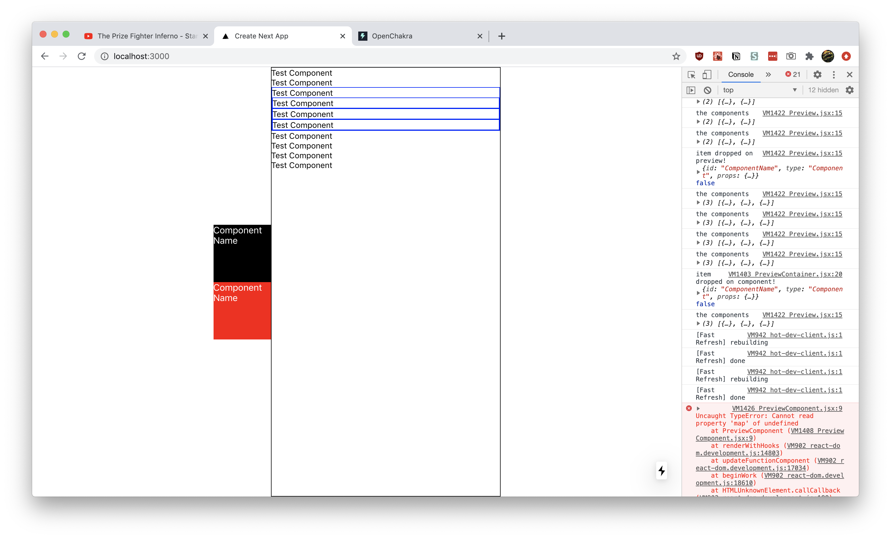
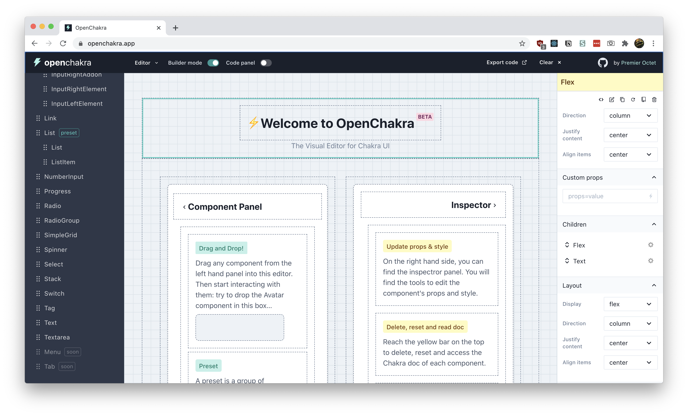
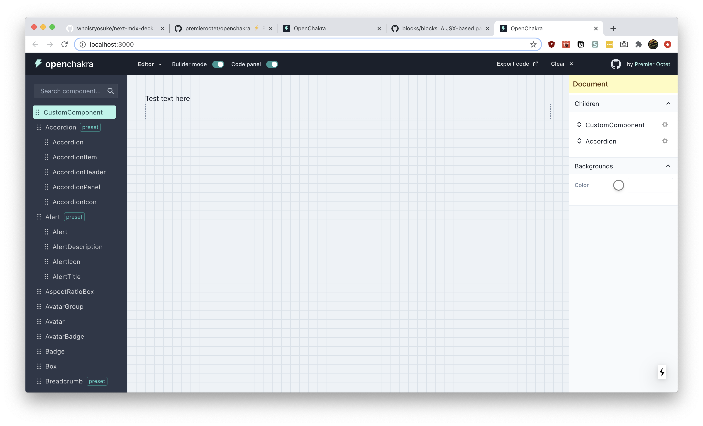
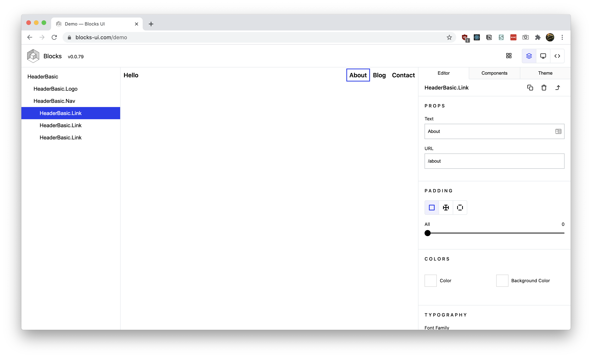
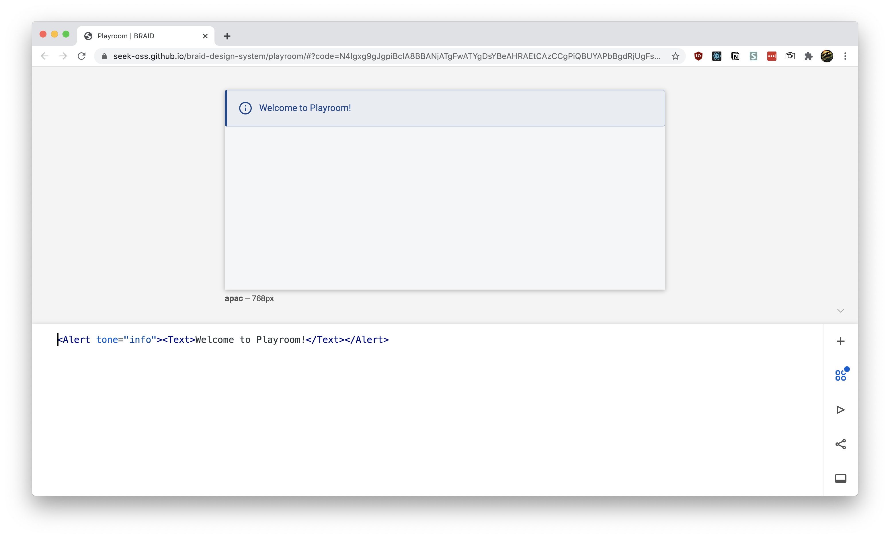

Wouldn't it be cool if you could create a website by dragging and dropping pieces of it around? To some it sounds like a _[green-weaved nightmare](https://en.wikipedia.org/wiki/Adobe_Dreamweaver)_, to others it sounds like [a proprietary platform](https://en.wikipedia.org/wiki/Adobe_Dreamweaver) — but this fantasy of freedom is becoming closer to being standardized into modern design and development workflows. With software like [OpenChakra](https://openchakra.app/), [Blocks UI](https://blocks-ui.com/), or even [Playroom](https://github.com/seek-oss/playroom) — we've gotten a taste **today** of what platforms like [Framer](http://framer.io/), [Modulz](https://www.modulz.app/), and other's have promised to use in an _unforeseen_ future: **design to code.**

So I got to thinking, how would you actually make a UI for building sites with components (like Figma or Sketch) and then export that to code?

And by thinking, I mean researching, reverse engineering, conceptualizing, and inevitably coding: **[design-system-builder](https://github.com/whoisryosuke/design-system-builder).** A small React app that accepts Reacts components to drag and drop into an "artboard" or "canvas", and then exports that to React code (or JSX) you can import into your project.

<figure>
  
  <figcaption>
    The drag and drop builder in action. Two test components are displayed in
    the left sidebar as black and red boxes. The preview window occupies the
    middle of the screen as a black bordered box that renders a list of
    components. Blue bordered components in the preview box represent nested
    components.
  </figcaption>
</figure>

Check out of [the source code here](https://github.com/whoisryosuke/design-system-builder), or read on to discover how I built it.

# Research

When you know something already exists, or even if you don't, the best place to often start is research. I already knew about **OpenChakra**, **Blocks UI**, and **Playroom,** so I started there. I reverse-engineered each project to see how it worked, and took notes on it.

To give you an idea of how I approach this process for a software project:

- I check out the `package.json` (or equivalent file like `composer.json` in PHP) to see what dependencies they're using. This usually gives you a great idea of how they handle core functionality. In this case, if there was drag and drop involved, `react-dnd` was found.
- Next begins the hunt for the "start" file. Sometimes this is listed in the `package.json` as the `start` script, often as a framework or library (like Gatsby or Next) which makes it easier to determine the starting point. Otherwise it may be under the `main`, which will be the root of the app. For **OpenChakra**, it was a Next app. But for **Blocks UI**, it was a monorepo, so I had to find the right package in `/packages/` — then it was a Gatsby project.
- From there, I try to find what's rendering the core functionality (aka the drag and drop builder). In this case, they were often a single component I could trace it back to.
- Once you're in the component, you can often find everything you need, like imported utilities, hooks, configs, etc. Sometimes you might have data that just "appears" in a component and isn't passed down naturally, but that's usually some framework magic (like Gatsby's GraphQL page generation).

So let's check out the breakdown of each project:

## [OpenChakra](https://openchakra.app/)



### How does it work?

- [NextJS app](https://nextjs.org/) (originally [CRA](https://github.com/facebook/create-react-app))
- Built with [Chakra UI](https://chakra-ui.com/getting-started)
- Uses [Redux](https://redux.js.org/) to manage state
- Uses [react-dnd](http://react-dnd.github.io/react-dnd) for drag and drop effect and adding functionality to components (`useDrag`)
- Makes a JSON list of components (`componentsList.js`) and uses that to generate the sidebar
- Uses a `<PreviewContainer>` component to wrap all the components dragged and dropped into the editor. This is what creates the "box" effect and also allows interactivity.
- How would you add a custom component?
  - Components are listed in `componentsList.js`
    - Used for the sidebar to define the menu structure
  - You also need to make sure the component is listed inside `src/components/editor/ComponentPreview.tsx` - this has a giant switch for each component (and special preview containers for certain more complex components)
    - This is where you should import your custom components
  - Need a special panel for each component that gets imported here `src/components/inspector/panels/Panels.tsx`
  - Default props for each component are located here `src/utils/defaultProps.tsx`
  - Components are also listed here `src/utils/editor.ts`
    - Used for the `useDropComponent` hook

### Takeaways

- Can't drop items between eachother in the preview (or "Builder mode"). But you can in the sidebar (a kind of "Layers" panel), and you can reorder them there.
- Really hardwired to Chakra in a couple of places, but not too hard to create conditionals (or just remove it)
  - For example, the ComponentPreview uses the Chakra library to grab the component (`Chakra[componentName]`). I created a new switch case that imports a custom component instead.
  - Panels assume every component uses Styled System utility props. But it's easy to add custom panels based on your prop needs.
- Really verbose. There's like 5 places to add the component, feels like there's a lot of duplication. But it's nice allowing custom panels, with custom prop setups.
- Elegant DX with bug monitoring and cache clearing 👏💯🐛 I appreciate that errors can be minimized, and the app knows when it's corrupted and has a button to clear cache.

### Adding a custom component

I went through the process of adding a custom component to OpenChakra (outlined roughly above). You can see it on my Github in a custom-components branch.



[whoisryosuke/openchakra](https://github.com/whoisryosuke/openchakra/tree/custom-components)

## [Blocks UI](https://blocks-ui.com/)



### How does it work?

- GatsbyJS (but can be any frontend, just use `<Editor>` component)
- Has a weird monorepo setup that requires you to prebuild all the packages before running
- Everything happens on `/demo` page (or `/pages/demo.js`)
  - Imports the `<Editor>` from the Blocks UI package
  - Passes sample JSX into `src` prop
  - Passes components into the `blocks` prop. Default blocks are imported from the Blocks UI/React package
  - You can also pass a layout wrapper using the prop
- Renders React components in a preview using `Function` and `React.createElement`

  ```tsx
  const element = useMemo(() => {
    if (!code) {
      return null
    }

    /* eslint-disable */
    const fn = new Function(
      'React',
      ...Object.keys(scope),
      `${code};
        return React.createElement(BLOCKS_Container)`
    )
    /* eslint-enable */

    return fn(React, ...Object.values(scope))
  }, [code])
  ```

- Components are created normally, but if you want to make them editable, they require the property-controls package (also part of the monorepo)
  - This small package basically adds an extra attribute to your component (e.g. Button.propertyControls — like defaultProps) with the controls you specify
  - They also require a `usage` attribute on the component that has a string literal containing the a JSX example of the component

### **Takeaways:**

- Can't do complex layouts like flex-based things (2+ column layouts) unless it's a pre-coded component. Makes it difficult to compose things.
- Very black box in it's implementation where you get a component, and have to dig into a separate package to find things.
- The requirement of default usage makes importing any component library tedious because it requires a special prop (`usage`) and working examples

## [Playroom](https://github.com/seek-oss/playroom)



- How do they parse the code to React?
  - It happens in the [Preview component](https://github.com/seek-oss/playroom/blob/master/src/Playroom/Preview.tsx)
  - [Code gets parsed by babel client-side](https://github.com/seek-oss/playroom/blob/master/src/Playroom/Preview.tsx#L36) - [utility function](https://github.com/seek-oss/playroom/blob/master/src/utils/compileJsx.ts)
  - Code is rendered by a [Render component](https://github.com/seek-oss/playroom/blob/master/src/Playroom/RenderCode/RenderCode.js) which uses [scope-eval](https://www.npmjs.com/package/scope-eval) to [run the React code](https://github.com/seek-oss/playroom/blob/master/src/Playroom/RenderCode/RenderCode.js#L28)
  - The code editor is [codemirror](https://codemirror.net/)

## 📚 Summary

- **OpenChakra** uses a Redux store to keep names of components. The preview window reads from the Redux store and renders all the components using a giant switch statement that render the appropriate component (inside a wrapper component that handles drag and drop).
- **Blocks UI** provides an `<Editor>` component that accepts JSX. It renders the components by creating a new `Function` using the provided JSX and rendering that in React.
- **Playroom** parses JSX with Babel and then renders it using `scope-eval`. Makes more sense this way since it's more code based, than a drag and drop editor.

# Planning

After a sufficient amount of research, I set out to plan out the feature set of an MVP product.

## Architecture

- User drags a component from a list of components
- Drops onto preview area ("canvas", "artboard", "frame", etc)
- Preview stores component data into context
- Preview displays context data as real components
- Preview components are wrapped in a controlled container to allow for actions like selecting/focusing
- Exports code
- Sidebar has a "layers" panel with a list of all the components (in a tree, so nested components are available by dropdown)
  - Components can be dragged into different spots to reorder
  - Edit button on side of button takes you to props edit panel
- Support React and React Native

### "Would be nice"

- Undo (action list in context to traverse through (like redux))
- Keyboard shortcuts (Delete, CTRL+Z for undo)
- Export code to CodeSandbox

I definitely didn't complete all these, but just outlining these from the outset helps the development process immensely.

## Structuring the Data

Now that I knew I was going to use the state to store the component data (similar to OpenChakra), I wanted to structure how it'd look. I also needed to create structured data types react-dnd.

### Drop object

For the "drop" to work with react-dnd, you need to attach data to the object you're dropping to let the "drop area" know what it's accepting. The `id` is basically the component name. And you can set a `type`, so if it doesn't match, it won't accept the drop (to allow multiple drop points in an app). In this case, we signify the `type` is a "Component" (which I made constant in my app called `DATA_TYPES` and stored it as a object property there).

```html
{ id: "ComponentName", type: "Component" }
```

### Handling children

For the structure of the React state (or context), I wanted to make sure that it could support an infinite amount of children. That way, we could nest components as deep as needed, and recursively render it.

It was pretty easy. I added a `children` property to the object with an array of more "component" objects. When we render, we check for the `children` property and render as needed.

```html
[ { name: 'ComponentName'} { name: 'Flex', props: {} children: [ { name:
'ComponentName', props: {}}, { name: 'ComponentName', props: {}}, ] } ]
```

## Rendering components dynamically

Figuring out this part of the app makes everything basically possible, and thanks to React, it's incredibly simple.

You use `React.createElement` with a component name (and props) to generate a component dynamically. We also store all the components in a single object to make it easier to look them up using a hash map named `PreviewComponents` (and safer, since you won't be calling random function names).

```tsx
const PreviewComponents = {
  Box,
  Button,
  Input,
}
const componentPreview =
  components.length > 0 &&
  components.map((component, index) => {
    if (typeof PreviewComponents[component.name] !== 'undefined') {
      return React.createElement(PreviewComponents[component.name], {
        // @TODO: Use a hash here?
        key: index,
        ...component.props,
      })
    }
  })
```

# Prototyping

To develop the initial prototype, I used NextJS to quickly bootstrap a React project. I then added react-dnd, and setup a simple drag and drop example using a placeholder box and preview container. When you drag the box into the preview, the "drop data" was displayed to the console.

From there, I created a context for the components to be stored in, then wired up the preview (or "drop area") to send the "drop data" to the context.

```tsx
// contexts/ComponentsContext.js
import React, { createContext, useContext, useState } from 'react'
const ComponentsContext = createContext([])

const ComponentsProvider = ({ children }) => {
  const [components, setComponents] = useState([])

  return (
    <ComponentsContext.Provider value={{ components, setComponents }}>
      {children}
    </ComponentsContext.Provider>
  )
}

const useComponents = () => useContext(ComponentsContext)

export { ComponentsContext, ComponentsProvider, useComponents }
```

```tsx
// components/Preview.jsx
import React, { useCallback, useState } from 'react'
import { Box } from 'rebass/styled-components'
import { useDrop } from 'react-dnd'
import { DRAG_TYPES } from '../constants/DragTypes'
import { useComponents } from '../contexts/ComponentsContext'
import PreviewComponent from './PreviewComponent'

export default function Preview() {
  const [focused, setFocused] = useState(null)
  const { components, setComponents } = useComponents()
  const [{ isOver, isOverCurrent }, drop] = useDrop({
    accept: DRAG_TYPES.COMPONENT,
    drop(item, monitor) {
      const didDrop = monitor.didDrop()
      if (didDrop) {
        return
      }
      console.log('item dropped on preview!', item, didDrop)
      const componentStructure = {
        name: item.id,
        props: {},
        children: [],
      }
      setComponents((prevValue) => [...prevValue, componentStructure])
    },
    collect: (monitor) => ({
      isOver: monitor.isOver({ shallow: true }),
      isOverCurrent: monitor.isOver({ shallow: true }),
    }),
  })

  console.log('the components', components)
  const componentPreview =
    components.length > 0 &&
    components.map((component, index) => (
      <PreviewComponent index={index} component={component} focused={focused} />
    ))
  return (
    <Box
      ref={drop}
      width="400px"
      height="100vh"
      sx={{ border: '1px solid black' }}
    >
      {componentPreview}
    </Box>
  )
}
```

Then I refactored the preview to use the context state to display the context data, which was an array of component names. I displayed them as strings first (as a sanity check), then integrated the dynamic render using React (discussed above). I created a recursive `walkChildren` function that goes through and renders all children (and children of children).

```tsx
// components/PreviewComponent.jsx
import React from 'react'
import ComponentName from '../components/ComponentName'
import PreviewContainer from './PreviewContainer'

const PreviewComponents = {
  ComponentName,
}

export default function PreviewComponent({
  component,
  index,
  focused,
  clickHandler,
}) {
  if (typeof PreviewComponents[component.name] !== 'undefined') {
    const walkChildren = (children) => {
      if (children.length > 0) {
        return children.map((childComponent) => {
          const NewChildComponent = React.createElement(
            PreviewComponents[childComponent.name],
            {
              ...childComponent.props,
              children: walkChildren(childComponent.children),
            }
          )
          return React.createElement(
            PreviewContainer,
            {
              index,
              onClick: clickHandler,
              focused: focused === index ? true : false,
            },
            [NewChildComponent]
          )
        })
      }
      if (typeof children === 'string') {
        return children
      }
    }
    const NewComponent = React.createElement(
      PreviewComponents[component.name],
      {
        // @TODO: Use a hash here?
        key: index,
        ...component.props,
        children: walkChildren(component.children),
      }
    )
    return React.createElement(
      PreviewContainer,
      {
        index,
        onClick: clickHandler,
        focused: focused === index ? true : false,
      },
      [NewComponent]
    )
  }
}
```

Once I was able to display top level components, I worked on nested children. Each component that gets displayed in the preview had to get wrapped in a new component that was essentially a new "drop area" (so we'd have one big preview drop, then smaller drops for components). Inside this wrapper, I connected it to the context to add new components when they're dropped. This component also needed to dynamically render, since it's passed a component object that may have the `children` prop (more more component objects).

```tsx
// components/PreviewContainer.jsx
import React, { useCallback } from 'react'
import { Box } from 'rebass/styled-components'
import { useDrop } from 'react-dnd'
import { DRAG_TYPES } from '../constants/DragTypes'
import { useComponents } from '../contexts/ComponentsContext'

export default function PreviewContainer({
  index,
  focused = false,
  onClick,
  children,
  ...restProps
}) {
  const { components, setComponents } = useComponents()
  // Handle dropping components for nested children
  const [{ isOver, isOverCurrent }, drop] = useDrop({
    accept: DRAG_TYPES.COMPONENT,
    drop(item, monitor) {
      const didDrop = monitor.didDrop()
      console.log('item dropped on component!', item, didDrop)

      if (didDrop) {
        return
      }
      setComponents((prevValue) => {
        const childComponent = {
          name: item.id,
          props: {},
          children: [],
        }
        const componentStructure = {
          ...prevValue[index],
          children: [...prevValue[index].children, childComponent],
        }
        return [
          ...prevValue.slice(0, index),
          componentStructure,
          ...prevValue.slice(index + 1, prevValue.length + 1),
        ]
      })
    },
    collect: (monitor) => ({
      isOver: monitor.isOver({ shallow: true }),
      isOverCurrent: monitor.isOver({ shallow: true }),
    }),
  })
  const clickHandler = useCallback(() => {
    onClick(index)
  }, [onClick])
  return (
    <Box
      ref={drop}
      onClick={clickHandler}
      sx={{ border: focused && '1px solid blue' }}
      {...restProps}
    >
      {children}
    </Box>
  )
}
```

## React Native support

I was able to display a sample React component, but I wanted to be able to display native components using `react-native-web`. Thanks to Expo, they make the process easy with their Webpack config and [NextJS example.](https://docs.expo.io/guides/using-nextjs/)

I followed the guide for [adding Expo to an existing NextJS project](https://docs.expo.io/guides/using-nextjs/#add-nextjs-to-expo-projects) and I was able to start using React Native components (like `<View>` and `<Text>`). You basically install an adapter, run it, and it generates (and modifies) the necessary files.

# Demystified?

After building it from scratch, I just kept looking at the feature list and thinking about how much work goes into this. One look at OpenChakra and how polished of a product it is (despite being alpha/beta) and you can see how far you can go with this kind of software.

But I hope seeing the how the core functionality of the drag and drop builders works, you can start to see the wires behind experiences like Figma or Framer.

Let me know if you have any questions in the comments or [on my Twitter](https://twitter.com/whoisryosuke), and let me know if you build anything with this!

# References

- [https://openchakra.app/](https://openchakra.app/)
- [https://blocks-ui.com/](https://blocks-ui.com/)
- [https://github.com/seek-oss/playroom](https://github.com/seek-oss/playroom)
- [https://github.com/whoisryosuke/design-system-builder](https://github.com/whoisryosuke/design-system-builder)
- [React DnD](https://react-dnd.github.io/react-dnd/)
- [How to render dynamic component defined in JSON using React](https://www.storyblok.com/tp/react-dynamic-component-from-json)
- [react-dnd/react-dnd: simple](https://codesandbox.io/s/github/react-dnd/react-dnd/tree/gh-pages/examples_hooks_js/04-sortable/simple?from-embed=&file=/src/Card.jsx)
- - Example of re-sorting a list using drag and drop
- - Basically make the drag component also a drop component, and pass the drag/drop component a state changing function (like `moveCard` that does a `setState` to re-order the things based on the new index provided).
- - The re-order function is a little tricky, since it requires taking an object and reordering objects inside of it. The example uses an immutability-helper library and it's update/slice functions.
- [React DnD - Touch Backend](https://react-dnd.github.io/react-dnd/docs/backends/touch)
- - React Native Web doesn't support the HTML5 backend. You'll get errors using it (see below). Instead, you have to use the `touch-backend` - documented above.
    ```tsx
    TypeError: node.setAttribute is not a function
    HTML5BackendImpl.connectDragSource
    node_modules/react-dnd-html5-backend/dist/esm/HTML5BackendImpl.js:453
      450 |   return _this3.handleSelectStart(e);
      451 | };
      452 |
    > 453 | node.setAttribute('draggable', 'true');
          | ^  454 | node.addEventListener('dragstart', handleDragStart);
      455 | node.addEventListener('selectstart', handleSelectStart);
      456 | return function () {
    View compiled
    ```
- - [Module parse failed: Unexpected token. You may need an appropriate loader to handle this file type, currently no loaders are configured to process this file. · Issue #996 · akveo/react-native-ui-kitten](https://github.com/akveo/react-native-ui-kitten/issues/996)

- Tried integrating UI Kitten components and got build errors by including the library (just using a button, the an input component broke the build)

  [Module parse failed: Unexpected token. You may need an appropriate loader to handle this file type, currently no loaders are configured to process this file. · Issue #996 · akveo/react-native-ui-kitten](https://github.com/akveo/react-native-ui-kitten/issues/996)

- - Seems tied to optional chaining not being parsed by Webpack
- - What's weird is that NextJS supports [this out-of-the-box according to this issue](https://github.com/vercel/next.js/issues/9004)
- - Meaning it must be [the Expo webpack or Babel configuration](https://docs.expo.io/guides/using-nextjs/#withexpo) that's messing things up
- - Added [optional chaining to the Babel config](https://www.gitmemory.com/issue/zeit/next.js/9004/552215459) to try and fix it

    [@babel/plugin-proposal-optional-chaining · Babel](https://babeljs.io/docs/en/babel-plugin-proposal-optional-chaining)

- - Also got an error saying it couldn't find React Native (even though Expo should alias it)

    ```tsx
    Error: Cannot find module 'react-native'
    Require stack:
    - /Users/ryo/Development/React/design-system-builder/node_modules/@ui-kitten/components/theme/modal/modalPanel.component.js
    - /Users/ryo/Development/React/design-system-builder/node_modules/@ui-kitten/components/theme/application/applicationProvider.component.js
    - /Users/ryo/Development/React/design-system-builder/node_modules/@ui-kitten/components/theme/index.js
    - /Users/ryo/Development/React/design-system-builder/node_modules/@ui-kitten/components/index.js
    - /Users/ryo/Development/React/design-system-builder/.next/server/pages/index.js
    ```

- - Ended up just using a custom RN component (`<View><Text>Test</Text></View>`) with NextJS and the Expo adaptor and it worked! Ideally if the library is built properly for distribution should work.
