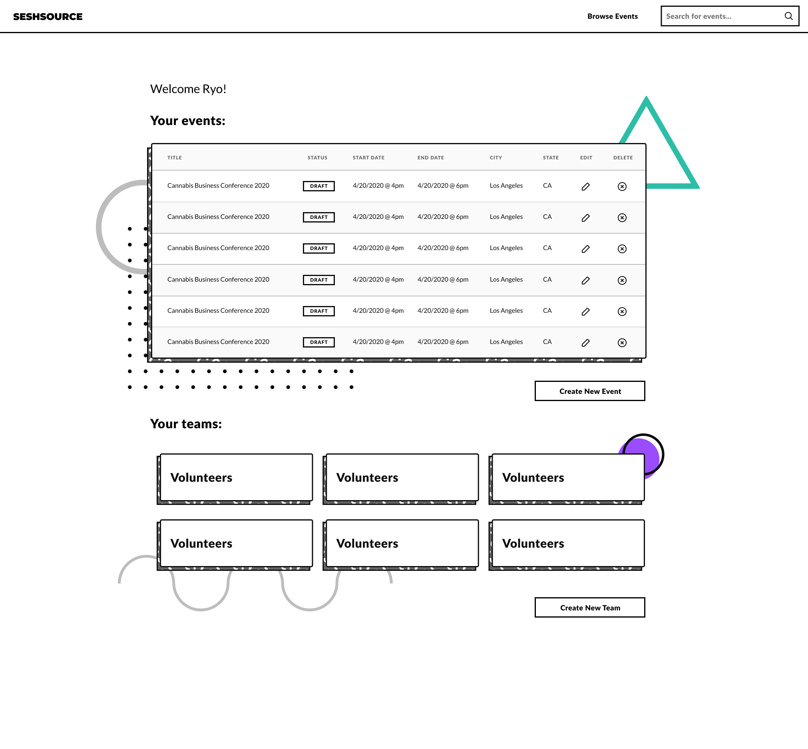
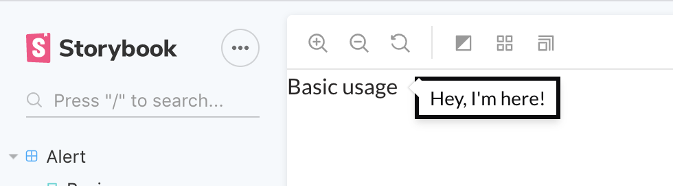
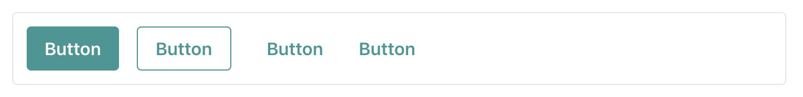
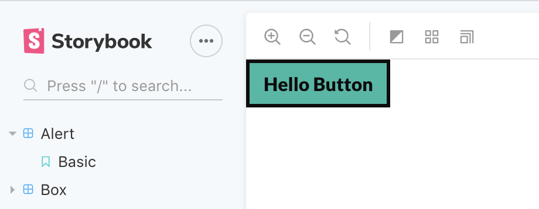
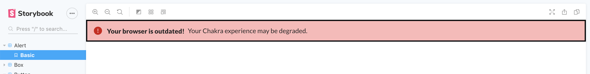

I've been using [**Chakra UI**](https://chakra-ui.com/) for a couple weeks now to create a new design system and I feel like I can provide a proper critique of it's customizability.

**Chakra UI** is a React component library that uses [**Emotion**](https://emotion.sh/) and [**Styled System**](https://styled-system.com/) under the hood. The combination of both allow for components that use utility props for styling: `<Button color="primary" textAlign="center">`. It's like [Tailwind](https://tailwindcss.com/) meet React props - but tied to your CSS in JS theme (note the use of `primary` for color). It's similar and more feature complete to other Styled System-based UI libraries like [Rebass](https://rebassjs.org/).

I've been a huge fan of **[utility style props](https://chakra-ui.com/style-props)** in my apps recently for styling as a powerful paradigm that makes prototyping faster and overriding style easier. Once you write a responsive width prop that does the work of 20 lines of CSS media queries — you'll never go back.

# The Design System

I used Chakra UI as the basis for the design system one of my side projects: [SeshSource](http://seshsource.com). I designed the UI initially in Figma and then used Chakra components to build out **primitives** (like the button, links, headings, etc).

The design system itself is a bit _modern_ (inspired by [Memphis design](https://www.google.com/search?q=memphis+design)) and has a more stylized look and feel. This leads to some components being more _adventurously_ accomplished, such as **bordered shadows** with **patterned backgrounds**.



A hi-fi UI mockup created in Figma of a SeshSource page. It features Memphis inspired design elements such as shapes, squiggly patterns, and hard drop shadows.

This led to be a great stress test of Chakra UI and it's **customizability**. Here are some of my thoughts from the process and how Chakra can make more allowance for theming. I'll also share more opinion-based issues with functional decisions.

# The Limitations

## Impossible to style some components

`<Switch>`, `<Checkbox>`, and a couple more can be roughly styled (like adding additional CSS on top), but they contain underlying elements that you don't have access to style.

### The Switch

The `<Switch>` for example has a `<div>` inside that is styled and you have no access to with the style props provided. I wanted to do things like **increase the scale of the inner elements**, but their **styles were unreachable**, and the variables they used influenced other aspects of the systems (scale is based on font sizing - so if I increase that, _all the text_ gets bigger too). Chakra has a few **sizes** available (small, medium, and large) and I ended up just using the "large" (and scaling it when needed using a `transform: scale(2)`).


### The Checkbox

I also needed to customize the **icon** used for the `<Checkbox>` , but I wouldn't be able to change it without copying the Chakra source code and swapping it there. This is because [the Checkbox](https://chakra-ui.com/checkbox) icon is a `<Icon>` component nested inside, that returns an SVG icon. You could do some CSS trickery to remove that icon and show another using the `background` property, but it gets hacky at that point (since the icon still shows in DOM).

### The Tooltip

And this one was strange (_but understandable_). I needed to style the `<Tooltip>` arrow. This requires you to copy the source because it's [**a React "portal"**](https://reactjs.org/docs/portals.html) (meaning it's not a direct child of the [Tooltip component](https://chakra-ui.com/tooltip), near the root of the DOM).

```jsx
import React from 'react'
import { Tooltip as ChakraTooltip } from '@chakra-ui/core'

export const Tooltip = ({ children, ...props }) => (
  <ChakraTooltip
    borderWidth="3px"
    borderStyle="solid"
    borderColor="black"
    {...props}
  >
    {children}
  </ChakraTooltip>
)

export default Tooltip
```

If it were a nested child instead, you could possibly use a selector to grab the necessary object, but it'd be impossible in this case (because it's outside the component scope, and doesn't have a defined class name or ID to target). You can style it in a basic sense, like changing the background or text color. But I was looking to add a border, which ends up looking odd, as it doesn't style the underlying SVG properly:



Seems like I would want something like Reakit or Material UI's recent approach to hook-based components that allow you to compose your own components with the design system's underlying logic and your styles/structure on top.

I'd be ok with this? As long as, in this case, I'd still be benefiting from the utility props.

Currently Chakra recommends creating your own components using their `<PseudoBox>`, but at that point I feel like I'm creating everything from scratch, and creating more problems for myself in the future by not accommodating for every edge case. This is why I come to component libraries — to avoid rolling my own.

## Hard to apply defaults - variant colors have limits

I needed to create a default button that had a border, and was the "primary" color of the design system. Chakra by default [has a few button styles or "variants" available.](https://chakra-ui.com/button#button-variant) One of these is a borderless button and another is a bordered button with transparent background.



I created a new component (`<Button>`) that passed a `<ChakraButton>` with a few default props for the border and background color. I also passed the remaining props (`...props`), so they could be overridden, like the background color.



```jsx
import React from 'react'
import { Button as ChakraButton } from '@chakra-ui/core'

export const Button = ({ children, ...props }) => (
  <ChakraButton
    variantColor="primary"
    color="black"
    borderWidth="3px"
    borderStyle="solid"
    borderColor="black"
    fontWeight="bold"
    px={3}
    py={2}
    display="block"
    height="auto"
    _hover={{
      backgroundColor: 'primary.300',
      color: 'black',
    }}
    _pressed={{
      backgroundColor: 'primary.700',
      color: 'white',
    }}
    {...props}
  >
    {children}
  </ChakraButton>
)

export default Button
```

But as you can see above, I had to override the text color to ensure contrast (it defaults to white, which isn't accessible with the "primary" color). This means if I pass the component another `variantColor` (which is a BG and text color), it overrides it's text color with hard-coded "black". Which doesn't work for all the `variantColor`, as some may need white text (requiring you to override the `color` prop too). This means you end up making a manual variant for each color (like creating your own `variant` prop that works like a giant `switch()` statement to swap utility props).

It also makes that process much more difficult, since you have to change multiple style values to accommodate all the component states (like regular vs hover BG).

## CSS is sometimes better

Chakra provides props for many of common CSS states (hover, focus, etc) — but there are plenty of times you can do much more powerful logic with other more exact CSS states or selectors. For instance, I wanted to style an input different based on the attribute passed to it. To accomplish this, I'd have to use the `sx` prop to pass the selector, or wrap the component in a `styled` (and hope for no collisions with style/utility props).

```jsx
import React from 'react'
import styled from '@emotion/styled'
import { Select as ChakraSelect } from '@chakra-ui/core'
import { Box } from '../Box/Box'

const SelectContainer = styled(Box)`
  &:focus-within {
    border-color: black;
    box-shadow: 0 0 0 3px #2bbaa4;
  }

  & select {
    font-weight: bold;
  }
`

export const Select = ({ children, ...props }) => (
  <SelectContainer
    borderWidth="3px"
    borderStyle="solid"
    borderColor="black"
    borderRadius="0"
    p={1}
    {...props}
  >
    <ChakraSelect border="0" _focus={{ outline: 'none' }}>
      {children}
    </ChakraSelect>
  </SelectContainer>
)

export default Select
```

## No way to theme some components

Chakra has an `<Alert>` component that basically is a "status message" element that you use above forms or other areas to notify the user of an error, success, etc. It has different `status` props you can pass to it (like `error`). I was able to roughly style the base component (just needed to add a border), but when it came to styling it based on the `status` prop, I couldn't find any documentation or method for it.



Screenshot of my customized Alert component featuring the default icon

I tried using the theme variants for components and placing it under object labeled for each status, but that didn't work:

```jsx
const theme = {
  ...ChakraBaseTheme,
  variants: {
    Alert: {
      error: {
        bg: 'red',
        color: 'white',
      },
    },
  },
}
```

After perusing through the theme file and type interfacing, I didn't see any settings for the status, or variants in general.

Then after checking the source code for `<Alert>`, the styles are derived [using a hook](https://github.com/chakra-ui/chakra-ui/blob/master/packages/chakra-ui/src/Alert/styles.js) and [a predetermined file](https://github.com/chakra-ui/chakra-ui/blob/master/packages/chakra-ui/src/Alert/styles.js) with a object based styles for light and dark modes. Preferably this should default to somewhere in the theme to ensure it's overridable.

I ended up rolling my own custom component from scratch. This was yet another "why am I using this library when I could just reach for Styled Components + Styled System?" moment (until I realize I'm avoiding extra work, then pivot back to something more realistic like Reakit or Grommet). But I jest. Chakra is a very young library and has room to grow. I look forward to seeing these components become more customizable to make the library more indispensable.

## Doesn't support `sx` prop

One of the benefits of using other utility prop-based libraries like [Rebass](https://rebassjs.org/) is that they also offer a styling prop that lets you write object-based CSS — but also still use theme properties as strings (`<Box sx={{ borderColor: "primary" }}>` would pick up the `primary` color from the theme). [Instead](https://github.com/chakra-ui/chakra-ui/issues/579), you have to use a `css` helper utility, combine it with the theme hook, and pass that to your component. It's a bit of work.

```jsx
/*@jsx jsx*/
import {css} from "@chakra-ui/core"

// grab the theme
const theme = useTheme()

// add the styles
const styles = css(stylePropObject)(theme)

// pass it to css prop
<Box css={styles} />
```

An alternative is to use Emotion's `styled` wrapper, or Emotions own `css` prop (but you don't get magic names like `color: primary` — looks like `color: ${(theme) => theme.colors.primary)}`). But it's a shame there's no direct way to accomplish more complex styles using the library.

Chakra offers some props for common selectors/states (like `<Box __hover={{ bg: 'red' }}>` to set the hover bg to red). But these don't cover every use case, or the kind of depth you get with the full range of CSS and it's selectors.

## No variants?

I don't understand why Chakra took so much from Styled System, even uses variants itself, but [doesn't allow for users to customize variants through the theme.](https://github.com/chakra-ui/chakra-ui/issues/76#issuecomment-531171216) You're expected to create a new component for each variant and use utility props to apply the new styles.

It works, but bloats your app or UI library with simple components that are wrappers doing styles (like creating multiple buttons button with unique color combinations). You end up doing your own custom wiring to create variants, and repeating the process across other components. Libraries like Styled System were created to offer more efficient solutions for this that didn't involve structuring your own variance API.

## Not a fan of "t-shirt sizing"

This one's more of a personal opinion, but [Chakra uses "t-shirt" sizes](https://chakra-ui.com/theme#sizes) for scaling components (e.g. `<Button size="lg">` ). I used to be a fan of this in the [Semantic UI days](https://semantic-ui.com/elements/button.html#size), but I've grown out of it in favor of using number based systems. You can have a larger degree, it's easier to swap, and you don't have to remember names and their order:

```jsx
<ButtonGroup spacing={4}>
  <Button size={1}>
    Button
  </Button>
  <Button size={2}>
    Button
  </Button>
  <Button size={3}>
    Button
  </Button>
  <Button size={4}>
    Button
  </Button>
</ButtonGroup>

// much better than

<ButtonGroup spacing={4}>
  <Button size="xs">
    Button
  </Button>
  <Button size="sm">
    Button
  </Button>
  <Button size="md">
    Button
  </Button>
  <Button size="lg">
    Button
  </Button>
</ButtonGroup>
```

## Icons stored in theme

One of the biggest issues I have with CSS in JS is how big the theme file becomes. People don't realize, but it's basically like having a giant Redux store, always active in your app and taxing the performance with it's presence (particularly since it's used across the app in context providers).

Chakra stores it's icons in the theme, and requires you to import them inside there. It's nice, because [they have a way coloring icons](https://chakra-ui.com/icon#adding-custom-icons) using the `variantColor` prop (which benefits from the magic theme naming syntax). But I wish there was an easier way to utilize different icon libraries without manually going in and replacing theme references (or even doing double work by pasting them into the theme file — instead of just importing from many React optimized icon libraries).

Chakra also does my preferred method with other components. With the `<Alert>` component you get the `<AlertIcon>` component. It reacts to the type you set on the primary component. If it was overridable with another icon as a prop it'd be nice.

# Would I use Chakra UI again?

**Absolutely!** As many issues as I had, I know that the library is very new and has room for improvement (maybe even a PR or two from me — still waiting for the TS migration to go through). I'm a big fan of utility props, and there aren't a lot of libraries out there that utilize it, so I definitely want to see Chakra become more adopted.

For **simpler design systems** that don't require the level of customization that I was going for, it's **a very approachable option** that can _expedite_ the prototyping or even development of your next design system or app.

Did I misunderstand any part of the Chakra library? Let me know in the comment or on Twitter on what I was wrong with, and what the real answer is (bonus points for a [CodeSandbox](https://codesandbox.io/)). I'll make sure to update this article to reflect any corrections.

# References

- [No sx prop in Chakra UI?](https://github.com/chakra-ui/chakra-ui/issues/579)
- [https://github.com/chakra-ui/chakra-ui](https://github.com/chakra-ui/chakra-ui)
- [https://chakra-ui.com/](https://chakra-ui.com/)
- [https://github.com/premieroctet/openchakra](https://github.com/premieroctet/openchakra)
- [https://openchakra.app/](https://openchakra.app/)

### Software Requirements

| Software        | Version  |
| --------------- | -------- |
| @chakra-ui/core | ^0.8.0   |
| @emotion/core   | ^10.0.28 |
| emotion-theming | ^10.0.27 |
| react           | ^16.8.6  |
| react-dom       | ^16.8.6  |
