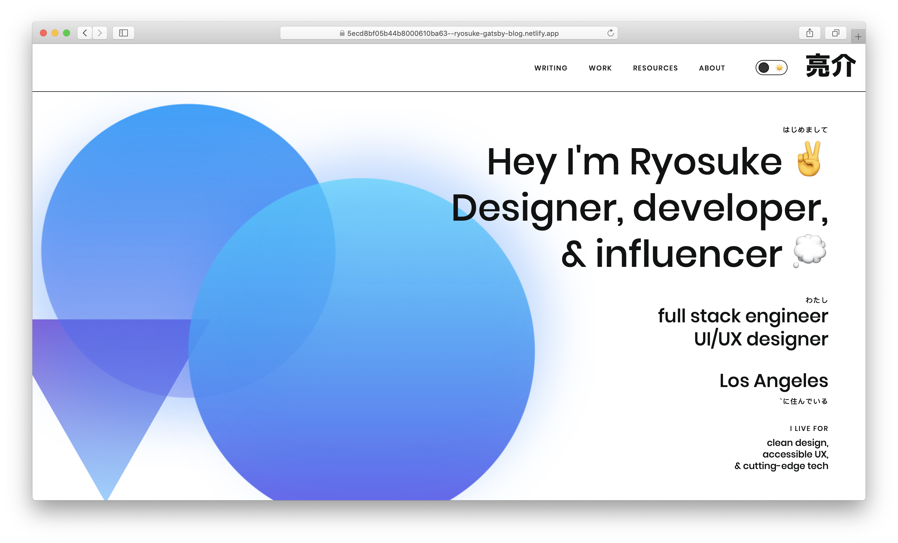
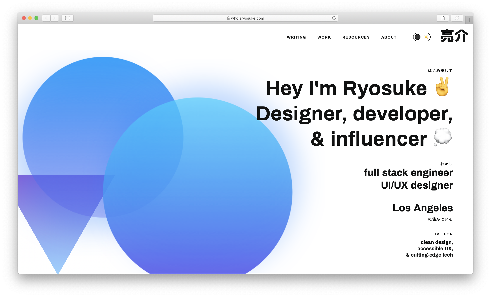
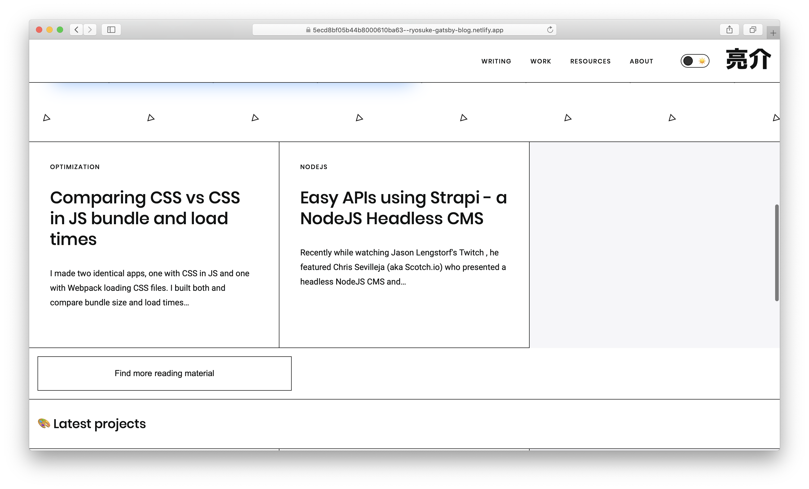
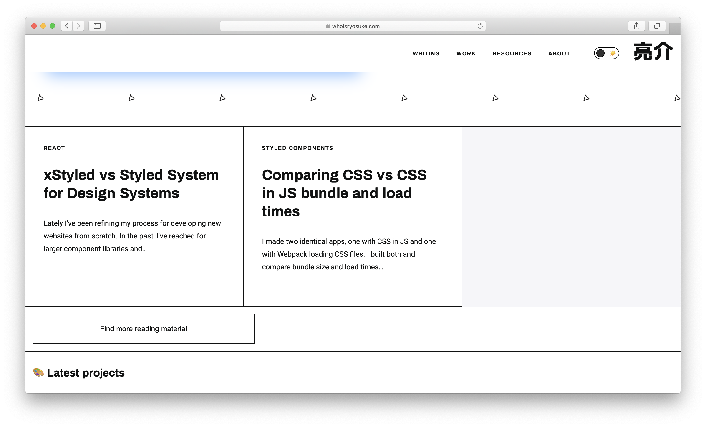
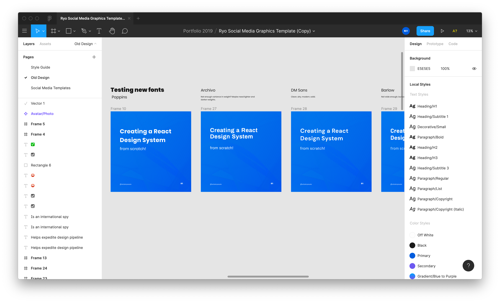
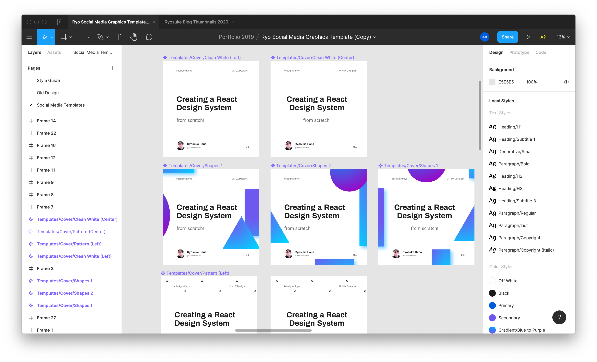
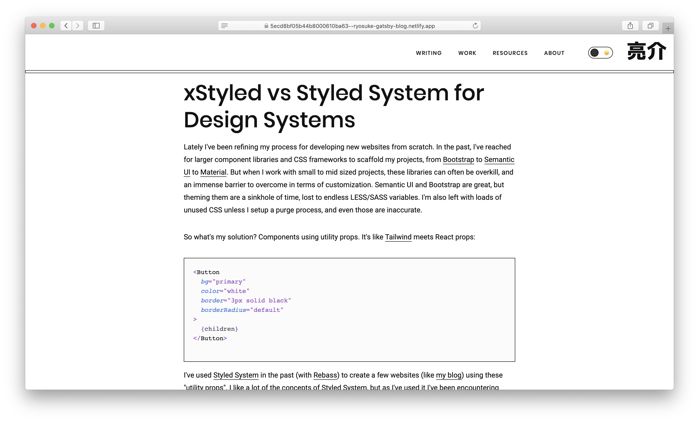
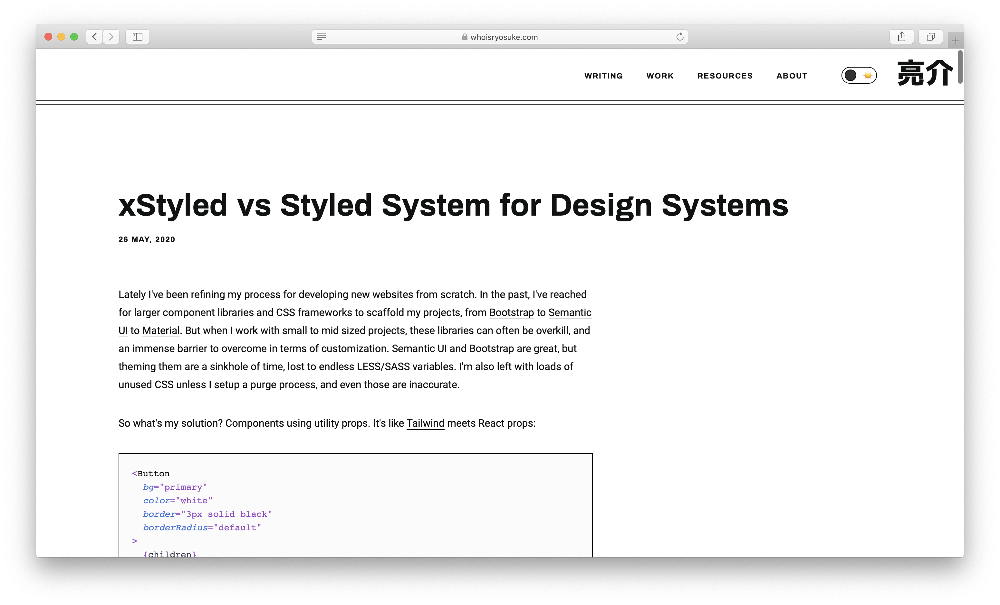
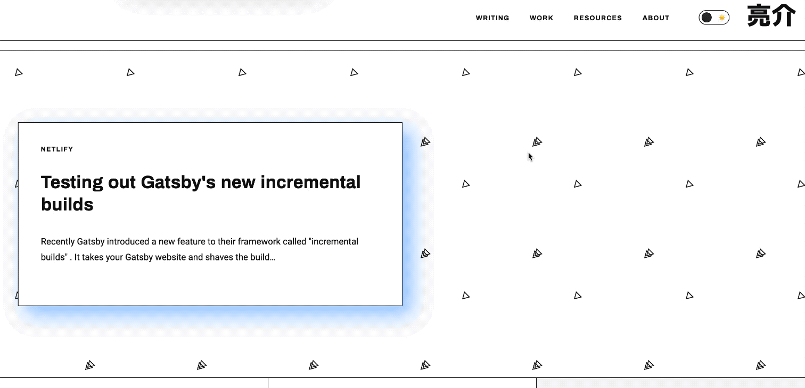

I finally got around to touching up the theme on my portfolio and blog site. I made some small changes that make dramatic improvements over the previous iteration. Check out how I increased the legibility and enhanced the aesthetic appeal of my Gatsby site and the process behind it.

# ⚖️ Old vs New

Here's a side-by-side screenshot comparsion of the old version (left) and the updated version (right). The changes here are pretty evident, with an increase in legibility and a better hierarchy of size.

<Box display="flex" flexDirection={['column','column', 'row']}>

<Box width={[1,1, 1/2]}>



</Box>
<Box width={[1,1, 1/2]}>



</Box>
</Box>

<Box display="flex" flexDirection={['column','column', 'row']}>
<Box width={[1,1, 1/2]}>



</Box>
<Box width={[1,1, 1/2]}>



</Box>
</Box>

Thanks to the way Netlify works, [you can even browse the version of the website before the update was applied](https://5ecd8bf05b44b8000610ba63--ryosuke-gatsby-blog.netlify.app/), so you can compare the changes yourself.

Next I'll dig into the creative exploration to discover these changes, as well as the inevitable programmatic execution.

# 🎨 Design Process

I started to test out some new design elements by using my pre-existing Figma templates as a basis. I had already created a small design system for my personal branding, as well as different layouts from the site (like cards).

I experimented by **swapping the header and body fonts** with a few other sans-serif choices. My goal was to find something that fit the clean and bold aesthetic of the branding. While developing social media graphics, I also found that the font weight for the header was a little _too light_ and **lacking legibility** at smaller scales (like mobile). I also found that Poppins as the body font was less legible, particularly on colored backgrounds.



Ultimately I decided on **Archivo in Bold** for the **header** and **Roboto** for the **body font**. Both were a nice balance of the weight I was looking for, with increased legibility at all scales.



# ✨ New features

Now that I outlined the core design changes I was looking to make to the site's branding and theme, I also laid out a list of features I was looking to accomplish for the update. These were all criticisms I accrued in a Notion page over time as I used and developed the site.

## ♿ Accessibility for sidebar menu

One of the biggest features I was looking forward to adding was accessibility support for the site's responsive navigation. Previously the nav menu would display horizontally on larger browsers, while on smaller viewports it is hidden and toggled by a menu button. This works fine for most users, but I wanted to ensure that users that rely on screen readers and keyboard navigation could use the menu.

After perusing the guidelines on accessibility for buttons, navigation, and menubars — I added the appropriate aria attributes to portions of the menu.

The navigation itself, a `<nav>` element, is given the explicit role "navigation" (even though using the DOM element `<nav>` is usually enough). I also added a `aria-labeledby` attribute that ties this navigation to the hamburger menu button that toggles it.

The menu itself (a `<ul>` element) is given the `role="menubar"` property. I also added a `aria-orientation` to signify the change between it's horizontal and vertical states. And `aria-hidden` to indicate when it's visually hidden by the toggle button (which uses a CSS `transform: translateX` to accomplish — but doesn't explicitly cue to non-visual users).

Here's an example of the final code (minus the Styled Components — just imagine there's a component that handles the CSS transform — or check out [the source code of my site here](https://github.com/whoisryosuke/ryosuke-gatsby-blog)):

Elements with the `menubar` role are required to have elements with the `role="menuitem"` property, so I took all the "list" or `<li>` elements and added the role. In order to ensure that users who use keyboard navigation don't stumble onto the hidden menu, I added a `tabIndex` to each of the `menuitem` that is set to `-1` when the menu is hidden.

```tsx
import React from 'react'
import styled from 'styled-components'
import Link from 'gatsby-link'
import { Box, Flex, Text } from 'rebass/styled-components'
import { useTheme } from '../../context/ThemeContext'
import DarkModeToggle from '../DarkModeToggle/DarkModeToggle'

interface HeaderProps {
  readonly mobile: boolean
  readonly visible: boolean
  toggleVisibility: () => void
}

const Header: React.SFC<HeaderProps> = React.memo(
  ({ mobile, visible, toggleVisibility }) => {
    const theme = useTheme()
    return (
      <StyledHeader justifyContent="flex-end">
        <StyledHeaderNav
          mobile={mobile}
          visible={visible}
          role="navigation"
          aria-labelledby="MobileButtonToggle"
        >
          <ul
            role="menubar"
            aria-orientation={mobile ? 'vertical' : 'horizontal'}
            aria-hidden={mobile && visible}
          >
            <li role="menuitem" tabindex={mobile && !visible && '-1'}>
              <Link to={'/blog'}>
                <Text variant="label">
                  Writing <span>📓</span>
                </Text>
              </Link>
            </li>
            <li role="menuitem" tabindex={mobile && !visible && '-1'}>
              <Link to={'/projects'}>
                <Text variant="label">
                  Work <span>🚀</span>
                </Text>
              </Link>
            </li>
            <li role="menuitem" tabindex={mobile && !visible && '-1'}>
              <Link to={'/resources'}>
                <Text variant="label">
                  Resources <span>💽</span>
                </Text>
              </Link>
            </li>
            <li role="menuitem" tabindex={mobile && !visible && '-1'}>
              <Link to={'/about'}>
                <Text variant="label">
                  About <span>👨‍💻</span>
                </Text>
              </Link>
            </li>
          </ul>
        </StyledHeaderNav>

        <Flex
          mr={4}
          justifyContent="center"
          flexDirection="column"
          className="toggle"
        >
          <DarkModeToggle />
        </Flex>
        {mobile && (
          <Box
            id="MobileButtonToggle"
            type="button"
            className="MobileButton"
            onClick={toggleVisibility}
            aria-expanded={visible}
            aria-pressed={visible}
            aria-label="Navigation button"
          >
            <svg
              className={visible && 'active'}
              viewBox="0 0 100 100"
              width="50"
            >
              <path
                className="line top"
                d="m 70,33 h -40 c -11.092231,0 11.883874,13.496726 -3.420361,12.956839 -0.962502,-2.089471 -2.222071,-3.282996 -4.545687,-3.282996 -2.323616,0 -5.113897,2.622752 -5.113897,7.071068 0,4.448316 2.080609,7.007933 5.555839,7.007933 2.401943,0 2.96769,-1.283974 4.166879,-3.282995 2.209342,0.273823 4.031294,1.642466 5.857227,-0.252538 v -13.005715 16.288404 h 7.653568"
              />
              <path
                className="line middle"
                d="m 70,50 h -40 c -5.6862,0 -8.534259,5.373483 -8.534259,11.551069 0,7.187738 3.499166,10.922274 13.131984,10.922274 11.021777,0 7.022787,-15.773343 15.531095,-15.773343 3.268142,0 5.177031,-2.159429 5.177031,-6.7 0,-4.540571 -1.766442,-7.33533 -5.087851,-7.326157 -3.321409,0.0092 -5.771288,2.789632 -5.771288,7.326157 0,4.536525 2.478983,6.805271 5.771288,6.7"
              />
              <path
                className="line bottom"
                d="m 70,67 h -40 c 0,0 -3.680675,0.737051 -3.660714,-3.517857 0.02541,-5.415597 3.391687,-10.357143 10.982142,-10.357143 4.048418,0 17.88928,0.178572 23.482143,0.178572 0,2.563604 2.451177,3.403635 4.642857,3.392857 2.19168,-0.01078 4.373905,-1.369814 4.375,-3.392857 0.0011,-2.023043 -1.924401,-2.589191 -4.553571,-4.107143 -2.62917,-1.517952 -4.196429,-1.799562 -4.196429,-3.660714 0,-1.861153 2.442181,-3.118811 4.196429,-3.035715 1.754248,0.0831 4.375,0.890841 4.375,3.125 2.628634,0 6.160714,0.267857 6.160714,0.267857 l -0.178571,-2.946428 10.178571,0 -10.178571,0 v 6.696428 l 8.928571,0 -8.928571,0 v 7.142858 l 10.178571,0 -10.178571,0"
              />
            </svg>
          </Box>
        )}

        <Link
          to={'/'}
          className="logo"
          aria-label="Ryosuke Hana (the Japanese Hiragana characters for the name)"
        >
          <svg
            width="87px"
            height="42px"
            viewBox="0 0 140 67"
            version="1.1"
            xmlns="http://www.w3.org/2000/svg"
            xmlnsXlink="http://www.w3.org/1999/xlink"
          >
            <g
              id="ryosuke"
              stroke="none"
              stroke-width="1"
              fill="none"
              fill-rule="evenodd"
            >
              <path
                d="M35.16,56.184 L35.16,42.936 L46.392,42.936 L46.392,54.24 C46.392,55.176 46.608,55.68 46.968,55.896 C47.4,56.112 48.624,56.184 50.496,56.184 C52.368,56.184 53.376,55.896 53.736,55.392 C54.096,54.816 54.456,52.944 54.672,49.776 L65.112,50.712 C64.824,54.672 64.824,56.544 64.248,58.92 C63.672,61.224 63.528,62.088 62.232,63.24 C60.864,64.392 60.144,64.608 57.624,64.968 C55.176,65.328 53.448,65.328 49.416,65.328 C47.04,65.328 45.168,65.328 43.728,65.256 C40.992,65.184 38.4,64.608 37.32,63.816 C35.592,62.448 35.16,60.432 35.16,56.184 Z M19.752,42.576 L30.696,43.512 C29.472,55.176 21.552,62.448 5.568,66.408 L0.672,57.192 C7.224,55.68 11.832,53.88 14.496,51.792 C17.232,49.704 18.96,46.608 19.752,42.576 Z M2.544,49.272 L2.544,33.36 L63.456,33.36 L63.456,48.552 L53.016,48.552 L53.016,41.208 L12.984,41.208 L12.984,49.272 L2.544,49.272 Z M27.24,5.928 L27.24,0.384 L38.76,0.384 L38.76,5.928 L65.472,5.928 L65.472,14.568 L0.528,14.568 L0.528,5.928 L27.24,5.928 Z M8.88,16.584 L57.12,16.584 L57.12,31.416 L8.88,31.416 L8.88,16.584 Z M45.816,25.512 L45.816,22.704 L20.184,22.704 L20.184,25.512 L45.816,25.512 Z M125.016,25.08 L125.016,65.472 L113.568,65.472 L113.568,23.352 L122.424,23.352 C116.232,19.32 110.4,14.568 105,9.096 C99.6,14.568 93.768,19.32 87.576,23.352 L97.512,23.352 L97.512,30.264 C97.512,52.008 93.768,58.2 79.584,66.192 L73.248,57.336 C83.904,51.576 86.28,47.616 86.28,30.264 L86.28,24.216 C82.392,26.592 78.576,28.752 74.76,30.624 L70.656,21.48 C81.168,16.008 90.168,9.6 97.8,2.04 L112.2,2.04 C119.832,9.6 128.832,16.008 139.344,21.48 L135.24,30.624 C131.568,28.824 128.184,26.952 125.016,25.08 Z"
                id="亮介-copy-11"
                fill={theme.colors.black}
              ></path>
            </g>
          </svg>
        </Link>
      </StyledHeader>
    )
  }
)

export default Header
```

### Gotta love React 💜⚛️

All this functionality was incredibly easy to integrate thanks to the React component and stateful architecture. If you look at guides online on how to accomplish most of this functionality dynamically, you end up with a lot of `querySelector` grabbing elements and mutating their properties. Instead with React, we can base the properties off the state, and ensure that they "react" to the changes instead of imperatively having to change them.

## 👁️ Stronger and more legible fonts

One of the easiest changes was swapping the fonts for the new choices. I was already using Google Fonts as a basis for my fonts, so I simply swapped the use of **Poppins** with **Archivo** + **Roboto**. The fonts are included as a `<link>` element in a `<Layout>` component, inside the `<head>` of the document (using `react-helmet`).

I also needed to adjust some of the scaling, line height, and spacing of font styles I had created (like `h1` variant used for `<Text>` components). I played around with some of the theme values, as well as toyed with the margin/padding props to achieve more comfortable and legible spacing for text areas.

<Box display="flex" flexDirection={['column','column', 'row']}>
<Box width={[1,1, 1/2]}>



</Box>
<Box width={[1,1, 1/2]}>



</Box>
</Box>

I opted to align my content area to the left, instead of center. And I extended the blog title past the content area to give it more character and shape. As I mentioned above, I played with the spacing of the text and balanced it properly. I also added the date of the blog post on the top (instead of the bottom) to make it easier for readers to quickly distinguish the publish date.

I'm definitely considering downloading the fonts down the line and serving them as dedicated assets to avoid the FOUT (flash of unstyled text) that occurs when you initially load the site. But I'm honestly ok with it for the time being because of how it improves the initial load and TTFB.

## 📩 Contact form using Netlify functions

Since this site has launched I've had a contact form available on the bottom that never actually worked. When you filled out and submitted the data, it'd output the form data to the console as a debug 😂I wasn't really interested in the lead generation from the contact form at the time, and I wasn't interested in the overhead required to accomplish it.

Now that Netlify Functions has been released out of beta and the free plans offer 125k request, I figured I could implement the feature without worrying about spinning up a backend to handle the email request. Rather than creating an Express backend to connect to a mail API (and hosting that all on Heroku or some other service) — I could create a single JS file that acts as a serverless function that handles the functionality in a more performant manner.

I created a new JS file and folder in the `/functions/` directory of my project with a function that accepts form data, contacts the SendGrid API, and returns an error/success message like a JSON API. All I needed to do was install `dotenv` for grabbing credentials from an `.env` file, and SendGrids SDK for sending mail requests.

```tsx
// /.functions/send-contact-form/send-contact-form.js
require('dotenv').config()
const sgMail = require('@sendgrid/mail')

exports.handler = async (event) => {
  if (event.httpMethod !== 'POST') {
    return {
      statusCode: 405,
      body: 'Method Not Allowed',
      headers: { Allow: 'POST' },
    }
  }

  const data = JSON.parse(event.body)
  if (!data.name || !data.email || !data.service) {
    return { statusCode: 422, body: 'Name, email, and service are required.' }
  }

  // using Twilio SendGrid's v3 Node.js Library
  // https://github.com/sendgrid/sendgrid-nodejs
  sgMail.setApiKey(process.env.SENDGRID_API_KEY)
  const msg = {
    to: 'ryosuke.san.hana@gmail.com',
    from: 'contact@whoisryosuke.com',
    subject: `whoisryosuke.com Contact Form - ${data.service}`,
    text: `Greetings my name is ${data.name} and I'm looking for help with ${data.service}. You can reach me at ${data.email}.`,
    html: `Greetings my name is ${data.name} and I'm looking for help with ${data.service}. You can reach me at <a href="mailto:${data.email}">${data.email}</a>.`,
  }
  try {
    await sgMail.send(msg)
  } catch (e) {
    return { statusCode: e.response.code, body: e.response.body }
  } finally {
    return { statusCode: 200, body: 'Email sent successfully' }
  }
}
```

In order to test the serverless function in my development environment, I installed Netlify Dev, a CLI for replicating the Netlify platform and services locally. I spun up the dev server using `netlify dev` and sent a test "payload" of fake form data using the CLI:

```tsx
netlify functions:invoke send-contact-email --no-identity --payload '{"email" : "jenna@example.com", "name" : "Jenn2a", "service" : "hello world from a function!"}'
```

I'll be honest, this was super buggy. Part of it was the learning curve of working with functions, making the proper fetch POST request, etc — but I'd have issues where I'd get false positives running the same code twice. For example:

- I'd run the CLI command above to make a test request, and it fails.
- Get it working once, can't get it working again.
- Fuss with code, nothing works, revert changes and leave project for the day
- Come back next day, run the command...and it works?
- Run the command again, it says it worked, but no email is received.
- Every subsequent email doesn't go through

Does it work? Does it not? I wouldn't be able to write a proper test to let you know. Not sure if this is the fault of the SendGrid SDK — maybe it's failing and not notifying me correctly? And Netlify is just passing on the false positive. Regardless, it was a pain to debug. Definitely made easier with the Netlify CLI, but not convincing enough to make me reconsider spinning up an Express server next time.

Regardless, since it did seem to work, I started to integrate it with the existing contact form. Here's the new `submitForm` method:

```tsx
const submitContactData = async (e) => {
  e.preventDefault()
  setFormStatus({ ...formStatus, loading: true })

  const formSubmission = await fetch('/.netlify/functions/send-contact-email', {
    method: 'POST', // *GET, POST, PUT, DELETE, etc.
    headers: {
      'Content-Type': 'application/json',
      // 'Content-Type': 'application/x-www-form-urlencoded',
    },
    body: JSON.stringify(contactData), // body data type must match "Content-Type" header
  })
  const formText = await formSubmission.text()
  setFormStatus({
    ...formStatus,
    loading: false,
    status: formSubmission.status,
    message: formText,
  })
  // Destroys notification after it fades out
  setTimeout(() => {
    if (!formStatus.loading)
      setFormStatus({ ...formStatus, status: null, message: '' })
  }, 3000)
}
```

## 🌊 Simple "Parallax" backgrounds

This one was another easy addition that was intended to be a part of the initial design specification, but was abandoned due to time constraints. This website has a section on the "frontpage" for a "featured" section that has a patterned background and a card for the latest article.

I added parallax to the element by added one CSS property to the existing component:

```tsx
background-attachment: fixed;
```

This gives the user the impression that the background is moving at a different rate than the foreground.



It isn't true parallax, since the background would also move in tandem with the user (rather than being fixed). But this was a quick and convincing enough application for now without needed to alter code significantly.

## 🐛 Bug fixes / Quality of Life

Beyond the larger features, I also handled a backlog of bugs that were bothering me:

- Dark mode touch ups, like inline code examples, or the progress bar background.
- Theme no longer swaps on tab switch. This was to make theming dynamic, in case the user changes their theme on another tab and goes back to the site. But this also overrides the user set theme, which can sometimes be the opposite of their device settings. We check on load now for the theme color, then allow the user to set it from there and don't change it until the website hard refreshes. I'll implement a storage/cookie solution for cementing the choice down the line, but this works for now.
- All images optimized. Sometimes I don't optimize an image when I release blog posts, or might forget to do one or two portfolio images. Now all the images have been optimized. Cut down over 20MBs of data. Should help with load times, particularly on an image-heavy site like this one. I'm still debating putting in a Gulp workflow that takes all the images and restricts them to a certain max width. Gatsby offers this functionality itself and generates thumbnails, but I'd prefer to have smaller source files if possible (to make the thumbnail generation faster and overall load times).
- Refactored themes. When I created the dark mode, I just copy/pasted the light theme and added the dark values. I should have extended the light theme, and then overridden any specific values. I created a base theme and extended that instead for both the dark and light themes.

# So how about those incremental builds?

Recently I wrote about how I added Gatsby's new "incremental builds" feature to this site, allowing me to push code changes to Netlify and only build static content for changes. This worked great for content updates, like writing a new blog post - or editing an old one.

But how does it work when you change your entire site? Because I changed elements of my theme, this impacted every single page of the website — meaning I'd have to rebuild each page - instead of relying on a cache.


I pushed the update that included all the new feature and it took **12 minutes to build the site,** about the same time it took when I initially built the site (to create a cache for incremental builds). This means it worked how it was supposed to — the cache was basically dumped and refreshed with new pages. And you can also see the build times decrease again as I make changes that effect less pages of the website, **going down to 4 minutes.**

This was a great test of the incremental builds feature, as I was worried that portions of the site might not get updated and keep a stale version of the cache.

# Redesign Delayed...For Now 😅

This refresh was a large enough facelift for me to be significantly happier with the design of my website. I was teetering on that edge of wanting to redesign everything from the ground up, but I wanted to use this as an opportunity to challenge myself to improve and adapt instead of recreate.

I hope these changes help improve your experience on [my website](http://whoisryosuke.com/), and that it encourages users to dig deeper into my content.

# References

- [https://github.com/whoisryosuke/ryosuke-gatsby-blog/commit/93c61d4664b70ce161f5063abd8f8ec200971d60](https://github.com/whoisryosuke/ryosuke-gatsby-blog/commit/93c61d4664b70ce161f5063abd8f8ec200971d60)
- [https://github.com/whoisryosuke/ryosuke-gatsby-blog/commit/6b24118a160aefebef074556a86cef1ce45592a4](https://github.com/whoisryosuke/ryosuke-gatsby-blog/commit/6b24118a160aefebef074556a86cef1ce45592a4)
- [https://github.com/whoisryosuke/ryosuke-gatsby-blog/commit/2f3bba766722a1f6476a07a0620333936eefac69](https://github.com/whoisryosuke/ryosuke-gatsby-blog/commit/2f3bba766722a1f6476a07a0620333936eefac69)
- [https://5ecd8bf05b44b8000610ba63--ryosuke-gatsby-blog.netlify.app/](https://5ecd8bf05b44b8000610ba63--ryosuke-gatsby-blog.netlify.app/)
- [https://docs.netlify.com/functions/overview/](https://docs.netlify.com/functions/overview/)
- [https://www.jennapederson.com/blog/2019/11/4/sending-email-with-netlify-functions/](https://www.jennapederson.com/blog/2019/11/4/sending-email-with-netlify-functions/)
