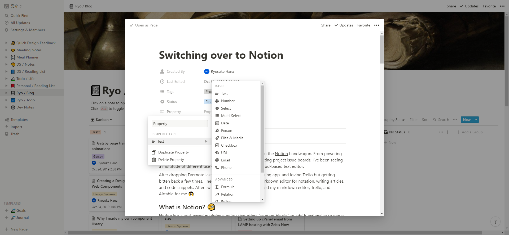
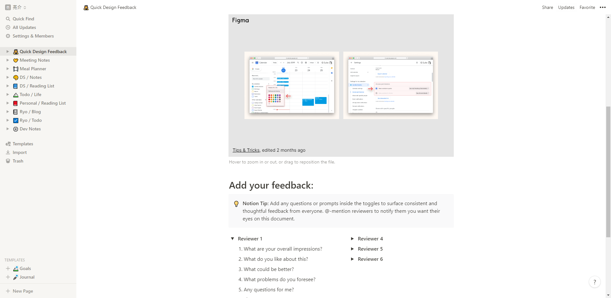
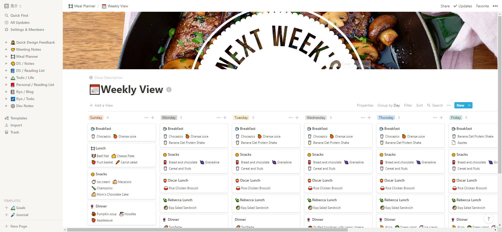
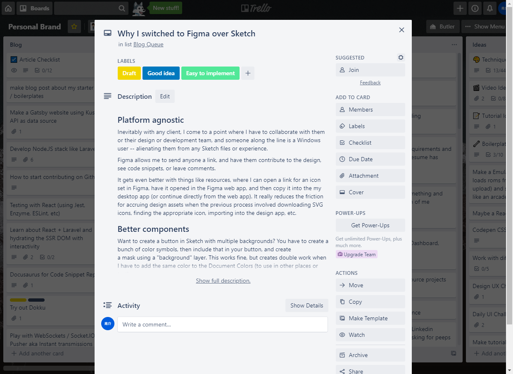

I've noticed a lot of developers and designers jumping on the [Notion](https://www.notion.so/?r=66e798702574451385c95902a7f09d17) bandwagon. From powering their [website's internal wiki and documentation](https://www.notion.so/whoisryosuke/87ac2b52857b44cb9b8ab7bc0039d5be?v=5b7b4feaf759469abc86f844f729d03e), to replacing project issue boards, I've been seeing a multitude of different use cases for the minimalistic cloud-based text editor.

After dropping Evernote last year as my primary note-taking app, and loving Trello but getting bitten back a few times, I needed a new cloud-based Markdown editor for notation, writing articles, and code snippets. After switching to Notion - it's replaced my markdown editor, Trello, and Airtable for me 🙌

## What is Notion? 🧐

[Notion](https://www.notion.so/?r=66e798702574451385c95902a7f09d17) is a cloud-based markdown editor that offers "content blocks" to add functionality to pages. You can create a todo list, a quote, embed a video, or even create a table that acts as a mini-database. It's fairly robust, and has a decent number of integrations that make the blocks indispensable (like embedding Figma designs or Codepen examples inside pages 🤯).

I'd [browse their templates](https://www.notion.so/Notion-Template-Gallery-181e961aeb5c4ee6915307c0dfd5156d) to get inspired and see how other people push Notion to the limit with tables, kanban views, relational databases, and other cool stuff.

## Evernote 👉 Boostnote 👉 Notion

Notion replaced **Boostnote** for me (which replaced **Evernote**). [Boostnote](https://boostnote.io/) is an open source, markdown editor that's basically Evernote without the cloud hosting integration. Instead, you'd save you notes to a local folder, which can be a synced Dropbox folder. This solution worked ok, but I had no web-based or native editor for writing notes on the go (or on a computer that didn't have Boostnote installed). I created [a rough Boostnote PWA](https://codesandbox.io/s/0yq69kvmpv), but since it requires integration with Dropbox, I didn't want to go through the effort of hosting a complete full-stack app with OAuth authentication.

Looking at other cloud-based Markdown editors in the space, the only one that caught my eye was **[Bear](https://bear.app/)**, but I couldn't bring myself to pay for what was essentially Evernote with better UX. Bear's free plan doesn't offer device syncing, unlike Evernote which has a 3 device limit _(and no limit for Notion)._

Switching over to Notion, I'm able to write in the desktop or native iOS app (which works fantastic), or open the web-based version anywhere. My notes are hosted by Notion, synced to each device, and I even get benefits like the "Add to Notion" iOS share widget 👌

## Replaced Trello _(kinda)_

I used Trello for things people shouldn't use it for. I had a couple lists dedicated to blog post ideas _(totally fine)_, and **then I'd draft, edit, and _finalize_** the entire blog post inside the Trello card description (☠️⚰️). I had issues with word count limits, accidentally hitting ESC and losing all my writing, and a myriad of other issues stemming from the fact I was using a todo app for blog authoring. But honestly, these issues permeated my other, more Trello appropriate tasks (such as project management).

I tried using Trello in combination with other note-taking apps (like Boostnote), but I didn't like the disconnect between my labeled Trello cards and my markdown editor. Everything required a level of translation (copy/paste to the Markdown editor), and management required manual syncing between both.

I would still use Trello for larger projects that are integrated with issue-tracking services like Jira or Github. You could use Notion, but the pricing would be more prohibitive, unless you used it for other team purposes as well. But even then, I think about how much I hate Trello card descriptions and losing sensitive data there.

Trello also has a iOS widget for the dashboard, allowing me to quickly create cards with ideas or notes (rather than opening the app, waiting for it to load, finding the list, etc). Notion doesn't offer anything like this yet, so in that regard, Trello is indispensable for recording quick ideas in the appropriate list.

## Replaced **Airtable**

I was considering using Airtable as a more beefy spreadsheet tool for many aspects of planning (from video production, to content calendars, to meal planning). All the features I was looking for in Airtable were achievable in Notion, and I was even able to find templates for things [like Meal Planning on community sites](https://notionpages.com/647/meals-database/).

I always thought about switching over to Airtable to manage my blog posts (using the complex data filtering and alternate views), but **I didn't want to _actually write_ inside Airtable**. Which made Notion the key alternative, combining the kanban functionality of Trello, the calendar views of Trello/Airtable, and the data table views from Airtable — all the features I wanted — all alongside a terrific Markdown-based writing experience.

The larger your files get, Airtable can be a bit slow on desktop and mobile. Notion isn't hyper fast (and chugs with larger files), but feels faster overall.

And the Airtable iOS app is incredibly limited, not allowing you to see any complex table views. With the Notion mobile app, I can browse a table like I normally would on desktop (scrolling horizontally if the columns exceed the width). I felt like my data on Airtable was only valuable on desktop because of this, and Notion unlocked the experience everywhere.

## Notion's Pros and Cons

Despite being fairly happy with my switch over to Notion, I thought I'd share the positive and negative discoveries I've made with the app.

### ⭕️ Notion Pros:

- 🆓 Free plan to get you started.
- 🤑 Simple actions using the app give you free credits which can equate up to 4-5 months of the lowest paid tier. Great incentive to keep using the app despite the limiting free plan, much better than a 15 or 30-day free trial of pro (which companies like Airtable employ).
- 📱 Share widget for Chrome and iOS works great for saving documents. I can save them to specific notes, that can be database-like "reading lists", where I stockpile and even sort/filter/tag the content.
- ⏹ Blocks are a fantastic addition to note-taking process, adding a layer of depth to it that's similar to Airtable or Trello, but inside a modern text editing experience. The ability to create complex tables, or order notes inside of a kanban board, elevates the experience past the ordinary note app.
- ⛓ Version controlled content. It's so nice being able to look at the "Updates" tab on the top right of any page and see a dropdown of all the changes that occurred on a page. It's game-changing going from writing things in Trello or a Markdown editor and having any changes lost forever unless I saved revisions to Notion's git-like versioning.
- 📃 Great templates for getting started, as well as the ability to create your own templates. One namely is a meeting notes template that I can quickly spin up for a structured document with spaces to enter the appropriate notes (observations, action items, etc).
- 🌏 I can make any document public (and even enable comments 🙋‍♀️). I've seen people use this to create personal portfolios or basic homepages, as well as public-facing company documents.
- 🤝 Great collaboration tools. Multiple people can work on the same note at once. I've seen design review documents where spaces are left for reviewers to come in and simultaneously provide feedback (similar to leaving labeled spaces for people on a Google Doc).
- 🔌 Integrations are great. Being able to embed Figma or Invision files is fantastic as a designer who collaborates with other teams. Pasting video links and being able to create "bookmarks" which resemble social media cards, or even straight up YouTube embeds. You can even embed CodePen inside notes, taking dev notes to a whole other level. Looking forward to seeing more.
- ♻ You can import directly from Evernote. I haven't tried this, since my Evernote is so jam packed with garbage (and gold) from the years. I'm concerned it'll import a lot of unstructured content into the UI that I'm just getting the swing of. But cool to know I could 👌

## ❌ Notion's Cons

- 😰 Free plan is limited by "blocks", which can be _each paragraph_ of your note, or _each todo item_ in a list. When you compare that to something like Trello, which allows you to create seemingly unlimited cards and checklists (todos), it seems **_immensely_ limiting**. Thankfully the limitation is nonexistent in any paid plan.
- 🐢 A little on the slow side. The app is slow to load, and frequently will reload the entire app if you leave it for an extended period of time. And if you want to open multiple documents at once, it requires multiple windows, which are different app instances (each loading as intensely as the first — and require reloading equally).
- 📃 iOS app crashes on longer documents. I write long notes because they often include huge chunks of code snippets. I've had Notion crash a few times when working with these files. Not consistently enough to be a bother, but enough to make me consider using more sub-pages in my organizational process.
- 📁 Organization is a little wonky when you want to start to push past simple folder structures. You can create a kind of "master page" that contains sub-pages, which can either contain content (blocks) or more nested pages. That second layer of nested pages can be difficult to setup sometimes, since you can't copy one of Notion's template inside another template. I love things like the Reading List template, and I'd love to create a Master Reading List, with sub-pages that are the Reading List template. Notion I think can accomplish this with a few tables/databases, but it's just not as intuitive compared to their other UX.
- ⌚ No Apple Watch support. Had to use Bear and Todoist instead.
- 📱 No widgets for iOS dashboard for quick note taking. Evernote, Trello, and other apps have a small widget for creating new file types, making it my go-to for one-off ideas.
- 📰 Share widget saves whole document (or not at all if it can't easily detect the content area). Doesn't allow you to save something as just a link, or portion of text. Evernote allows you to select parts of text to save specifically, or only as a link, or even write small notes during the save (for the Chrome version).
- 📡 No API _(yet)_. It's been discussed for years, and if you check the official Notion roadmap it's on the to-do list, so it should be coming soon _~~(maybe).~~_
- 🚫 Exporting Markdown doesn't format correctly. Code blocks are displayed as blockquotes, instead of using the standard triple template literal. Requires me to go through **every article** and **_manually_** wrap code blocks (and add back the code language). Sometimes formatting is just wonky, where I'll bold a sentence that partially has a link inside, and I'll see the `**` artifacts instead of bold (while the actual markdown looks like `/*/*)`.
- ⚫️ Changing to Dark Mode requires a few clicks (go to Sidebar > Settings > Toggle Dark Mode), I wish there was a button in the sidebar or some menu (maybe View on the desktop app?).
- ⏮ Pressing undo while scrolled to a different part of the document doesn't take you back to where you were. If you scroll around and undo, it can be hard to remember/see where you last were. VSCode and other editors jump your cursor to the last undo area, it'd be nice to get this from Notion.

Despite the cons, I've been really satisfied with the Notion experience. It's improved my note-taking and encouraged better organization. It works for daily life and professional use. And the integrations are fantastic, from code snippets to Figma designs, they all fit perfectly into my workflow.

## Hey I'd like to know if, you got the Notion 🚢

It's definitely not for everyone, particularly with how robust and complex it can get, but I feel like it's an easier UI to get around than other apps doing the same.

In this sea of cloud-based applications and services, it's easy to find a solution for any problem. But as I enlarge my scope, my personal capacity is still limited, so having an app that combines the functionality of a few others minimizes the head-space reserved for app-specific UI quirks. And as someone who doesn't have the fattest wallet for a plethora of SaaS apps, it's nice to have an app that replaces a few and cuts back on investment.

**Are you using Notion?** What do you use it for, and how has it changed the way you approach note-taking or documentation? Would love to hear your opinion on Twitter or in the comments! 👍

> Full disclosure: This article does feature an affiliate link for Notion. I am not sponsored by Notion, but signing up with my link gives me $5 free credit, as well as gives you $10 free credit (on top of all the other free credits I discussed earlier). Meaning **you get 2 free months** for using my link vs not 👍

## References

- [Notion](https://www.notion.so/?r=66e798702574451385c95902a7f09d17)
- [CSS Tricks: How I’ve Been Using Notion Personally and Professionally](https://css-tricks.com/how-ive-been-using-notion-personally-and-professionally/)
- [Notion Pages - Community sources templates](https://notionpages.com)
- [Boostnote](https://boostnote.io/)
