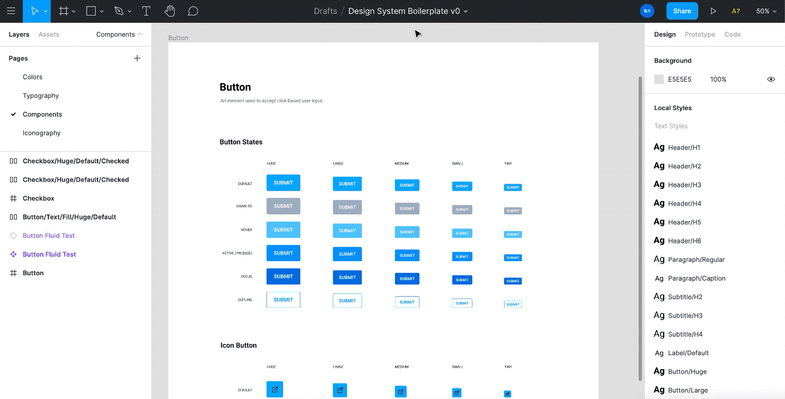

As I've been creating new design systems with CSS in JS libraries like Styled Components or Emotion, I've found myself repeatedly having to translate design tokens from Figma into a JSON-based theme for code. I'll put together an entire design system inside Figma, then have to spend hours copying the design tokens over into a structured theme object. Then if I update the design tokens in the theme code, I have to synchronize any changes with the Figma document — all manually.

Since Figma opened up it's API to plugin developers, I thought this would be a good opportunity to learn the Figma API and create a tool to expedite the conversion of design tokens between Figma and CSS in JS libraries.

I created a Figma plugin called **Styled Theme Generator** that converts Figma color and text styles into a CSS in JS theme, or vice versa, importing a theme and generating Figma styles. I'll go over the process and what I discovered creating this plugin.



Check out [the source code here](https://github.com/whoisryosuke/styled-theme-generator), or keep reading to learn more!

# Using the plugin

Before we dive deep into the why or how behind the plugin, let's see how to use it.

1. Download or clone [the plugin's git repo](https://github.com/whoisryosuke/styled-theme-generator)
2. Go to Figma Plugins settings and add a new plugin using the `manifest.json`
3. Create a new or open an existing Figma document with styles
4. Run the plugin (Plugins > Development > styled-theme-generator)
5. The plugin window will popup. There are two sections where you can either convert the document's Figma styles to JSON, or import a JSON theme to generate Figma styles.

Try importing this sample JSON theme to populate the document with color styles:

```jsx
{
	"colors": {
		"white": "#FFFFFF",
		"black": "#000000"
	}
}
```

Then edit one of the colors, and convert the styles back to JSON.

Much better than the manual way right? 🏎💨

# How does it work?

The plugin uses the Figma API to read, create, and edit styles. The API is provided to plugins by Figma through a `figma` variable, where you can run methods like `getLocalTextStyles` to get all the document's text styles.

I generate or parse a JS object by stringifying or parsing an object to JSON. The JSON should follow a certain theme specification (see below), making the import/parsing process easier.

## 📦 Figma plugin setup

I used the UI starter project from Figma's [plugin tutorial](https://www.notion.so/whoisryosuke/Figma-plugin-that-converts-styles-into-theme-js-e0225bc46ad64fe8806ea4cd7f418854#b59647f6a3d74e78b71742fc9eadc4f3), generated from the "New Plugin" menu. I styled the app using [figma-plugin-ds](https://github.com/thomas-lowry/figma-plugin-ds), a library by Thomas Lowry that replicates the look and feel of Figma UI (and provides some helpful utility classes).

## 🏗 Theme Structure

The theme specification is [System UI](https://system-ui.com/theme), which is used by libraries such as Styled System or xStyled, and component libraries such as Chakra UI or Theme UI. I'm also using [the variant API](https://styled-system.com/variants) from Styled System to create grouped text styles.

Here's an example of the theme structure we'll be working with:

```tsx
export const theme = {
  colors: {
    text: "#111212",
    background: "#fff",
    primary: "#005CDD",
    secondary: "#6D59F0",
    muted: "#f6f6f9",
    gray: "#D3D7DA",
    highlight: "hsla(205, 100%, 40%, 0.125)",
    white: "#FFF",
    black: "#111212",
  },

  gradients: {
    subtle: `linear-gradient(180deg, ${colors.primary} 0%, ${colors.secondary} 100%)`,
    purple: `linear-gradient(180deg, ${colors.primary} 0%, #A000C4 100%)`,
    blue: `linear-gradient(180deg, #00D2FF 0%, ${colors.secondary} 100%)`,
  },

  // Typography
  fonts: {
    body: "Roboto, Helvetiva Neue, Helvetica, Aria, sans-serif",
    heading: "Archivo, Helvetiva Neue, Helvetica, Aria, sans-serif",
    monospace: "Menlo, monospace",
  },
  fontSizes: [12, 14, 16, 20, 24, 32, 48, 64, 96],
  fontWeights: {
    body: 400,
    heading: 500,
    bold: 700,
  },
  lineHeights: {
    body: 1.5,
    heading: 1.25,
  },

  // Text Variants
  text: {
    h1: {
      fontFamily: fonts.heading,
      lineHeight: "1.25",
      fontSize: [6, 6, 6, 6],
      marginBottom: 3,
    },

};

export default theme;
```

The theme structure has a `colors` property that is a hash map of each color token (`colors: { white: "#FFF" }`). This allows us to loop over it when importing, or mapping one out while looping through the document's colors.

For text styles, we'd have to use a few properties in the theme structure, from `fontSize` to `fonts` to `text`. The `fontSize` would be an array of integers that represent the entire font scale, easily generated with a de-duped array. The `fonts` property is a hash map, similar to the colors, where each font choice is a property (usually semantically named like `body` or `header`).

Where the work really happens is the `text` property. Here is where we can store text "variants", or groups of CSS properties, that can be quickly applied to components through a `variant` prop. This allows `<Heading variant="h1">` to style the component with a `h1` styling (which could be a larger font size, bold font weight, etc).

While looping over the text styles to create the `text` property, we'd import/generate the corresponding `fontSize` and `fonts` properties. We can also associate the two thanks to Styled Systems "magic" theme getters inside certain theme properties (like variants). This lets you write things like `fontFamily: "body"` and it picks up the `body` property from the `theme.fonts` property. Thanks to this we can generate the JSON much easier, without having to actually use an AST to associate the variables.

## 📖 Getting text styles

### Reading from Figma

Text styles are available by running the `getLocalTextStyles` method on the `figma` plugin class. This returns an array of [TextStyle](https://www.figma.com/plugin-docs/api/TextStyle/) objects. These objects contain a `name` property which is the name you set in the UI.

If you use a **nested structure** for styles (like `Header/H1` and `Header/H2`) the names look just like that - `/` separated. You might assume since the styles nest, they'd be represented by an array of similar styles (like all the `Header` styles in a "grouped" array, in the root array returned by `getLocalTextStyles`). But they don't, it's a **flat array**, so you have to parse the name and ensure you check for the separator.

```jsx
// This shows the HTML page in "ui.html".
figma.showUI(__html__);

figma.ui.onmessage = (msg) => {
  if (msg.type === "generate-styles") {
    // Get text styles to generate text variants
    const textStyles = figma.getLocalTextStyles();

    const textVariants = textStyles.map(
      ({
        id,
        name,
        fontName,
        fontSize,
        letterSpacing,
        lineHeight,
        textCase,
        textDecoration,
      }) => ({
        name,
        fontFamily: fontName!.family,
        fontWeight: fontName.style
        fontSize,
        letterSpacing,
        lineHeight,
        textCase,
        textDecoration,
      })
    );

		console.log('text styles', textVariants)
  }

  figma.closePlugin();
};
```

Gives you an object like:

```jsx
;[
  {
    name: 'Header',
    fontFamily: 'Roboto',
    fontWeight: 'Regular',
    fontSize: 24,
    letterSpacing: { unit: 'PERCENT', value: 0 },
    lineHeight: { unit: 'AUTO' },
    textCase: 'ORIGINAL',
    textDecoration: 'NONE',
  },
  {
    name: 'Paragraph',
    fontFamily: 'Roboto',
    fontWeight: 'Regular',
    fontSize: 12,
    letterSpacing: { unit: 'PERCENT', value: 0 },
    lineHeight: { unit: 'AUTO' },
    textCase: 'ORIGINAL',
    textDecoration: 'NONE',
  },
]
```

### Extracting font sizes

A theme file depends on a font size scale that’s often an array value of integers (`const fontSizes = [8,16,24,32,40,48]`). To make a proper theme file we have to associate the pixel based font size values (from Figma) to the integer based array.

We have to loop through the text styles and build a font size array, which should be easy during the initial parse. Then we can parse over the generated theme file and replace any pixel values with the reference to the font size array.

```tsx
// Get text styles to generate text variants
const textStyles = figma.getLocalTextStyles()

// Parse font sizes
// Create array of font sizes and sort numerically by least to most
const fontSizesWithDupes = textStyles
  .map(({ fontSize }) => fontSize)
  .sort((a, b) => a - b)
// Remove dupes
const fontSizes = fontSizesWithDupes.filter(
  (item, index) => fontSizesWithDupes.indexOf(item) == index
)
```

This can also be done for other similar values, like font families, weights, etc. Except these are stored as a **hash map**, not an array. This is accomplished my using the array's `reduce` method to map it to an empty object:

```tsx
// Parse font families
// Create array of font sizes and sort numerically by least to most
const fontFamilies = textStyles
  .map(({ fontName }) => fontName!.family)
  .sort()
  .reduce((map, obj) => {
    map[obj.toLowerCase()] = obj
    return map
  }, {})
```

Note here that we just take the font name and use it as the object key (or property). I debated over this implementation, whether or note to try and generate semantic naming conventions (like header vs body font), but I opted to just use the font name. It allows developers to go into the theme and more easily find and replace the property with a semantic name. This seemed better than alternatives, like creating an array and accessing fonts using `fonts[2]`.

### Handling variants

For the variants, or the `text` property of the theme, we just had to loop over the same Figma text styles we generated fonts and font sizing with. Here are some key notes:

- **Variants are not nested in the theme file.** This means despite text styles being nested in Figma, they should not nest in the theme file (e.g. "Paragraph/Body" should **not** become `paragraph: { body : {} }`). If a variant is based off another variant (like the bold version of a font style only needing to change the bold property), you're supposed to "extend" from another variants (rather than nesting).
- **Font sizing and fonts** should relate to the `fontSizes` and `fonts` variables we generated using "magic" syntax (integers for font sizing or string of fonts property name).
- **Slashes aren't uses for JS object property names.** They can be, but it's not a common practice. When parsing the text style name from Figma, if it contains slashes, we have to convert to a different symbol (like a dot or slash).

For example `Paragraph/Body` becomes `paragraph-body`, so it looks like `<Text variant="paragraph-body">`. Since this is a very opinionated decision, there should be a dropdown or input that allows users to select different choices.

It's also difficult to do this when importing, since theme files probably won't follow this convention much, so imports will likely get grouped by the associated component (which still is sketchy, since variants can be used across multiple components).

Now that I had a better idea of how to handle implementation, I tried a couple different versions.

### Dot Separated version

I created this first as an experimental solution to the nested styling issue.

```jsx
const textVariants = textStyles
      .map(
        ({
          name,
          fontName,
          fontSize,
          letterSpacing,
          lineHeight,
          textCase,
          textDecoration,
        }) => ({
          name,
          fontFamily: `${fontName!.family}`,
          fontWeight: `${fontName.style}`,
          fontSize,
          letterSpacing,
          lineHeight,
          textCase,
          textDecoration,
        })
      )
      .reduce((map, obj) => {
        map[obj.name.replace("/", ".").toLowerCase()] = obj;
        return map;
      }, {});
```

But once I refreshed myself on the latest version of the Styled System API, they actually changed the way they handle variants from a theme-level to component-level. This means that it's more encouraged to have different types of variants, rather than sharing them across all components.

Because of this change, it seems like a nested object would be a good idea, since it could allow developers to take grouped styles (like all `Header/H1` `Header/H2` etc) and add them to a `<Heading>` component. More modular than having all components with access to dot/dash separated versions (e.g. `<Text variant="heading.h2">`).

### Nested object version

With this version we need to loop over the text styles, grab each style name, and use `split` to separate the name by the `/`. Then we take the array of "name chunks" and use reduce to map it into an object. But to do this, we also use a recursive function to walk through the object, get to the most deeply nested property, and add the next property there. This lets us take something like `Paragraph/Body` and convert it to `textVariants: { paragraph: { body: {} } }`.

You can see a breakdown of the recursive `walkObject` function down below.

```jsx
// Parse text variants
let textVariants = {};
textStyles.map(
  ({
    name,
    fontName,
    fontSize,
    letterSpacing,
    lineHeight,
    textCase,
    textDecoration,
  }) => {
    // Parse name from Figma slash `/` to object `.`
    let filteredName = name;
    if (flagLowercaseNames) filteredName = filteredName.toLowerCase();
    const nameArray = filteredName.split("/");

    const textNameReducer = (accumulator, currentValue, index) => {
      if (index == nameArray.length) {
        return walkObject(accumulator, "");
      }
      return walkObject(accumulator, currentValue, true);
    };
    let textObject: object = nameArray.reduce(textNameReducer, {});

    const textVariant = {
      fontFamily: `${fontName!.family}`,
      fontWeight: `${fontName.style}`,
      fontSize: getFontSize(fontSize),
      letterSpacing,
      lineHeight,
      textCase,
      textDecoration,
    };

    textObject = walkObject(textObject, textVariant);
    textVariants = merge(textVariants, textObject);
  }
);
```

I ended up staying with the nested object version, but as I sit on it longer, I honestly want to learn more towards the dot syntax. It's much easier and faster on the code generation end — and it's easier and fast on the developer end (allowing them to copy and go — rather than manually parsing out variants into appropriate components). Especially since it's only text styles, you'd basically only have 1-3 components these variants would apply to (Box, Text, maybe a Heading?).

## 🎨 Getting colors styles

Based on the [PaintStyle](https://www.figma.com/plugin-docs/api/PaintStyle/) and [Paint](https://www.figma.com/plugin-docs/api/Paint/) types. They can be accessed using the `getLocalPaintStyles` method, which returns an array of `PaintStyle` objects.

```jsx
// Get colors
const colors = figma.getLocalPaintStyles()

colors.map(({ paints, type, remote, name }) =>
  console.log(JSON.stringify({ paints, type, remote, name }))
)
```

Gives you something like:

```jsx
{
        paints: [
          {
            type: "SOLID",
            visible: true,
            opacity: 1,
            blendMode: "NORMAL",
            color: {
              r: 0.7686274647712708,
              g: 0.7686274647712708,
              b: 0.7686274647712708,
            },
          },
        ],
        type: "PAINT",
        remote: false,
        name: "Gray",
      }
```

### Handling types

As you can see above, the objects in the `paints` array have a `type` property. This lets you know if the color is a solid or gradient. We can check this by using a short function that uses Typescript to compare the type to an associated enum (like a hash map):

```tsx
/**
 * Describes a Figma paint type retrieved from the Figma API.
 * @ignore
 */
const enum FigmaPaintType {
  Solid = 'SOLID',
  GradientLinear = 'GRADIENT_LINEAR',
}

const isFigmaLinearGradient = (paint: FigmaPaint): paint is GradientPaint => {
  return paint.type === FigmaPaintType.GradientLinear
}

const isFigmaSolid = (paint: FigmaPaint): paint is SolidPaint => {
  return paint.type === FigmaPaintType.Solid
}

if (isFigmaSolid(paint)) {
}
if (isFigmaLinearGradient(paint)) {
}
```

I originally found this code in [the Diez CLI codebase](https://github.com/diez/diez/blob/7c224a3cb8d66262191da3aef12a1a4144bc39bc/src/extractors/extractors/src/extractors/figma.ts), but they were using their own custom Figma typings (since it was developed prior to Figma's official Typescript typing). I touched up the code and ensured it uses the official Figma types instead.

### Converting Figma format to CSS RGBA/HEX/HSL

Figma colors are in RGB format, but they're stored as a value from 0 to 1, instead of 0 to 255 like standard RGB format. This means the Figma color value needs to be converted:

```jsx
const { r, g, b } = paint.color
let newColor = `rgba (${Math.round(r * 255)}, ${Math.round(
  g * 255
)}, ${Math.round(b * 255)}, ${paint.opacity})`
```

Which is then easily used with libraries like TinyColor:

```jsx
newColor = Color(newColor).toHexString()
// Gives HEX version of color

newColor = Color(newColor).toRgbString()
// Gives RGBA version of color

newColor = Color(newColor).toHslString()
// Gives HSL version of color
```

I created a switch statement in the color parsing method to handle these different conversions. Ideally down the line, I can add an input to the UI that allows users to select what color format they prefer. For now though, I set hex as a default.

## Handling separators / nested styles

Often styles and colors are organized in a nested object structure, such as:

```jsx
const theme = {
	textVariants: {
		h1: {
			fontFamily: "Roboto",
		}
	}
	colors: {
		brand: {
			primary: "blue",
			secondary: "purple"
		}
	}
```

It's important to take Figma styles that feature separators (like `Header/H1`) and break them out into nested objects. We can do this using the `split()` method on the `String` prototype:

```jsx
const colorArray = name.split('/')
```

Now we have an array of name "pieces" that we need to convert into a nested object, where each property name is a segment of our name. It should look like this:

```jsx
const obj = {
  Header: {
    H1: '',
  },
}
```

This function needs to be recursive, meaning it will run itself repeatedly until a certain condition is met. In this case, we loop through the object's parameters (using `Object.keys()`) and see if the parameter is an object. If so, we run the function again.

We also need to set the value of the deeply nested object. So while we're traversing deep down into the object, we need to check if it's the last portion of the style name. If it's the last one, you set the parameter to a value passed to the function. This way it recursively loops through until there's no more array elements (or name segments). We check for the last array element using a reducer, instead of the actual "object walking" function, to separate the logic (since it requires knowledge of the original array, which the "object walking" function won't have).

```jsx
/**
 * Loops through a nested object to set the last objects param or value
 *
 * @param obj
 * @param newValue
 * @param isKey
 */
function walkObject(obj: object, newValue: string, isKey: boolean = false) {
  const keys = Object.keys(obj)

  // If it's the top level, create first param
  if (keys.length === 0) {
    obj[newValue] = {}
  }

  // Loop through objects parameters
  keys.forEach(function (key, i) {
    // Only do the first for perf reasons
    if (i === 0) {
      let value = obj[key]

      // If it's an object, recursively run again
      const nestedKeys = Object.keys(value)
      if (typeof value === 'object' && nestedKeys.length > 0) {
        walkObject(value, newValue, isKey)
      } else {
        // Set param or value of nested object
        if (isKey) {
          obj[key][newValue] = {}
        } else {
          obj[key] = newValue
        }
      }
    }
  })

  return obj
}
```

The reducer:

```jsx
const colorNameReducer = (accumulator, currentValue, index) => {
  if (index == colorArray.length) {
    return walkObject(accumulator, '')
  }
  console.log('creating param', accumulator, currentValue)
  return walkObject(accumulator, currentValue, true)
}
let colorObject = colorArray.reduce(colorNameReducer, {})
```

The array's reducer accepts an empty object, which allows you to create a new object as the basis for the reducing. We use that empty object as an `accumulator`, which runs the "object walking" function.

This returns an object for each color that looks like this:

```jsx
{
	"Black": "#000",
}

// Or for nested
{
	"Brand": {
		"Primary": "blue",
	}
}
```

This then can be combined later:

```jsx
let finalColors = {}

// loop here

finalColors = { ...finalColors, colorObject }
```

### Shallow vs deep merging

The big issue here is that the data is "**shallow merged**". This means that if you have any nested objects, like the `Brand.Primary` above, you'll lose it if you merge another object with a similar structure (like `Brand.Secondary`).

The first instinct is to use the `finalColors` object as the basis for the reducer, instead of an empty object. The issue here is that the reducer is designed to go through the object to the last property, and only the first property of each function (for performance reasons).

Instead, we can utility a **deep merge** function to safely merge the multiple objects without data loss.

But in order to enable this, I have to change the setup of my Figma plugin.Because I use one of the basic Figma plugin templates that are provided in the documentation / getting started page, I'm not able to use JS modules (local .JS files with `export` or NPM files).

You get the following error, which took me a while to figure out was this issue:

```jsx
Error: Syntax error on line 1: Unexpected token
    at runPluginCodeInternal (figma_app.184c709c00d0e7d1014eeb96b8405934.min.js:900)
    at /file/rMHyOhwndcGNtvaJdZvodR/async https:/www.figma.com/figbuild/symlinks/figma_app.184c709c00d0e7d1014eeb96b8405934.min.js:900
```

Had to downgrade a dependency to get Webpack working as Figma docs specified. See [the issue here on Github](https://www.notion.so/whoisryosuke/Importing-CSS-in-JS-themes-into-Figma-and-vice-versa-2cb9c55c6e474ee8bd67295f946a84e4#067f97eb2b67424892494b12ef19e453). `"html-webpack-plugin": "3.2.0",`

Also had issues with deepmerge and Typescript too. Couldn't import for some reason, TS kept giving error about module missing types (despite having types). Checking the issues, seems Webpack was a BIG issue:

- [https://github.com/TehShrike/deepmerge/issues/137](https://github.com/TehShrike/deepmerge/issues/137)
- [https://github.com/webpack/webpack/issues/6584](https://github.com/webpack/webpack/issues/6584)
- [https://github.com/TehShrike/deepmerge/pull/124](https://github.com/TehShrike/deepmerge/pull/124)
- [https://github.com/TehShrike/deepmerge/issues/87](https://github.com/TehShrike/deepmerge/issues/87)

So instead, I copied the module the into my project into a `utils` folder and adapted the module to the import/export syntax. This worked way better with Webpack. And luckily, I'm not too concerned with having to update the module, since it's one of those NPM libraries that are kinda "done" and rarely updated anymore.

I also added `esModuleInterop` as `true` to `tsconfig.json`:

```jsx
{
  "compilerOptions": {
    "target": "es6",
    "typeRoots": ["./node_modules/@types", "./node_modules/@figma"],
    "esModuleInterop": true
  }
}
```

## ⬇️ Importing themes


Once I figured out the process of reading from Figma's text and color styles, I moved into the import process. I added a `<textarea>` input to the plugin's UI code where user's can paste a JSON object of their theme.

```tsx
<div class="section-title">Import</div>
  <div id="msg" class="hidden row mb-xsmall">
    <div class="icon icon--warning-large icon--red"></div>
    <div id="msg-text" class="type type--small ml-xsmall"></div>
  </div>
  <button id="generate" class="button button--secondary">
    Import Figma styles from theme JSON 👇
  </button>
  <div class="section-title">Theme JSON</div>
  <div class="input">
    <textarea id="theme" class="textarea" rows="2"></textarea>
  </div>
```

This is sent to the "backend" plugin code, which parse the theme into Figma styles. We also do a check to see if no theme is provided, and inform the user with an error message.

```tsx
document.getElementById('generate').onclick = () => {
  // Clear errors
  const errorBox = document.getElementById('msg')
  errorBox.classList.remove('flex')
  errorBox.classList.add('hidden')

  const textbox = document.getElementById('theme')

  // Check if theme is empty before sending
  if (textbox.innerHTML !== '') {
    parent.postMessage(
      { pluginMessage: { type: 'generate', theme: textbox.innerHTML } },
      '*'
    )
  } else {
    const errorBox = document.getElementById('msg')
    errorBox.classList.remove('hidden')
    errorBox.classList.add('flex')
    const errorText = document.getElementById('msg-text')
    errorText.innerHTML =
      'No theme found. Please copy your theme inside the text box.'
  }
}
```

In the backend code we can access this by using the `theme` prop on the `msg` object Figma (a kind of "response" from the input/frontend).

```tsx
figma.ui.onmessage = async (msg) => {
  if (msg.type === 'generate') {
    const theme = JSON.parse(msg.theme)
    console.log('the theme', theme)
  }
}
```

Since we already know the theme structure, we can loop over the arrays and hash maps accordingly. Here's an example of the text styles importer:

```tsx
// Get existing document styles to check later
const localTextStyles = figma.getLocalTextStyles()

// Loop through text styles
// Note that this is an async function
Object.keys(theme.text)?.map(async (name) => {
  const themeFont = theme.text[name]
  // See if name exists in document styles
  const localStyle = localTextStyles.find(
    ({ name: localName }) => localName === name
  )
  // Use existing style or create new one
  const textStyle = localStyle || figma.createTextStyle()

  // Prepare the fontName object
  const fontName = {
    family: theme.fonts[themeFont.fontFamily],
    style: themeFont.fontStyle ? themeFont.fontStyle : 'Regular',
  }

  // Update/mutate the text style's properties
  textStyle.name = name
  // Load font before you apply the property
  // You must await or Figma will not apply the font proper
  await figma.loadFontAsync(fontName)
  textStyle.fontName = fontName
  textStyle.fontSize = themeFont.fontSize
  textStyle.letterSpacing = themeFont.letterSpacing
  textStyle.lineHeight = themeFont.lineHeight
  textStyle.textCase = themeFont.textTransform
  textStyle.textDecoration = themeFont.textDecoration
  console.log('text style', textStyle)
})
```

It took me a minute to figure out how to create Figma styles. The official documentation lists the method `createTextStyle()`, but doesn't tell you what to do with it. I tried to pass the font object to it and it kicked back with some errors. Then I tried just running the function by itself and a blank style appeared in Figma's sidebar (no name, no properties). I finally figured out that you create this text style and just mutate it's properties, very similar to creating an element with JS and using the element reference to change it's attributes/innerHTML.

Similarly, I tried setting the font name and calling it a day (since I was using Roboto, a font I know I had on my computer). Figma kicked back with a very informative error stating I needed to load the font first. Looking this up, I found that I had to `await` the `loadFontAsync` method before applying the property. This worked great.

If you're looking for a cleaner functional representation of this code, I'd check out [the figma-markdown-parser plugin](https://github.com/vqoph/figma-markdown-parser/blob/945704091b0e5235f180a3c7f0ff832c24a331e2/src/plugin/lib/createTextStyles.ts) or [figma-theme-ui](https://github.com/LekoArts/figma-theme-ui).

# Concluding thoughts

It's been interesting to approach design systems from the perspective of code generation. I'm forced to think about every use case, which starts to outline best practices.

When you work on multiple design systems you can better grasp the necessary scope of a base system. Things that seemed "semantic" and "logical" in one system quickly become "bottlenecks" and "limitations" in another.

It's also been cool to dream about how to push this technology even farther to create better integrations.

## Structuring properties

For example, I'm using System UI (aka Styled System) as the basis for the theme structure. For **font weight**, they use **semantic naming** (body vs header weights). In a some systems, this doesn't make sense, since a header font may share the same weight as a body font.

Instead, weights should be a scale from thin to thick, separating the property from implementation details: `fontWeights = [ 300, 400, 700 ]`

Or if you want to retain semantic naming conventions, you should lean towards naming that describes the property - not where it exists: `fontWeights = [ thin: 300, regular: 400, bold: 700 ]`

## Handling components

I've been able to scope other ideas as I've dug into the Figma API, one of them being components. How would you parse through Figma or React components and generate the other?

This is really difficult on a design and Figma end. **Design does not equal code.** As a designer, we often have to do things that may not make sense in the scope of the DOM because we're working within the design system's paradigm. As I've observed a multitude of UI kits for design systems in Figma, the structures for components differ dramatically. Some components use auto layout, some contain extra "sizing" components to handle padding, others may be more Sketch-like and have multiple layers for things like background/state/etc.

What I have been interested in exploring is auto layout components and extracting these into code in various ways.

First and foremost, I'd want to take the padding and margin from the auto layout and add them to the `spacing` theme property. This would populate a theme with all the standard spacing values (ideally following some scale like `4, 8, 16, 32`).

I'd also be interested in taking simpler components that only use 1 auto layout layer (usually the component frame itself) and try to generate a React component based on this. We'd have access to padding/margin from auto layout, as well as text and color styles. And all these can be associated with theme values once the document is completely parsed (much like relating text styles to design tokens above using Styled System's "magic" syntax). I could picture components looking like:

```tsx
<Box
  variant="heading.h1"
  sx={{
    color: 'primary',
    m: 2,
    px: 3,
  }}
>
  Component text
</Box>
```

### Component variations

Taking the last example a step further, assuming we can get the `variant` and `sx` properties of each Figma component, we should be able to generate component-level variations. You could parse components, take each slash (`/`) separated name and create different variations. So if you had `Button/Disabled` vs `Button/Hovered` it'd combine the two sets of variants (`disabled` and `hovered`) into a `button` object. This could be used inside the component create all the various variants.

It gets a little more complex, since components in Figma are often sorted in deeply nested groups. You'll more likely see a component look like `Button/Text/Large/Disabled` and `Button/Icon/Small/Hovered`. Here our component hierarchy branches first from icon vs text to a sizing scale, then to component state. Ideally we'd want to create a variant for each one. Component states would be their own variant (`state`), sizing would be another (`size`), and one for `type` . The only issue here is that when we process each of these components, we'll have duplicate styles from other variants, since each component will be a mix of multiple variants. To figure out what values are shared across each group, you could store each component in a group array (like `const largeComponent = [ styles1, component2 ]`) Then take these arrays and compare a couple (or all?) to what properties are duplicated and then store these as the variant. Takes a bit of processing, especially if a document has a lot of components, but seems doable.

# Get converting!

I hope this helps you expedite your workflow with CSS in JS themes and eliminate more translation between your design and developer teams! If you have any issues feel free to [open one on Github](https://github.com/whoisryosuke/styled-theme-generator/issues/new) or [hit me up on Twitter](https://twitter.com/whoisryosuke) with any questions. I'm still working on a few kinks and features, so I wouldn't suggest using this in production yet.

# References

- [https://github.com/whoisryosuke/styled-theme-generator](https://github.com/whoisryosuke/styled-theme-generator)
- [https://www.figma.com/file/rMHyOhwndcGNtvaJdZvodR/Styled-Theme-Generator-Test-File?node-id=0%3A1](https://www.figma.com/file/rMHyOhwndcGNtvaJdZvodR/Styled-Theme-Generator-Test-File?node-id=0%3A1)
- [https://www.figma.com/plugin-docs/setup/](https://www.figma.com/plugin-docs/setup/)
- [https://www.figma.com/plugin-docs/api/figma/](https://www.figma.com/plugin-docs/api/figma/)
- [https://www.figma.com/plugin-docs/api/PaintStyle/](https://www.figma.com/plugin-docs/api/PaintStyle/)
- [https://www.figma.com/plugin-docs/api/TextStyle/](https://www.figma.com/plugin-docs/api/TextStyle/)
- [https://github.com/figma/plugin-samples/](https://github.com/figma/plugin-samples/)
  - Github repo with official Figma plugin templates
  - [Webpack Plugin Template (for plugins with multiple JS files)](https://github.com/figma/plugin-samples/tree/master/webpack)
  - [https://www.figma.com/plugin-docs/bundling-webpack/](https://www.figma.com/plugin-docs/bundling-webpack/)
- [https://rsms.me/figplug/](https://rsms.me/figplug/)
- [https://github.com/nirsky/figma-plugin-react-template](https://github.com/nirsky/figma-plugin-react-template)
- [https://www.npmjs.com/package/@mattdesl/fika](https://www.npmjs.com/package/@mattdesl/fika)
- [https://github.com/yuanqing/create-figma-plugin](https://github.com/yuanqing/create-figma-plugin)
- [https://varun.ca/figma-plugins/](https://varun.ca/figma-plugins/)
- [https://github.com/thomas-lowry/figma-plugins-on-github](https://github.com/thomas-lowry/figma-plugins-on-github)
- [https://diez.org/getting-started/figma.html](https://diez.org/getting-started/figma.html)
- [https://github.com/diez/diez/blob/7c224a3cb8d66262191da3aef12a1a4144bc39bc/src/extractors/extractors/src/extractors/figma.ts](https://github.com/diez/diez/blob/7c224a3cb8d66262191da3aef12a1a4144bc39bc/src/extractors/extractors/src/extractors/figma.ts)
  - Wanted to use the typing here, but just ended up using `@figma/plugin-typings` instead. The `index.d.ts` file there had equivalents of everything like `FigmaVector` vs `Vector` . Kept enums for evaluating type equivalents (like determining if a color is fill or gradient).
- [https://github.com/thomas-lowry/figma-plugin-ds](https://github.com/thomas-lowry/figma-plugin-ds)
  - Design system for Figma plugins. CSS framework with classes for common components (button, input, labels, etc) and utility styles (like `pt-xsmall` for padding the top a small amount).
- [https://twitter.com/hihayk/status/1280218024432357378?s=21](https://twitter.com/hihayk/status/1280218024432357378?s=21)
  - Make app like this and then import the theme to Figma
- [https://github.com/TehShrike/deepmerge](https://github.com/TehShrike/deepmerge)
- [https://stackoverflow.com/questions/56000286/create-nested-object-from-array-of-objects-in-javascript](https://stackoverflow.com/questions/56000286/create-nested-object-from-array-of-objects-in-javascript)
- [https://developer.mozilla.org/en-US/docs/Web/JavaScript/Reference/Global_Objects/Array/reduce](https://developer.mozilla.org/en-US/docs/Web/JavaScript/Reference/Global_Objects/Array/reduce)
- [https://jsfiddle.net/6jpyuvo7/40/](https://jsfiddle.net/6jpyuvo7/40/)
  - Example of recursive nested object creation from an array of strings
- [https://system-ui.com/theme/](https://system-ui.com/theme/)
  - Standard theme structure used by Styled System and other component libraries that use it (like Chakra UI, Rebass, etc).
- [https://gist.github.com/whoisryosuke/7a035953003bd75e389290bae7e11ae4](https://gist.github.com/whoisryosuke/7a035953003bd75e389290bae7e11ae4)
  - Theme structure from my blog
- [https://gist.github.com/whoisryosuke/91b21920ad406dc6e1e4446f94ad2cde](https://gist.github.com/whoisryosuke/91b21920ad406dc6e1e4446f94ad2cde)
  - Unified theme object / theme structure adapted from my blog
- [https://github.com/vqoph/figma-markdown-parser/blob/945704091b0e5235f180a3c7f0ff832c24a331e2/src/plugin/lib/createTextStyles.ts](https://github.com/vqoph/figma-markdown-parser/blob/945704091b0e5235f180a3c7f0ff832c24a331e2/src/plugin/lib/createTextStyles.ts)
  - How to handle creating Figma styles programmatically
- [https://github.com/LekoArts/figma-theme-ui](https://github.com/LekoArts/figma-theme-ui)
  - Plugin that imports and converts theme files into Figma styles
