I've recently been on a big [Notion](https://www.notion.so/?r=66e798702574451385c95902a7f09d17) kick recently, spending a lot of time [watching videos on Notion](https://www.youtube.com/channel/UCoSvlWS5XcwaSzIcbuJ-Ysg) and re-organizing my pages. It's been inspirational to see the various ways other people have structured their data. Once I realized that Notion has a similar potential to Airtable, I also dug deep [into their community and templates](https://airtable.com/templates) to find more inspiration on more advanced relational database structures.

I thought I'd share the structures of some of my Notion pages and how I manage many aspects of my personal and professional life using the app. Here are the types of content we'll be covering:

- Blog
- Todo
- Personal Porfolio
- Meal Planner
- Recipes
- Social Media Management
- Project Management
- Reading Lists
- Notes
- Work Expenses
- Cloud Storage

Let's get right into the Notion!

# How I structure content

I have four primary pages that house most of my notes. This allows me to share the Life page (as well as everything in it) with my wife, as well as create a bit of separation between parts of my life. Here are the four pages:

- The **Life** page houses things like my Recipes or Shopping List.

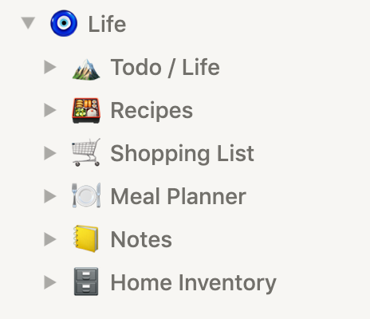

- The **Ryo** page houses my personal brand and business development.

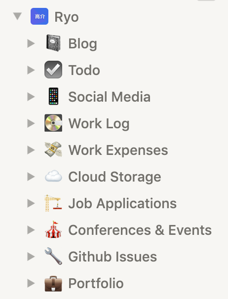

- The **Notes** page houses different types of notes I take, from development to design systems.

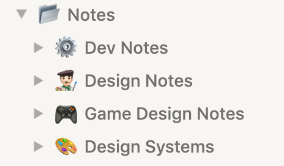

- The **Projects** page houses exactly that - projects I work on and notes about them.

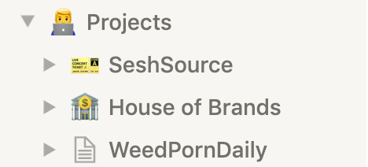

I'll break down how I use and structure some of the key pages you see listed.

## Blog

This one is probably the most simple. It's a page that's a "Table", or database. I use the Kanban view and sort it by the article's status (drafts, published, etc). I have a separate "List" view that acts as an archive for all publish posts, and a "Calendar" view where I can see on what days I actually published (or plan to publish) my blog posts.

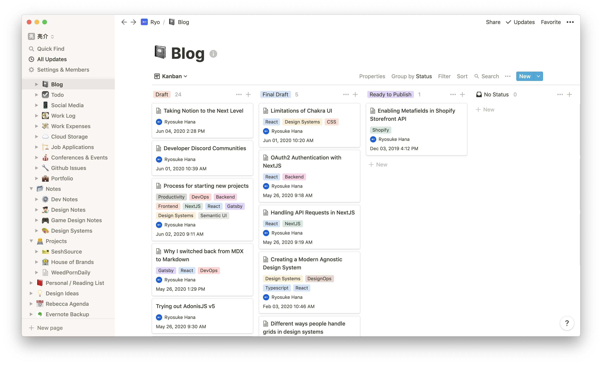

I write articles, tag them their current state (drafts, published, etc), and write my notes and article inside the database entry. I'll often link to and reference other Notion pages (usually a Todo task). If I'm doing intense editing I'll create pages inside the blog post to house any big edits (like previous revisions).

## Todo

Primary view is kanban, separated by todo status (pending, doing, complete, etc). One of the "status" is project, which lets me keep a column specifically with smaller projects I'm working on.

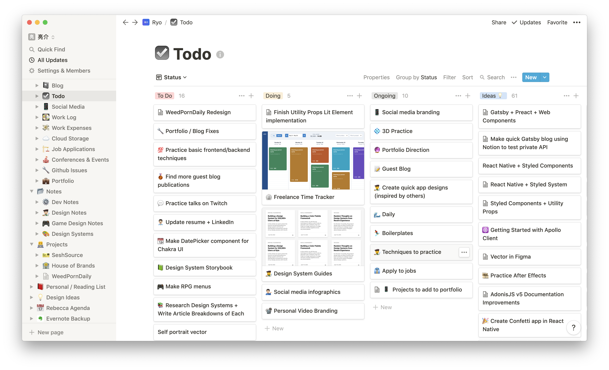

Time sensitive tasks are organized in a Calendar view, where I can visualize my schedule of todos I need to complete.

Here's the kick (inspired by [Jesse Showalter](https://www.youtube.com/watch?v=biWUb-yiUVY)): For personal projects that don't involve multiple collaborators, you can create linked databases to the overall Todo database and create a filter for the project you're working on. This way you can isolate all your todos in one place, making it easier for things like scheduling, ensuring you don't have to double up on the todo.

## Personal Portfolio

This one seems obvious, but it can be easily overlooked, particularly if your brand or business existed prior to Notion. And it's just something you might not immediately think to document in this particular fashion, but once you do, it becomes clear how invaluable it is. I was heavily inspired by [this Notion video](https://youtu.be/ojkQ3dx2TdY) that featured Cheng Lennon and his process.

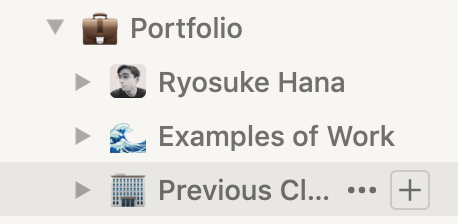

I took many of the key pieces of data that I convey on my resume and portfolio, like contact details and work history, or even my mission statement, and I created a CV-styled page. I can send this directly to recruiters with Notion's public link feature, or I can reference it when redesigning my portfolio ore resume.

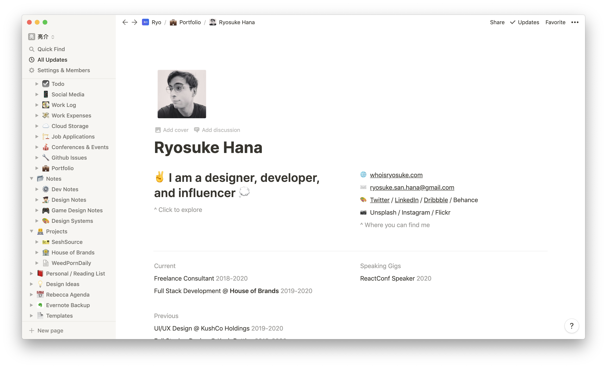

Alongside a CV, I also created a database of previous clients. It helps when you need to make a new catered CV/resume and want to change up your work history to something more relevant. I can easily filter by skills, project types, time periods, etc.

And to make it easier to keep track of the best work I created a Portfolio page that lists all my core skills and key portfolio items. I can also send this to recruiters, or download images to quickly send to clients:

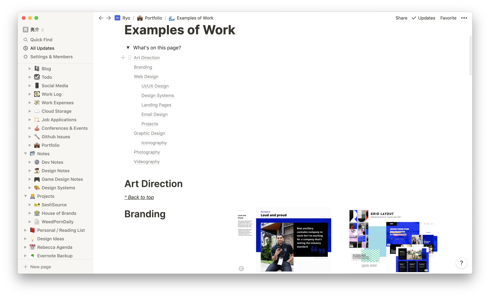

## Work Log

This one is a Notion page I wish I would have started sooner. The "Work Log" is a database where I keep screenshots, links, and other details related to the work I do on a daily basis. I can organize it by project, so I can get an overview of what I've completed over time and see progression in the project (or overall).

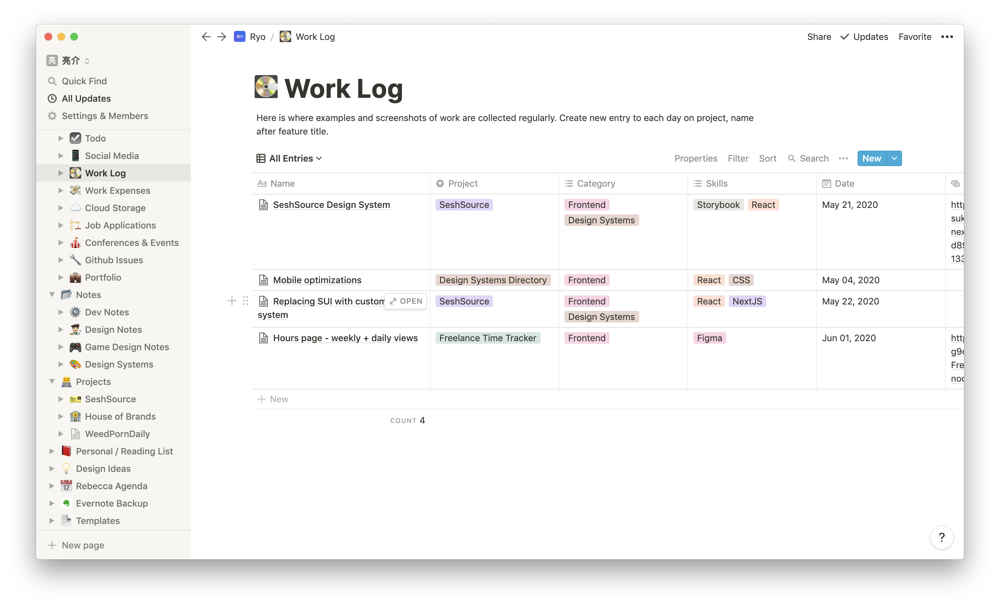

Here is where Notion shines where you can juggle between a "Table" view with a lot of great detail (like attaching a URL, files, setting a date, etc) — and you can pop over to a "Gallery" view and see a more visual representation of the data.

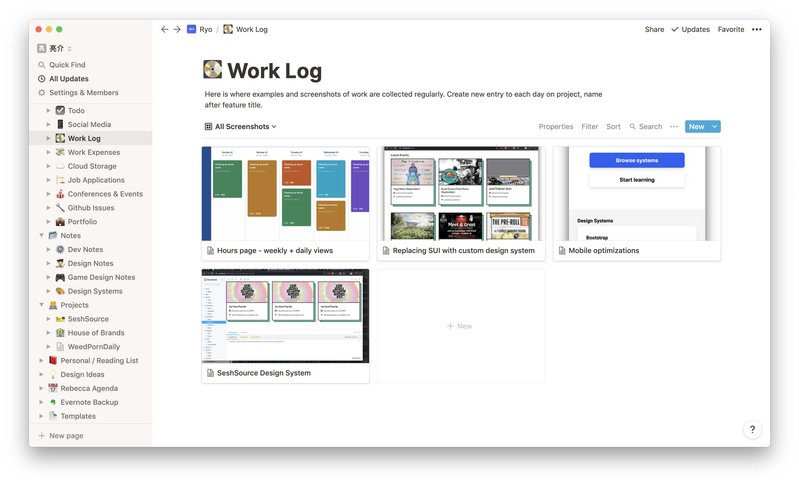

Or a "Calendar" view where you can visualize your work across time:

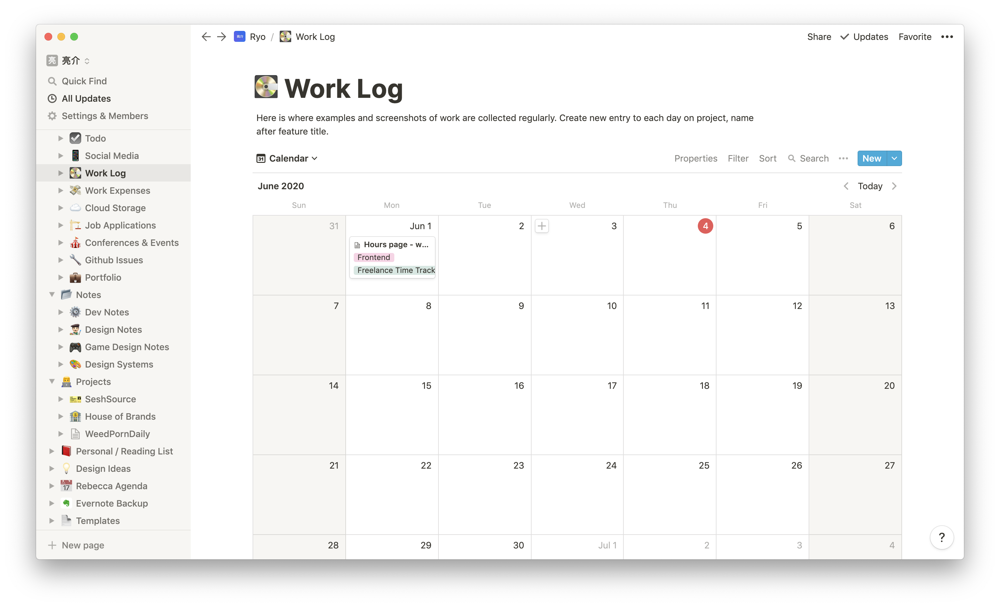

What's great about the work log is that I can use it inside of other projects. I often keep a "Screenshots" page inside of many project pages that acts as an cloud-based archive of the project development. I still do this, since it can be helpful to organize them in particular ways that aren't tabular (like creating columns to show side-by-sides, or creating contextual/instructional annotations). But now, even if I don't manually keep a screenshots page, I can add a relational table to my work log that filters by that particular project.

## Meal Planner

Beyond tech, I'm big on health and nutrition. I'm currently on a lean bulk, which means my diet has to consist of a larger caloric intake, as well a certain ratios of carbs, fats, and protein. Twice a week I commit to a process called "meal prepping" where I spend a few hours cooking 3-4+ days worth of meals for myself and my wife. To make this process as productive as possible, and to ensure I hit my "macros" or nutritional goals, I need plan the meals out prior to the prep.

I found [a great Notion template](https://notionpages.com/605/meal-planner/) to get me started with this one and I edited it to fit my needs. It works by creating 3 databases: "**Shopping List**", "**Meals**" and a "**Meal Prep Calendar**". I also have a "**Meal Prep Log**" that acts as an archive of what's actually cooked.

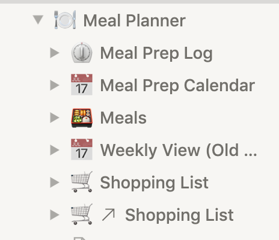

The **Meals** database contains the dishes I cook, like "_Rice, Black Beans, and Chicken_". Each page inside the meals database has a field that relates to the **Shopping List** database, where I store each item used to cook the meal (in this case individually: rice - beans - and chicken).

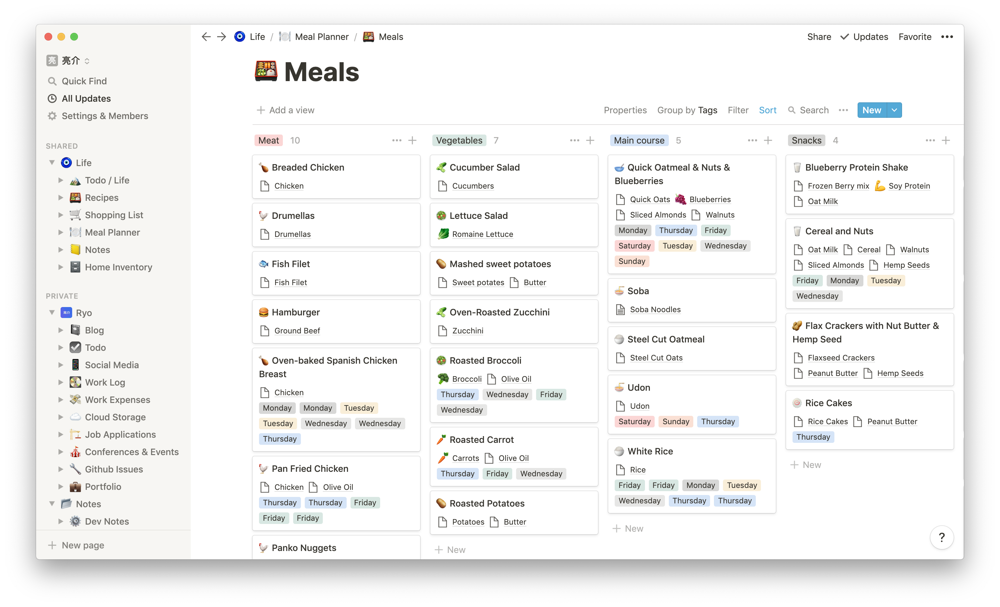

The **Meal Prep Calendar** is exactly what is sounds like. It's a database that I primarily keep in a monthly "Calendar". Each day I make pages that corresponds to a meal time (breakfast, snack, etc), 8 in total. Each page here, like my Breakfast card for instance, is linked to the Meals and Ingredients database. This lets me search for meals/ingredients and associate them with database entries with macros. I can also display the related fields on the Calendar by enabling their property, allowing me to quickly glance and see the entire meal plan.

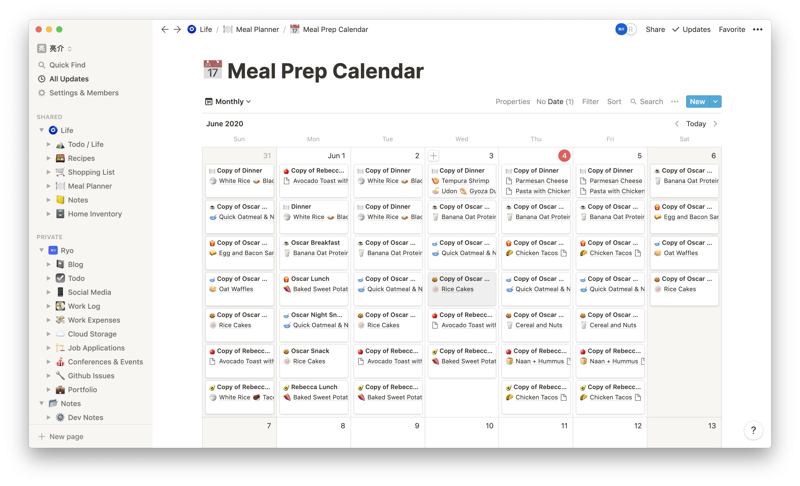

I also tag each day's meals with the day of the week (all Monday meals get tagged Monday). This lets me create a "Kanban" view for the table that acts as "weekly" meal tracker. Each kanban column represents a day of the week. To limit the meals to the current week, I create 2 date filters (on/after Sunday and on/before Saturday). Each week I have to manually configure the filters, but it can be nice to see the week in isolation.

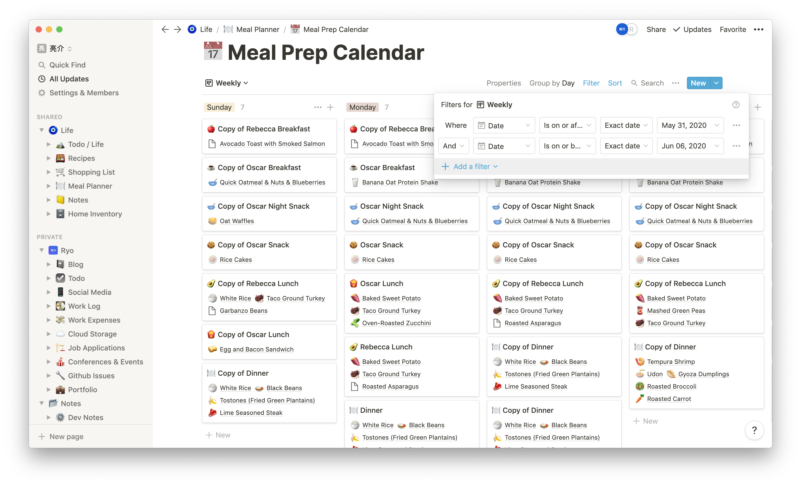

Previously the template came with a "Weekly View" page with a table that featured a similar looking "Kanban" view that above, but you could only plan one week at a time, and you'd have to overwrite the previous week's plans (which took time to delete + replace all the properties). And what's funny with my meal prep process, I often alternate plans between weeks, so I'd end up recreating old plans constantly. This led me to create the Meal Prep Calendar page, where I can keep an archive of all my meal prep plans, and allow me to quickly copy days or even weeks.

It's also nice, the template came with a **Shopping List** database that's related to the Meals table, but filters it by the Ingredients included. This lets you plan out meals and then automatically generate a shopping list.

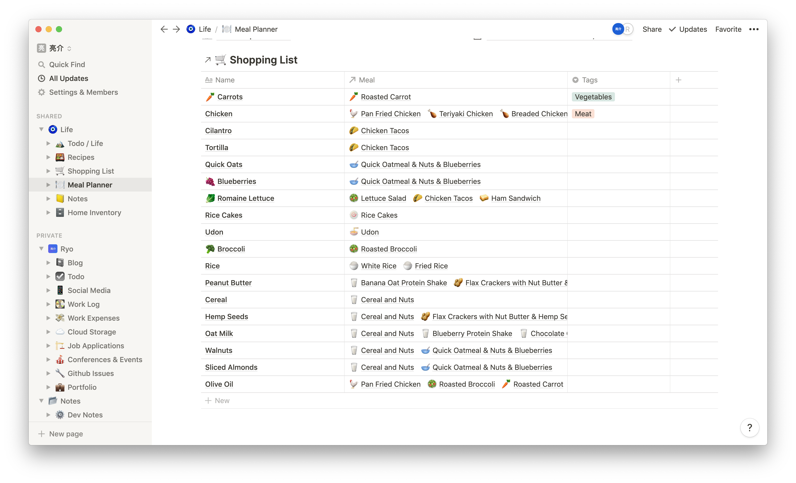

I also keep a **Meal Prep Log** database where each time I cook, I note what food I prepared. This eliminates the need to label food with expiration dates in the fridge (mostly), and allows us to easily go back and answer "how long ago did we make that thing in the freezer?".

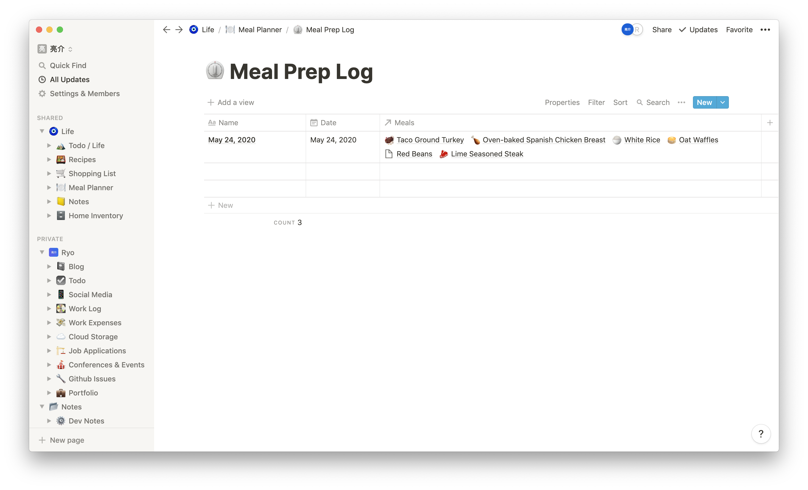

## Recipes

This is one I'll probably end up merging into the Meals database, but I keep a separate database for recipes. This allows me to quickly store recipes I find online using the Notion browser extension, or author my own.

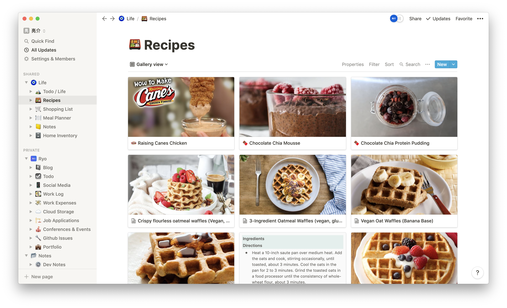

I have a template that creates the necessary structure for recipe pages (like ingredients/steps, as well as macros):

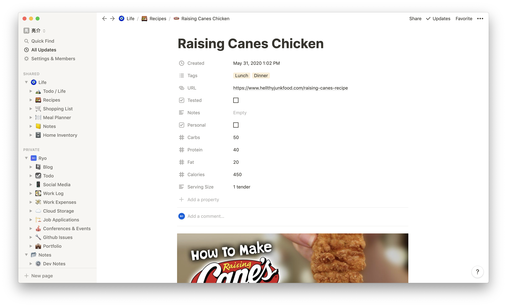

## Social Media Management

For my personal brand, I created a **Social Media** page that houses my post schedule, assets, and any information about accounts and process. This one I haven't fleshed out incredibly, but it'll contain things I currently have in a separate todo page (like my goals, ideas for content, etc).

## Project Management

Notion has been indispensable for project management. It's capability to store every type of data I need to store (all on the cloud) make it ideal as an archive or knowledge base for teams working on new (and even older projects).

Here's an example of [SeshSource](https://seshsource.com), one of my side projects I've been working on. Many of the pages are very basic, like a Ticketing Process page that is simply a text page that discusses the process.

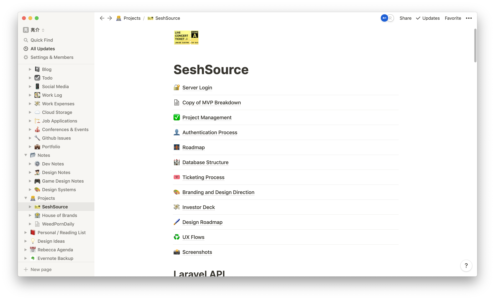

Others are a little more complex, like the Design Roadmap page. This page contains a few inline tables that keep track of components and pages that need to be designed and coded. I can also link to the designs, and even embed the Figma documents if needed.

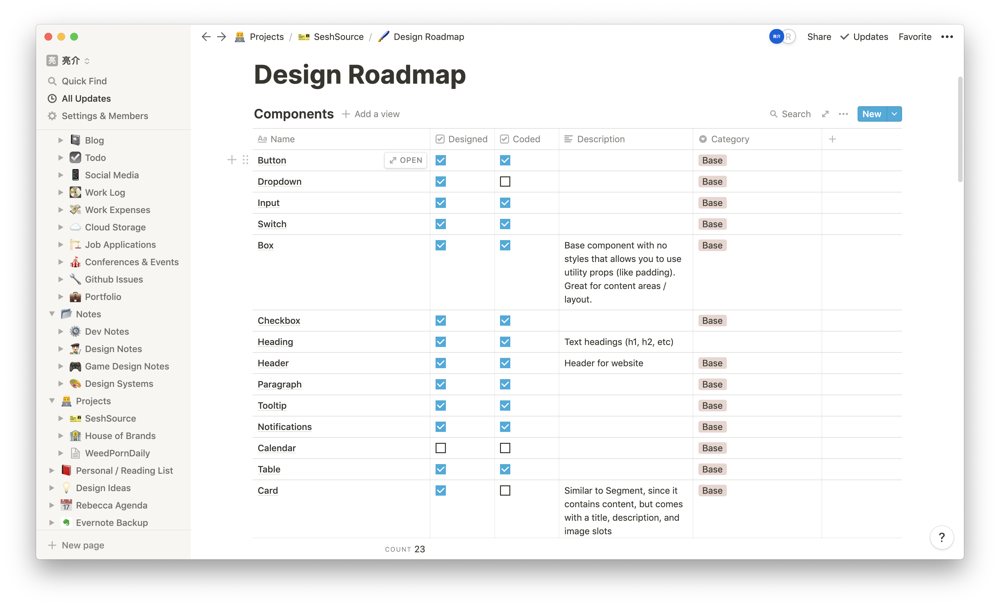

## Design Feedback

I keep a page with an inline table for meeting notes and design feedback / critiques. You can create a template for each type to make it faster getting started. And of course you can embed Figma, Invision, and other types of design files directly into the Notion page for easier access for teammates.

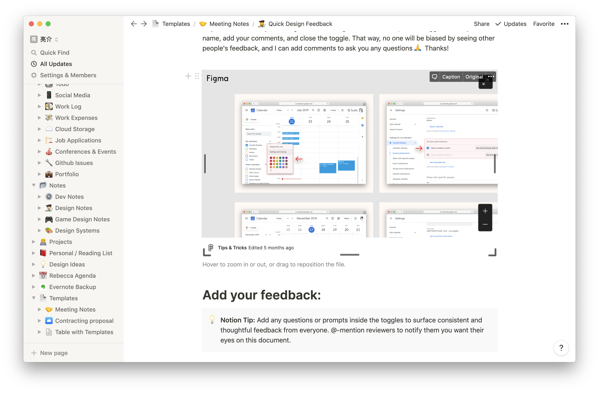

## Reading Lists

I'm an avid reader of blogs and various publications so I'm constantly keeping an archive of posts I'd like to read. I keep two lists in Notion, a personal reading list, and one specifically for design systems. In the table I keep track of things like if I've read it or not, the date I read the article, and a quick summary:

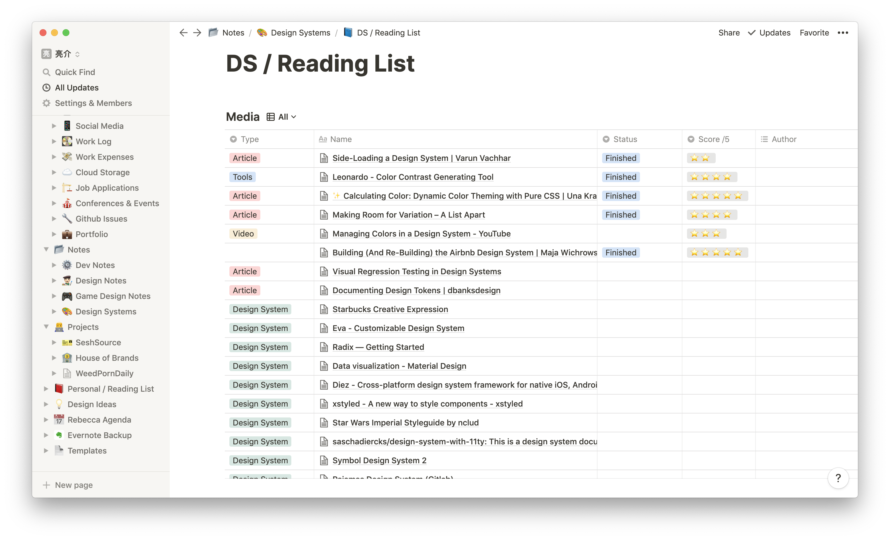

I'm a big fan of this table as it plays into a new website I'm working on, Design Systems Directory. I wanted to create a website that acts as an archive or "directory" for all design systems articles and media. As I go through blogs I'm subscribed to, newsletters, and other publications — I'm constantly saving articles into the Design Systems Reading List on Notion. Then later I can export the list as Markdown or CSV later for importing into a database. I'm excited to take this content and use a framework like Gatsby to generate a website based off of it.

It's also valuable to go back and look at more timeless content that has become more relevant thanks to a present project I'm working on.

## Notes

Notation is a key process in my learning process and acts as a better personal reference down the line when I reapproach similar tasks. I take notes primarily on Development, Design Systems, and personal/home processes.

Since I expect to have so many, my development notes are kept in a table. This allows me to filter them by particular tags or search for certain names.

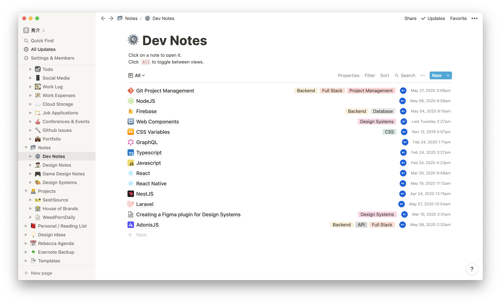

I have a template for creating new "topics" that outlines the basic research structure I undergo. It acts as a quick overview of the library/topic letting me know what it is, why I'd use it, and a quick getting started guide:

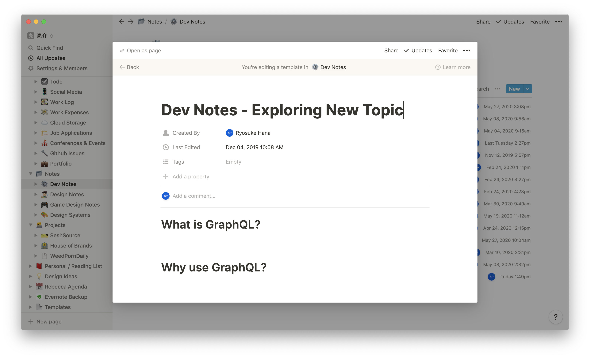

You can see a filled out version featuring React Native here. I also use sub-pages here to contain more dense bits of information, like the basics behind a library, or a list of all the component libraries available:

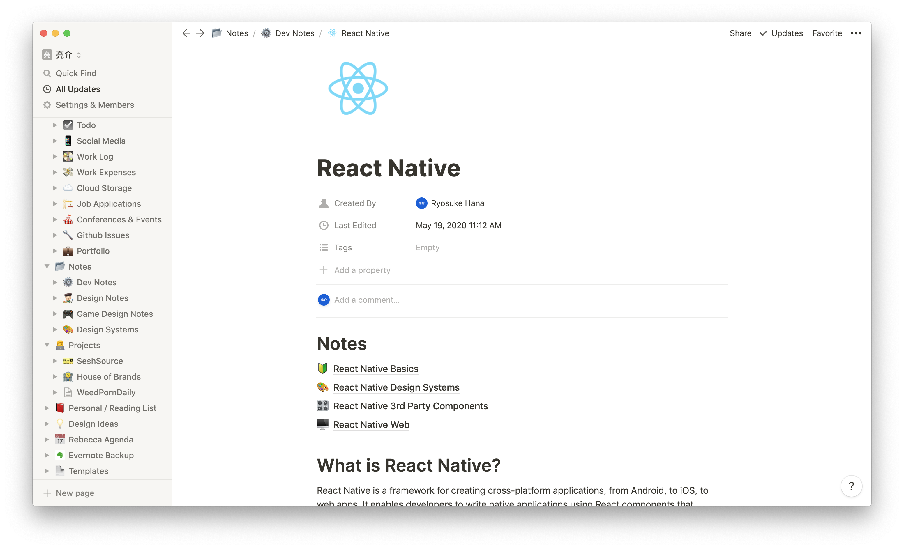

You can see the design system page below, where I use Notion's two column layout to display a summary and image of the component library in action.

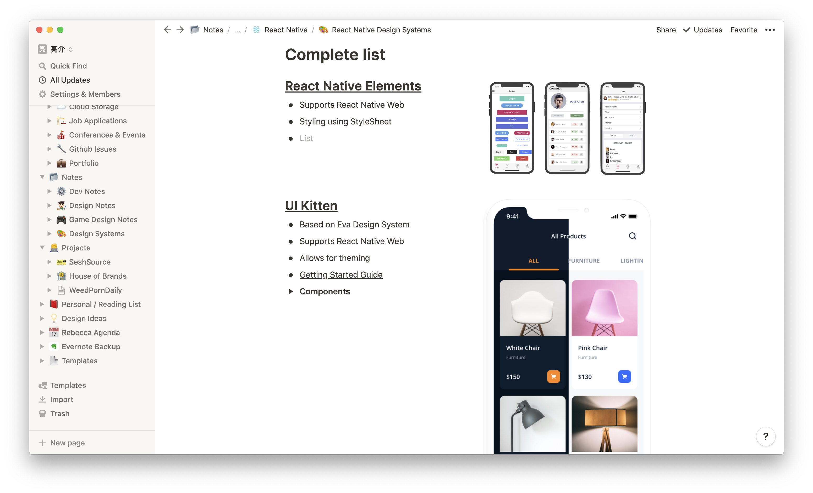

## Work Expenses

I keep track of all my professional expenses, one-time or recurring, using a Work Expenses page. It's just an inline table with a list of expenses, amount, type, etc. I believe this one is a template that Notion offers by default. I added a couple views to the table that allow me to filter by monthly expenses vs one-time, and track expenses for each quarter.

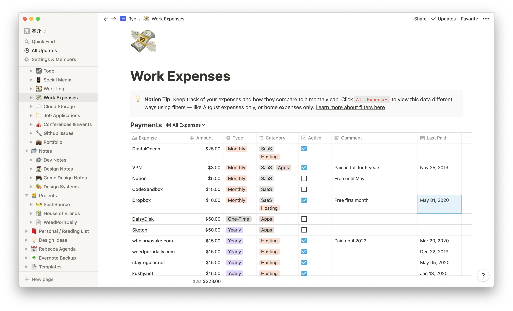

## Cloud Storage

I utilize a few cloud-based storage options like Dropbox and Google Drive for storing various personal and professional files. From my website backups to business documents, anything that I keep on the cloud I document here (as an overview — not 1:1 tracking). This helps me visualize the structure, quickly click links to go to certain folders online, and understand how to organize my data (where does this go? portfolio, projects, or freelance docs?).

I use Notion's toggle or accordion block here to replicate the folder structure of each cloud storage platform.

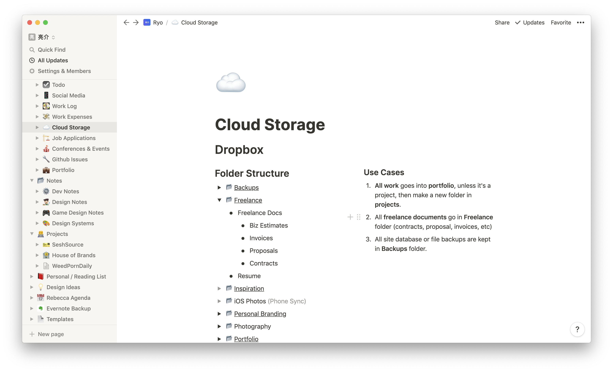

# Notion is king

The new joke around my house with my wife is that [Notion](https://www.notion.so/?r=66e798702574451385c95902a7f09d17) better never disappear, or we'd lose half our lives. I also joke (not really) that if Notion ever did disappear, I'm ready to replicate the app for personal purposes because I have yet to find a form of notation that's been as productive for me.

I hope seeing some of these structures helps envision how you can incorporate Notion into your life and improve your workflow.

Full disclosure: There are [Notion affiliate links](https://www.notion.so/?r=66e798702574451385c95902a7f09d17) on this page, but I am in no way affiliated or sponsored by Notion. But by using [my link](https://www.notion.so/?r=66e798702574451385c95902a7f09d17) you **get an additional \$15 in credit** and give me \$5 in credit. Many thanks if you've used my link in the past! 🙏

# References

[Notion SuperCharged | How I organize my whole life](https://www.youtube.com/watch?v=biWUb-yiUVY&list=WL&index=32&t=0s)

[Notion Office Hours: Design with Notion 🖼](https://www.youtube.com/watch?v=ojkQ3dx2TdY&feature=youtu.be)

- [https://www.notion.vip/](https://www.notion.vip/)
- [https://notionpages.com/](https://notionpages.com/)
- [Official Notion Template Gallery](https://www.notion.so/Notion-Template-Gallery-181e961aeb5c4ee6915307c0dfd5156d)
