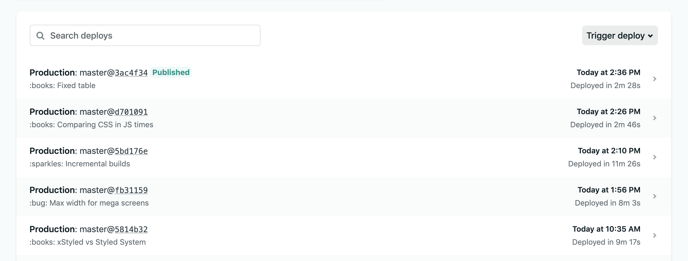

Recently Gatsby introduced a new feature to their framework called ["incremental builds"](https://www.gatsbyjs.org/blog/2020-04-22-announcing-incremental-builds/). It takes your Gatsby website and shaves the build times down significantly by caching your build and adding the new content (rather than rebuilding the entire site for a small change). The feature is available exclusively for Gatsby Cloud, but Jason Lengstorf released [an article on the Netlify blog](https://www.netlify.com/blog/2020/04/23/enable-gatsby-incremental-builds-on-netlify/?utm_source=twitter&utm_medium=gatsby-inc-builds-jl&utm_campaign=devex) that outlines adding a similar new feature to your Gatsby site on Netlify.

This article is basically that guide (with some tweaks), along with my own personal results and findings from the process. ⚠️ **Spoiler alert:** my build times were lowered by ~66%. Keep reading to see how simple it was!

# Enabling incremental builds

## **Step 1: Upgrade to Gatsby v2.20.4 or higher**

Gatsby introduced incremental builds in version 2.20.4, so make sure to upgrade your Gatsby site to the latest version.

```bash
npm install gatsby@latest
# yarn add gatsby@latest
```

## **Step 2: Enable Netlify Build Plugins**

To enable incremental builds on Netlify, [enable the Netlify Build Plugins Beta](https://app.netlify.com/enable-beta?utm_source=blog&utm_medium=gatsby-inc-builds-jl&utm_campaign=devex?utm_source=twitter&utm_medium=gatsby-inc-builds-jl&utm_campaign=devex).

On the Netlify Build Plugins page, enable "build plugins" for any projects you need it for using the search box. Once enabled, this will make **all build plugins** available to the projects once you reference them in your `netlify.toml` (see below).

For more details on Netlify's Build Plugins, check out the [Build Plugins docs](https://docs.netlify.com/configure-builds/build-plugins/?utm_source=blog&utm_medium=gatsby-inc-builds-jl&utm_campaign=devex).

## **Step 3: Add the Gatsby Cache Netlify Build Plugin**

Now we need to enable `netlify-plugin-gatsby-cache`, which will persist Gatsby’s `public` and `.cache` directories between builds on the Netlify platform.

In your `netlify.toml`, add the following:

```
[build]
  publish = "public"

[[plugins]]
  package = "netlify-plugin-gatsby-cache"
```

Save and commit this change and Netlify will handle the rest!

## **Step 4: Add the flag to enable Gatsby incremental builds**

Finally, update your build command in `package.json` (or on Netlify if you use a platform-specific command) to include the incremental builds flag:

```json
"scripts": {
  "build": "GATSBY_EXPERIMENTAL_PAGE_BUILD_ON_DATA_CHANGES=true gatsby build --log-pages"
},
```

You can add the optional `--log-pages` flag to [see what Gatsby builds on each run](https://www.gatsbyjs.org/docs/conditional-page-builds/#reporting-what-has-been-built). This is important, since this feature is experimental, you'll want to keep track and ensure Gatsby is updating the pages you need.

# My build times

After going through the setup process on Netlify and pushing up a couple content updates, I was able to see immediate performance gains from the optimization:

**Before**: 8-10 minutes builds

**After**: 11-12 minutes initial build, and 2-3 mins once cached!



After enabling the incremental builds, Netlify was capable of keeping the cache, but I had to push another commit before I started seeing the gains.


The Netlify build process before the cache is generated

It's interesting to see the initial build increase in time by a couple of minutes, but it's definitely worth it considering each subsequent build was reduced significantly (1/3 of the original time!). Also love the status messaging in the log once a cache is detected ⚡️:


The Netlify build process after a subsequent commit with a cache detected

## Possible issues?

The biggest issue is that **this isn't really incremental builds**. According to the Gatsby documentation, this is actually called [**Conditional Page Builds**](https://www.gatsbyjs.org/docs/conditional-page-builds/). Incremental Builds are technically [only available on Gatsby Cloud](https://www.gatsbyjs.com/docs/incremental-builds/). It's a little confusing that both exist, it raises a lot of questions like: "How are Conditional Page Builds different than Incremental Builds?" or "Since Conditional Page Builds are experimental and buggy for production, what does it say about Incremental Builds?".

I'd be curious to see how easy this is to setup on another CI/CD platform since this method was facilitated primarily by a Netlify plugin. I'm not sure how it'd work on a service like CircleCI. [Hit me up on twitter](https://twitter.com/whoisryosuke) and let me know if you've tried anything like this yet!

And I'm also curious how often Netlify deletes it's cache of projects. If it never deletes it, I'd be very happy with this improvement. But if it deletes the cache within a few days to a week, it might not be as helpful anymore, as I write on a weekly basis. [I asked Netlify on Twitter](https://twitter.com/whoisryosuke/status/1265411123840380930), and it seems that the cache should persist until you delete it, making these performance gains basically permanent (until you need to dump your build cache for whatever reason). Meaning I'll never see that 11 minute build time again, and only see 2-3 minutes from now on. That's pretty incredible!

It's also disappointing to see that this feature **doesn't work with Gatsby's development server.** This would be one of the biggest benefits, since building Gatsby websites locally can be incredibly cumbersome if you're working at a large scale. Commonly you find yourself having to restart the development server to see server-based changes (like generating pages with GraphQL) — and this process can take up to 5-10 mins or more depending on the amount of content or pages generated. Most devs end up doing hacky things like limiting the number of pages in local development (instead of pulling all the content from an API). Having incremental builds here would help immensely, especially when you already generate a `.cache` locally as well.

# Fast websites just got faster 🐇💨

I'm already pretty impressed with how fast Gatsby websites are for clients, but now they're improving one of the parts of their process that was slowing at scale: the builds. I've been eating up Netlify's free build time with my Gatsby blogs, and the bigger they get the more time I rack up. So it's nice being able to shave my load times off by 2/3. It encourages me to write more content (or even edit/tweak previous content) without as much consequence.

Hope this helps improve your Gatsby sites! And [let me know on Twitter](https://twitter.com/whoisryosuke) if you got this working on other platforms, would love to see something like a CircleCI → Digital Ocean.

# References

- [Enable Gatsby Incremental Builds on Netlify](https://www.netlify.com/blog/2020/04/23/enable-gatsby-incremental-builds-on-netlify/?utm_source=twitter&utm_medium=gatsby-inc-builds-jl&utm_campaign=devex)
- [Conditional Page Builds](http://gatsbyjs.org/docs/conditional-page-builds/)
- [A guide to Gatsby incremental builds - LogRocket Blog](https://blog.logrocket.com/gatsby-incremental-builds/)
