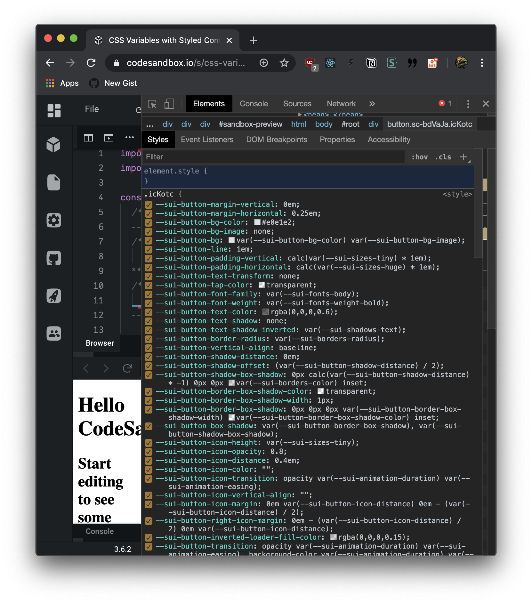

Theming requires a lot of variables to enable customization. Some frameworks and libraries go as far to have hundreds, if not thousands of variables, that account for each component property (`$button-text-color-primary`) - as well as all the base design tokens (`$red`).

Theming becomes a tedious process that doesn't feel creative, and more restrictive. It becomes an encyclopedic research for corresponding variables that consumes more time than designing. The goal was to make customization easier, and by creating so many toggles, it becomes severely abstracted from the true design method: CSS.

Variables are supposed to ease the design process and ensure that all the properties are in harmony and rhythm with the design system. Things fall into disarray then there's thousands of variables to manage, and more time is spent in translation than design. Does this component have a specific variable for this property, or should I use a base theme variable? There's often no visual map of these values and their connection to each other, and the process of learning variables for a new design system can feel like a homework assignment staring at a table of keys and values.

So if more variables isn't the solution, is less variables? Even if components use a small, base set of variables, it becomes difficult to replace specific properties. With padding and margin for instance, they may still use a "spacing" design token to keep it in the rhythm, but the ratio may differ from a "button" to a "card". We can define it differently per component, but if a user wishes to customize this, they have to edit the source code (or override the CSS — often tricky). It seems excessive variables are required if you don't have access to source code, otherwise, you can assume the user can edit the source CSS directly.

Let's take a trip through the various methods of styling web based component libraries, from OOCSS to CSS in JS, and the multitudes of approaches for theming. We'll see why we use the variables, why exactly we need so many, and what modern practices are being employed to surpass these age old issues.

## OOCSS

One of the oldest ways of handling theming is OOCSS, or Object Orientated CSS. OOCSS is a naming convention, like BEM (or Block Element Modifier), that encourages a certain guideline for writing class names and structuring your CSS' specificity. For example: if you had a button, and you didn't want to accidentally inherit any CSS from other another stylesheet on the page, you add a "namespace" class name that prepends your component name (`nike button`). This technique is also used for theming, where you can append variables like colors, or sizing, and safely alter the component's styling within it's scope.

```css
/* Another CSS file */
.button {
  color: red;
}
/* Your CSS */
.nike.button {
  color: black;
}
.nike.button.red {
  color: DarkRed;
}

/* <button class="button">3rd party Button</button> */
/* <button class="nike button">Nike Button</button> */
/* <button class="nike button red">Dark Red Nike Button</button> */
```

### Theming Methodology

[Semantic UI](https://semantic-ui.com/) (or SUI) is an [excellent example](https://github.com/Semantic-Org/Semantic-UI/blob/master/src/definitions/elements/button.less#L2493-L2529) of this methodology in practice. Each component can be modified using these "utility"-style CSS class names, which alter properties like color or sizing. Theming is accomplished by using these utility class names to alter base component styles (such as adding a `primary` class to a button to change the background color).

You can also theme on a component-level by using the utility classes to define different component themes. SUI for example, lets you add a `.inverted` class to any component, making it essentially "dark mode". This same logic can be extended to create other themes for color styles or even sub-brands in a company (also seen in SUI using `.ui.facebook` to use those brand colors).

To create your own kind of "variables" across the app, you could create class names like `[.ui.red](http://ui.red)` that apply a `color: red` to the element, and then stack these on any component necessary. This starts to blend with Utility CSS (see below), and is a bit generic (applies red font color, but what about background? needs a separate variable). And if you're obeying OOCSS principles anyway, you'll often have specific component classes for each generic variable you create.

### Issues

The primary issue with OOCSS is the amount of CSS needed to accomplish it. Any "utility" class name that you'd like to add to the system must be added to each component's CSS scope individually (since you can't just make a `.color-red` global class and call it a day). This ships a lot of extra CSS to the user that they may not use.

You also end up writing a lot of repetitive CSS. This is improved by combining this method with SASS or LESS, which let you run "mixins" that can generate duplicate style logic (with even slightly different properties like colors or theming).

Another issue is generating the utility classes and keeping properties consistent across components (like colors). This is where leveling up to SASS/LESS or CSS custom properties would help eliminate repetitive code dispersed across your component styles.

### Examples

- [Semantic UI](https://semantic-ui.com/)

## Utility CSS

```html
<blockquote class="fl w-100 ph0 border-box mh0 mb4 mb5-ns pb5 bb b--black-50">
  <p class="f3 f1-ns measure fw7 lh-title mt0">
    One of the comments I hear most frequently about Zarf’s design is ‘I love
    the minimalism!’ Zarf’s minimalist experience is completely powered by
    Tachyons. With Tachyons, I was able to build a product with a cohesive
    design story with minimal hassle and debugging. Tachyons truly made
    developing the design for Zarf fun.
  </p>
  <cite class="mtw f5 f4-m f3-l fs-normal">
    <span class="fw6">Safia Abdalla</span>
    <span class="db f5">
      <a
        class="link black-70 dim"
        href="http://tanmulabs.com"
        title="Tanmu Labs"
      >
        Tanmu Labs
      </a>
    </span>
  </cite>
</blockquote>
```

Utility CSS is a method of styling components with CSS class names that represent specific properties, like `.mt-10` for adding 10px of margin to the top of an element. There are a few libraries that follow this principle: [Tachyons](https://tachyons.io/#style), [Basscss](https://basscss.com/), and [Tailwind CSS](https://tailwindcss.com/).

You can see Tachyons in action above with a blockquote component from their frontpage. The compound of all the class names is a fluid, 100% width, 0% padding left and right, border-box...you get the idea. If you inspect a Tachyons element in a web inspector, you can see what each individual class name does. It becomes fairly easy to learn many of the properties because of their semantic nature.

These are often abstracted away into individual components, using libraries like React, Vue, or Angular. Rather than writing that verbose HTML and CSS each time, you'd use a JS-based component `<Quote body="" author="" />`. Libraries like Tailwind also have ways to compile these utility properties into reusable component class names.

### Theme Methodology

Since you often use a premade library for this method, you'll end up using one of their theming methods for customizing the components. [Tachyons for example](https://tachyons.io/docs/themes/skins/), uses CSS custom properties to set it's theme values. [Tailwind on the other hand](https://github.com/tailwindcss/tailwindcss/blob/master/stubs/defaultConfig.stub.js#L5), uses a JS-based object that's run through their postcss build process. If you're creating your own utility CSS library from scratch, it really depends on your preferred method for handling what is essentially variables.

```js
    theme: {
        screens: {
          sm: '640px',
          md: '768px',
          lg: '1024px',
          xl: '1280px',
        },
        colors: {
          transparent: 'transparent',

          black: '#000',
          white: '#fff',

          gray: {
            100: '#f7fafc',
            200: '#edf2f7',
            300: '#e2e8f0',
            400: '#cbd5e0',
            500: '#a0aec0',
            600: '#718096',
            700: '#4a5568',
            800: '#2d3748',
            900: '#1a202c',
          },
    }
```

In terms of actually theming components, the variability of the theme is up to how many design tokens you have (like colors). You can create any component you'd like, and but there will only ever be a set amount of colors in the config.

And if you want to theme an application using utility CSS, like a dark mode toggle, there are a few different ways of handling it:

- Using CSS custom properties for your colors is the simplest way if your app can support it.
- You can also use utility CSS to handle it (with a sprinkle of OOCSS and JS). You preface your class names with your theme name (`.dark:bg-white`) and add them to components (`<button class="bg-black dark:bg-white">`). The theme can then be activated by adding a class name to the root HTML element (`<body class="dark-mode">`), which works by using CSS selectors and a bit of OOCSS structure (`.dark-mode [class^="dark:"]`).

### Issues

It is undeniable that from a glance utility CSS becomes acronym soup. While CSS does require a certain cognitive load to parse a class' properties, there's a whole extra layer of translation here from the utility abstraction. Tailwind [has a solution for this](https://tailwindcss.com/course/composing-utilities-with-apply/) where you can define component classes using Tailwind properties and use [postcss](https://github.com/postcss/postcss) to build the production CSS, but you still end up with utility properties to translate.

Parsing the class names is also a trickier affair when you want to dynamically alter them using JS. There are more class names to deal with, and require parsing to make any changes (converting `mt-10` to `mt-20` isn't _that hard_ in JS, it just is an extra step and more code to write).

### Examples

- [Tachyons](https://tachyons.io/#style)
- [Basscss](https://basscss.com/)
- [Tailwind CSS](https://tailwindcss.com/)

## SASS/LESS Variables

```less
/*******************************
             Site Settings
    *******************************/

/*-------------------
           Fonts
    --------------------*/

@fontName: 'Lato';
@fontSmoothing: antialiased;

@headerFont: @fontName, 'Helvetica Neue', Arial, Helvetica, sans-serif;
@pageFont: @fontName, 'Helvetica Neue', Arial, Helvetica, sans-serif;

@googleFontName: @fontName;
@importGoogleFonts: true;
@googleFontSizes: '400,700,400italic,700italic';
@googleSubset: 'latin';

@googleProtocol: 'https://';
@googleFontRequest: '@{googleFontName}:@{googleFontSizes}&subset=@{googleSubset}';

@bold: bold;
@normal: normal;

/*-------------------
          Base Sizes
    --------------------*/

/* This is the single variable that controls them all */
@emSize: 14px;

/* The size of page text  */
@fontSize: 14px;

/*-------------------
        Brand Colors
    --------------------*/

@primaryColor: @blue;
@secondaryColor: @black;

@lightPrimaryColor: @lightBlue;
@lightSecondaryColor: @lightBlack;
```

The classic way that many design systems still use to achieve theming. SASS and LESS are a different syntax for writing code that compiles to CSS. They allow for the functionality that isn't available in CSS (like variables, before they were CSS custom properties). This method allows the use of variables and mixins, which act as functions.

You can use these mixins to handle repetitive code (like looping through a 1-16 grid or complex animations/effects). The variables are also very useful, since they can be different value types (from a string to number to array). Unlike CSS custom properties which are limited to property values, SASS/LESS vars can be anything, allowing you to use them for complex mixins (like switch statements). You can see the variables above being used to store the URL for the Google Font API.

All code compiles away to CSS (complete with autoprefixing), leaving behind no variables or mixins. However it does require a build process, which can often be intensive or difficult to integrate into workflows.

### Theme Methodology

Often theming is accomplished by using base variables (like color or sizing), which are then used in other more specific variables (usually component level). For example, `$primary: red` would be used for `$button-bg`, which is then applied to the button's `background-color` property. All variables are global and allow for use across any imported SASS/LESS stylesheet.

SASS and LESS tend to be structured so the base variables are imported first, then the individual components. Then the file is either compiled in full, or broken up into modular component-based files.

This is the best way to handle theming if your design system needs to support legacy browsers. You only serve CSS at the end of the day, and it doesn't require any modern JavaScript or new CSS features (unless you choose to use them).

### Issues

The major issue with theming with this method is the lack of dynamic variables. SASS or LESS must be compiled into CSS before being shipped to a browser. Using SASS or LESS directly with a client-side compiler isn't a common practice, since they require Node or Ruby. This leads to theming being accomplished with either separate stylesheets (easily generated off the same CSS styles using different variables) — or OOCSS. Either way, you end up loading way more code than the user needs. And PurgeCSS, which cleans unused CSS from files, has difficulty with more dynamic applications.

This method also tends to suffer from an excessive number of variables, and because SASS variables are global, they can be used anywhere. Meaning you get a lot of cross-component variable use, leading to you running from file to file deciphering a few values. For example, the Semantic UI variable file has a var for border radius, but it uses another variable, which is referenced _after_ the border radius variable. There's no clear hierarchy, and the global namespace can cause naming conflicts if you're not careful.

Themes are often separated into different folders, which contain variable files for each module or component, which leads to quite a bit to leaf through. And it acts as another layer of abstraction from the actual code, where you have to search for the proper file each variable is contained in (usually 2-3 tops, but legwork nonetheless).

### Examples

- [Semantic UI](https://semantic-ui.com/)
- [Bootstrap](https://getbootstrap.com/)

## CSS Custom Properties (or Variables)

```css
/*******************************
                Button Themes
      *******************************/
/*-------------------
            Element
      --------------------*/

/* Button */
--sui-button-margin-vertical: 0em;
--sui-button-margin-horizontal: 0.25em;
--sui-button-bg-color: #e0e1e2;
--sui-button-bg-image: none;
--sui-button-bg: var(--sui-button-bg-color) var(--sui-button-bg-image);
--sui-button-line: 1em;

/* Button defaults to using same height as input globally */
--sui-button-padding-vertical: calc(var(--sui-sizes-tiny) * 1em);
--sui-button-padding-horizontal: calc(var(--sui-sizes-huge) * 1em);

/* Text */
--sui-button-text-transform: none;
--sui-button-tap-color: transparent;
--sui-button-font-family: var(--sui-fonts-body);
--sui-button-font-weight: var(--sui-fonts-weight-bold);
--sui-button-text-color: rgba(0, 0, 0, 0.6);
--sui-button-text-shadow: none;
--sui-button-text-shadow-inverted: var(--sui-shadows-text);
--sui-button-border-radius: var(--sui-borders-radius);
--sui-button-vertical-align: baseline;

/* Internal Shadow */
--sui-button-shadow-distance: 0em;
--sui-button-shadow-offset: (var(--sui-button-shadow-distance) / 2);
--sui-button-shadow-box-shadow: 0px calc(var(--sui-button-shadow-distance) * -1)
  0px 0px var(--sui-borders-color) inset;

/* Box Shadow */
--sui-button-border-box-shadow-color: transparent;
--sui-button-border-box-shadow-width: 1px;
--sui-button-border-box-shadow: 0px 0px 0px var(
    --sui-button-border-box-shadow-width
  ) var(--sui-button-border-box-shadow-color) inset;
--sui-button-box-shadow: var(--sui-button-border-box-shadow), var(--sui-button-shadow-box-shadow);

/* Icon */
--sui-button-icon-height: var(--sui-sizes-tiny);
--sui-button-icon-opacity: 0.8;
--sui-button-icon-distance: 0.4em;
--sui-button-icon-color: '';
--sui-button-icon-transition: opacity var(--sui-animation-duration) var(
    --sui-animation-easing
  );
--sui-button-icon-vertical-align: '';

--sui-button-icon-margin: 0em var(--sui-button-icon-distance) 0em - (var(
        --sui-button-icon-distance
      ) / 2);
--sui-button-right-icon-margin: 0em - (var(--sui-button-icon-distance) / 2) 0em
  var(--sui-button-icon-distance);

/* Loader */
--sui-button-inverted-loader-fill-color: rgba(0, 0, 0, 0.15);

--sui-button-transition: opacity var(--sui-animation-duration) var(
      --sui-animation-easing
    ), background-color var(--sui-animation-duration) var(
      --sui-animation-easing
    ), color var(--sui-animation-duration) var(--sui-animation-easing), box-shadow
    var(--sui-animation-duration) var(--sui-animation-easing),
  background var(--sui-animation-duration) var(--sui-animation-easing);

--sui-button-will-change: '';

/*******************************
                Button Styles
      *******************************/
cursor: pointer;
display: inline-block;

min-height: 1em;

outline: none;
border: none;
vertical-align: var(--sui-button-vertical-align);
background: var(--sui-button-bg);
color: var(--sui-button-text-color);

font-family: var(--sui-button-font-family);

margin: 0em var(--sui-button-margin-horizontal) var(
    --sui-button-margin-vertical
  )
  0em;
padding: var(--sui-button-padding-vertical) var(--sui-button-padding-horizontal)
  calc(var(--sui-button-padding-vertical) + var(--sui-button-shadow-offset));

text-transform: var(--sui-button-text-transform);
text-shadow: var(--sui-button-text-shadow);
font-weight: var(--sui-button-font-weight);
line-height: var(--sui-button-line);
font-style: normal;
text-align: center;
text-decoration: none;

border-radius: var(--sui-button-border-radius);
box-shadow: var(--sui-button-box-shadow);

user-select: none;
transition: var(--sui-button-transition);
will-change: var(--sui-button-will-change);

-webkit-tap-highlight-color: var(--sui-button-tap-color);
```

CSS custom properties are basically variables for CSS properties. Any CSS property can be defined inside of these "custom properties", and those "custom properties" get used across your CSS like variables (literally using the CSS function `var()`). They've become more widely supported in all modern, evergreen browsers, making them more of an option for design systems.

### Theming Methodology

Base design tokens are defined as custom properties in a root HTML element (selected using `:root` or `html` usually). This allows you to use them in any component nested inside the app. Component level custom properties are created as needed, and can even reference the base custom properties. Seen above is an example of a component level CSS, with it's own custom properties and using base properties as well. Seen below is an example of base CSS applied to the root element:

```css
:root {
  /* sizes */
  --sui-spacing-1: 0;
  --sui-spacing-2: 4;
  --sui-spacing-3: 8;
  --sui-spacing-4: 16;
  --sui-spacing-5: 32;
  --sui-spacing-6: 64;
  --sui-spacing-7: 128;
  --sui-spacing-8: 256;
  --sui-spacing-9: 512;
  --sui-sizes-mini: 11 / 14;
  --sui-sizes-tiny: 12 / 14;
  --sui-sizes-small: 13 / 14;
  --sui-sizes-medium: 14 / 14;
  --sui-sizes-large: 16 / 14;
  --sui-sizes-big: 18 / 14;
  --sui-sizes-huge: 20 / 14;
  --sui-sizes-massive: 24 / 14;

  /* Fonts */
  --sui-fonts-body: Roboto, Helvetiva Neue, Helvetica, Aria, sans-serif;
  --sui-fonts-heading: Poppins, Helvetiva Neue, Helvetica, Aria, sans-serif;
  --sui-fonts-monospace: Fira Code, Menlo, monospace;

  /* Fonts: Weight */
  --sui-fonts-weights-body: 400;
  --sui-fonts-weights-heading: 500;
  --sui-fonts-weights-bold: 700;

  /* Fonts: Line Height */
  --sui-fonts-line-body: 1.5;
  --sui-fonts-line-heading: 1.25;

  /* Breakpoints */
  --sui-breakpoints-mobile: 320px;
  --sui-breakpoints-tablet: 768px;
  --sui-breakpoints-computer: 992px;
  --sui-breakpoints-desktop: 1200px;
  --sui-breakpoints-widescreen: 1920px;

  /* Colors */
  --sui-colors-white: #fefefe;
  --sui-colors-black: #010101;
  --sui-colors-red: #db2828;
  --sui-colors-orange: #f2711c;
  --sui-colors-yellow: #fbbd08;
  --sui-colors-olive: #b5cc18;
  --sui-colors-green: #21ba45;
  --sui-colors-teal: #00b5ad;
  --sui-colors-blue: #2185d0;
  --sui-colors-violet: #6435c9;
  --sui-colors-purple: #a333c8;
  --sui-colors-pink: #e03997;
  --sui-colors-brown: #a5673f;
  --sui-colors-grey: #767676;

  --sui-colors-primary: blue;
  --sui-colors-text: #111212;
  --sui-colors-background: #fff;
  --sui-colors-secondary: #6d59f0;
  --sui-colors-muted: #f6f6f9;
  --sui-colors-gray: #d3d7da;
  --sui-colors-highlight: hsla(205, 100%, 40%, 0.125);
  --sui-colors-disabled: rgba(40, 40, 40, 0.3);
  --sui-colors-disabled-inverted: rgba(225, 225, 225, 0.3);
}
```

When using CSS custom properties for theming, you'll often notice that much like SASS/LESS, the more you need to customize - the more custom properties you'll create. And to create the most flexible system, nearly every property ends up using a CSS custom property. This way, you're able to manage most of the component's style logic from these variables, without having to dig into the source code, especially if the variables are labeled correctly.

### Issues

It requires however, that the component is styled using an **_excessive_** number of properties. This leads to more custom properties to name, as well as the possibility of class name collision. Using less custom properties seems to be the way to go, with specific overrides for unique component properties.

Your CSS becomes incredibly verbose in production, where all components contain not only their style definitions, but **_hundreds of more lines_** in variables (often doubling the size of components).



Overriding also looks verbose, since you define properties again, which adds nearly double the number of variables if all are used (making files 3x as originally large when customization is considered).

This is a prime example of why **complex design systems** should lean towards **working from** component library **source code,** rather than importing and override methods. Similar to old SASS projects like Bootstrap or SUI, you download the source code and bundle it yourself. Rather than importing the component and applying style overrides, you bundle the component with new theme values, ship that dependency, and import that in your code. The only issue with this method is handling version upgrades, and managing merging new code with possibly customized code.

This also makes a case for CSS in JS, where you can override a component's styles without worrying about scope as much (as long as it doesn't use too specific of a selector). Rather than redefining properties (which can fail if loaded after the original component - common with bundlers), you just wrap the component in a `styled()` function with new CSS. Ideally main theme variables are still used for properties like background color (to keep consistency in the system), but niche component properties/variables aren't necessary unless you need to programmatically change it across the app (like React Context).

- [Example on CodeSandbox](https://codesandbox.io/s/css-variables-with-styled-components-1q887)

### Examples

- [Tachyons](https://tachyons.io/)

## CSS in JS (CSS style)

```js
import React from 'react'
import styled from 'styled-components'

const StyledButton = styled.button`
  font-family: ${({ theme }) => theme.fonts.heading};
  font-size: ${({ theme }) => theme.fontSizes[1]}px;
  color: ${({ theme }) => theme.colors.white};
  background-color: ${({ theme }) => theme.colors.text};
  padding: ${({ theme }) => `${theme.space[1]}px ${theme.space[3]}px`};
  border: 0;
  border-radius: ${({ theme }) => theme.radii.default}em;
  text-align: ${props => (props.align ? props.align : 'center')};
`

const Button = ({ className, children }) => {
  return <StyledButton>{children}</StyledButton>
}

export default Button
```

CSS in JS is a technique of writing your CSS inside of JavaScript, often alongside your components. It's a modular architecture that allows you to reference style to logic faster, remove components completely without leaving behind unused CSS, and handle the complex process of class names. It's usually accomplished with a library that facilitates the processing of the CSS inside of JS. The most popular choices currently are Styled Components, Emotion, and JSS.

This method in particular focuses on the CSS, writing it in a classic (or SASS/LESS format), encased in template literals. It differs from the object-based CSS and utility CSS methods employed using the same styling libraries.

### Theming Methodology

Similar to CSS custom properties and SASS/LESS, your goal is to use as many theme variables as possible to replace CSS properties. It integrates each component into the system and unifies theme changes across them. You can also define properties for every component property, like above, to ensure that all properties are theme-able.

However, thanks to the power of Styled Components, if you're looking to override or add a CSS property, you either wrap the component in `styled()` function or pass in some CSS props for a more one-time and inline solution.

```js
const ButtonOverride = styled(Button)`
  background-color: white;
  border: 1px solid black;
  color: black;
  margin: 1em;
`

// or use CSS prop (requires Babel plugin)

;<Button
  css={`
    background-color: white;
    border: 1px solid black;
    color: black;
    margin: 1em;
  `}
>
  Submit
</Button>
```

With this method, you can have a `<BaseButton>` that gets extended into a `<GhostButton>` that's styled with a transparent BG and border (as CSS overrides). This is useful with Styled Components, since the entire component style block gets loaded in production. So if you have a prop to change the component style (to a ghost button for example), all the ghost button styles will be loaded (even if it isn't used). To ensure this doesn't happen, separating the logic for more complex variations is a more sensible way to structure components. For simpler styles (like a couple property changes similar to above), this might be overkill.

- [Example on CodeSandbox](https://codesandbox.io/s/styled-components-theming-example-xkvu7)

### Issues

Note that once you override a component using styled, you can’t use the `as` prop with the extended component, or it’ll override the base component. For example, if I used the `<GhostButton>` and wanted to make it a link, it would lose the base button styles.

~~You could maybe setup a “forwarded as“, which would get passed into the original component’s `as` prop. Requires testing to confirm.~~ I also tried using a `forwardAs` prop to circumvent the Styled Component replacing the base component, instead of overriding it properly. This doesn't work, and the prop is negated through the extension process.

You can also reuse CSS across components if you separate the CSS into it's own variable (or function if you want to use props):

```js
// Works, but only recommended for smaller style blocks
// Since this code will be duplicated, breaking DRY
const simpleStyles = `color:red;`
const styles = props => `
      font-family: ${({ theme }) => theme.fonts.heading};
      font-size: ${({ theme }) => theme.fontSizes[1]}px;
    `

const Button = styled.button`
  ${simpleStyles}
  ${styles}
`

const GhostButton = styled.button`
  ${simpleStyles}
  ${styles}
    	border: 1px solid;
  background-color: transparent;
`
```

This would create duplicate styles across the app, breaking DRY principle. When you extend a component (`GhostButton = styled(Button)`), the extended component inherits the class name from the original component, condensing the stylesheet. But when you import the same CSS into 2 separate components, the CSS will appear twice in the stylesheet under 2 different class names. Only good for similar styles (like "primary" background coloring between elements or font definitions) - instead of base component styles.

### Examples

- [orbit-components](https://github.com/kiwicom/orbit-components/blob/master/src/Button/index.js)
- [RebassJS](https://github.com/rebassjs/rebass)
- [Grommet](https://v2.grommet.io/)
- [Smooth UI](https://github.com/smooth-code/smooth-ui)
- [Reakit](https://github.com/reakit/reakit)

## CSS in JS (Object style)

This method is similar to CSS style above, you're essentially writing your CSS in JS. Except with this method, rather than writing in the CSS syntax, you write in a object-based syntax. If you've ever written inline styles in React, you're probably familiar with the format. CSS properties are converted to camelCase, and values are encased in quotes and proceeded by commas. This style of CSS in JS is accomplished using libraries like JSS, or even Styled Components (which supports both object and template literal style CSS).

### Theme Methodology

Very similar to the CSS style. You have a theme file that exports a theme object. This theme object is accessed by components. You can store base design tokens, or even component specific styles inside this "master" theme file. Component's access the theme values through their props.

Some libraries separate the component level styles into a separate component specific theme file (`Button.theme.js`), or even attach the styles onto the component's theme property directly (`Button.theme = {}`).

### Issues

Same as above. You also deal with translating CSS to an object syntax, which can be a slight barrier for developers used to writing classic syntax.

### Examples

- [Material UI](https://material-ui.com/)

## CSS in JS (Utility style)

```js
import React from 'react'
import styled from 'styled-components'
import {
  compose,
  space,
  layout,
  typography,
  color,
  flexbox,
} from 'styled-system'

interface Props {
  to?: string;
  href?: string;
}

export const Link = styled('a')(
  {
    display: 'block',
    boxSizing: 'border-box',
    margin: 0,
    minWidth: 0,
  },
  props => props.css,
  compose(space, layout, typography, color, flexbox)
)

Link.defaultProps = {
  p: 2,
  m: 3,
  color: 'black',
}

export default Link
```

With utility props, you create your components using a library like [Styled System](https://styled-system.com/) or [xstyled](https://xstyled.dev/). This gives your components utility props that can access theme variables. This gives you the ability to design components on the prop level, and easily override them using the same props when you use the component in your app. A button can be as simple as `const Button = () => <Box px={3} py={2} color="primary">` and you can use it `<Button color="secondary" width={1/2}>` to change the color and width.

In this example, we pass the `compose()` function with each utility prop we'd like to use (e.g. space = margin/padding props). Any default CSS is passed into the first CSS style object, and then any additional utility props are set as `defaultProps`. These default props ensure a certain component look or structure, but allows the user to modify it using theme variables (aka design tokens) via utility props.

As you can see, we create a component here using Styled System. But we can also extend a `<Box>` or base component that has the utility props (see: [RebassJS](https://rebassjs.org/)). This allows us to create one "master" component that all other components extend to access the utility props.

### Issues

The only issue with this method is Styled Components way of styling components. If you have a `<Box>` component and try to extend the styles using `styled(Box)`, you'll lose the ability to change the base element using the `as` prop. For example:

```js
import Box from 'above'

const StyledBox = styled(Box)`
  color: red;
`

const Page = () => (
  <div>
    /** Works, but doesn't inherit Box CSS or props **/
    <StyledBox as="a" href="#" p={2}>
      Test link
    </StyledBox>
    /** The correct way to do it **/
    <Box as="a" href="#" p={2} color="red">
      Test link
    </Box>
  </div>
)
```

Extending the `<Box>` works fine until you need more complex styles, like using the `:after` selector to create pseudo elements. If you wanted to accomplish that, you'd need to use the `sx` or `css` props, which mix the component logic with the equivalent of inline styles.

```js
    const Page = () => <div>
    	<Box
    		as="a"
    		href="#"
    		sx={{
    			`&:after`: {
    				display: 'block',
    				position: 'relative',
    				top: '0',
    				left: '0',
    				width: '100%',
    				transform: 'translateX(0)`,
    			}
    		}}>
    			Test link
    	</Box>
    </div>
```

You can see how this quickly becomes verbose, restricts CSS to object styling, and muddle the component logic with huge chunks of CSS. The alternative for Styled System is using Emotion or Styled Components CSS prop, which allows for writing CSS styles as literal blocks (instead of object style) with theme tokens ( `color: black` will reference `[theme.colors.black](http://theme.colors.black)` ). Either way, it requires style logic inside the component, which gets messy and harder to read than classic CSS that's separated from the HTML/JSX.

The best way to handle theming components with this method is always creating a new component for any task, extending the `<Box>` component, and styling exclusively through props.

Theming your entire application is also easier using this method, because your styling is controlled through a standard "system", which is predicated upon your theme file. And it's even easier thanks to the dynamic nature of JavaScript, and the way Styled Components provides it's theme to the app's components (using React's Context API and a `<ThemeProvider>` component). You can have multiple theme configurations available to swap anytime, allowing for live re-theming or your app without serving additional CSS (instead using CPU to modify existing CSS). Only CSS custom properties can accomplish this, and still requires JS to do.

Utility props work great for simple design systems that don't implement complex CSS styling, particularly if they can leverage the dynamic nature of the utility props. They can however, encourage inconsistent design if the user abuses the props in undesirable combinations. It also ties the styling logic to the component props level, and discourages extending styles using common `styled()` method. Creating components is an incredibly simple process, but it can be confusing for anyone used to working with other forms of CSS styling in React.

# What's the solution?

Ideally the best solution would be to have someone download the source code, edit it with theme customizations, optionally build it, and handle the distribution on a CDN or package manager. In this world however, this isn't viable for a myriad of reasons. Altering source code works, but keeping it up to date with upstream changes (like bug fixes!) can be challenging. And building and distributing are areas many developers and designers don't feel comfortable or even want to deal with.

Because of this, many libraries have separated their logic. Style logic is separate from theme variables which are separate from overrides.

- In **SASS**, we see `.variables` and `.overrides` files for theming, while the core styles can be kept up to date with latest source code releases.
- With **CSS in JS** solutions, we see a heavy use of **theme objects** that are imported into applications (usually as JSON, YML, etc), while component and styling logic is imported from an easily updated dependency (`import Button from 'design-system'`).
- With **Web Components** and more **modern "vanilla" solutions**, we see a heavy use of **CSS custom properties** to handle theming (and even complex state telegraphed through the poorly implemented shadow DOM).

That being said, as long you pick a solid theming methdology that is compatible with your application's stack, and separate your styling logic as much as possible from the actual component, you should be fine. Everything else is opinions in between that lead to a very similar result.

Or if you're consuming a library and looking for the easiest theming method to work with, find one that works for your stack and team first, then go for one that uses the most logical theming setup to you. Ideally the less variables you have to edit, the better, if you're willing to sacrifice a more unique aesthetic.

That being said, here are the methods I recommend for theming based on approach:

## JS based

There's really only a singular best approach here that's the most progressive and problem-solving: **CSS in JS**. You can use CSS class names the "old school" way in JavaScript, but it doesn't solve any issues that have plagued CSS since it's inception (scoping/specificity, separation of logic, etc). If you're using JavaScript, there's no reason not to use a (properly configured) CSS in JS solution.

- The design system / component library should be installed as dependency where the user can provide their app with their customized theme as an override (using often app state, store, or a context provider component).
- Component logic should be heavily dependent on theme, and where not, overridable somehow (usually using another `styled()` Styled Component wrapper to "extend" the styles of the original component and safely override properties).

If you need **native theming** (such as iOS or Android), go for **Styled Components** and **React Native.**

## CSS based

You have a lot of options here because of how developed the landscape has become over the past decade of development. Depending on what you need out of a project, there's a few paths you can pursue:

- If you need **dynamic theming**, and either don't have a lot of design tokens or don't mind excessive CSS to parse (it is fast 🙈) — **CSS custom properties**.
- If you need **theming**, but don't want to sacrifice **performance and flexibility** — **SASS** combined with **OOCSS** CSS principles and PurgeCSS (to eliminate unused styles)
- If you need **theming**, and want a **simpler** setup and **a lot of overhead** — **utility CSS** and **PurgeCSS**.

As browsers begin to expand their core functionality and we broaden CSS' feature set, soon we'll be able to drop methods like SASS out of the picture, and only use them for very specific results (like generating repetitive code with non-CSS property based variables). You'll start to see more and more libraries adopting CSS custom properties (if they haven't already), and it'll soon become a standard for achieving base-level (and even complex) CSS theming. And if you're longing for the the CSS of yore, utility CSS seems to be a nice marriage between the two.

# Theming takes thought

If there's anything I've learned designing themable applications and interfaces — if you don't plan for it from the beginning, it'll bite you in the ass later. There are a lot of standards that go into defining a theme's structure and use that have to be considered. You can quickly define a system that becomes constricting, where refactoring is often tedious and expansive depending on the library's scale. It's important to take note what you want out of the theming process, and practically plan how to achieve it before attempting complete implementation.

# References

- [CSS Custom Properties Theming Example](https://codesandbox.io/s/css-variables-with-styled-components-1q887)
- [Styled Components CSS Theming Example](https://codesandbox.io/s/styled-components-theming-example-xkvu7)
- [Styled Components Utility Theming Example](https://codesandbox.io/s/styled-components-utility-theming-example-q5ymb)
