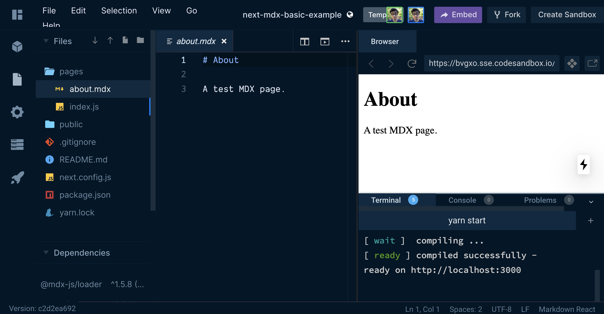
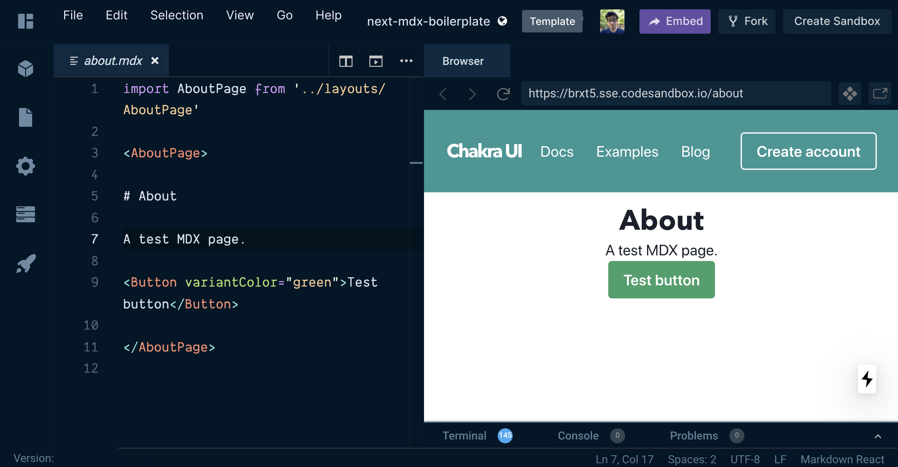

Recently I've been exploring the potential integrating MDX into NextJS and seeing how it handles common use cases for websites (like blogs, docs, etc). I've become a big fan of MDX, it's authoring experience is the equivalent of writing with Wordpress using shortcodes — on steroids (Guten-who?).

MDX is an extension of the Markdown language and adds the ability to write Javascript and JSX (like React components) inside your files alongside Markdown syntax context. It allows you to do things like import React components to use inside of posts, or even write them inline:

```jsx
export const Highlight = ({children, color}) => (
  <span
    style={{
      backgroundColor: color === 'green' ? "#25c2a0" : "#1877F2",
      borderRadius: '2px',
      color: '#fff',
      padding: '0.2rem',
    }}>
    {children}
  </span>
);

<Highlight color="green">Green</Highlight> and <Highlight>blue</Highlight> are my favorite colors.

I can write **Markdown** alongside my _JSX_!
```

NextJS is a framework for developing React applications. In this case, we're leveraging their static build capabilities and creating a prerendered version of the website.

As of writing, Next has [a plugin for MDX](https://www.npmjs.com/package/@next/mdx) that allow for authoring pages as MDX files. So rather than creating a page as `/pages/your-page.jsx` — you create a `/pages/your-page.mdx` file. Combined with Next's static building, it becomes an excellent option for creating blogs, docs, or even landing pages.

Let's see how it works in practice and how well it scales. But first, here's a list of starter projects to get you going 👇🏼

# 📦 Example projects

I setup a new NextJS project (v9.3.4) with MDX and created branches for each stage of the development. That way if you want the most base install possible, you can use that branch. Or if you're interested in using Styled Components, there's a branch progressed to that stage as well. You can also go through each step and it's git commits to see what's integral for each integration.

## [Basic install](https://github.com/whoisryosuke/next-mdx-boilerplate/tree/basic-install)

[🛠 Test it out on CodeSandbox](https://codesandbox.io/s/github/whoisryosuke/next-mdx-boilerplate/tree/basic-install)



- Write content as MDX. Either directly in `/pages/` or import MDX into React pages.

## [Custom Components](https://github.com/whoisryosuke/next-mdx-boilerplate/tree/custom-components)

[🛠 Test it out on CodeSandbox](https://codesandbox.io/s/github/whoisryosuke/next-mdx-boilerplate/tree/custom-components)

- Pass custom components into the MDX Provider (e.g. swap `<h1>` with a React component)

## [Basic example](https://github.com/whoisryosuke/next-mdx-boilerplate/tree/master)

[🛠 Test it out on CodeSandbox](https://codesandbox.io/s/github/whoisryosuke/next-mdx-boilerplate/tree/master)

- Merges "Basic Install" and "Custom Components"

## [Basic layouts](https://github.com/whoisryosuke/next-mdx-boilerplate/tree/basic-layouts)

[🛠 Test it out on CodeSandbox](https://codesandbox.io/s/github/whoisryosuke/next-mdx-boilerplate/tree/basic-layouts)

- Example of using different post layouts

## [Styled Components](https://github.com/whoisryosuke/next-mdx-boilerplate/tree/styled-components)

[🛠 Test it out on CodeSandbox](https://codesandbox.io/s/github/whoisryosuke/next-mdx-boilerplate/tree/styled-components)

- Integrated with Styled Components.
- App is wrapped with a custom theme
- Dynamic stylesheets are written on build and updated client-side

## [Prettier + ESLint](https://github.com/whoisryosuke/next-mdx-boilerplate/tree/prettier)

[🛠 Test it out on CodeSandbox](https://codesandbox.io/s/github/whoisryosuke/next-mdx-boilerplate/tree/prettier)

- Prettier integrated
- Prettier configured for NextJS
- ESLint integrated.
- ESLint configured with Airbnb as base, and NextJS custom rules on top.
    - Accessibility rules (jsx-a11y) included
- Prettier and ESLint integrated together.

## Styled + Prettier

[🛠 Test it out on CodeSandbox](https://codesandbox.io/s/github/whoisryosuke/next-mdx-boilerplate/tree/styled-and-prettier)

- Merges "Styled Components" and "Prettier + ESLint" branches

## [Typescript](https://github.com/whoisryosuke/next-mdx-boilerplate/tree/typescript)

[🛠 Test it out on CodeSandbox](https://codesandbox.io/s/github/whoisryosuke/next-mdx-boilerplate/tree/typescript)

- Same features as basic install
- Integrates Typescript
- Adds `package.json` script for linting TS/TSX files

## [Typescript + Linting](https://github.com/whoisryosuke/next-mdx-boilerplate/tree/typescript-and-prettier)

[🛠 Test it out on CodeSandbox](https://codesandbox.io/s/github/whoisryosuke/next-mdx-boilerplate/tree/typescript-and-prettier)

- Same features as Typescript
- Kinda merges Prettier branch, but swaps `babel-eslint` for Typescript specific parsers
- Includes `tsconfig.json`
- Properly typed (complete with MDX types)

## [Chakra UI](https://github.com/whoisryosuke/next-mdx-boilerplate/tree/chakra-ui)

[🛠 Test it out on CodeSandbox](https://codesandbox.io/s/github/whoisryosuke/next-mdx-boilerplate/tree/chakra-ui)



- Merges "Styled Components" and "Prettier + ESLint" branches
- Integrated Chakra UI
- Use any Chakra UI components inside MDX without imports
- Replaced Styled Components with Emotion ([with proper NextJS integration](https://github.com/zeit/next.js/blob/canary/examples/with-emotion/pages/index.js))
- Added a sample `<Header />` component (from Chakra UI recipes) to the sample layout

## [Chakra UI + Framer Motion](https://github.com/whoisryosuke/next-mdx-boilerplate/tree/chakra-motion)

- Same features as Chakra UI
- Integrates framer-motion library
- Page transition animations (exiting and entering)
- Component-level transition animations (entering and hovering)

# How does it work?

NextJS has a plugin for MDX called [@next/mdx](https://www.npmjs.com/package/@next/mdx). The plugin detects most MDX files in the project and parses them with Webpack (using [@mdx-js/loader](https://www.npmjs.com/package/@mdx-js/loader)). You install both these dependencies and add the plugin to your Next config:

```jsx
npm i @next/mdx @mdx-js/loader
```

`next.config.js`:

```jsx
const withMDX = require('@next/mdx')({
    extension: /\.mdx?$/,

		// Or use this to support MD files too
		// extension: /\.(md|mdx)$/,
})
```

In order to detect MDX files in pages directory (where NextJS picks up React page component automatically normally), you have to add MDX to the 'page file extensions' parameter in the Next config file:

`next.config.js`:

```jsx
module.exports = withMDX({
    pageExtensions: ['js', 'jsx', 'mdx'],
})
```

MDX page content is loaded automatically into the NextJS [app wrapper](https://nextjs.org/docs/advanced-features/custom-app). You can customize this by adding a `_app.js` file to your project. In this file, you can change the page layout of **all** MDX files, usually by wrapping the content in a layout component. In this case, we provide MDX with more components using it's context provider:

`_app.js`:

```jsx
import React from 'react'
import {MDXProvider} from '@mdx-js/react'

const mdComponents = {
    h1: props => <h1 style={{color: 'tomato'}} {...props} />
}

export default ({Component, pageProps}) => (
    <MDXProvider components={mdComponents}>
	    <Component {...pageProps} />
    </MDXProvider>
)
```

And that's all it takes to make a NextJS site where you can write MDX files inside the pages directory and display them on the frontend! And the last step isn't necessary, but makes it easier to bring new, custom components - or overwrite HTML elements with React components.

## Creating MDX pages

There are a few ways to create pages in NextJS that use MDX content. Whether it's directly, where the MDX file is the page, or a React component that includes MDX content inside of it — there are a few avenues to approach when architecting your frontend.

### `/pages/` directory

Place MDX files directly in `/pages/` for them to show. `/pages/your-page.mdx` becomes `[http://localhost:3000/your-page/](http://localhost:3000/your-page/)` on the frontend.

### Import MDX files

Import the MDX files like you would any other React component or NPM dependency. This gives you a parsed version of the MDX courtesy of Webpack on build. Great for authoring content as MDX and importing into React pages.

```jsx
import About from "./about.mdx"

const TestPage = () => {

    return (
        <div>
            <div>Test</div>
            <About />
        </div>
    )
}
export default TestPage
```

### Dynamic import

When you need to load the MDX content on demand, like for a post archive, you can use Next's `dynamic` utility. It's normally used for importing React component dynamically (like `React.lazy`), but instead we leverage it for MDX (since it requires Webpack parsing, just like React components). 

```jsx
import dynamic from 'next/dynamic'

const BlogPostPage = ({ filename }) => {
    console.log('the filename', filename)
    const MDXContent = dynamic(() => import(`../../../${filename}`))
		// Not convinced this works, but this is theoretically how it happens
    const MDXMetadata = dynamic(() => import(`../../../${filename}`).then(mod => mod.metadata))
    console.log('the content', MDXMetadata)
    return (
        <div>
            <h1>Blog</h1>
            <MDXContent />
            <h2>Blog Title: {MDXMetadata.title}</h2>
            <h2>Date: {MDXMetadata.date}</h2>
        </div>
    )
}
```

The path provided to the dynamic import is relative to the page component (`<BlogPostPage>`), and you can't rely on Node's `path`.  Also note here, the `metadata` is an object that is exported from the MDX file (`export const metadata`), and it's pulled out from `dynamic` using a Promise. You can [read more about @next/dynamic here](https://nextjs.org/docs/advanced-features/dynamic-import) or [exporting variables from MDX here.](https://mdxjs.com/getting-started#exports)

# Common Issues

Despite the setup being immensely easy to accomplish, and incredibly powerful, it suffers from it's simplicity. Here are the common issues I discovered while adding features, as well as any workarounds I found.

## Page layouts

In the past, when integrating Markdown with NextJS, you'd parse the Markdown content, check the frontmatter, see if there was a "section" or "layout" parameter, and swap the layout based off that. It's a common practice in most blogs with different "post types". With Next and Markdown, this all would happen inside a dynamic page component (like `/pages/blog/[slug].js`) where you'd use the the NodeJS filesystem (`fs`) to query for the content (and inevitably parse it).

With MDX, it's a much simpler process. You import the layout component and wrap you MDX content in it:

```jsx
import AboutPage from "../layouts/AboutPage"

<AboutPage>

# About

A test MDX page.

</AboutPage>
```

This is much simpler than the alternative, where you're forced to parse the MDX (see below).

You can also wrap your entire website and all MDX content in a single layout by using the `_app.js` wrapper (see above for an example).

## Frontmatter is a problem

By default, the MDX plugin for Next **doesn't support frontmatter**. If you include frontmatter inside your MDX file, it'll **print out inside the content area** of the post 🤮 If you're migrating an existing content library to Next, and you have to use MDX, make sure you're not using frontmatter in any posts (or have an efficient way to convert it to the method below).

The way you handle frontmatter in MDX is a little different. Since MDX allows you to write Javascript inside your files, like importing and using React components, you can also export data. [According to the MDX docs](https://mdxjs.com/getting-started#exports), this is how it looks like:

```jsx
import { sue, fred } from '../data/authors'
export const metadata = {
    authors: [sue, fred]
}
# Post about MDX
MDX is a JSX in Markdown loader, parser, and renderer for ambitious projects.
```

And when you want to use the metadata (i.e. frontmatter), you import it as a module alongside the post content:

```jsx
import React from 'react'
import MDXContent, {metadata} from 'posts/post.mdx'
export default () => (
    <>
    <MDXContent />
    <footer>
        <p>By: {metadata.authors.map(author => author.name).join(', ') + '.'}</p>
    </footer>
    </>
)
```

This works great if you're importing your content directly into your pages (like the second method above in the page creation section).

The only issue? You can't get this dynamically, since MDX files require Webpack parsing to access the metadata like this. Instead, it's recommend you load the data using Node's filesystem, then parse the MDX file manually using [MDX AST](https://mdxjs.com/advanced/ast). Then you can walk through the tree to find the metadata object.

```jsx
{
    "type": "root",
    "children": [
    {
        "type": "import",
        "value": "import { sue, fred } from '../data/authors'\n",
        "position": {
        "start": {
            "line": 1,
            "column": 1,
            "offset": 0
        },
        "end": {
            "line": 2,
            "column": 1,
            "offset": 44
        },
        "indent": [
            1
        ]
        }
    },
    {
        "type": "export",
        "value": "export const metadata = {\n  authors: [sue, fred]\n}",
        "position": {
        "start": {
            "line": 2,
            "column": 1,
            "offset": 44
        },
        "end": {
            "line": 4,
            "column": 2,
            "offset": 94
        },
        "indent": [
            1,
            1
        ]
        }
    },
```

It's not clear how to get the AST however? The docs don't make it clear anywhere how to parse MDX manually without some sort of plugin for a framework (like CRA or Next). I'm assuming you use [the MDX loader for Webpack](https://www.npmjs.com/package/@mdx-js/loader), but it's not clear how to use it on demand and dynamically.

## Post Archives / Post Summaries

You use the `getStaticProps` method in your page (like a blog archive `pages/blog/archive.js`). In the method, you use Node's `fs` method to access the MDX content directory. Then you can loop over the posts however you need.

Since you will likely need frontmatter, you'll need to parse the MDX as an AST and navigate it to find that. Here you can also try to pull a blog summary by avoiding any JS that may be at the top of the MDX.

The major issue with this is the amount of processing required. Each page that references the MDX content will be required to parse it separately, since each page executes it's own `getStaticProps` lifecycle. You could try to cache the results? Or pass a huge data object around the client-side context. But at that point, you might want to explore options like [Gatsby](https://www.gatsbyjs.org/docs/mdx/getting-started/) that create a unified data layer with GraphQL. Getting frontmatter data is [as easy as a GraphQL query.](https://www.gatsbyjs.org/docs/mdx/writing-pages/#using-frontmatter-in-mdx)

**Example of an archive page:**

```jsx
export async function getStaticProps({ params }) {
    const postsDirectory = path.join(process.cwd(), 'posts')
    const mdxFiles = fs.readdirSync(postsDirectory)
    // const mdxFiles = fs.readdirSync("posts")
    // Loop through all post files and create array of slugs (to create links)
    const paths = files.map(filename => ({ slug: filename.replace(".mdx", "") }));

    // Optionally loop through files, get content, and parse frontmatter
    const postsWithFrontmatter = files.map(filename => {
        const postContent = fs.readFileSync(path.join("posts", params.slug + ".mdx")).toString();

        // Dont do this.
        // const frontmatter = matter(postContent)

        // Parse the MDX as an AST instead
        // Use the MDX library to parse here "server-side"
        // Pass the parsed data back to page component below

        return ({
            slug: filename.replace(".mdx", ""),
            frontmatter
        })
    })

    return {
        props: {
            posts: paths
            // or posts: postsWithFrontmatter
        }
    }
}
```

**Example of a single page:**

Here we use the `@next/dynamic` library to dynamically load the MDX data using Webpack (since Webpack parses the content for us, and without it we'd have a giant unparsed string of MDX).

`pages/blog/post/[slug].js`:

```jsx
import fs from 'fs'
import path from 'path'
import dynamic from 'next/dynamic'

const BlogPostPage = ({ filename }) => {
    console.log('the filename', filename)
    const MDXContent = dynamic(() => import(`../../../${filename}`))
		// Official syntax - but doesn't work for me personally?
    const MDXMetadata = dynamic(() => import(`../../../${filename}`).then(mod => mod.metadata))
    console.log('the content', MDXMetadata)
    return (
        <div>
            <h1>Blog</h1>
            <MDXContent />
            <h2>Blog Title: {MDXMetadata.title}</h2>
            <h2>Date: {MDXMetadata.date}</h2>
        </div>
    )
}

export async function getStaticProps({ params }) {
    const filename = path.join("content/blog", params.slug + ".mdx")

    // const frontmatter = matter(mdxPost)

    return {
        props: {
            filename
        },
    }
}

export async function getStaticPaths() {
    const postsDirectory = path.join(process.cwd(), 'content/blog')
    const mdxFiles = fs.readdirSync(postsDirectory)
    console.log('the queried pages', mdxFiles)
    // Loop through all post files and create array of slugs (to create links)
    const paths = mdxFiles.map(filename => ({
        params: {
            slug: filename.replace(".mdx", "")
        }
    }));

    return {
        paths,
        fallback: false
    }
}

export default BlogPostPage
```

## Linting MDX

Writing MDX is great, but with any declarative syntax it can be easy to make a small mistake that breaks the entire code. [MDX supports linting using ESLint](https://github.com/mdx-js/eslint-mdx), which statically analyzes your MDX content and checks if it passes predetermined rules. This works great for detecting small issues while writing.

```bash
yarn add -D eslint-plugin-mdx
```

However, it breaks when you try to use MDX for what it's for. For example, when you want to wrap a page in a certain layout, you just wrap the entire MDX file's content in a React component that contains the layout (see above "Page Layouts"). 

```markdown
<PageLayout>

# MDX Page

This content prints correctly. But linting will fail at the code block.

    ```js
    const TestComponent = () => {
        return(<div>Test</div>)
    }
    ```

All this content will look improperly colored in the code editor now.

</PageLayout>
```

The issue with this style of writing is that we're mixing Markdown and JSX. There's usually not an issue with it, but it has some odd edge cases that you'll encounter quickly. Ideally if you write JSX, you shouldn't place Markdown inside it. It works, the MDX parser will convert Markdown inside React components into HTML. But the linter, on the other hand, has some issues parsing the data according to it's rules. 

If you include a code example that uses Javascript inside your MDX using "code fences" (or the three tildes followed by the language) it will break the linter. The issue lies with the way our MDX file is setup. We wrap the Markdown/MDX content in a React component, which triggers the JSX linting rules. Because of this, ESLint now checks our Markdown content for JSX that may break it. It doesn't stop until the component is closed, which is an issue, since it has to wrap the whole page.

This doesn't seem like a big issue, but it defeats the purpose of using MDX. The point is to be able to mix Markdown and JSX. If you can't do simple things like page layouts and you're forced back into full JSX (when using JSX), it ruins the authoring experience. It discourages the use of JSX since the author will have to format all nested content in JSX or HTML, which is the tedium we sought to escape with MDX.

Thankfully this is simply the linting process, not the build, and can be improved. The code works, just fails testing, which isn't a deal breaker for smaller projects.

## Displaying 404 for pages that don't exist

If you use the `getStaticPaths` method in any dynamic pages, NextJS makes a static map of all your dynamic routes (like blog posts). If a page isn't included in the static path method, a 404 will be displayed.

If for whatever reason the component doesn't receive the post data it needs to render, like a slug, you can return NextJS' error page:

```jsx
import { useRouter } from 'next/router'
import ErrorPage from 'next/error'

// Place somewhere inside the page component's render cycle
const router = useRouter()
if (!router.isFallback && !post?.slug) {
    return <ErrorPage statusCode={404} />
}
```

## Handling emojis and image URLs

MDX supports remark plugins, so you can use plugins like [remark-images](https://github.com/remarkjs/remark-images) and [remark-emoji](https://github.com/rhysd/remark-emoji).

Images allows you to write image URLs directly (e.g. "[http://my.domain.app/image.png"](http://my.domain.app/image.png%22)) and it converts it to a Markdown friendly image syntax. The emoji plugin allows you to write emojis in the Markdown syntax (e.g. `:dog:` becomes 🐶).

`next.config.js`:

```jsx
const images = require('remark-images')
const emoji = require('remark-emoji')

const withMDX = require('@next/mdx')({
    extension: /\.mdx?$/,
    options: {
    mdPlugins: [images, emoji]
    }
})
```

# Take the Next step to MDX

I hope this article was able to enlighten you on the process for handling MDX with Next, as well as it how it compares to a similar and popular framework - Gatsby. And with plenty of starter templates in a variety of React flavors, you've got no excuse to try it out today!

If you have any questions or want to show off your MDX project in Next, comment here or [hit me up on Twitter!](https://twitter.com/whoisryosuke)

# References

- [http://code.whoisryosuke.com/docs/js/react/next/mdx](http://code.whoisryosuke.com/docs/js/react/next/mdx)
- [https://mdxjs.com/getting-started/next](https://mdxjs.com/getting-started/next)
- [https://nextjs.org/docs/advanced-features/static-html-export](https://nextjs.org/docs/advanced-features/static-html-export)
- [https://nextjs.org/docs/advanced-features/custom-app](https://nextjs.org/docs/advanced-features/custom-app)
- [https://github.com/hashicorp/next-mdx-enhanced](https://github.com/hashicorp/next-mdx-enhanced)
    - Plugin that takes MDX to next level with NextJS
        - Allows you to use different layouts
        - Lets you use frontmatter (since by default it doesn't work)
- [https://github.com/zeit/next.js/issues/8857](https://github.com/zeit/next.js/issues/8857)
    - NextJS issue asking for frontmatter support for MDX
    - Points people to [MDX export example](https://mdxjs.com/getting-started#exports)
    - [https://spectrum.chat/mdx/general/how-do-i-read-only-mdx-exports-without-parsing-the-mdx-itself~3c6313de-4943-43c6-9d19-e22395f9df57?m=MTU3NzkwMTQ1NTkzNQ==](https://spectrum.chat/mdx/general/how-do-i-read-only-mdx-exports-without-parsing-the-mdx-itself~3c6313de-4943-43c6-9d19-e22395f9df57?m=MTU3NzkwMTQ1NTkzNQ==)
        - Talks about not being able to load MDX frontmatters/exported metadata from files. Solution? Use [MDX AST](https://mdxjs.com/advanced/ast) - parse MDX into an AST and find the exports inside. LOL
- [https://github.com/IanChen83/next-mdx-frontmatter](https://github.com/IanChen83/next-mdx-frontmatter)
    - Old plugin that provides frontmatter support to MDX
- [Static Site Generation with NextJS by Ben Awad](https://www.youtube.com/watch?v=pY0vWYLDDco)
    - Covers using Node `fs` and NextJS `getStaticPaths` method for querying dynamic page data.
    - Example of doing things manually. Rather than using MDX plugin, manually parses Markdown. Similar to [NextJS official example for Markdown blogs](https://github.com/zeit/next.js/blob/canary/examples/blog-starter/pages/posts/%5Bslug%5D.js).
    - Not good example for MDX, since you shouldn't manually parse it (little more complex than just parsing, needs Webpack bundling for deps and whatnot).
- [https://github.com/zeit/next.js/tree/canary/examples/with-mdx](https://github.com/zeit/next.js/tree/canary/examples/with-mdx)
    - Hyper basic example.
- [https://github.com/mdx-js/mdx/tree/master/examples/next](https://github.com/mdx-js/mdx/tree/master/examples/next)
    - Shows how to pass components using MDXProvider
- [https://github.com/lorenseanstewart/nextjs-mdx-blog-kit](https://github.com/lorenseanstewart/nextjs-mdx-blog-kit)
    - A little old. Bad practices (dev deps in deps).
    - One of the few examples I could find of [querying page/post data](https://github.com/lorenseanstewart/nextjs-mdx-blog-kit/blob/master/utils/blog-engine.js) in [the layout](https://github.com/lorenseanstewart/nextjs-mdx-blog-kit/blob/master/pages/_app.js#L27) (important for things like changing layout based on post type).
- [https://github.com/gregsantos/next-mdx-starter](https://github.com/gregsantos/next-mdx-starter)
    - 2 years old
- [https://github.com/zeit/next.js/blob/canary/examples/with-emotion/pages/index.js](https://github.com/zeit/next.js/blob/canary/examples/with-emotion/pages/index.js)
- [https://chakra-ui.com/getting-started](https://chakra-ui.com/getting-started)
- [https://www.youtube.com/watch?v=zIDpZi-36Qs&list=WL&index=12&t=0s](https://www.youtube.com/watch?v=zIDpZi-36Qs&list=WL&index=12&t=0s)
    - Video tutorial that covers adding Framer Motion to NextJS
- [https://github.com/zeit/next.js/tree/canary/examples/with-typescript](https://github.com/zeit/next.js/tree/canary/examples/with-typescript)
- [https://www.robertcooper.me/using-eslint-and-prettier-in-a-typescript-project](https://www.robertcooper.me/using-eslint-and-prettier-in-a-typescript-project)
    - Guide I used for setting up TS + Linting version
- [https://github.com/typescript-cheatsheets/react-typescript-cheatsheet](https://github.com/typescript-cheatsheets/react-typescript-cheatsheet)
- [https://www.typescriptlang.org/docs/handbook/modules.html](https://www.typescriptlang.org/docs/handbook/modules.html)
- [https://github.com/mdx-js/mdx/pull/811/files](https://github.com/mdx-js/mdx/pull/811/files)
    - Pull request in v2 where I found out they had types
- [https://github.com/mdx-js/mdx/blob/v2/packages/react/types/index.d.ts](https://github.com/mdx-js/mdx/blob/v2/packages/react/types/index.d.ts)
    - Types for MDX React in v2
- [https://github.com/zeit/next.js/issues/7515](https://github.com/zeit/next.js/issues/7515)
    - How to properly type `_app.js`