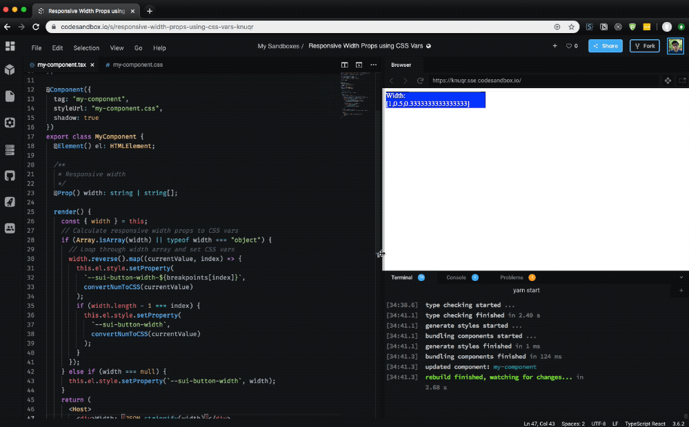

I've been getting into design systems, component design, and theming recently — and one of the pinnacles of contemporary styling in web applications that has caught my eye is prop-based design. It's similar to utility CSS frameworks like Tachyons, Basscss, or Tailwind, which use shorthand CSS class names to apply properties to components (`<div class="w-50">` for setting 50% width). Rather than using CSS class names, we use the component's props to provide the values (`<Box width="50%">`).

I wanted to explore some different ways you can use Web Component properties to imitate the functionality you get from libraries like [Styled System](https://styled-system.com/). Styled System uses component props like width or color and translates the value to CSS using Styled Components. I was looking to replicate the same effect using only vanilla JS and CSS _(and StencilJS to make Web Components easier to work with)._



# Responsive Width Props

Like Styled System, you should be able to pass a string or array. If array is passed, then assume it's values for responsive media queries.

```js
// Example from Styled System
<Box width={[1, 1 / 2, 1 / 3]} />

// Would render a box
// 100% at mobile
// 50% at tablet
// 33% at desktop
```

To accomplish this with a Web Component, you could use CSS custom properties and a little JS:

```css
:host {
  --sui-button-width: 100%;
  width: var(--sui-button-width);
  display: block;
}

@media only screen and (min-width: 400px) {
  :host {
    width: var(--sui-button-width-mobile, var(--sui-button-width));
  }
}

@media only screen and (min-width: 800px) {
  :host {
    width: var(--sui-button-width-tablet, var(--sui-button-width));
  }
}

@media only screen and (min-width: 1200px) {
  :host {
    width: var(--sui-button-width-desktop, var(--sui-button-width));
  }
}
```

```ts
import { Component, Element, Host, Prop, h } from '@stencil/core'

const breakpoints = ['desktop', 'tablet', 'mobile']

const convertNumToCSS = number => {
  if (typeof number == 'number') {
    return `${Math.floor(number * 100)}%`
  }
  return number
}

@Component({
  tag: 'my-component',
  styleUrl: 'my-component.css',
  shadow: true,
})
export class MyComponent {
  @Element() el: HTMLElement

  /**
   * Responsive width
   */
  @Prop() width: string | string[]

  render() {
    const { width } = this
    // Calculate responsive width props to CSS vars
    if (Array.isArray(width) || typeof width === 'object') {
      // Loop through width array and set CSS vars
      width.reverse().map((currentValue, index) => {
        this.el.style.setProperty(
          `--sui-button-width-${breakpoints[index]}`,
          convertNumToCSS(currentValue)
        )
        if (width.length - 1 === index) {
          this.el.style.setProperty(
            `--sui-button-width`,
            convertNumToCSS(currentValue)
          )
        }
      })
    } else if (width === null) {
      this.el.style.setProperty(`--sui-button-width`, width)
    }
    return (
      <Host>
        <div>Hello, World! I'm Stencil 'Don't call me a framework' JS</div>
      </Host>
    )
  }
}
```

And it'd be used like this in your app:

```js
<my-component width={[1 / 3, 1 / 2, 1]} />
```

[See an example on CodeSandbox here.](https://codesandbox.io/s/responsive-width-props-using-css-vars-knuqr?fontsize=14&hidenavigation=1&theme=dark)

## How does it work?

Responsive widths work by using an array of values, either raw numbers (like 1/2 or 1/3) or percentage based strings (50% or 33%), and setting the width for each breakpoint based on the array values. If you pass 3 values into the array, it sets each value to a breakpoint from the largest to the smallest breakpoint. If there are more breakpoints than array values, the smaller breakpoints are skipped.

Our component checks the width prop for an array, and if it finds one, loops through to set CSS custom properties for each breakpoint. We set the properties using our component's `el` property, which is essentially a "ref" to the component created by Stencil. This allows us to change properties on the element like we would if we used a `querySelector` or `getElementById`. In this case, we use the `setProperty` method on the element's style property to set the CSS custom property.

The way we handle associating responsive array values to breakpoints is by reversing the width array! The biggest value (assumed to be the biggest viewport) becomes first. This way when we loop through the responsive widths (in reverse), they'll match up to the breakpoints array we created. If there aren't enough values for breakpoints, we don't set the CSS custom property, meaning smaller breakpoints get "skipped" first.

Meaning to make a component that has a width of 33% on tablet, 50% on desktop, and 100% on widescreen, you'd do this:

```js
// Breakpoints
const breakpoints = ['widescreen', 'desktop', 'tablet', 'mobile']
// Component
;<my-component width={[1 / 3, 1 / 2, 1]} />
```

I'm using the Styled System approach for responsive width props, which I prefer over other libraries that use objects to explicitly set responsive width (`<Box width={{'small': '33%', 'tablet': '50%' }}>`). It's less verbose. But if you wanted this method, it'd actually be similar to implement.

In this example, the mobile breakpoint would be "skipped", since there wasn't a value set for it. But it doesn't mean that it doesn't have a "default" value! We set that in the CSS, where each breakpoint is hardcoded (or looped through using a SASS mixin) with a width property that uses the CSS `var()` function.

The beauty of the `var()` function is that is supports a fallback value, which can also be another CSS custom property. Which means we can set each breakpoint's width to use a CSS custom property appended with the breakpoint name (`--sui-button-width-mobile`) and use the base width of the component as a fallback (`width: var(--sui-button-width-mobile, var(--sui-button-width));`). This way, if we don't set a breakpoint's CSS custom property (such as a user not setting enough array values in their width prop), we'll use the component's base width instead. If an array is detected, the component's base width is set to the width's smallest array value. It assumes you'd want smaller viewports to act similarly to the smallest setting, allowing for elegant props like `<my-component width={[1,1/2]}>` to set 100% width on all viewports except the largest.

# What are the drawbacks?

Honestly from what I've observed from my small experiment, not too many!:

- Extra processing time since the properties must be computed upon render, and block render until they're complete.
- May cause conflicts with CSS if you try to set the width somewhere else, since the CSS custom properties are set using inline values (which carry specificity weight). You'd have to override the width property, rather than using the CSS custom property somewhere else. This would come in handy if you needed a widths based on custom breakpoints, instead of your design system's default.

Let me know if you notice anything in your own testing!

# Margin, padding, and more

It's easy to take this implementation and use it to create responsive margin, padding, and any other props that are based off CSS breakpoints. The only difference would be instead of converting the prop's array value to a percentage, you'd convert it to a `px`, `rem`, or `em` format. Or even better, you could multiply the value by a CSS custom property for "spacing" (`calc(var(—sui-button-padding-mobile) * var(—sui-spacing))`). This way you maintain a proper "rhythm" for the spacing in your app, no matter what value is passed.

```ts
import { Component, Element, Host, Prop, h } from '@stencil/core'

const breakpoints = ['desktop', 'tablet', 'mobile']

const convertNumToCSS = number => {
  if (typeof number == 'number') {
    return `${Math.floor(number * 8)}em`
  }
  return number
}

@Component({
  tag: 'my-component',
  styleUrl: 'my-component.css',
  shadow: true,
})
export class MyComponent {
  @Element() el: HTMLElement

  /**
   * Responsive padding
   */
  @Prop() padding: string | string[]

  render() {
    const { padding } = this
    // Calculate responsive padding props to CSS vars
    if (Array.isArray(padding) || typeof padding === 'object') {
      // Loop through padding array and set CSS vars
      padding.reverse().map((currentValue, index) => {
        this.el.style.setProperty(
          `--sui-button-padding-${breakpoints[index]}`,
          convertNumToCSS(currentValue)
        )
        if (padding.length - 1 === index) {
          this.el.style.setProperty(
            `--sui-button-padding`,
            convertNumToCSS(currentValue)
          )
        }
      })
    } else if (padding === null) {
      this.el.style.setProperty(`--sui-button-padding`, padding)
    }
    return (
      <Host>
        <div>Hello, World! I'm Stencil 'Don't call me a framework' JS</div>
      </Host>
    )
  }
}
```

This functionality could be abstracted fairly easily depending on your use, allowing you to run a single function to parse each prop into CSS custom properties.

Hope this inspires you to think about some different ways of handling Web Components and CSS styling, and how you can incorporate concepts from utility CSS practically into your component API.

Kanpai,
Ryo

# References

- [https://stenciljs.com/docs/styling#using-a-css-variable](https://stenciljs.com/docs/styling#using-a-css-variable)
- [https://css-tricks.com/updating-a-css-variable-with-javascript/](https://css-tricks.com/updating-a-css-variable-with-javascript/)
- [https://github.com/ionic-team/stencil/issues/507#issuecomment-364509518](https://github.com/ionic-team/stencil/issues/507#issuecomment-364509518)
- [https://codesandbox.io/s/responsive-width-props-using-css-vars-knuqr](https://codesandbox.io/s/responsive-width-props-using-css-vars-knuqr?fontsize=14&hidenavigation=1&theme=dark)
- [https://codesandbox.io/s/responsive-padding-props-using-css-vars-m2otc](https://codesandbox.io/s/responsive-padding-props-using-css-vars-m2otc)

### Software Requirements

| Software      | Version |
| ------------- | ------- |
| @stencil/core | 1.7.5   |
