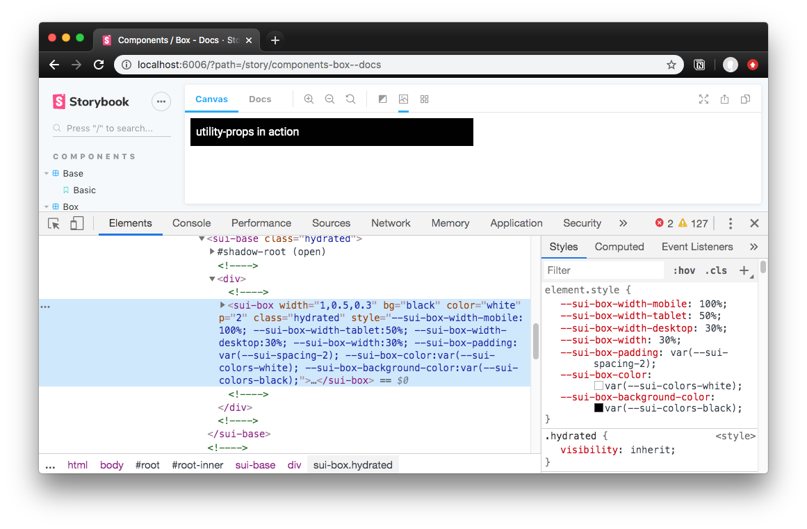
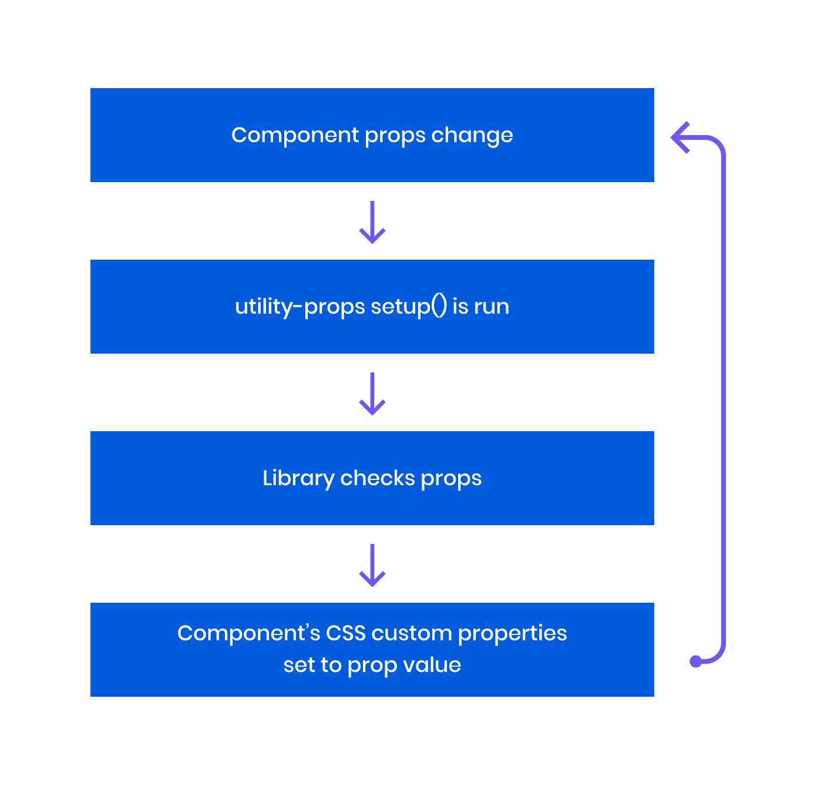
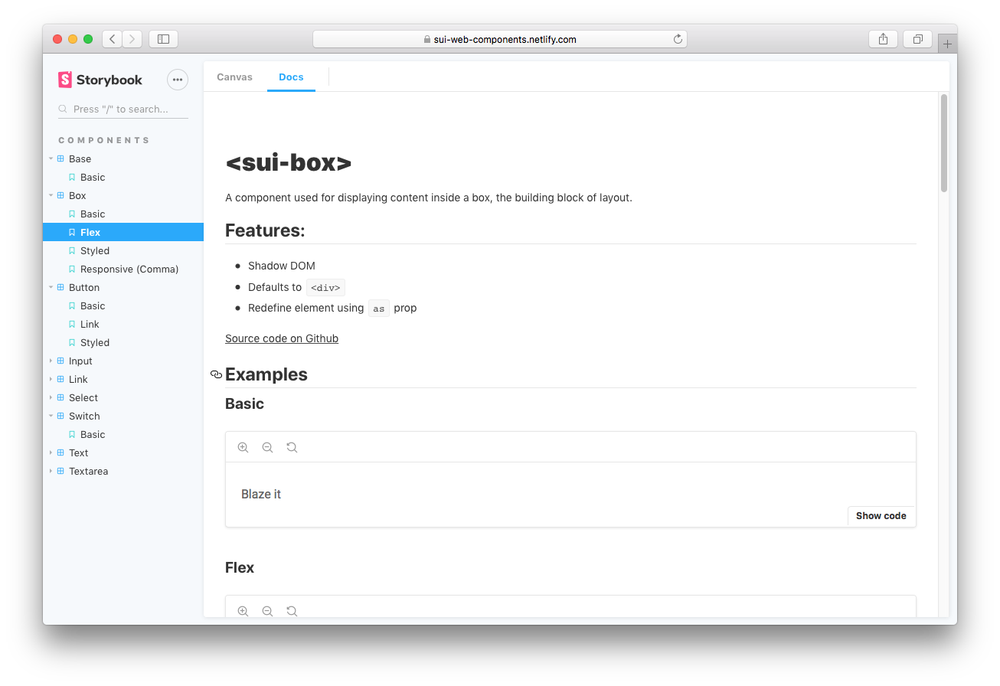
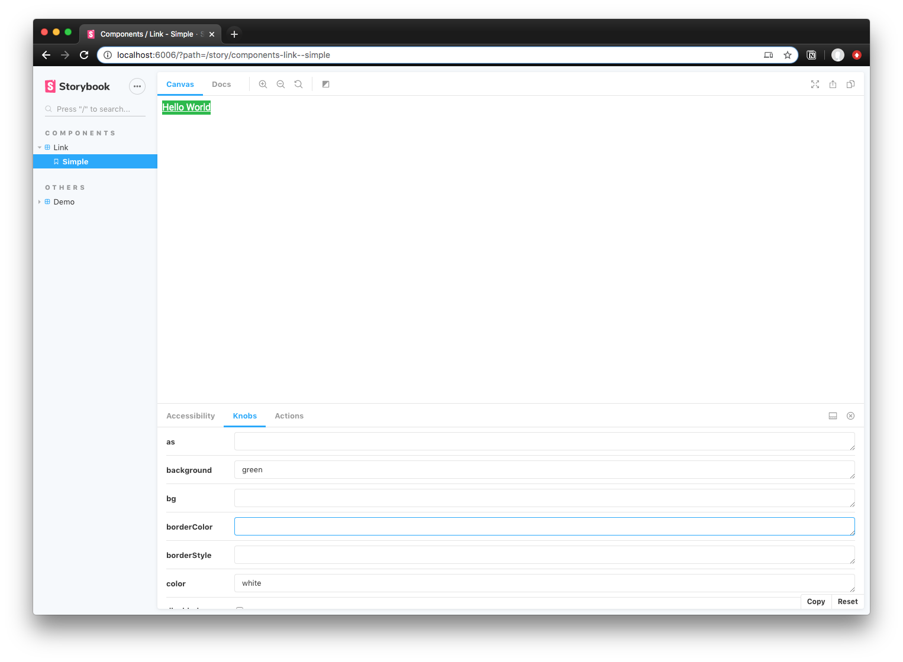

I like to work fast and I prefer tools that facilitate that pace of workflow. When I'm designing interfaces for the web, I'm often bouncing back and forth between HTML and CSS, wherever each are located. It becomes a tedious back and forth process of synchronizing my mental model of the DOM with the style declarations in the CSS. It's a tedium I often endure for the sake of adding extra margin to a component with pre-existing styles (usually from a design system). And don't get me started on making media queries for responsive layouts, which require a fair bit of boilerplate just to setup each time.

I became attracted to a declarative component model by Styled System, which uses "utility" props to style it's components. Instead of writing the CSS, you change the component's styles using it's props. For instance, you could change the background color of a component using a `bg` prop (`<Button bg="red">`). The component reflects these changes in the CSS for you, allowing you to write out your components and styles together without worrying about class names or selectors.

I created utility-props as an agnostic solution for providing web components a similar, flexible, and consistent styling API. Using the library, you can pick and choose which "utility" props (essentially CSS properties) you'd want the component to support. Then it becomes this easy to create a box component with a responsive width (100% on mobile, 30% on desktop), white text, and a black background without a single line of CSS:

```js
<x-box width={[1, 0.5, 0.3]} bg="black" color="white" p="2"></x-box>
```



I'll go over the how and why I created this library, but if you're interested in seeing this library in action, check out [this small component library](https://github.com/whoisryosuke/sui-web-components) I created. It uses StencilJS to create web components and integrates the utility-props with the framework. Otherwise, let's dive deep into declarative web component styling 🏄‍♂️

## Why use "utility props"?

The reasons are very simple:

- Helps devs who may not want to write CSS create or alter existing styling. Empowers them through convenient props.
- Keeps styling consistent by defaulting to theme variables (aka design tokens) where possible.
- Helps visualize core styling without bouncing between HTML, CSS, and class names.
- Faster than writing the CSS equivalent when used for many common use cases.
- Works with any framework, from Vue to React and everything in between.
- Uses CSS custom properties for styling, allowing you to override anywhere (CSS or even JS). Not as enclosed as CSS in JS solutions.
- Doesn't use class names, and uses namespaced custom properties, meaning no accidental style overrides or conflicts.
- Can give components presentational independence, allowing you position, size, and space them without nesting in a dedicated layout component (like a `<Box>`).

It becomes clear once you work with the paradigm and compare it to the predecessor. Here's what a responsive layout looks like with utility prop powered components:

```html
<!-- 100% on mobile / 50% on tablet / 30% on desktop -->
<sui-box display="flex">
  <sui-box width="1,0.5,0.3">
    Box contents
  </sui-box>
  <sui-box width="1,0.5,0.3">
    Box contents
  </sui-box>
  <sui-box width="1,0.5,0.3">
    Box contents
  </sui-box>
</sui-box>
```

And that same layout in classic HTML and CSS:

```html
<div class="flex">
  <div class="3-col">
    Box contents
  </div>
  <div class="3-col">
    Box contents
  </div>
  <div class="3-col">
    Box contents
  </div>
</sui-box>

<style>
  .flex {
    display: flex;
  }
  .three-col {
    width:33%;
  }
  @media only screen and (min-width: 800px) {
    .three-col {
      width:50%;
    }
  }
  @media only screen and (min-width: 400px) {
    .three-col {
      width:100%;
    }
  }
</style>
```

Using props is much simpler, faster, and reduces the verbose amount of boilerplate required to accomplish simple tasks like responsiveness.

## How it works



You call the `setup()` function as part of the web component's lifecycle, ideally running each time any prop changes. The setup checks for each prop you provide, parses the prop value into a CSS custom property, and attaches it to the web component's inline style block. The custom property is derived by the component name your provide, as well as an optional namespace parameter in the setup function.

```js
setup(propList, componentName, props)
// setup(['width', 'color'], 'component', props);
```

The styles get "attached" to the web component by using the DOM's native `element.style.setProperty()` method. When passing the component props, you include a prop that acts as a "ref" to the web component element in the DOM (similar to running a `getElementById()`). The library looks for a prop named `el`, which should be the ref, then runs the `style.setProperty()` method on it. You can either include this prop on your component, or merge the ref with the props (`const props = { ...componentProps, el: componentRef }`).

Inside your component's CSS, you setup your CSS to use each CSS custom property that this library creates and updates. For example, for the `font-family` prop, you need the following CSS: `font-family: var(--sui-componentname-font-family);`. So for every utility prop you use, you need a matching CSS property for it that uses the appropriate CSS custom property.

There's a bit more that happens behind the scenes to parse or convert your prop values, like handling colors or spacing, you can learn more about that below.

### **Converting Prop Values**

All prop values go through a "conversion" process, based on the prop type. For example, the `width` prop uses the "sizing" conversion, versus the `p` (or padding) prop which uses "spacing" conversions.

The following are the type of props and how they're handled:

- **Sizing**: Converts any value less than 1 to a percent (e.g. `0.3` becomes `30%`). Otherwise, the prop value is provided directly as the CSS custom property.
- **Color**: Converts any value that is not hex, RGB, or HSL to a theme token (aka CSS custom property like `--sui-colors-red`). Otherwise, the prop value is provided directly as the CSS custom property.
- **Spacing**: Converts any number less than 8 to a spacing theme token (aka CSS custom property like `--sui-spacing-3`). Otherwise, the prop value is provided directly as the CSS custom property.
- **Default**: All prop values are provided directly as the CSS custom property.

If the prop supports being responsive, then it's checked if it's an array/object, and loops through running any conversions necessary.

Here's an example of the function that handles the sizing conversion:

```js
/**
 * Converts number to percent
 * or returns the value (for units with px/em/etc)
 * @param number Number or string (of a number or CSS unit)
 */
const convertNumToPercent = (number: number | string) => {
  let parsedNum
  if (typeof number === 'string') {
    parsedNum = parseFloat(number)
  } else {
    parsedNum = number
  }
  // If it's a number type, assume user wants percent
  // If string passed, parsed num should be 1 or less, and contain no characters
  if (
    typeof number == 'number' ||
    (typeof number == 'string' && parsedNum <= 1 && !/[a-z]/i.test(number))
  ) {
    return `${Math.floor(parsedNum * 100)}%`
  }
  return number
}
```

### **Responsive Props**

For props that can be responsive, you can provide an array as a value to change styling based on breakpoints/viewports.

```js
// Renders a box that's 100% on mobile, 50% on tablet, and 30% on desktop.
<x-box width={[1, 0.5, 0.3]}></x-box>
<x-box width={['100%', '50%', '30%']}></x-box>
// If your app doesn't support array-based props, you can use comma-separated values
<x-box width="1,0.5,0.3"></x-box>
<x-box width="100%,50%,30%"></x-box>
```

To enable responsive props, you have to add CSS custom properties to your component for each breakpoint you define. By default the library uses **mobile**, **tablet**, and **desktop** viewports. You can define any name and any number of viewports you need. Here's an example of the required CSS for the default breakpoints:

`your-component.css`:

```css
/* A CSS selector for your web component. `:host` works if you use shadow DOM */
:host,
your-component {
  /* Optional. Allows you to set defaults. */
  --sui-box-width: 100%;
  --sui-box-height: auto;
  --sui-box-padding: 0;
  --sui-box-margin: 0;
  --sui-box-font-size: var(--sui-fonts-sizes-body, inherit);

  --sui-box-align-items: center;
  --sui-box-align-content: center;
  --sui-box-justify-content: normal;
  --sui-box-flex-direction: row;
  --sui-box-flex-wrap: wrap;

  /* Everything below is required (assuming you use all responsive props) */

  width: var(--sui-box-width);
  min-width: var(--sui-box-min-width);
  max-width: var(--sui-box-max-width);
  height: var(--sui-box-height);
  max-height: var(--sui-box-max-height);
  min-height: var(--sui-box-min-height);
  padding: var(--sui-box-padding);
  margin: var(--sui-box-margin);

  font-size: var(--sui-box-font-size);
  text-align: var(--sui-box-text-align);
}

/* 
* Create media queries for each breakpoint (mobile, tablet, desktop by default)
* You control your own breakpoint widths here.
*/
@media only screen and (min-width: 400px) {
  :host,
  your-component {
    width: var(--sui-box-width-mobile, var(--sui-box-width));
    max-width: var(--sui-box-max-width-mobile, var(--sui-box-max-width));
    min-width: var(--sui-box-min-width-mobile, var(--sui-box-min-width));
    height: var(--sui-box-height-mobile, var(--sui-box-height));
    max-height: var(--sui-box-max-height-mobile, var(--sui-box-max-height));
    min-height: var(--sui-box-min-height-mobile, var(--sui-box-min-height));

    padding: var(--sui-box-padding-mobile, var(--sui-box-padding));
    margin: var(--sui-box-margin-mobile, var(--sui-box-margin));

    font-size: var(--sui-box-font-size-mobile, var(--sui-box-font-size));
    text-align: var(--sui-box-text-align-mobile, var(--sui-box-text-align));
  }
}

@media only screen and (min-width: 800px) {
  :host,
  your-component {
    width: var(--sui-box-width-tablet, var(--sui-box-width));
    max-width: var(--sui-box-max-width-tablet, var(--sui-box-max-width));
    min-width: var(--sui-box-min-width-tablet, var(--sui-box-min-width));
    height: var(--sui-box-height-tablet, var(--sui-box-height));
    max-height: var(--sui-box-max-height-tablet, var(--sui-box-max-height));
    min-height: var(--sui-box-min-height-tablet, var(--sui-box-min-height));

    padding: var(--sui-box-padding-tablet, var(--sui-box-padding));
    margin: var(--sui-box-margin-tablet, var(--sui-box-margin));

    font-size: var(--sui-box-font-size-tablet, var(--sui-box-font-size));
    text-align: var(--sui-box-text-align-tablet, var(--sui-box-text-align));
  }
}

@media only screen and (min-width: 1200px) {
  :host,
  your-component {
    width: var(--sui-box-width-desktop, var(--sui-box-width));
    max-width: var(--sui-box-max-width-desktop, var(--sui-box-max-width));
    min-width: var(--sui-box-min-width-desktop, var(--sui-box-min-width));
    height: var(--sui-box-height-desktop, var(--sui-box-height));
    max-height: var(--sui-box-max-height-desktop, var(--sui-box-max-height));
    min-height: var(--sui-box-min-height-desktop, var(--sui-box-min-height));

    padding: var(--sui-box-padding-desktop, var(--sui-box-padding));
    margin: var(--sui-box-margin-desktop, var(--sui-box-margin));

    font-size: var(--sui-box-font-size-desktop, var(--sui-box-font-size));
    text-align: var(--sui-box-text-align-desktop, var(--sui-box-text-align));
  }
}
```

### Theme Tokens

This library also defaults to using "theme tokens" if possible by way of CSS custom properties. For "color" based props for instance, if you use words, instead of hex codes, RGB, or HSL color values, the library will try to use a CSS custom property based on your word.

```js
<x-box color="blue"></x-box>
// Renders a box with text that references the CSS custom property for blue
// Becomes: `--sui-componentname-color: var(--sui-colors-blue);`
// Used in CSS: `color: var(--sui-componentname-color);`
```

"Spacing" properties, on the other hand, will access the appropriate CSS custom property using the prop value if you provide a number from 1-10. For example, `<x-box p="3">` would equate to `--sui-componentname-padding: var(--sui-spacing-1)`. [See the conversion section above](https://github.com/whoisryosuke/utility-props#converting-prop-values) for more details on how this works.

This allows you to store your design tokens inside of CSS custom properties and enforce your design system's guidelines across the components.

In order for the theme tokens to work, you must define them somewhere in your application. You can either put it in the `:root` of your global CSS or create a component (like a `<theme-provider>`) to pass the tokens (or CSS custom properties) down to nested components. Here's an example for the `<theme-provider>` component CSS:

```css
:host {
  /* sizes */
  /* Required for any spacing props (padding, margin) */
  --sui-spacing: 8px;
  --sui-spacing-0: 0px;
  --sui-spacing-1: 4px;
  --sui-spacing-2: 8px;
  --sui-spacing-3: 16px;
  --sui-spacing-4: 32px;
  --sui-spacing-5: 64px;
  --sui-spacing-6: 128px;
  --sui-spacing-7: 256px;
  --sui-spacing-8: 512px;

  /* Colors */
  /* None of these names are required. Just here as example. */
  /* Use any color names you'd like, even separated by dashes  */
  --sui-colors-white: #fefefe;
  --sui-colors-black: #010101;
  --sui-colors-red: #db2828;
  --sui-colors-orange: #f2711c;
  --sui-colors-yellow: #fbbd08;
  --sui-colors-green: #21ba45;
  --sui-colors-blue: #2185d0;
  --sui-colors-violet: #6435c9;
  --sui-colors-primary: blue;
  --sui-colors-secondary: #6d59f0;
  --sui-colors-text: rgba(0, 0, 0, 0.6);
  --sui-colors-text-inverted: rgba(255, 255, 255, 0.9);
  --sui-colors-bg: #fff;
  --sui-colors-muted: #f6f6f9;
  --sui-colors-gray: #d3d7da;
  --sui-colors-highlight: hsla(205, 100%, 40%, 0.125);
  --sui-colors-disabled: rgba(40, 40, 40, 0.3);
  --sui-colors-disabled-inverted: rgba(225, 225, 225, 0.3);
}
```

## Putting it all together

In order to test everything, I created a small component library using StencilJS that integrates utility-props. I started with a "box" component that uses all the utility props, and explored other types of components (like links, buttons, and form elements) to see how they benefit from utility props. This allowed me to debug a few of the key issues that plague web component integration, like array-based props converted to strings.

I ended up with 9 components that you can use for prototyping, as the building blocks for a design system, or exclusively to create an entire website with primitives.

You can play with the component library [here on Storybook](https://sui-web-components.netlify.com/?path=/story/*). Or browse [the source on Github.](https://github.com/whoisryosuke/sui-web-components)



You can also change the props in Storybook to test out how the utility props work:



## Optimizations / Roadmap

Now that the library has the core functionality I was looking for and works without any major bugs (let me know 🐛👀), I laid out a few features I'm looking to implement in the future to make the library even better.

### Removing inline styles

Currently utility props works by applying the CSS custom properties directly to the web component's style block. This leads to the DOM being filled with inline styles, looking gnarly, and leads to less than best performance because of this reliance.

Instead, we could pass the utility props a reference to the web component's style block (which we can query using `el.shadowRoot.querySelector("style")`). There, we could append the `innerHTML` with the appropriate CSS custom properties.

- The only issue here is parsing the CSS. You can append values at the end, but if you want to update the property, you'd end up appending duplicate properties — making the CSS endless and excessive depending on the number of changes. You'd also have to replace only first reference of the custom property, since you can redefine the variable later for other purposes (like media queries). And sometimes it's not first, because the you're not required to define a variable, you only have to use it (semi-easy change/requirement though).
  - Can parse the innerHTML using a [CSS parser to AST](https://github.com/csstree/csstree). That way you can search the CSS as an object for the property.
    - Would require bundling of the prop actions, or caching of the CSS somehow, since the parsing would occur for each prop (n \* props queries).
    - Also, shipping an entire parser to the browser increases the libraries bundle size immensely.
  - Could use regex. But requires each variable listed inside component CSS (doesn't happen currently, only defaults).

I'll be exploring this optimization the most, since it's probably the biggest limitation/issue with using this library at scale.

### More (responsive) props

After limiting the responsive props to only a select few props, I immediately started to try to consider edge cases where someone might want to use the other props responsively. For example, when would someone ever need to change a components text color based on the viewport? There are definitely cases it could happen, but it seems so infrequent, that I figured it could be left to additional custom CSS on top of the component.

I also didn't add props for specific margin/padding settings, like `marginTop`. This is a big one that I recognized would be very necessary, particularly for enforcing consistency (since the alternative is using a hard-coded string based margin/padding with all 4 attributes — which doesn't benefit from custom properties).

These are options I'd like to explore and add to the library.

## Get designing! 🎨

I hope this enables you to expand the functionality of your current or future design systems. With more people adopting the component-based model for developing modular portions of the interface, it'll be interesting to see how we all can fully utilize the "prop" paradigm for styling.

If you're interested in using it, you can find more [complete instructions and documentation for the utility props](https://github.com/whoisryosuke/utility-props/blob/master/README.md) library on Github. And if you're interested in learning more about the internals and get closer to the metal - I [wrote an article breaking down the first stages of this library.](https://whoisryosuke.com/blog/2020/utility-css-props-with-web-components/)

Let me know if you use the library or components and what kind of features you'd like to see 🙌

Cheers,
Ryo

## References

- [utility-props](https://github.com/whoisryosuke/utility-props)
- [Utility Web Components](https://github.com/whoisryosuke/sui-web-components)
- [StencilJS](https://stenciljs.com/)
- [Styled System](https://styled-system.com/)
- [https://github.com/ionic-team/ionic/blob/master/core/src/components/input/input.tsx](https://github.com/ionic-team/ionic/blob/master/core/src/components/input/input.tsx)
- [https://www.w3schools.com/tags/tag_textarea.asp](https://www.w3schools.com/tags/tag_textarea.asp)
- [https://github.com/rebassjs/rebass/blob/master/packages/forms/src/index.js](https://github.com/rebassjs/rebass/blob/master/packages/forms/src/index.js)
- [https://github.com/material-components/material-components-web-components](https://github.com/material-components/material-components-web-components)
- [https://github.com/vaadin/vaadin](https://github.com/vaadin/vaadin)
- [https://github.com/wiredjs/wired-elements](https://github.com/wiredjs/wired-elements)
- [Building UI At Enterprise Scale With Web Components](https://www.youtube.com/watch?v=y1hFSuSHkRk&t=1236s)
  - [@22:20](https://youtu.be/y1hFSuSHkRk?t=1341) Touches on the use of utility style props to create extensible and themable components.
- [https://reacttraining.com/reach-ui/checkbox](https://reacttraining.com/reach-ui/checkbox)
  - Accessible components
