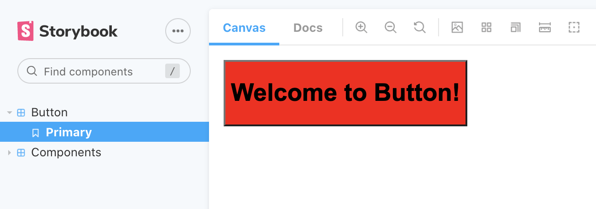

I had some time recently to check out Vanilla Extract CSS. It’s styling library that’s similar to CSS-in-JS projects like Styled Components or Emotion, but generates bundled CSS for production — similar to libraries like Stylex (Meta) or Stitches. And of course, it can also generate atomic CSS, so you can essentially make your own Tailwind library.

<aside>
ℹ️ This article goes deep into design system foundational topics like tokens, themes, variants. If you aren’t sure what some of these are, I’d check out a guide or [tutorial](https://storybook.js.org/tutorials/design-systems-for-developers/) that covers those.

</aside>

# How does it work?

You create styles using the Style API (`style(CSSObject)`) - similar to libraries like Styled Components, Emotion, JSS, etc.

These styles are stored in a variable (e.g. `buttonClass`). The style method returns a CSS class name that can be applied to your HTML element or React component:

```jsx
const buttonClass = style({ display: flex })

return <Button className={buttonClass} />
```

You can also compose styles by combining the style variables:

```jsx
const combinedStyle = style({ buttonClass, backgroundColor: 'red' })
```

# Process

The first thing that I had to come to terms with is that Vanilla Extract requires a build pipeline. Whether it’s Webpack, Parcel, or esbuild — you need to have a supported build library setup in your project.

<aside>
ℹ️ I’ll be using an Nx monorepo with React app and library bootstrapped, but you can use any project boilerplate (such as NextJS, GatsbyJS, etc) that supports extending the build configuration and it’s a very similar process.

</aside>

## Setup

Since I’m using the [Nx monorepo](https://nx.dev/) as the basis of my project, I used the Webpack plugin - along with the primary library `@vanilla-extract/css`:

```jsx
yarn add @vanilla-extract/css @vanilla-extract/webpack-plugin
```

## Wiring up the build config

Here is where I had to make a choice — would I want to ship my design system fully bundled (using Webpack) — or did I want the end user to bundle?

I opted for the latter, having the library consumer install the Vanilla Extract Webpack plugin. This adds an extra setup step to my own library, but it makes it easier for me to ship my code. And it allows the user greater performance optimization since they can wire it into their own build scripts. The only major caveat is that the library can’t be used from a CDN on something like CodePen.

With the Nx monorepo, libraries don’t get setup with a build system out of the box — they use Typescript to compile the code. But when you create an “app”, or use a service like Storybook, it’ll come with Webpack installed by default.

We can add the Vanilla Extract plugin to these apps, so we can import our design system and build an app. This process would be the same as the user of our library, so it’s a good way to test the implementation.

Nx makes it easy to extend the Storybook config:

```jsx
// .storybook/main.js
module.exports = {
  stories: [],
  addons: ['@storybook/addon-essentials'],
  webpackFinal: async (config, { configType }) => {
    // apply any global webpack configs that might have been specified in .storybook/main.js
    if (rootMain.webpackFinal) {
      config = await rootMain.webpackFinal(config, { configType })
    }

    // Add Vanilla Extract here
    config.plugins = [...config.plugins, new VanillaExtractPlugin()]

    return config
  },
}
```

## Using the library

### Style API

You use a `style` method and pass an object of CSS properties. It’s similar to Emotion (or even Styled Components) with it’s object syntax for styling.

```jsx
// button.css.ts
import { style } from '@vanilla-extract/css'

export const buttonStyles = style({
  display: 'flex',
  backgroundColor: 'red',
})
```

```jsx
// button.tsx
import { buttonStyles } from './button.css'

export interface ButtonProps {}

export function Button(props: ButtonProps) {
  return (
    <button className={buttonStyles}>
      <h1>Welcome to Button!</h1>
    </button>
  )
}

export default Button
```



This `style` method supports:

- Styles for current component
- CSS Pseudo Selectors (`:hover`)
- CSS Selectors (**only** for **current** object - e.g. `& :nth-child(2n)`)
- CSS Variables (for re-scoping or creating new tokens)
- Media Queries (`@media` for breakpoints)
- Browser Support (`@supports`)

And it has a lot of cool interoperability with other Vanilla Extract features (like referencing class names using other components styles - or CSS variable names and values).

# Themes

Themes are a first class citizen in Vanilla Extract, with a few different ways of creating them depending on your need. A theme is a CSS object of properties that get used as variables in your styles. For example, you could have a theme property with each different font size in your design system (`theme.fonts.small`). These variables get converted to CSS variables at build time, and get used by other components as CSS variables (`var(—fonts-small-12883`).

The first theme method is `createTheme`. This one accepts theme properties and values - and returns a CSS class name (used to wrap whole or parts of app in theme - `<div className={themeClass}>`) - and a `vars` variables, that contains the theme properties (to use inside other components — like `vars.fonts.small`).

```tsx
// theme.css.ts
import { createTheme } from '@vanilla-extract/css'

export const [themeClass, vars] = createTheme({
  color: {
    brand: 'blue',
  },
  font: {
    body: 'arial',
  },
})

// In your component:
import { style } from '@vanilla-extract/css'
import { vars } from '../theme'

export const buttonStyles = style({
  display: 'flex',
  backgroundColor: vars.color.brand,
})

// Make sure to wrap your app in the `themeClass`
import { themeClass } from '../theme'

export const App = ({ children }) => (
  <div className={themeClass}>{children}</div>
)
```

The second theme method is `createGlobalTheme` - this does exactly that, it attaches the theme variables to a container (like a `<div id="app">`). When you import your theme into any file, the CSS variables will be injected into the document scope.

```tsx
import { createGlobalTheme } from '@vanilla-extract/css'

// In this case, we attach variables to global `:root`
// so you don't need an ID or Class in your DOM
export const vars = createGlobalTheme(':root', {
  color: {
    brand: 'blue',
  },
  font: {
    body: 'arial',
  },
})
```

The third theme method is `createThemeContract` - which basically accepts the “shape” of your theme (only properties) and you literally `null` the values. Then you create other themes using this theme as the basis:

```tsx
import {
  createThemeContract,
  createTheme
} from '@vanilla-extract/css';

// The contract - or "shape" of theme
export const vars = createThemeContract({
  color: {
    brand: null
  },
  font: {
    body: null
  }
});

// "Fills in" the contract with values
export const themeA = createTheme(vars, {
  color: {
    brand: 'blue'
  },
  font: {
    body: 'arial'
  }
});

// Secondary theme
export const themeB = createTheme(vars, {
  color: {
    brand: 'pink'
  },
  font: {
    body: 'comic sans ms'
  }
});

// In your component
<div id="app" className={mode === 'a' ? themeA : themeB}>
```

### Light / Dark modes

There are a couple of approaches to handling light/dark mode toggles. Since you’re only creating 2 themes, you can get away with defining the light theme as the “primary” theme, and using it as the basis for the dark theme:

```tsx
// 📁 light.css.ts
import { createTheme } from '@vanilla-extract/css'

export const colors = {
  text: '#111212',
  background: '#fff',
  primary: '#005CDD',
  secondary: '#6D59F0',
  muted: '#f6f6f9',
  gray: '#D3D7DA',
  highlight: 'hsla(205, 100%, 40%, 0.125)',
  white: '#FFF',
  black: '#111212',

  success: 'green',
  message: 'blue',
  warning: 'yellow',
  danger: 'red',
}

export const gradients = {
  subtle: `linear-gradient(180deg, ${colors.primary} 0%, ${colors.secondary} 100%)`,
  purple: `linear-gradient(180deg, ${colors.primary} 0%, #A000C4 100%)`,
  blue: `linear-gradient(180deg, #00D2FF 0%, ${colors.secondary} 100%)`,
}

export const [themeClass, vars] = createTheme({
  colors,
  gradients,
})

// 📁 dark.css.ts
import { createTheme } from '@vanilla-extract/css'
import { vars } from './light.css'

// Redefine all the colors here (except, you know, dark)
// const colors = { /* ... */ };
// const gradients = { /* ... */ };

// We use the vars from the light theme here as basis for this theme
// It ensures our dark theme has same properties (like color.brand)
export const [darkTheme, darkVars] = createTheme(vars, {
  colors,
  gradients,
})
```

Then when we toggle between light and dark modes in our app (using React state usually — or a callback based on the user’s system preferences) — we change the class name that wraps our app from `lightTheme` to `darkTheme`.

```tsx
import { ThemeContext, ThemeNames } from '../context/theme'
import { useState } from 'react'
import { light, dark, base } from '../theme'

/* eslint-disable-next-line */
export interface ThemeProviderProps {}

export function ThemeProvider({
  children,
}: React.PropsWithChildren<ThemeProviderProps>) {
  const [selectedTheme, setSelectedTheme] = useState<ThemeNames>('light')

  const toggleTheme = () => {
    setSelectedTheme((prevValue) => (prevValue === 'light' ? 'dark' : 'light'))
  }

  const colorMode = selectedTheme === 'light' ? light.class : dark.class
  return (
    <ThemeContext.Provider
      value={{
        theme: selectedTheme,
        toggleTheme,
      }}
    >
      <div className={`${base.class} ${colorMode}`}>{children}</div>
    </ThemeContext.Provider>
  )
}

export default ThemeProvider
```

### “Base theme”

But what about properties that don’t change between theme modes? Like font sizing or spacing? This is where the composability of themes comes into play. We can create a theme that acts as a “base” theme that contains all shared properties.

```jsx
// 📁 base.css.ts
import { createTheme } from '@vanilla-extract/css';

export const [baseThemeClass, vars] = createTheme({
  fontSizes: {
		small: '12px',
		medium: '16px',
	},
	spacing: {
		0: '2px',
		1: '8px',
	}
});

// Then in the app you can combine the two themes
// Base and Light/Dark
export const App = ({ children }) => <div className={`${baseThemeClass} ${lightThemeClass}`}
```

This way, when we define our other themes (like the dark version) - we don’t have to redefine any properties that stay the same (like font sizes).

The way Vanilla Extract’s themes work is that it requires the theme to use every property defined by the base theme. You can’t skip colors for instance - even if they’re the same as the light theme, or it won’t build your CSS and throw an error. You can ideally just pass in the theme properties from the light theme and “extend” it by overriding what you need (`const darkTheme = createTheme(lightVars, { ...lightTheme, colors: { red: ‘dark-red’ } })` — but I think it’s nicer to keep things organized and more modular.

### Normalize Theme API

Now that there were two themes, each with their own set of tokens, I wanted to ensure there was an API that made sense to the end user.

I initially settled on exporting a `theme` object with a `tokens` property - as well as each theme class name as a property. This lets me quickly do `themes.tokens` and grab tokens — or `themes.light` to use one of the themes.

```jsx
export {
  // The tokens from one theme (or a theme contract)
  tokens,
  // Each theme class
  light,
  dark,
}
```

This works for only one type of theme, but since I had 2 (a “base” theme and a “color” theme), I needed to have a different structure that combines the tokens (or variables) together:

```jsx
// 📁 theme/light.css.ts
const [themeClass, vars] = createTheme({
  colors,
  gradients,
});

// We export an object
// So we don't have to destructure each time
const light = {
  class: themeClass,
  tokens: vars,
};

// 📁 theme/index.ts
export {
	// Each theme class
	themes: {
		base,
		light,
		dark,
	},

	// Tokens
	tokens: {
		...baseVars,
		...colorVars,
	}
}

// 📁 In a component:
import { style } from '@vanilla-extract/css';
import { tokens } from '../theme';

export const buttonStyles = style({
  display: 'flex',
  backgroundColor: tokens.colors.primary,
});
```

Though this could get confusing for the end user, since it’s difficult to understand what themes are interchangeable (like light/dark) - and which tokens belong to which.

# Thoughts

After building a few components and spending a lot of time thinking about how they’d get ultimately used in different contexts, I had some thoughts on different topics.

## Customization

One of the big issues I have with a lot of libraries is how difficult it can be to either: customize a component (like removing a border radius from a button) or dramatically changing the aesthetic of an entire system.

Ideally with Vanilla Extract, you can give consumers of the design system a few entry points for component customization:

- CSS variables (either component specific e.g. `--button-radius` - or theme tokens)
- CSS overrides (last class name wins - kinda)
  ```jsx
  <Button className={`${buttonStyles} ${buttonOverrides}`} />
  ```
- Extending styles (they import `buttonStyles` and use as basis for `style()` method).
  ```tsx
  import { buttonStyles } from './button.css'

  const newButtonStyles = style([...buttonStyles, { backgroundColor: 'red' }])
  ```
  But this would also require exporting some sort of primitive button - or providing a prop that swaps component styles with a style override.
  ```jsx
  // Primitive button used **outside** design system
  import { PrimitiveButton } from 'design-system'

  const Button = (props) => (
    <PrimitiveButton {...props} className={yourButtonStyles}>
      {children}
    </PrimitiveButton>
  )

  // Override prop **inside** the design system
  const Button = ({ styleOverride }) => (
    <button className={styleOverride ?? buttonStyles}>{children}</button>
  )
  ```
  And it assumes the component structure is 1 level deep, often you could have “sub” elements that need styling in a component, like an icon.
  **Solution?**: Make a `styles` prop for any component that allows complete override of styling. Also accept a `className` prop that gets merged - so incremental changes can be allotted for. And of course, they could always change the CSS vars in the component scope. It handles the most extreme and simple changes. Reminiscent of old school MUI and the way they handled I think.

### Variants get weird too

When you need to create simple style iterations of a component - like scaling it up, or changing a color scheme, you’ll often use [variants](https://vanilla-extract.style/documentation/styling-api/#stylevariants). Vanilla Extract uses a `styleVariant` method to create different sets of styles your component can swap between.

```jsx
import { styleVariants } from '@vanilla-extract/css';

export const variant = styleVariants({
  primary: { background: 'blue' },
  secondary: { background: 'aqua' }
});

// In React:
<button className={variant[props.variant]}>
```

You can see that this works great when we have control of it, but when the user needs to insert their own, it gets...funky.

```jsx
// A user importing our component and extending with a new variant
<Button style={overrideVariantHow...}>
```

We can create a prop that allows overriding of specific variants (`colorSchemeOverride`), create their own variant under a different prop (doubling up code a bit), or if we used CSS variables in the styles they could kinda control it there. But this is where users get locked into the component architecture a bit and have to hit eject if they like a certain variant API — but need to add or tweak a couple things.

### No selectors in variants

This limits styles. We can’t add a `:hover` state to a variant, or an `:before` selector (if I need to place something behind the component).

For example, I have a focus state that requires placing an additional border behind the component. It creates a “double” border effect.

This also limits variants. For example, I can’t create a “ghost” or “outline” variant for a button that has pseudo selectors to change up the other states (hover, disabled, etc). The style is a “one-size-fits-all” solution, where I have to hope it works across all selector states.

The other option is to create a separate component for each case of these “complex” style variants — but I feel like I’m creating the same component a few times (with a lot of overlap of styles - like sizing/padding/etc - even other variants maybe) - just to tap into a greater depth of styling via pseudo selectors.

### Recipes API

The [Recipes API](https://vanilla-extract.style/documentation/recipes-api/) tackles the issue of “I need to make a new button, but I still want to stay within the basic rules of this button”.

But it still doesn’t solve the issue of adding new variants — or extending styles? The docs don’t touch upon the ability to take a recipe and use it as basis for another - and only alter a property or variant.

# Issues

## Storybook Unreliable HMR

Storybook’s HMR or Hot Module Reloading feature allows you to edit your source code and have the changes appear fast — instead of waiting for the entire app to rebuild. This feature clashes with Vanilla Extract a bit and causes inconsistencies with styling. The only way to fix it is hard refreshing the Storybook app, which reloads the CSS properly. For example, if you change a property in a component’s styles, it might reload and remove the component styles completely.

# Should you use Vanilla Extract?

I think it’s a solid styling solution, especially for more simple design systems that don’t have super complex CSS going on. The Typescript integration alone really makes the style authoring experience much more enjoyable (and secure).

If you’re building something fast, dirty, and cutting edge - not sure if I’d recommend it, because it does limit your input (and output) — I’d stick with options like Styled Components or Emotion in those cases.

# Gelato UI

You can find the design system I was experimenting with [on Github](https://github.com/whoisryosuke/gelato-ui), I called it **[Gelato UI](https://github.com/whoisryosuke/gelato-ui)** in honor of the Vanilla Extract it takes to make it.

# References

- [Published NPM libraries that use @vanilla-extract/css](https://www.npmjs.com/browse/depended/@vanilla-extract/css)
- [Theming a React Application with Vanilla Extract](https://formidable.com/blog/2021/vanilla-extract/)
