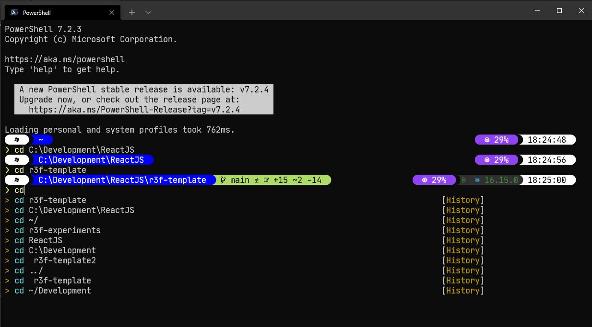
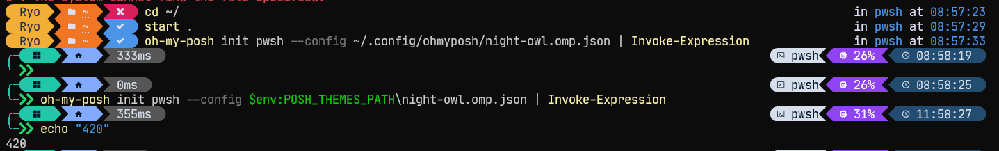
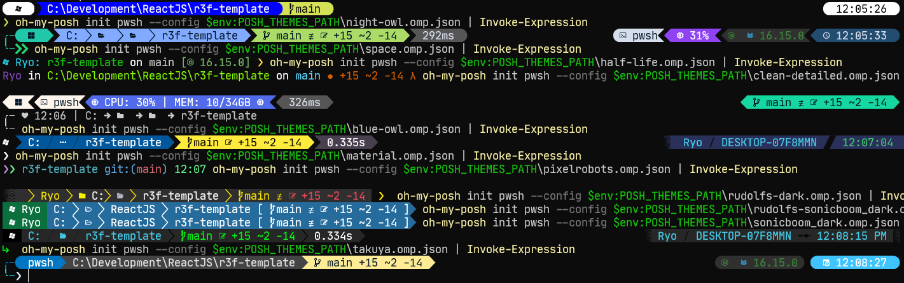
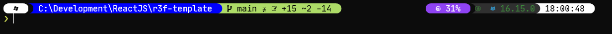
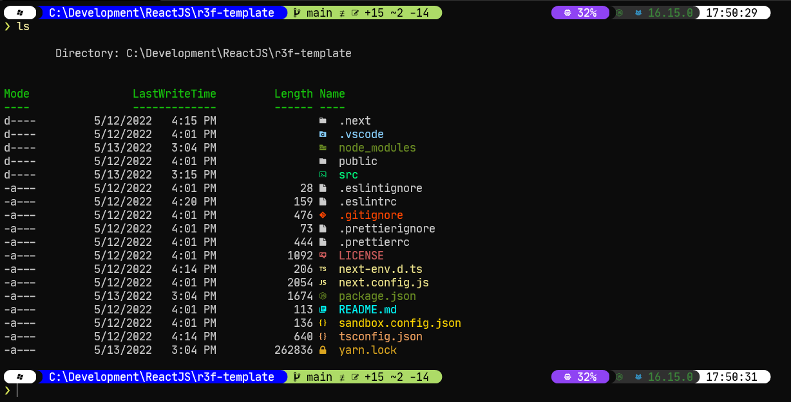

I was sitting on YouTube the other day and looking for a quick productivity win, and I stumbled across [Scott Hanselman’s](https://twitter.com/shanselman) video on [making the ultimate Windows Terminal](https://www.youtube.com/watch?v=VT2L1SXFq9U&t=2102s). I’ve recently started doing more web and game development on my Windows machine, so I thought I’d give it a shot and see how much better my shell experience could get.

After watching 15 minutes of his video, I was hooked and already tweaking and customizing my theme to my exact needs.



I thought I’d write about my process and the steps I took to get to my final Terminal setup. The process was similar to [“oh my zsh” on Mac](https://ohmyz.sh/) if you’re familar with that.

# Getting Started

First things first, we need PowerShell. This will work with other shells, but to make this process simple, we’ll start with PowerShell.

Windows 10 comes with a “**Windows Powershell**”, but it’s not the same as **_Powershell_**. You’ll need to download a separate shell if you haven’t already:

1. [Download and install Powershell](https://docs.microsoft.com/en-us/powershell/scripting/install/installing-powershell-on-windows?view=powershell-7.2#msi)

<aside>
⚠️ It’s recommended you use [Windows Terminal](https://github.com/microsoft/terminal) to manage different shells. That’s a separate download, but it automatically picks up any shells you have (from Windows PowerShell, to PowerShell, to even the WSL (aka Linux) ones. I had to set PowerShell as default in the Windows Terminal settings.

</aside>

# Oh My Posh



Like oh my zsh for Mac, but for PowerShell. Styles your Powershell and displays extra info (like current Github branch).

[Windows | Oh My Posh](https://ohmyposh.dev/docs/installation/windows)

[How to make the ultimate Terminal Prompt on Windows 11 - This video is LONG and WORDY and DETAILED](https://www.youtube.com/watch?v=VT2L1SXFq9U&list=WL&index=19)

## Getting Started

1. Make sure Powershell is installed (see top of this page)
2. [Install oh-my-posh](https://ohmyposh.dev/docs/installation/windows). I used the manual method.
3. Restart your Powershell (or Windows Terminal).
4. You should see it! But with broken fonts and missing glyphs…
5. Install special fonts from [NerdFont](https://www.nerdfonts.com/) (basically fonts + glyphs like FontAwesome).
   - You can usually find your favorite coding font (like Fira Code or Jet Brains Mono)
6. Go to **Windows Terminal** settings, select **Powershell** settings, go to **Appearance**, and change font to the one you downloaded - it will end in `NF` (e.g. `JetBrainsMono NF`)
   - You’ll also want to do this for Visual Studio Code if you plan to use the integrated shell/console.
7. Now things should look correct! 🎆

## 🎨 Themes



Browse all the [themes here](https://github.com/JanDeDobbeleer/oh-my-posh/tree/main/themes) or run `Get-PoshThemes`. The default themes come pre-installed with oh-my-posh in the `$env:POSH_THEMES_PATH`.

Install the theme by opening your `$PROFILE` (or `.bashrc` for WSL) and changing the `oh-my-posh` initialization we added earlier with your theme config. Here you can see we’re installing one of the default themes - Night Owl:

```bash
oh-my-posh init pwsh --config $env:POSH_THEMES_PATH\night-owl.omp.json | Invoke-Expression
```

<aside>
⚠️ You can use `echo $PROFILE` to see where the profile is, and open it with whatever text editor you prefer.

**Protip**: I use the `code` command to open things in VSCode. You can activate this by going to the Command Prompt (CMD + Shift + P) and typing “bash” and installing it from there.

</aside>

[Customize | Oh My Posh](https://ohmyposh.dev/docs/installation/customize)

### My Theme



I created a theme based on `powerlevel10k_modern` and took some modules from `night-owl` like the CPU monitor, Node version, and PHP version.

[Oh My Posh - My Custom Theme (based on powerlevel10k + night-owl)](https://gist.github.com/whoisryosuke/3b34892672a2a28e14f54dda80348b86)

# 3rd Party Plugins

These are extra sprinkles on top of Windows Terminal that help enhance the experience (like adding icons or autocomplete to commands).

## Autocomplete using history

Predictive intellisense based off your shell history - like a smart search. So if you go to certain folders often, they’ll pop up in the list as you type.


1. Install the prelease of the module (requires 2.2.0-beta1 or greater as of 5/17/2022): `Install-Module -Name PSReadLine -AllowPrerelease -Scope CurrentUser -Force -SkipPublisherCheck`
2. Add this to your `$PROFILE`:

```bash
# Add auto complete (requires PSReadline 2.2.0-beta1+ prerelease)
Set-PSReadLineOption -PredictionSource History
Set-PSReadLineOption -PredictionViewStyle ListView
Set-PSReadLineOption -EditMode Windows
```

This wasn’t as simple as the commands sometimes (go figure with prerelease lol) - but these resources helped get things working.

[GitHub - PowerShell/PSReadLine: A bash inspired readline implementation for PowerShell](https://github.com/PowerShell/PSReadLine)

[Set-PSReadLineOption : A parameter cannot be found that matches parameter name 'PredictionSource' · Issue #2189 · PowerShell/PSReadLine](https://github.com/PowerShell/PSReadLine/issues/2189)

[Adding Predictive IntelliSense to my Windows Terminal PowerShell Prompt with PSReadline](https://www.hanselman.com/blog/adding-predictive-intellisense-to-my-windows-terminal-powershell-prompt-with-psreadline)

## Terminal Icons



These are nice icons for the different folders and files you have in development projects. If you’ve used VSCode and installed any icon extensions, you’re probably familiar with this.

1. Run this command to install the module: `Install-Module -Name Terminal-Icons -Repository PSGallery`
2. Add this to your `$PROFILE`: `Import-Module -Name Terminal-Icons`
3. Refresh your PS config by running: `. $PROFILE`
4. Try running `ls` or `dir` to see the icons!

Thanks again to Scott Hanselman for the tip!:

[Take your Windows Terminal and PowerShell to the next level with Terminal Icons](https://www.hanselman.com/blog/take-your-windows-terminal-and-powershell-to-the-next-level-with-terminal-icons)

## My Final Configuration

For reference, here is the final configuration file for my Windows Terminal (aka `$PROFILE`). I also added some comments that go over the installation of plugins/modules I mentioned above (just in case).

[PowerShell Config - Includes Oh My Posh, Terminal Icons, and Autocomplete with History (requires module see below)](https://gist.github.com/whoisryosuke/ba9926dd66e825ab1c740101604bae77)

# What’s your shell look like?

Now that I’ve dipped my toe in the shell customization water, I’m definitely looking for more inspiration to improve my setup and make it even better. [Hit me up on Twitter and share your shell setup](https://twitter.com/whoisryosuke), I’d love to see it.
