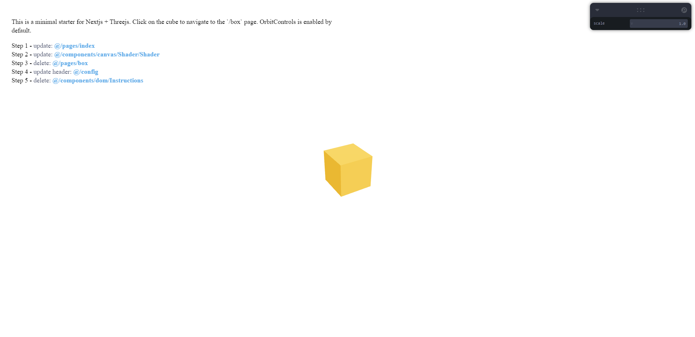
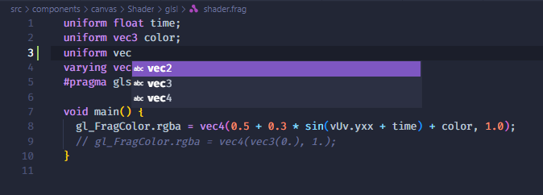
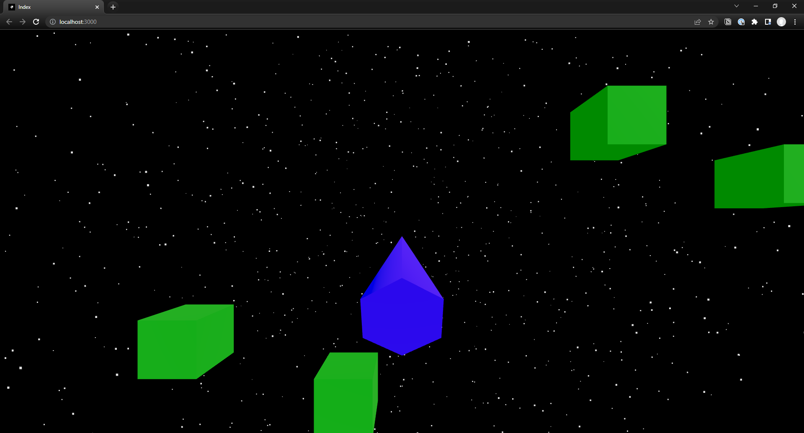
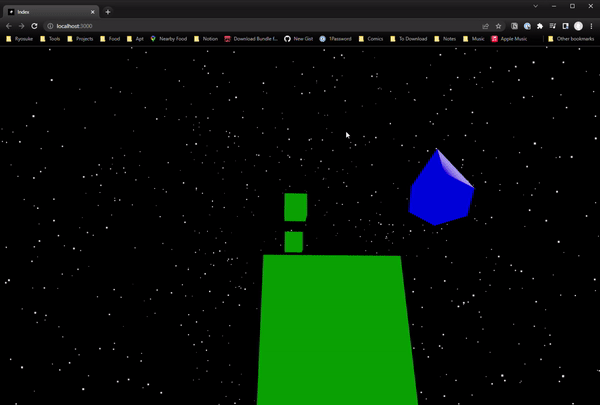

I’ve been really getting into 3D and game development, from Blender and Maya to Unity and Unreal Engine to even custom programmed C++ game engines using OpenGL or DirectX. The deeper you go, the more you tend to work with languages like Python or C. But what if there was a way to do a lot of the things you do in a software like Unity — but on the web...with JavaScript?

This is where **[WebGL](https://www.khronos.org/webgl/)**, **[ThreeJS](https://github.com/mrdoob/three.js/)**, and **[React Three Fiber](https://github.com/pmndrs/react-three-fiber)** come into play. **WebGL** is the web implementation of the OpenGL specification (aka brings 2D and 3D rendering to web). **ThreeJS** is a JavaScript library that uses WebGL to create a low-level 2D and 3D graphics API (like drawing a canvas, creating a “camera”, vertex and pixel/fragment shaders, rendering vertex buffers from 3D meshes, etc). And finally — **react-three-fiber** is a React library that integrates ThreeJS more efficiently into the React ecosystem with easy to use functions and components.

React Three Fiber has been a fantastic way to quickly prototype 3D apps and games, and even efficient enough to carry them through to production. **The problem?** It’s can be a lot of setup. Just from that last paragraph, you see the string of dependencies R3F uses, and it gets even more complicated from there when you familiarize yourself with the current ThreeJS ecosystem (see: [three-stdlib](https://github.com/pmndrs/three-stdlib)).

I tried to find a template that just worked out of the box, and I was able to find a few, but I wanted a little more. So I did the inevitable — scrapped together my own template: **[r3f-next-starter](https://github.com/whoisryosuke/r3f-next-starter).**



This template gives you a solid foundation out of the box: NextJS site with R3F + DOM setup, accessibility (aria elements for 3D), quick “toggles” using Leva, and a fantastic shader setup with syntax highlighting.

# **[Using the template](https://github.com/whoisryosuke/r3f-next-starter)**

1. Clone the repo: `git clone https://github.com/whoisryosuke/r3f-next-starter.git`
2. Install dependencies: `yarn`
3. Run the development server: `yarn dev`
4. See some 3D 👀 at [http://localhost:3000/](http://localhost:3000/)

# What’s in it?

- ♻ Easily mix DOM and 3D Canvas
- 🎨 Fragment and Vertex Shaders (with syntax highlighting + autocomplete)
- 🎛 [Leva](https://github.com/pmndrs/leva) panel for debugging
- ♿ [R3F A11y](https://github.com/pmndrs/react-three-a11y)
- 🏪 [Zustand](https://github.com/pmndrs/zustand) store
- 📁 Relative paths (`@/components/`)
- 📴 Offline mode
- 🍱 Bundle Analyzer
- ☑ Typescript

# Where I started

I was able to find [an example in the NextJS repo](https://github.com/vercel/next.js/tree/canary/examples/with-three-js) that covers the barebones setup for ThreeJS (aka using React Three Fiber). This was great, but not enough.

I dug a little deeper and I discovered **[create-r3f-app](https://github.com/utsuboco/create-r3f-app)**. This CLI didn’t work completely for me on my Windows setup (crashed during a step). Though it did have a partial output which allowed me modify the template to a working point. It also came with Tailwind setup, so I removed any references to it.

The create-r3f-app template was a great starting point, and basically makes up a large portion of my template. It had a great setup for managing R3F Canvas vs DOM elements. And a nice Webpack setup for importing shader files (`.frag` and `.vert`). I go into more detail on all the features below.

I went through and started to convert it completely into Typescript, add any goodies I needed (Leva, a11y, etc), and I was basically good to go. I go over these down further down below.

# Feature Breakdown

There were a lot of nice things happening in this template (mostly from create-r3f-app) and I thought it’d be cool to go over a few of them in a bit of detail.

## **DOM vs R3F**

When you create a new page, you don't need to wrap anything in a canvas. This automatically happens in the `_app.jsx` file. The `partition` script in `_app.jsx` checks for `<Dom>` and `<R3f>`, and wraps your R3F components in a canvas.

```tsx
import type { AppProps } from 'next/app'
import { useRouter } from 'next/router'
import useStore from '@/helpers/store'
import { useEffect } from 'react'
import Header from '@/config'
import Dom from '@/components/layout/dom'
import partition from '@/helpers/partition'
import dynamic from 'next/dynamic'
import '@/styles/index.css'

// We dynamically import the canvas (required of any R3F component in NextJS-land)
const LCanvas = dynamic(() => import('@/components/layout/canvas'), {
  ssr: false,
})

// This component takes it's children and finds the R3F and DOM
// and splits them up into their own space
const Balance = ({ child }) => {
  const [r3f, dom] = partition(child, (c) => c.props.r3f === true)

  return (
    <>
      <Dom>{dom}</Dom>
      <LCanvas>{r3f}</LCanvas>
    </>
  )
}

// The wrapper around the entire app
// Standard NextJS process/API
function App({ Component, pageProps = { title: 'index' } }: AppProps) {
  // We grab the children whatever page we're rendering
  // and make sure we run any initialProps from NextJS to hydrate the component
  const child = Component(pageProps).props.children

  return (
    <>
      <Header title={pageProps.title} />
      <Balance child={child} />
    </>
  )
}

export default App
```

Each page should export `<DOM />` and `<R3f r3f />` components in a JSX fragment (so you can have 2 children without a parent):

```tsx
import dynamic from 'next/dynamic'

const Shader = dynamic(() => import('@/components/canvas/Shader/Shader'), {
  ssr: false,
})

// dom components goes here
const DOM = () => {
  return (
    <>
      <p>420 blaze it</p>
    </>
  )
}

// canvas components goes here
const R3F = ({ r3f = true }) => {
  return (
    <>
      <Shader />
    </>
  )
}

// The page component that gets "split up" by the `_app.js` file above
const Page = () => {
  return (
    <>
      <DOM />
      <R3F r3f />
    </>
  )
}

export default Page

export async function getStaticProps() {
  return {
    props: {
      title: 'Index',
    },
  }
}
```

It makes composing pages simpler, mixing DOM and R3F easy, and no fuss with wrapping the canvas every time.

## Shader Support



This is actually pretty simple to implement if you’re already using Webpack. You essentially use the `raw-loader` to load the “raw” shader file and `glsify-loader` to [parse](https://github.com/glslify/glslify) the GLSL shader.

In NextJS, you can extend the Webpack rules to add the plugins:

```json
// next.config.js
config.module.rules.push({
  "test": /\.(glsl|vs|fs|vert|frag)$/,
  "exclude": /node_modules/,
  "use": ["raw-loader", "glslify-loader"]
})
```

If you prefer a different file format, you can add one here to have it get picked up. For instance, some projects prefer `.pixel` or `pshader` for Fragment shaders.

When you browse the shaders (`.frag` and `.vert`) in VSCode (or just open the project really), you should see a popup to install a plugin that handles the syntax highlighting and autocompletion.

The suggestion when you open a project is done using the VSCode Workspaces feature and using the Recommended Extensions config (`.vscode\extensions.json`).

# The Changes

## Typescript

The first major change was converting everything to Typescript. The create-r3f-app template had TS support — but most of the files were still in `.js` format. This unveiled a couple of issues with shader files (`.frag`), whenever they were imported in a file I saw an error saying they couldn’t be found. I needed to create a new TS definition file `shader.d.ts` file ([see this StackOverflow](https://stackoverflow.com/questions/62111157/cannot-find-module-when-using-raw-loader-and-typescript)):

```tsx
// shader.d.ts
declare module '*.vtx' {
  const content: string
  export default content
}

declare module '*.frg' {
  const content: string
  export default content
}
```

## CSS Reset

Since I removed Tailwind, I also had removed their “base/reset” CSS file that helps “normalize” the style output across browsers. I opted to integrate the classic Normalize.css and call it a day.

## a11y Support

One of the major things missing from the template was the new react-three-a11y library. This lets you wrap your 3D components in an `<A11y>` component that does a few things:

- Creates an aria-compliant HTML element in the DOM for your canvas element
- Lets you add logic for focus events (e.g. `onFocus`) in the 3D layer

This one is really easy to integrate, so I just installed it, added a component to “announce” things to screen reader, and wrapped the existing components in accessibility wrappers. Done! No excuse not to make your app or game more accessible.

## Quick toggles with Leva

One of the most powerful tools during development and prototyping is the ability to alter properties using a GUI. For example, using sliders to change an objects position or shader properties like colors is incredibly satisfying.

This was another quick and easy add. Just install and wire up some component properties to the panel using their `useControl` hook.

## CodeSandbox optimization

One of the first things that you’ll notice when you work in R3F and an online code editor like CodeSandbox — it crashes way too much. This usually happens because of 2 things: the file constantly hot reloading in bug-prone areas (like the `useFrame` hook), and the hot reloading messing with the canvas state ThreeJS has vs the R3F/React side (canvas often just drops out / crashes).

The way to avoid this is by adding a configuration file to let CodeSandbox know not to reload on each keystroke, and avoid infinite re-render when possible:

```json
// sandbox.config.json
{
  "infiniteLoopProtection": true,
  "hardReloadOnChange": false,
  "view": "browser"
}
```

# What’s next?

I’m looking to add some more examples to the template, just things that I find myself repeating often - like the proper way to type a R3F React component props. Is it `Vector3` or `number[3]`? Answers like that should just be a copy/paste away instead of spending time Googling or digging through the R3F Discord.

Anything that’s too intense or might bloat the template is going to end up in [my new r3f-experiments repo.](https://github.com/whoisryosuke/r3f-experiments)

# But what can you do?

Lots of cool stuff — from [award winning app experiences](https://www.awwwards.com/awwwards/collections/webgl/), to complete 2D/2.5D/3D games in your browser!



I took the template, cloned it, and [created a mini Asteroids inspired game.](https://github.com/whoisryosuke/r3f-experiments/tree/asteroids) All I had to do was add a player “model” (aka a cone), add some asteroids (aka cubes) to the scene, and rig up the player to keyboard input (WASD for movement). Oh and figuring out how the move the camera with the player model was a little tricky. But you can [see from the commits](https://github.com/whoisryosuke/r3f-experiments/commits/asteroids) it didn’t take a lot of code to create this whole experience.



I hope this inspires you ([and make it easier!](https://github.com/whoisryosuke/r3f-next-starter)) to create your own 3D prototypes and experiments. As always you can [reach out to me on Twitter](https://twitter.com/whoisryosuke) if you want to chat about anything or ask a quick question.

## Shout out!

- [NextJS ThreeJS/R3F Example](https://github.com/vercel/next.js/tree/canary/examples/with-three-js)
- [create-r3f-app](https://github.com/utsuboco/create-r3f-app)
- [Poimandres](https://github.com/pmndrs/) (and [their Discord!](https://pmnd.rs/discord))
