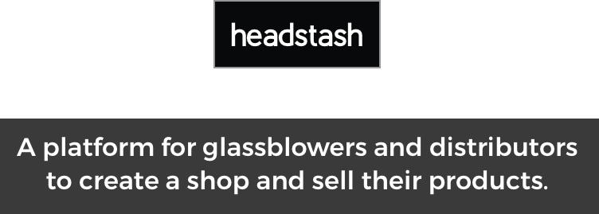
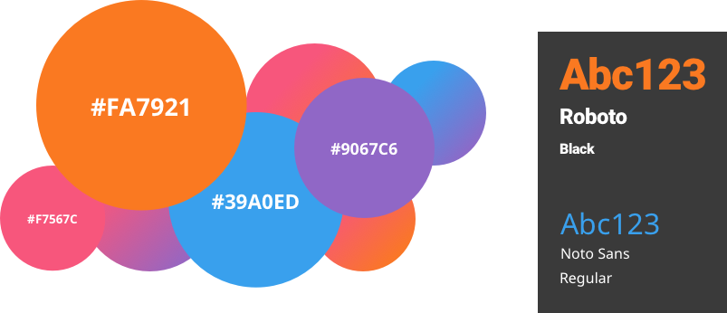
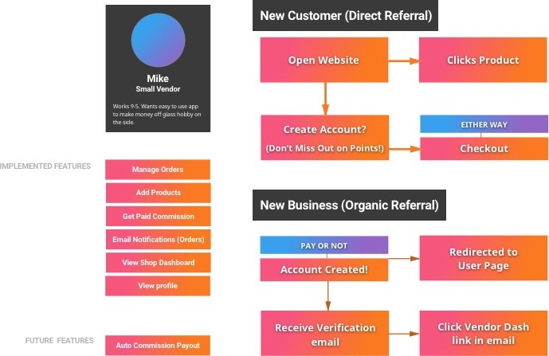
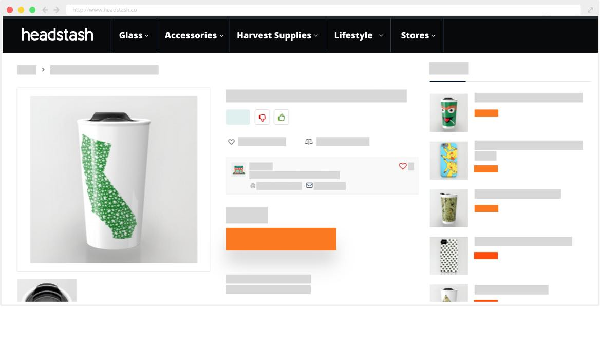
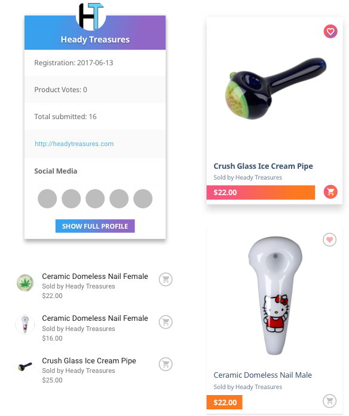
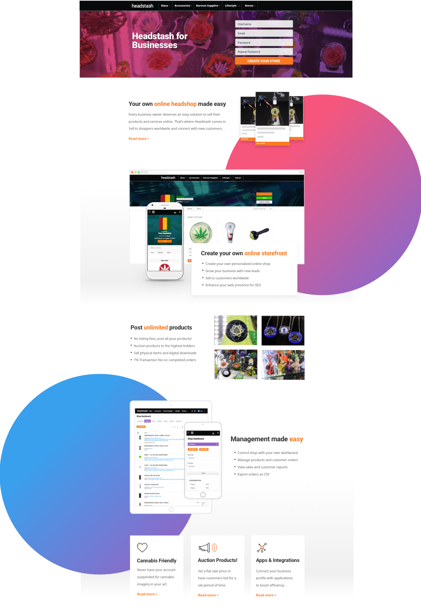
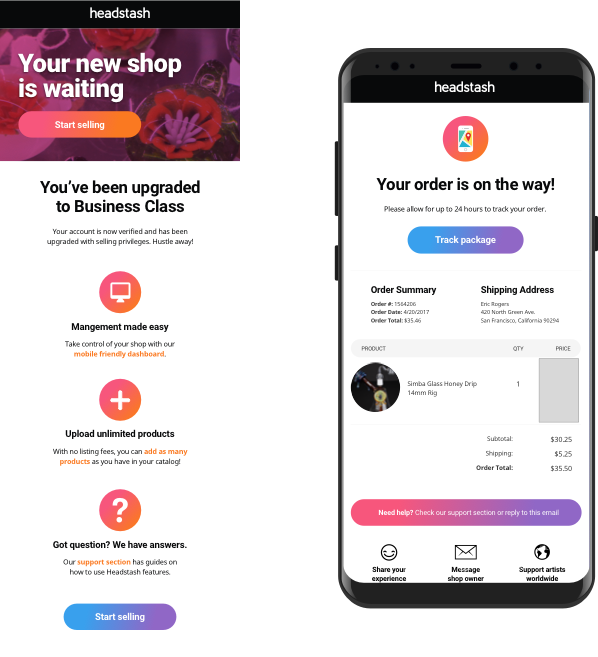
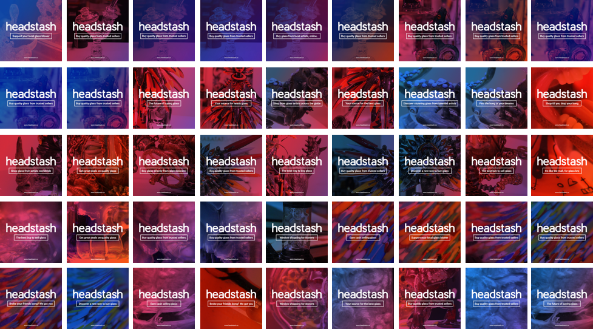

In 2017, I created Headstash, a B2C glass marketplace that allowed artists and craftsman to create their own online storefront. Using their shop profile, they could sell and auction their products to customers worldwide.

The goal of this project was to solve the issue of buying glass as a collector or consumer. The current state of the market lacked a solution that allowed artists to easily sell their work in a single marketplace. The only solution was costly or free self-hosted options, which only really receive sales from direct artist promotion. Marketplaces like Amazon and Ebay don't allow for glass paraphrenalia to be sold on their site, which despite being art pieces, the glass still classified as illegal.

My role in the project was to be the sole creator. I would develop the branding of the company, the go-to-market strategy and any competitive research, and the actual design and development of the website (and the UI/UX involved in that). This project was designed with Sketch, and developed using Wordpress and a multitude of plugins.

## Branding

For the Headstash branding, I primarily took inspiration from Amazon and the Gap, and taking note of cues from Etsy. 

The logo drew most inspiration from the Gap with it's refined and safe qualities exhibited by the san-serif typeface. After a bit of experimentation, I ended up on the Headstash "logo" to be it's logotype in white inside a black box.

The color scheme was composed with Amazon's primary color in mind -- orange. I wanted the site's main color to evoke that sense of sale and urgency, without the tension you get with a hotter red or an often crass green. **Orange** was a wonderful medley of what I was looking for, bright and energizing, yet subtle enough. From there, I chose a complimentary **purple**. I wanted the site to feel bright and colorful, and feature modern gradients, so I picked additional colors (like the purple) that would create exciting and appealing blends of color. 

I also wanted a font that was readable, had a good "design" feel, but was still approachable (nothing too edgy or loud). The focus of the site was the products themselves, the text would play a secondary role. This led me to using a mix of **Roboto** for headers and **Noto Sans** for body text. Roboto gave me the thickness and legibility I needed for headers, and Noto Sans is notorious for performing well at smaller scales (perfect for body - or even smaller scale).

## User Research (UX)

Before developing the application, I embarked on user research through user flow diagrams and user stories. This allowed me to really understand who the consumer of the app would be, what functionality they need out of it, and their typical use of the app. This made the process of creating wireframing and high-fi mockups much simpler.

## Inteface Design (UI)

I really wanted Headstash to feel modern, and the first impression users receive from a website is it's visual theming. I set out to create components that would exhibit the style I was looking to achieve, to later restyle pre-existing Wordpress elements. I took inspiration from Material Design, and used some of their components as the basis.

## Website Design

I took care in designing key pages of the website that would act as landing pages for specific use cases (capturing business signups, frontpage, etc). The following is an example of the business landing page, designed to entice business owners to open their first shop with Headstash.

## Email Design

I wanted to ensure I really took care of the UX of the entire experience, from onboarding to checkout. Part of that process was designing and developing emails that WooCommerce and BuddyPress would send to users (like customers making a purchase, or new user registration guides).

## Social Media Graphics

In order to promote the project, I designed several series of graphics for social media using glass photography I accrued from local galleries and showings. I was able to run the campaign for a couple months and saw fair success in the style of graphics.

