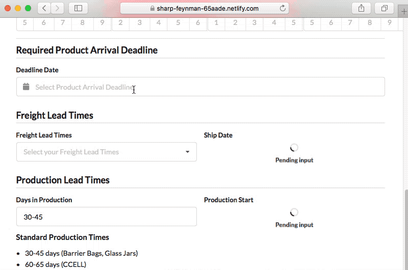

Each year during the Chinese New Year, production often comes to a halt in China for several weeks because of the holiday. Due to this delay, Kush Supply Co wanted to offer their B2B customers with a way to forecast their decisions in conjuction with the impending holiday. I was approached to quickly create an app that received a few date-based inputs and generated the appropriate production timelines based on simple algorithms the team provided.

Within a few hours the app was completed and deployed on Netlify. It went on to be used extensively for months, included in company email signatures, and helped generate more revenue with enhanced customer interactions.

I created the app using Create React App to boostrap the React application framework. Fomantic UI was installed for styling to match the company's new design system, and I used their calendar component to complete the more complex date inputs.

