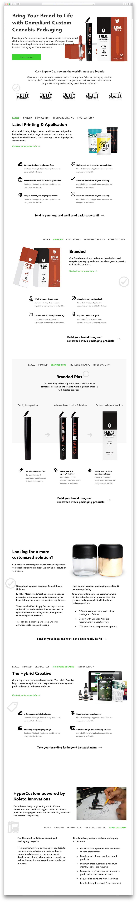

I worked closely with the marketing team to product this landing page for the Kush Supply Co. distribution branch. The team provided copy and direction, and I designed the layout and components, as well as coded the final product.

The goal of the project was the create a fairly direct CTA for distributors to contact KSC to join their network. This helped refresh the main website and introduce new styling, new iconography, and innovative compositions to a site with a fairly rigid and dated aesthetic.

I was also tasked with creating a landing page for product customization services. The team didn't have access to any customized products to photograph (which I normally handled). Instead, I created fake branding designs (using pre-existing fake brand assets), 3D mockups, and applied the branding to the mockups. The goal of this page was to be as engaging as possible, while illustrating key concepts as graphically as possible to accompany the copy.

