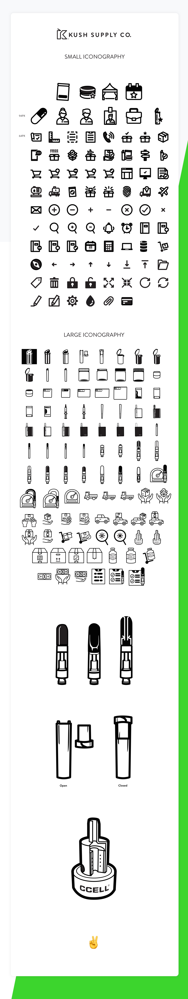
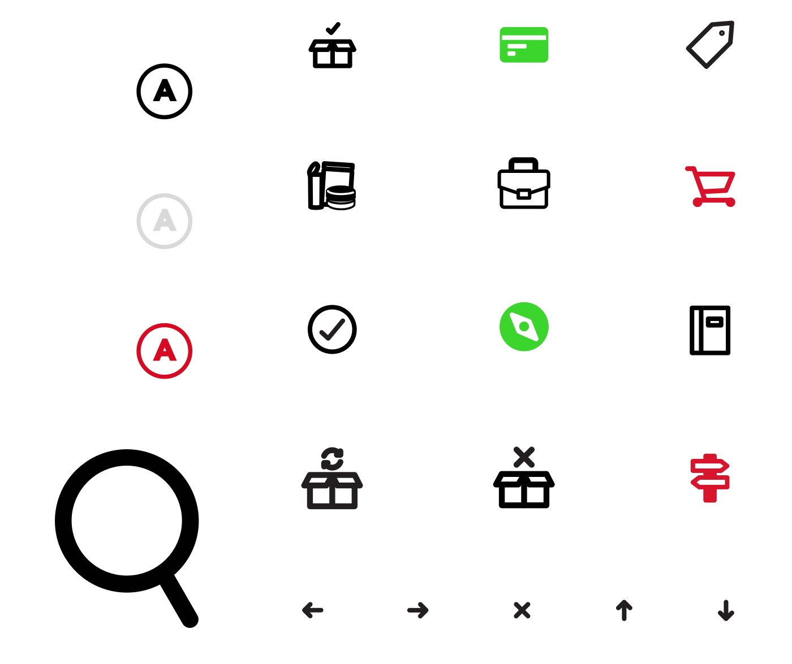
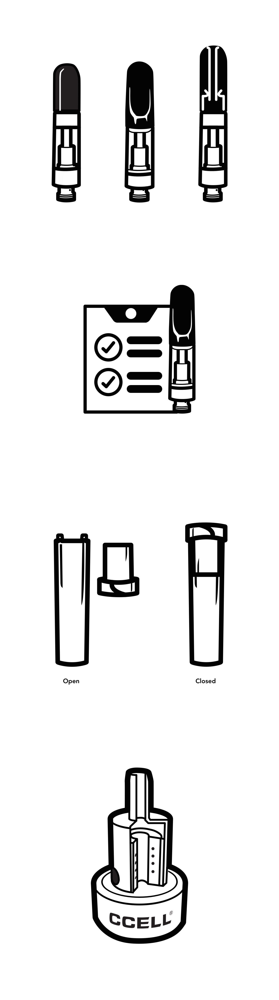
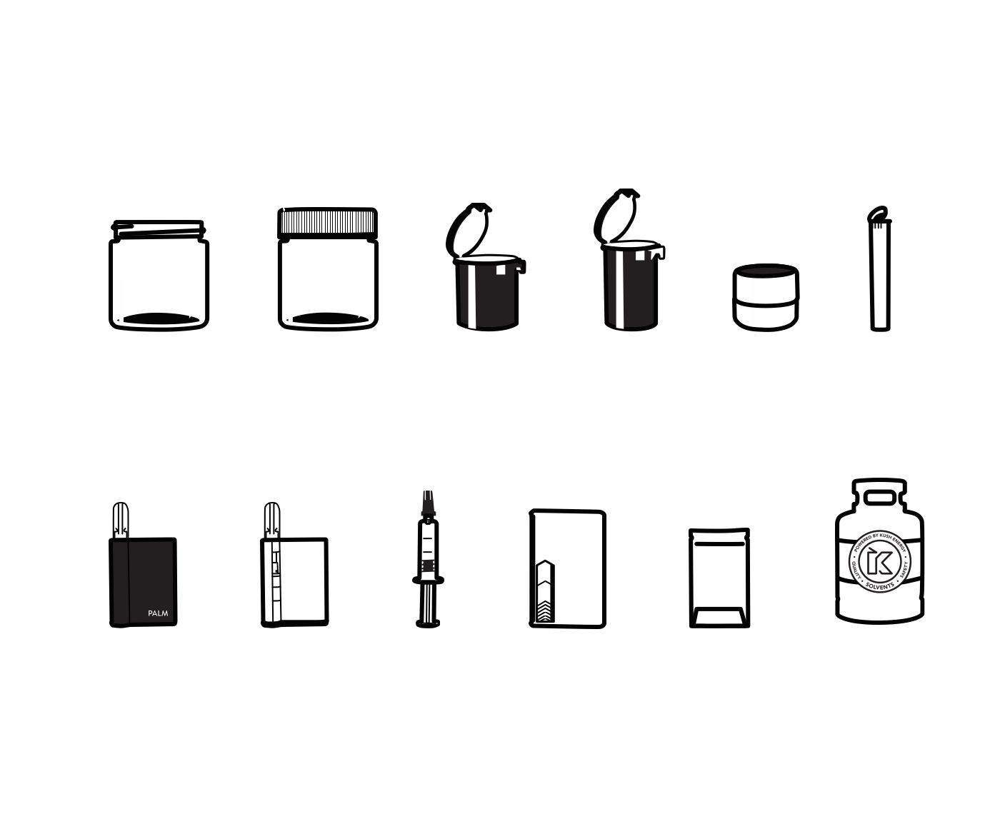

As Kush Supply Co. expanded as a company, the need for a custom set of iconography grew larger. I was tasked with creating an icon set that would replace the use of Font Awesome across the site, and be used across web and print media. The goal was to create a full set of common use icons, as well as more custom icons that reflect the industry and products of Kush Supply Co.

The icons were created with care to reflect the Kush Supply Co. branding and aesthetic. Despite being rigid, designs were kept soft and slightly rounded to be less abrasive.

Custom icons of the most popular products were designed at a much larger scale than a normal icon for use on the web and print. Detail was key, since vape cartridges are distinguished with minute details.

The icons were distributed as EPS, JPG, PNG files at various sizes, and I put together a Sketch library that contained all the icons for easy use in prototyping.
