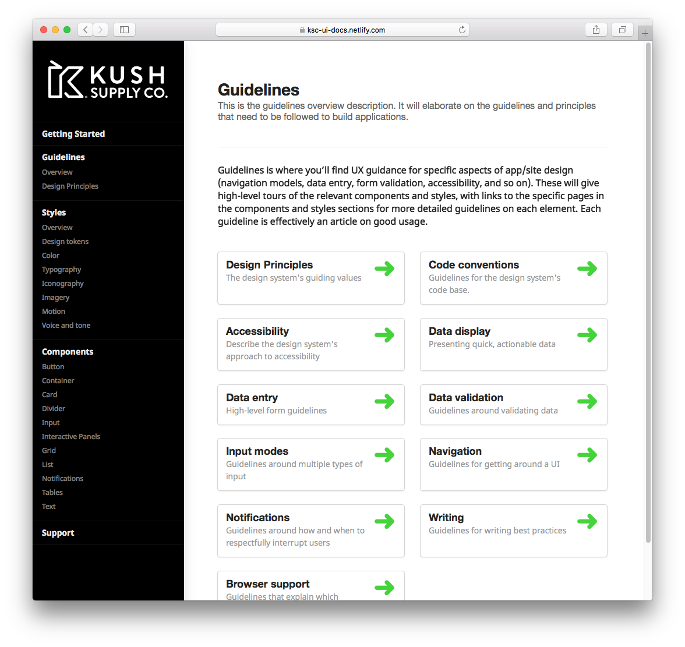
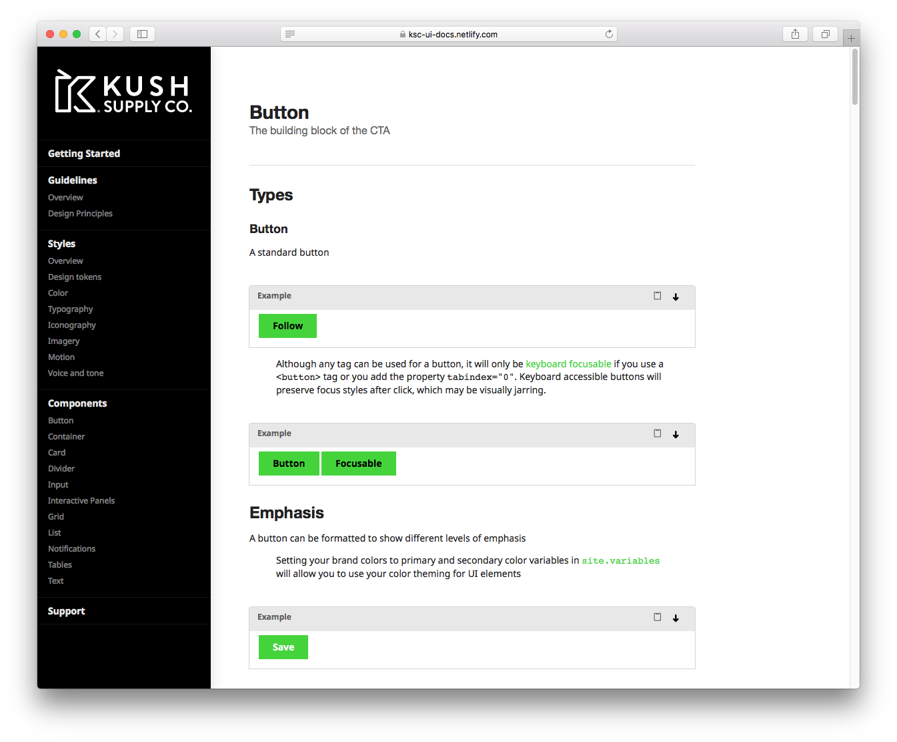
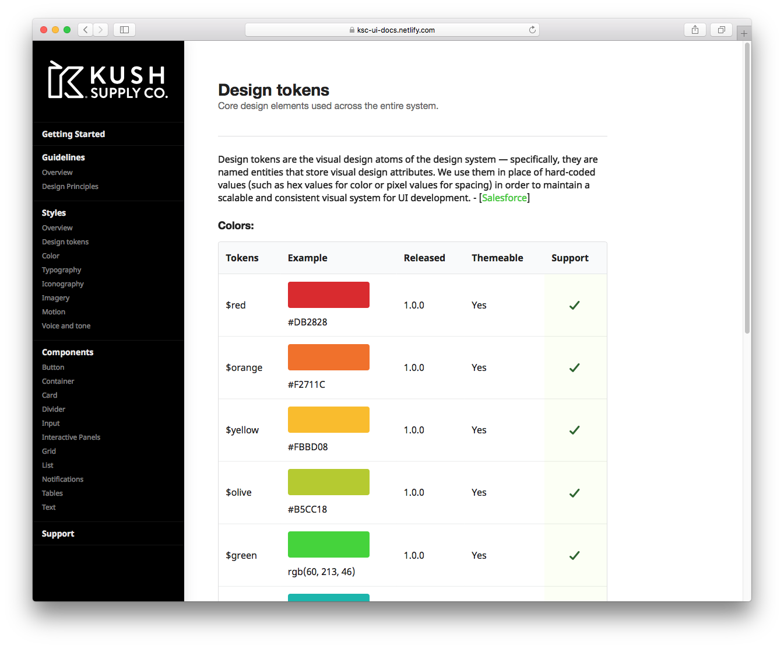
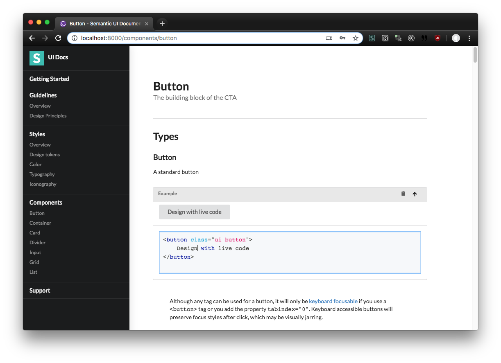

While working alongside the KushCo and Kush Supply Co marketing teams, I created a number of landing pages for their website properties. Web development was handled by an internal "dev" team, more tech savvy employees, or other external parties. Due to this, the website itself didn't have a clear methodology for accomplishing simple tasks. There were 4-5 different ways to create a single button, each page had a myriad of custom CSS stacks on top of a Bootstrap library, and the source code was no where to be seen.

It quickly became clear that there was a design system and component library would be necessary to continue to scale the company. The marketing team and 3rd party consultants had already put together style guides for each of the sub-brands, however, it was fairly incomplete. It lacked many guidelines that web and native developers needed to accomplish their work, and there was no clear component library for the web.

I began working on the design system during a redesign of the Kush Supply Co website. The website would be redesigned from the ground up as a B2B landing page and catalog for browsing. Another React application created by the KSC dev team would accompany this product, and offer B2B customers a greater level of customization and control over their distribution. Because of the duality of these applications, it became essential to have a component library that could used across both.

# The Stack

For this design system, I needed a few key things: a CSS/component library as a basis, documentation, and a Sketch library.

## New Style Guide

Since the look and feel of the new website should come before commiting the code, I began exploring the aesthetic of the design system in Sketch. I used Jan Losert's [Symbols and Styleguides](https://janlosert.com/store/symbols-styleguides.html) as the basis for the Sketch component library, plugged in the colors and fonts, and began the long process of exploration.

In the end, we had a full design-based component library that we could use to prototype new applications (which I promptly did with a few apps 😅).

## Bootstrap < Semantic UI

Despite the old website using Bootstrap, I ended up using a different CSS framework as the basis for the web-based component library. Bootstrap worked great, was more difficult to theme and customize, and didn't have as many components for the web and React. And as the company executives stressed a need for elevating the design, I strayed away from the classic 12-column Bootstrap grid.

I settled on Semantic UI for it's flexibility, component diversity, and themability. You can use Semantic UI as a CSS framework in HTML (or even somewhat in PWA/app style projects). Or if the team needed, they could use the CSS with Semantic UI React, a implementation of the components that work in React. This allowed the design system to work for older platforms, and the newer projects on the horizon. SUI was also made for quickly theming, inside the app or the core CSS, meaning devs could just apply a `.red` CSS class to an element to apply a certain sub-brand's red color. The team and customers also demanded more complex components, such as date pickers, which SUI (or rather Fomantic UI), had readily accessible for use.

## Documentation

Since I was using Semantic UI as the basis, I was able to clone their documentation website and apply the themed CSS over it. It made it easy during development to hand off to the marketing or dev teams. They were able to apply and critique the system rapidly because of this.

The SUI docs weren't enough however, since they didn't cover the entire design system, only the component library (and SUI's own values). The SUI docs were built using an older NodeJS static site generator (one of the first!), and due to this, the build process was slow and templating wasn't ideal. Much of the code was malformed, and the docs were incredibly slow and bulky to load on even desktop.

I've done a lot of work recently with GatsbyJS, a static site generator, to create documentation websites. I've also been working with MDX, a syntax that's essentially Markdown + React components. Combining the two, I created a Gatsby documentation site styled with the themed Semantic UI component library, and the content was pulled from MDX files.

The use of MDX allowed me to quickly author pages for the website, and even include live coding examples. Rather than having to write in full HTML, I could use it sparingly, and even alongside React components (like SUI React's `<Button>`).

The live coding was accomplished using combining a few React libraries: react-live, react-copy-to-clipboard, and SUI React's own Visibility component.

And I was able to create custom pages effortlessly to convey other style guidelines, such as the design tokens.

# Open Sourced

If you're interested in documentation for your Semantic UI theme, or just want SUI-themed docs, [check out my semantic-ui-docs-gatsby project on Github](https://github.com/whoisryosuke/semantic-ui-docs-gatsby) or [Gatsby's starter page](https://www.gatsbyjs.org/starters/whoisryosuke/semantic-ui-docs-gatsby/).

