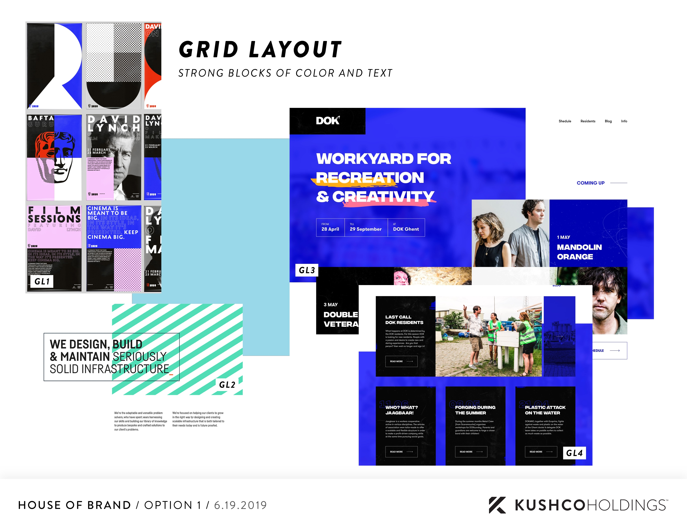
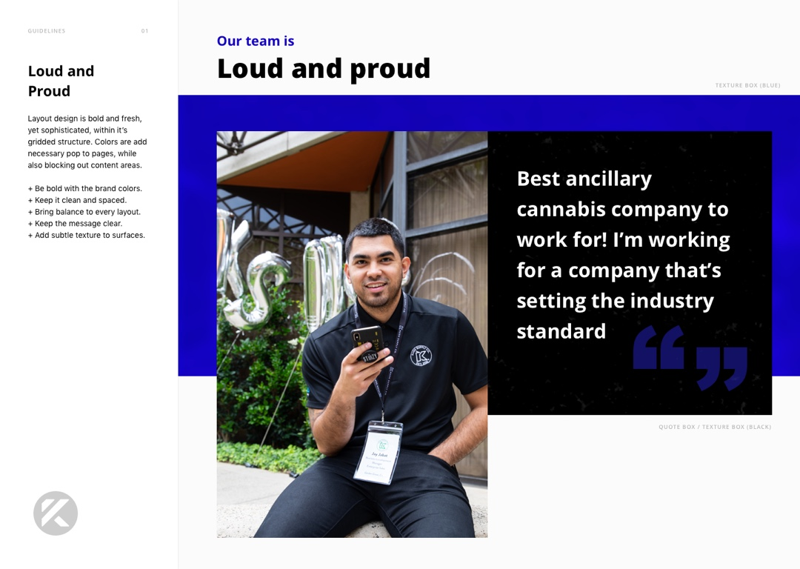
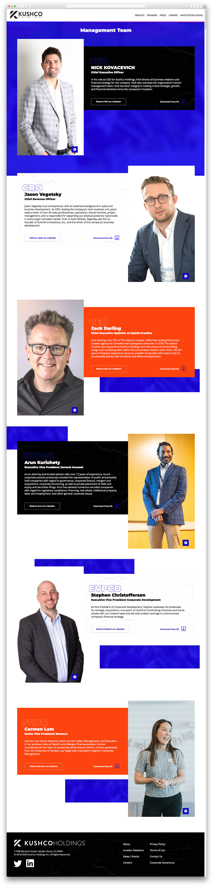
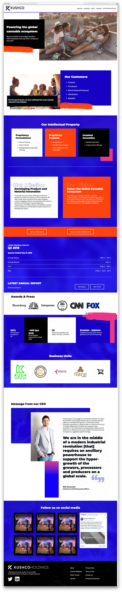
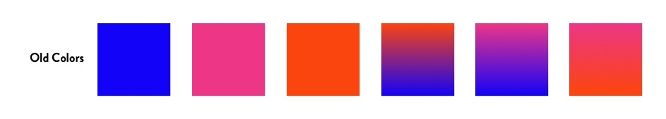
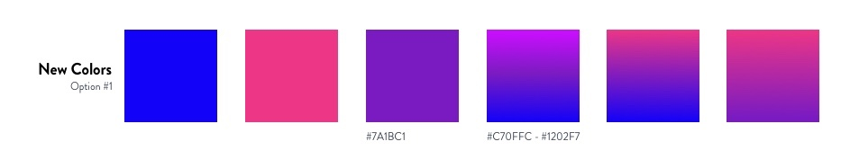
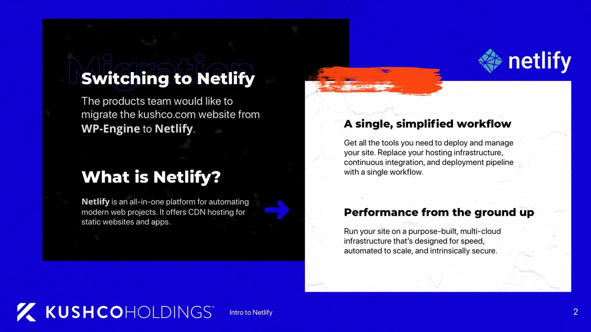
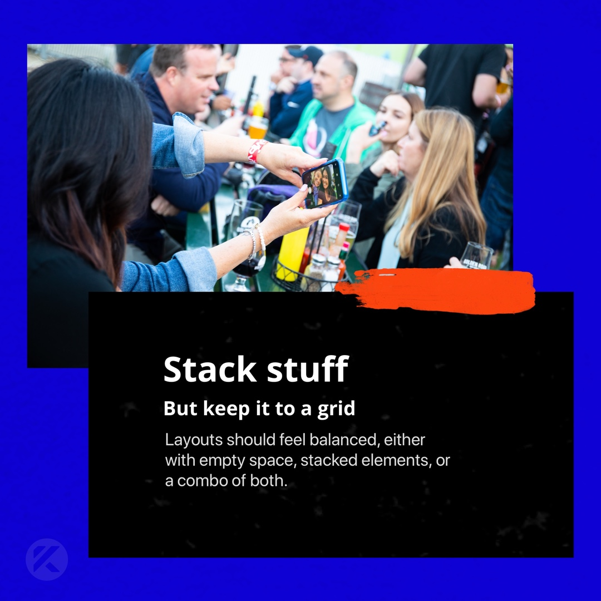

I approached in late 2019 by KushCo Holdings to work with their team to rebrand the company colors and aesthetic, and create a design system for the new branding. The new design system would consist of a handful of components that translated across web, mobile, social media, and print platforms. The website was completed within the given a deadline of a month, from rebrand to web design to launch.

# Aesthetic and Color

We began by collectively researching reference material for the new branding. 3 goals for each design were designated by the stakeholders: Bold, Metallic/Nike, and Minimal. Then we looked for anything that met the standard, collected it in a shared Dropbox folder, and composed a Powerpoint to present to stakeholders. From there, they picked the aesthetic they felt best matched their company. Colors came second. I worked with the team's Creative Lead to pick couple good base colors, then used a few online color tools to divinate the remainder. The colors were then approved by the stakeholders.

With the colors and reference material in place, I began experimenting on the design aesthetic. I started creating small components, like a button or card, and tried to see what elements and motifs I could carry over from the references (and what was cohesive).

After a bit of trial and error, I began to compose more components (masthead, content grids, etc), based off core principles I began to establish (pulled from the references). Since the website would consist of the same content, I had to create components that would contain and compose the content appropriately, but it was also a faster process with a smaller list of components.

# Style Guide

With the colors and components in place, I began to create a style guide for the company to illustrate the new brand guidelines. It contained all the components, typography styles, and colors that comprised the system. Created in Sketch, this library allowed designers to use components dynamically across any file (or easily access all the design tokens).

# Design

This is the original design, before a few revisions, with fully saturated colors. I translated the Sketch components to HTML, CSS, and React-based components. The site was built using GatsbyJS, rather than using Wordpress as the frontend.

To make the process of creating such dynamic components easier, I started the design system from scratch using SASS and Storybook. The only dependency was a Semantic UI grid to make the base layout simpler, and modify on top of that (such as the offsets). Despite using the SUI grid, a lot of the components were created using custom Flexbox styling, due to their complexity.

# Accessibility

Partially through the process we were informed that one of the primary stakeholders and founders were color blind, and weren't happy with the new color scheme. He specifically cited it looking "blue white and red", while our colors were "blue white and orange".

The team was a bit confused. But thankfully, I had designed all the components for web inside of StorybookJS which has color accesibility tools built in. I popped open Storybook, went through each setting, and took a screenshot for the team. They were quickly able to identity which form of color blindness the stakeholder had, and from there, we worked to reimagine the color scheme from the new constraints.

# Deployment

The previous iteration of the website was created using Wordpress, and hosted on a Wordpress exclusive platform. Part of the website package for the company was not only creating a stellar design and web app -- but a better one than it's predecessor. This meant making the site faster, and more secure.

I proposed Netlify as a solution for deploying the website to the team and their IT/development teams. During the proposal, the IT team offered space on their Microsoft Azure platform. After a small amount of research, I found that Azure charges for each Linux-based deployment (which all NodeJS servers require). Despite having an enterprise plan, the cost of development would have been upwards of \$100-200 per month for the handful of dev projects we were already hosting on Netlify (for free!).

The features Netlify offered were indispensible for the team: creating public and private branches, running an authentication server, and secure static hosting. The website's danger matrix was dramatically reduced by removing a server-side runtime like PHP and Wordpress from the mix.

# Social Media Templates

In addition to creating print and web components, I also created templates for social media using the design tokens and components from the design system. The assets and instructions were provided to the social media team to empower their content creation process.

