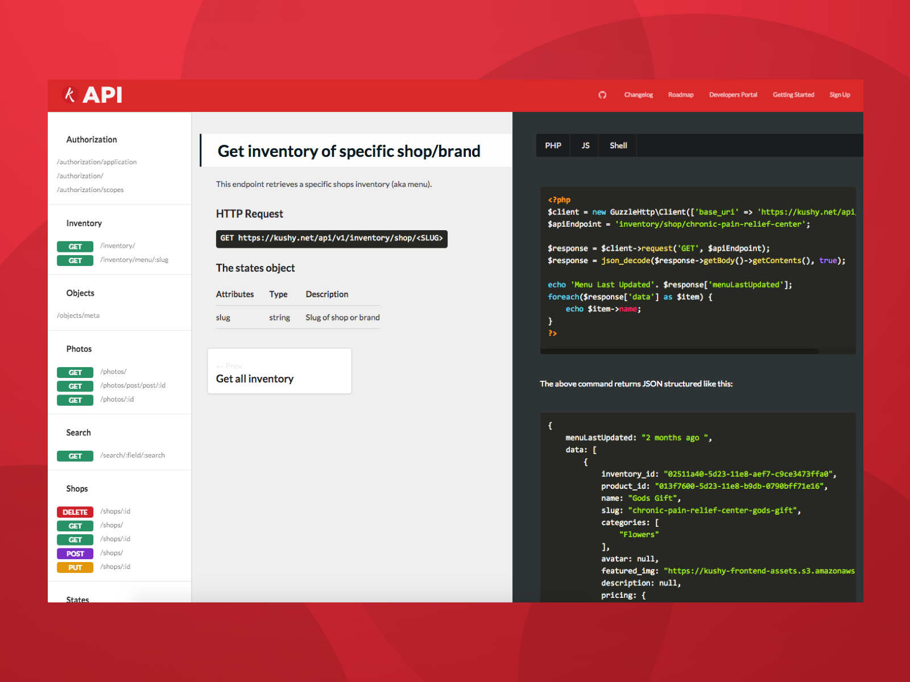
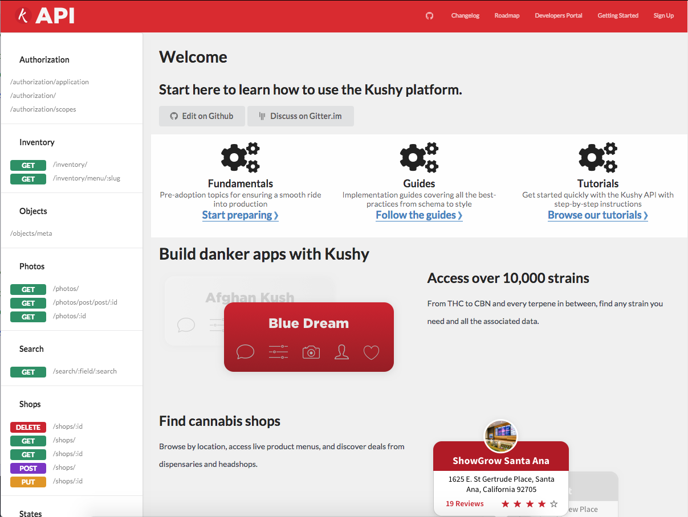
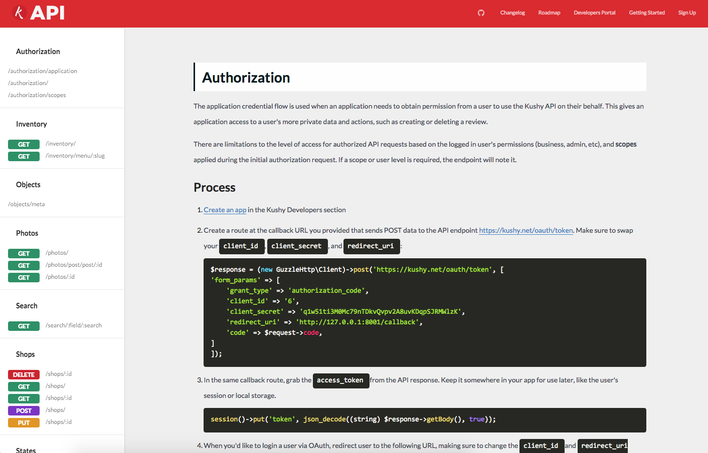

In order to facilitate accessibility to the Kushy API, I wanted to create documentation that would entice and educate developers on how to use the new API. 

I first researched several options, [from **Slate**](https://github.com/kushyapp/kushy-api-docs-slate) to **Gitbook** to **Docusaurus** to **React-Styleguidist**, and created prototypes on **Netlify** to test. 

After shopping around, I wasn't satisfied with the flexibility of the solutions I'd discovered, so I set off to create my own in **GatsbyJS** since I had experience with it already. It was an excellent static site generator that could easily be modified to work with the Markdown format of documentation.

I forked this website as the basis, implemented the Kushy branding, and created a framework for the documentation (to automatically generate menus and special styles). This project was deployed on Github Pages, and I created a subdomain (`docs.api.kushy.net`) on Amazon's Route53 to mask the Github URL.

# Documentation

## Frontpage

## Single Page Layout

<a href="https://github.com/kushyapp/kushy-docs-gatsby" class="btn">View project on Github</a>