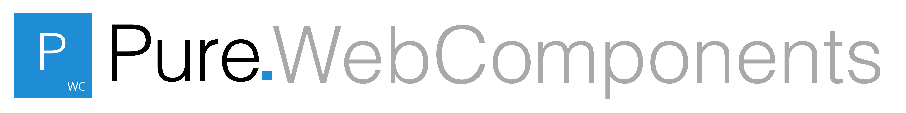
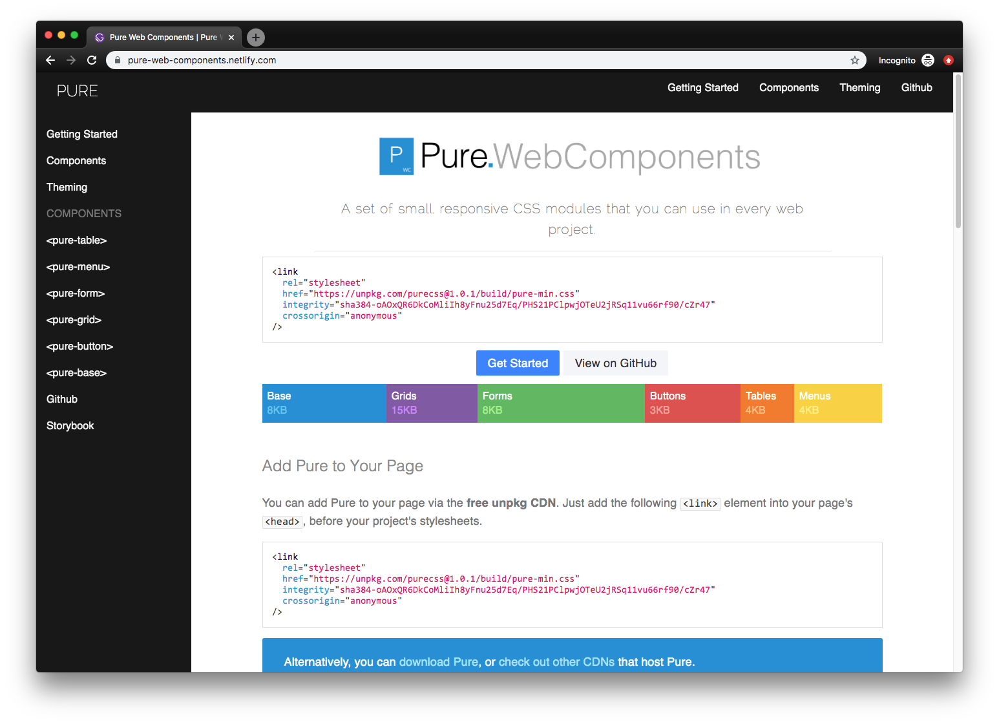

I created [Pure Web Components](https://github.com/whoisryosuke/pure-web-components) as a personal project to experiment with the new Web Components standard. [Pure CSS](https://purecss.io/) is a CSS framework by Yahoo that has a tiny footprint (3.8kB) with only 6 components. I thought it'd be a great small-scale experiment to migrate an existing CSS codebase and component library to a more modern level.

Pure Web Components is a component library with 6 web components that reflect their CSS counterparts. Each component comes bundled with it's own CSS, and scoped to the shadow DOM where possible. It's built using StencilJS, a framework for developing Web Components.

  <a href="http://pure-web-components.netlify.com/">See the documentation</a> |{' '}
  <a href="https://github.com/whoisryosuke/pure-web-components">
    Browse source code on Github
  </a>

The documentation is also a reflection of the original site where possible, taking much of it's content and design. The documentation was created using GatsbyJS, and is a blazing fast React-powered PWA. Content is hosted in Markdown files, which allow for authoring in Markdown, as well as Web Components that are piped in.

> You can find [the full breakdown of the documentation tech stack and process in my blog post here](https://whoisryosuke.com/blog/2019/automatic-web-component-docs-using-gatsby-stencil/).

The component pages featured a props table (pulled from Markdown, generated by StencilJS). The table itself uses `<pure-table>`, the web component from the library. Each coding example is also "live" and editable.

