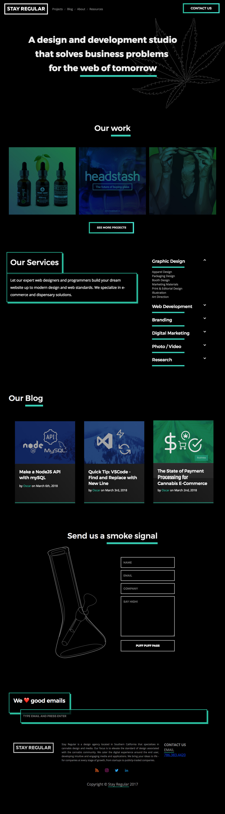
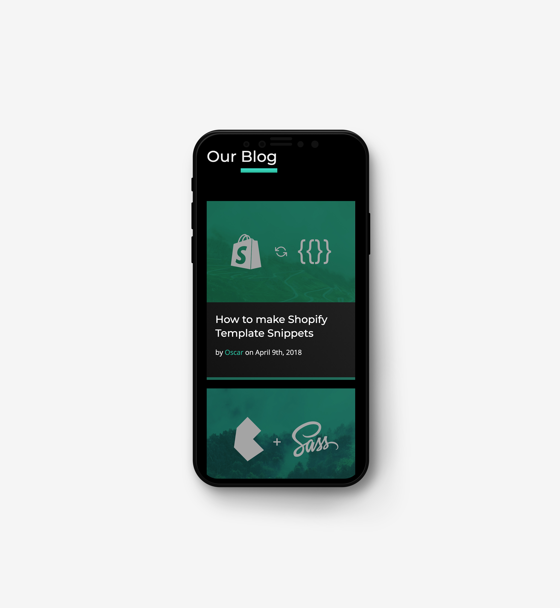
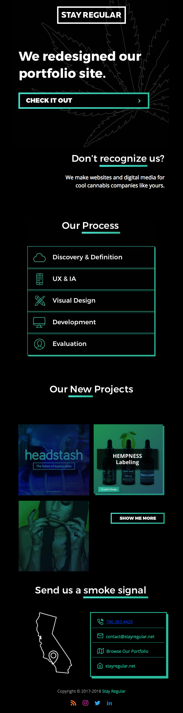

As my design studio Stay Regular approached it's yearly anniversary, it became time for the regularly refreshing of the website's theme. This would be the third major revision of the site since it's (semi) static inception using the Kirby CMS. 

## The Goals

We set clear goals in the beginning to define the direction of our design:

* Mobile friendly
* Animation
* WOW factor
* Better understanding of brand/services

## [The Result](http://stayregular.net)

<a href="http://stayregular.net" class="btn">Visit the live site</a>

## Animations & Microinteractions

### Parallax

We wanted to bring our page to life with microinteractions and animated elements that enhanced the user experience beyond a static interface. Parallax was a quick, effective, and *mobile friendly* method to create a bold masthead for the frontpage. Combined with our vector illustrations and the Anime.JS animation library we were using before to create the randomized drawing effect, the parallax took everything to another level.

<section class="row">
    

        

            <h4>Accordion</h4>
            

            
Don't make them work for it, make them <em>play</em> for it. Accordions became an effective way to take the wall of text we had before for services and transform it into an elegant interface.

        

    

    

        

            <h4>"Pop Out" Hovers</h4>
            

            
This animation was important to take our projects and literally lift them off the page as the user interacts with them, bringing them closer to the user.

        

    

</section>

## Newsletter

To announce the release of the new website changes, I designed and coded a newsletter to transmit through MailChimp. A mockup was created in Sketch, and it was coded using the **Foundation for Emails** framework by ZURB. The result was a perfect email in a majority of popular email clients.

