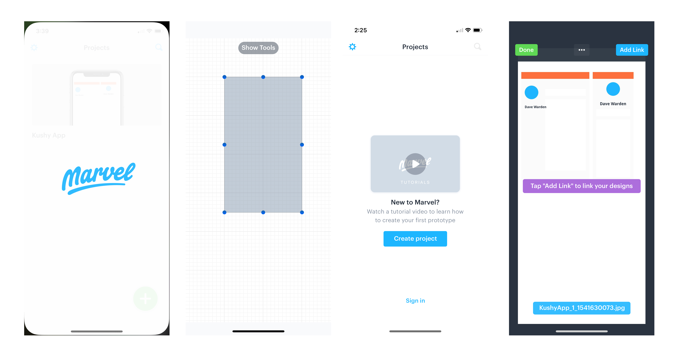
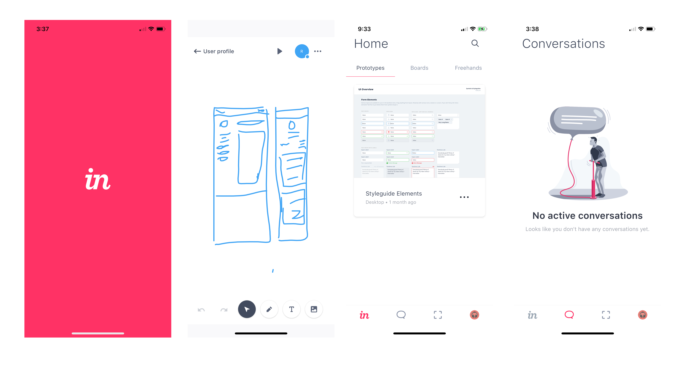

Recently I was on the hunt for an iOS to prototype and sketch UI designs in on the go. I whittled my search down to three options: Marvel, Invision, and Adobe Sketch. I thought I'd share my findings to help other UX/UI designers make their decision 👍

First, let's break down the core features you'd want out of these apps, and which one made the cut:

|                                   | Marvel | Invision | Adobe Sketch |
|-----------------------------------|--------|----------|--------------|
| Can draw shapes                   | ✅      | ❌        | 🤔            |
| Can insert images                 | ✅      | ✅        | ✅            |
| Can create prototypes from sketch | ✅      | ✅        | ❌            |
| Lots of control                   | ✅      | ✅        | ✅            |
| Grid based                        | ✅      | ❌        | ❌            |
| Doesn't require an account to use | ✅      | ❌        | ✅            |
| Allows for linking of screens     | ✅      | ❌        | ❌            |
| Free to use                       | 🤔      | 🤔        | ✅            |
| Collaborate live with team        | ❌      | ✅        | ❌            |

It's clear that Marvel had more features, but was it the better app?  Let me talk about my experience with each one and you can come to your own conclusion.

# Marvel app

The Marvel app had *nearly* everything I needed. It did an excellent job of onboarding with plenty of helpful tips and even tutorials in empty states to encourage creation. And I was able to import Sketch documents as screens.

Drawing felt great, and it had a variety of tools to use (like creating basic shapes, or inserting images - even stock photos). It even featured a grid mode, which allowed for tighter drawing and command over shapes.

You can add clickable boxes to your sketch to link between sketches, which when played, is a live (shareable) prototype of your app. This was the only app that allowed for the actual creation of a true "prototype", and not just a handful of screen sketches.

The best part? No account required. You can sketch away and have JPGs saved to your camera roll. Creating an account allows you to share your prototypes online.

**The cons?** Free tier is limited by 2 projects and prototypes are branded with Marvel's logo (not sketches JPGs though). The paid version starts at $12/mo for unlimited, unbranded projects. Marvel also limits the canvas size to your phone's screen size, which makes sketching cramped unless you're working at always working at a 1:1 scale. 

**The verdict?** Marvel is the best (and only option) for creating prototypes on the go, but maybe not the best place to sketch out more loose wireframes, site trees, or other UX visual data structures.

# Invision app

The Invision app honestly felt the best out of all the other UI/UX iOS apps. The drawing feels great, and you get an infinite canvas to draw on -- something none of the other apps offer. And it was cool to have to option to flick a switch and have my drawing broadcasted to all my other team members watching the same doc. No other UX app featured that kind of live collaboration, only sharing of creation afterwards.

You can import your sketch designs and prototypes to browse them on the go. And there are a few other collaborative features, like chatting with team members, that might be more enticing on larger projects.

**The cons come quicker here.** It takes longer to load than Marvel, opening any freehand sketch takes ~15-20s. This app is missing a lot of key features though, such as shape drawing tools, or linking of screens to prototype. And before you even get into the "freehand" sketch mode, you're required to login to an Invision account (meaning no working without internet). Despite being able to import Sketch files, you can't actually manipulate or even draw on top of any of them.

**The verdict?** Invision seemed like a great app to sketch in, and maybe even browse prototypes you've created on desktop, but it wasn't possible to prototype on the go.

# Adobe Sketch

I worried some UX apps might not have the best drawing tech, so I threw Adobe Sketch into the mix hoping that it'd meet my standards for a smooth drawing experience.

Honestly the only pro I can convey -- beyond the fantastic drawing feel you can expect from Adobe -- is that it had more brushes? Oh, and it's amazing that's it's a completely free app to use (beyond premium paid brushes).

**The cons** The canvas size is limited, although it's possible to set it to larger sizes and proportions. But the worst offender is the limited drawing area, the UI of the app is so intrusive that you lose 40-50% of the canvas to brushes and other tools. And unlike other mobile sketch apps, you're unable to hide all the panels while drawing (or even rotate to landscape, which would help). Drawing shapes was cumbersome and clunky -- you have to draw shapes with the marquee tool and trace them with your finger.

**The verdict?** Doesn't even come close to the feature set of Marvel or Invision. The lack of sketch imports, linking of screens for prototyping, and easily

## The best UX iOS app?

Overall I'm incredibly impressed by the performance of all the apps I reviewed. It's amazing what's possible portably using these apps, and how well they worked. 

At the end of the day though, I couldn't settle on a single app for my workflow. **I use Marvel to create prototypes** (sketches and compiled images). And until I can find another drawing app with infinite canvas and good shape tools, **Invision is my go-to tool for more *freehand* sketches** of interfaces, wireframes, etc.

What do you think? I'm curious to hear from other designers and hear what your mobile workflow looks like. Do you use any web apps? What's the Android platform look like in comparison? Let me know in the commments, or [hit me up on Twitter](http://twitter.com/whoisryosuke)

Cheers,
Ryo

***

**References**:

* [Marvel App for iOS](https://marvelapp.com/ios/)
* [Invision App for iOS](https://itunes.apple.com/us/app/invision-design-prototype/id990700027?mt=8)
* [Adobe Photoshop Sketch for iOS](https://itunes.apple.com/us/app/adobe-photoshop-sketch/id839085644?mt=8)