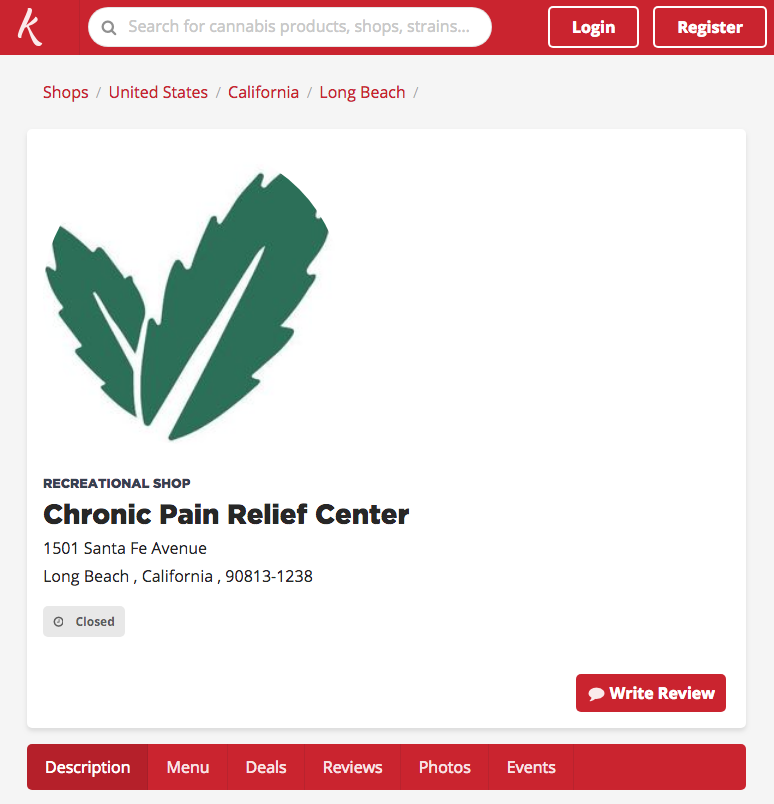

Recently I decided to start experimenting with [NextJS](https://nextjs.org/) as a way to implement a React frontend for [Kushy](http://kushy.net). Currently Kushy runs off Laravel directly, instead of being a separate app that consumes a Laravel API. I've been looking to dive deep in React with Kushy, but it's been difficult finding a framework that scales properly, and I've been avoiding doing it from scratch (crafting my own Webpack config, route and CSS splitting, *all that jazz*). 

The goal of this experiment was to create a NextJS application for Kushy using the [Kushy API](http://kushy.net/developers/), and discover what it takes to roughly create some basic functionality of Kushy (browsing individual businesses by slug).

## Example

You can check out the project deployed on **Heroku**, or browse the source code on Github:

* [Heroku - Live test site showing Shop Slug](https://kushy-frontend-next.herokuapp.com/shop/chronic-pain-relief-center)
* [Live page on Kushy for comparison](https://kushy.net/shops/chronic-pain-relief-center)
* [Github repo](https://github.com/whoisryosuke/kushy-frontend-next)

## Issues

There were a couple of issues I encountered immediately while trying to use NextJS. Luckily only a couple.

### Dynamic Routing (/posts/{slug})

NextJS doesn't have this out of the box. You have to make a NodeJS server (in this case Express) with your dynamic routes.

> See: [NextJS docs on custom server/routing](https://github.com/zeit/next.js/#custom-server-and-routing), [this article](https://medium.com/@diamondgfx/nextjs-lessons-learned-part-2-f1781237cf5c), [this plugin](https://github.com/fridays/next-routes), 

Ended up using plugin (https://www.npmjs.com/package/next-routes) to accomplish it "easily". In the future though I'll just use the Express API.

### Deployment

NextJS can be Jekyll or other static site generators. You run a build process everytime the code changes, then you restart the server.

`npm run build`
`npm run start`

Makes NextJS perfect for something like Heroku that handles that process. Or maybe not, if they don't have proxying/multiple instances -- since NextJS performs best when clustered. 

> It is possible to run a static build process like GatsbyJS that can run on a CDN/host like Github Pages or Netlify. But you lose the dynamic routing and SSR that Node and Express provide. That's where GatsbyJS shines, it pulls all the content to live statically, while NextJS pulls on demand.

### User Login / Authorization

NextJS doesn't come built in with any functionality for "protected" routes, if you needed to lock certain pages behind a login authentication. Luckily, it wasn't too difficult with the way NextJS works on the server and client-side.

To login a user, I used an API using the OAuth2.0 flow, so I redirected the user to the API's login. Once the user logged in and approved the app, they're redirected back a callback page on the app. This page makes one last request to the API (using a secret token the API sent to the callback), and the API responds one last time with an access token or JWT (JSON Web Token) for the user.

Here's where the magic of NextJS comes in. We store the token in a cookie on the server-side, which allows us to grab it from anywhere (server or client). When we need the token, we parse it from the server-side headers (passed through the `getInitialProps()` method) -- or use a library like `js-cookie` to grab the cookies client-side.

To create a protected route, you make a HOC that checks for the cookie in the `getInitialProps()` and `componentDidMount()` lifecycles. If you find the token's cookie, the HOC loads the page component. But if it can't find the cookie, it'll redirect the user to a public page (usually a login). 

## Conclusion

Much like any good framework, once you know what you're doing -- and you figure out how it handles certain things -- it becomes effortless to create what you want. I walked away from working on NextJS with my mind buzzing with several apps I could whip out now that I could apply them. While I'm not sure this will be the framework we use for the Kushy frontend, it's definitely a great contender.

Kanpai 🍻
Ryo

***

**References**:

* [kushy-frontend-next on Github](https://github.com/whoisryosuke/kushy-frontend-next)
* [NextJS - Deployment Guide](https://nextjs.org/learn/basics/deploying-a-nextjs-app)
* [NextJS - How to send request parameters to page (like post slug in URL)](https://github.com/zeit/next.js/issues/929)
* [next-routes - Dynamic routing for NextJS](https://www.npmjs.com/package/next-routes)
* [NextJS - How to use multiple plugins / configurations](https://github.com/zeit/next-plugins/issues/7)
* [Lessons Learned Building in Next.js pt2 - Brandon Richey](https://medium.com/@diamondgfx/nextjs-lessons-learned-part-2-f1781237cf5c)