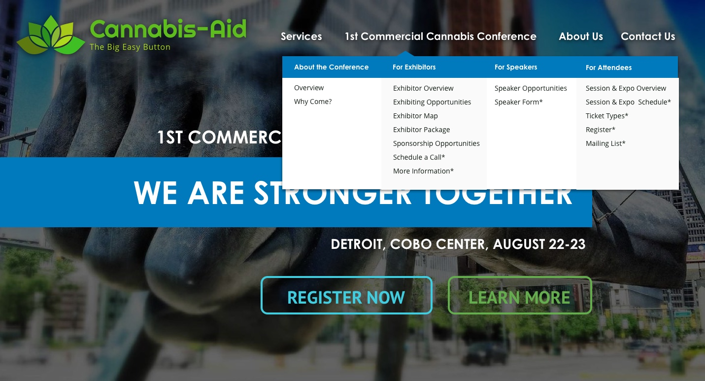
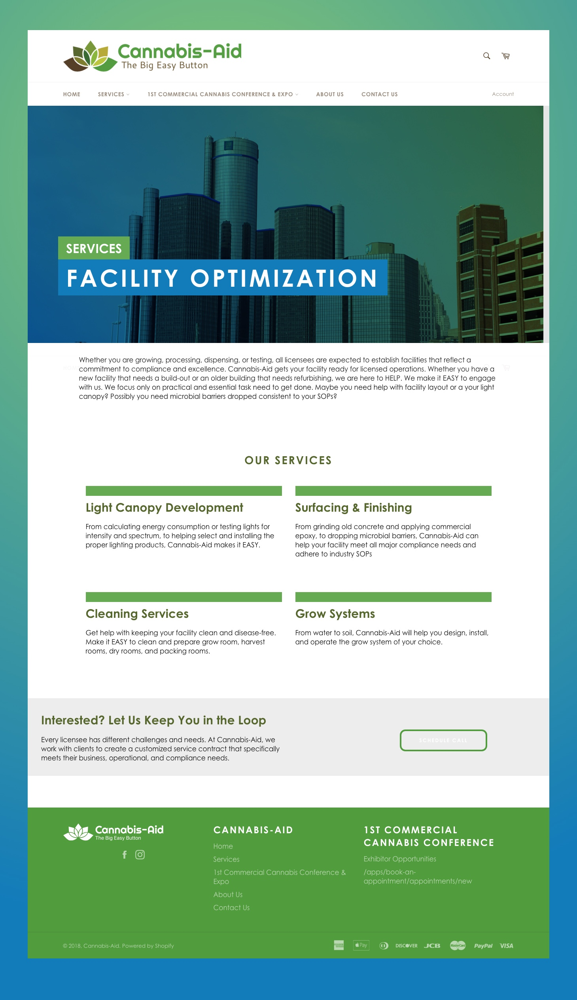

In 2018, I was approached by **Cannaid**, a B2B cannabis consultancy looking to start the inaugural edition of the ***Commercial Cannabis Conference & Expo***. 

My role was to customize the pre-existing Shopify theme and create a dual portal for their professional services, and the event itself. I also consulted Cannaid with integration options for their event ticketing service, from ticket sales to an interactive floor plan for booth sales. I was also tasked with "refreshing" the branding, providing a new color scheme and updated logo for the client. 

## Research

The inital stage of the project was spent doing different forms of research to accrue as much information as possible for the design and development (and ensure I was building the best architecture for the clients problem matrix).

I started with **competitive research**, pulling up each of the competitors websites and analyzing their setup (from their tech stack to solutions for overlapping issues like interactive expo maps). I created a spreadsheet with each competitor and any data I'd accrued, such as links to 3rd party services they integrated into their platform.

After getting an idea of the current competitive landscape, I began researching solutions to key issues the client conveyed during initial meetings. For example, the client was looking for an **event management software solution** that would allow him a significant range of functionality. One of the features included an interactive floor maps of the event space for vendors to purchase booths. My goal was find the most effective solution in terms of cost and execution, ensuring that it could be **integrated easily with the Shopify platform.**

## Proposals

I designed a few rounds of hi-fi website mockups, as well as branding proposals. Each revision got us closer to achieving the client's vision - *professional, photographic, and polished.*

## Refreshed Branding

The client provided multiple logos they had created using an online logo generator and a color scheme they had picked out. I was given the creative freedom to choose new colors and adapt them to the logos. 

We settled on a scheme that featured similar notes from the original (light green and solid blue), yet brightened the palette from it's brown and dark bases.

## Final Shopify Theme

After the client picked their preference, I translated the design to a Shopify theme. Each component was created to allow the client to edit the content from the Shopify theme customization dashboard.

