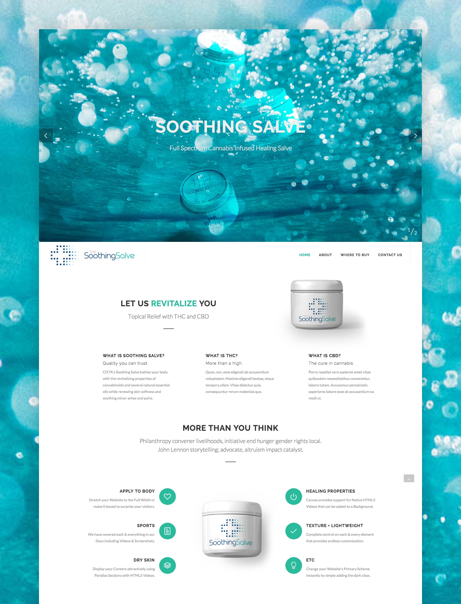

In 2017, I was approached by Cota, a manufacturer of cannabis infused lotions. They were looking for a web presence for their brand to educate customers and entice investors, and they had a strict budget for the project.

I created a fully designed and developed website in 2-3 days from minimal branding and a product label.

Utilizing stock photography, I was capable of creating custom graphics for the brand by combining the photos with mockups of the product. This allowed me to quickly create visuals for the website without coordinating a photo shoot for the product or background. The website was bootstrapped off a pre-existing theme in my archive, allowing me to incorporate battle-tested components.

## Mockups

In order to exemplify the product in the best fashion, I created a mockup using a product label provided by Cota. After a bit of research, I found a mockup template that matched his exact bottle and applied the label. The client was incredibly satisfed with the final product and turnaround time.

<a href="http://cotacbd.com/" class="btn">See website</a>