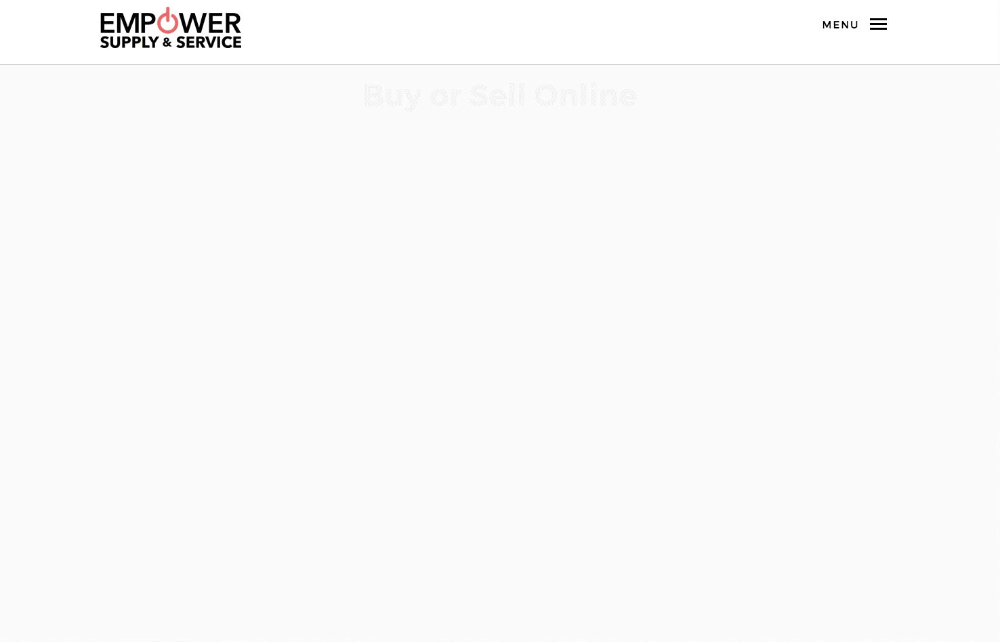
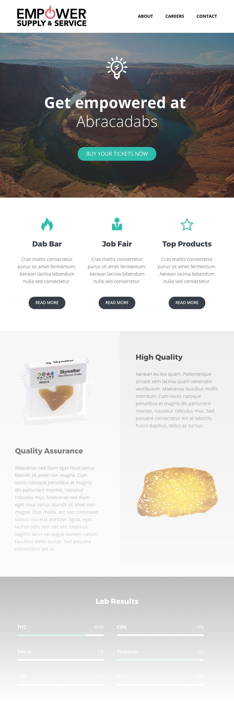

The client, Empower Supply and Services, came to [Stay Regular](http://stayregular.net) (my cannabis design studio) looking for a complete branding and website to advertise their newly launched distribution company. My role in the project was to create the landing page, as well as a newsletter template for future campaigns.

Overnight, using a template in my archive, I was able to quickly create a completely branded one-page website that was polished and professional. Also, as a part of the branding package, I produced 3 short videos to introduce the company's new logo and branding on social media.

## Features

* Mailchimp integration
* Scroll-based animations
* Mobile-friendly design
* Curated stock photography
* Newsletter Template (compatible with Microsoft 365)
* 3x Branding Videos

### Mobile-friendly

The website was designed with mobile viewports in mind, utilizing grid optimizations to alter elements based on device width.

### Scroll-based Animations

As the user scrolls through the site, each section is revealed through coordinated CSS animations. I use the Animate.css library to easily add an array of transitions to page elements. This, combined with Waypoints and a few delays, created simple yet stunning presentations.

## Newsletter
The Empower team was looking for a flexible solution for email marketing, that would allow less tech-savvy staff to easily build out an appropriate campaign.

I used a pre-existing template in my archive to quickly create a branded newsletter for the Empower team. This mockup was created to present the basic content elements and potential use cases. The newsletter was coded and optimized to work with Empower's Microsoft 365 email service.

          

## Branded Videos

The following videos were created using Adobe After Effects either using plugins, toolkits, or templates to achive certain effects, such as traced lightning or flames. The client preferred the first version. The final video was converted to an Instagram-friendly video format.

<iframe src="https://player.vimeo.com/video/286940486" width="100%" height="360" frameborder="0" webkitallowfullscreen mozallowfullscreen allowfullscreen></iframe>

<iframe src="https://player.vimeo.com/video/286940593" width="100%" height="360" frameborder="0" webkitallowfullscreen mozallowfullscreen allowfullscreen></iframe>

<iframe src="https://player.vimeo.com/video/286940529" width="100%" height="360" frameborder="0" webkitallowfullscreen mozallowfullscreen allowfullscreen></iframe>