In 2018, I was contracted by [KushBottles](http://kushbottles.com/) to handle their photography and various videography projects. My primary role was photographing new products, as well as re-shooting the entire product catalog at a higher quality. I was also tasked with producing social media photo campaigns, photography assets for the marketing department, and documenting the KushBottles custom portfolio.

## Product Photography

As a distributor, KushBottles sells product through [their online B2B shop](http://kushbottles.com/). My role was photographing every single product in the shop, as well as any custom-branded products created by KushBottles for clients (featured in their custom portfolio). Each product was carefully edited, de-blemished, and cut out into transparencies.

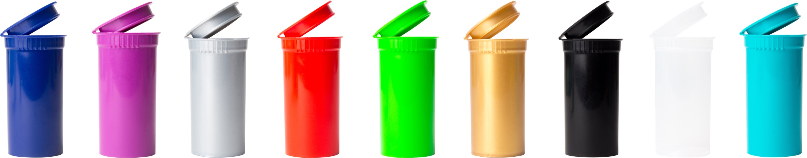

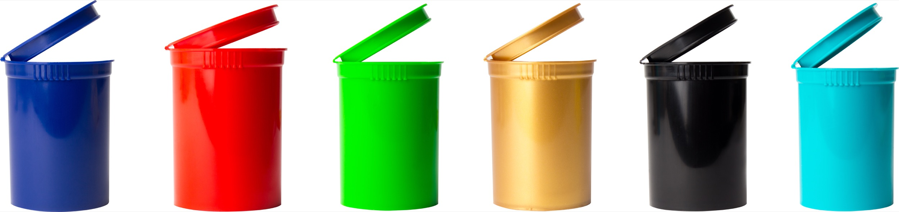

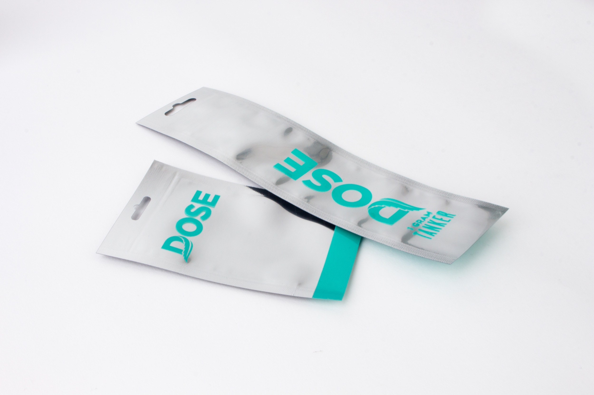

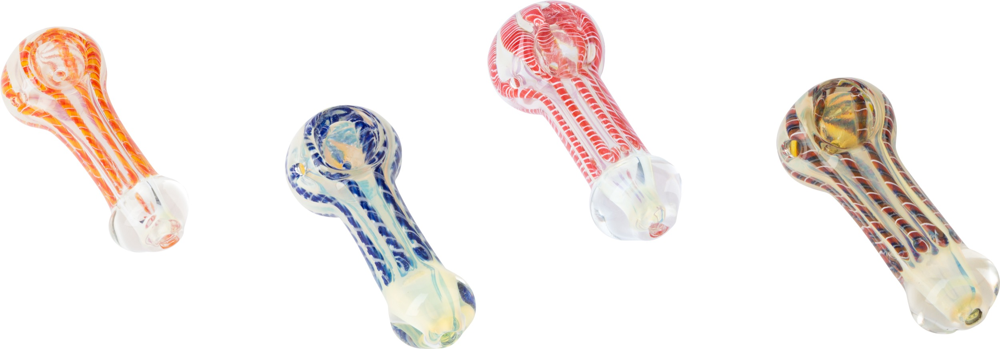

<section class="row">
    

        

            
            
Vape cartridge

        

    

    

        

            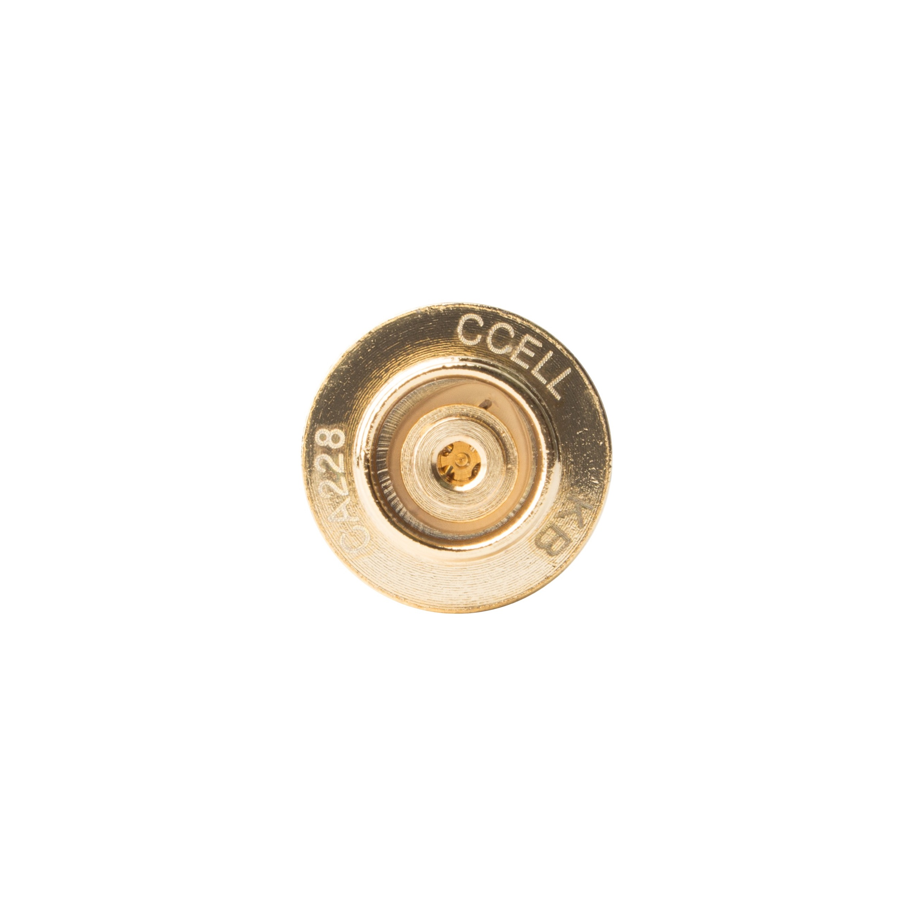
            
Vape cartridge

        

    

    

        

            

            
Vape cartridge

        

    

    

        

            

            
Vape cartridge

        

    

</section>
<section class="row">
    

        

            

            
Vape cartridge

        

    

    

        

            

            
Vape cartridge

        

    

    

        

            
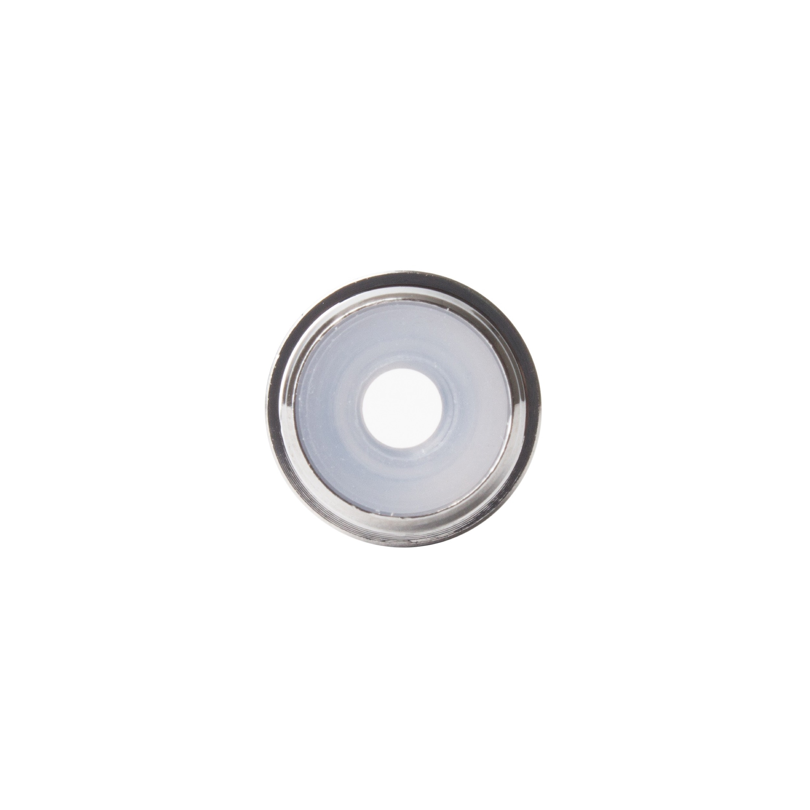

            
Vape cartridge

        

    

    

        

            
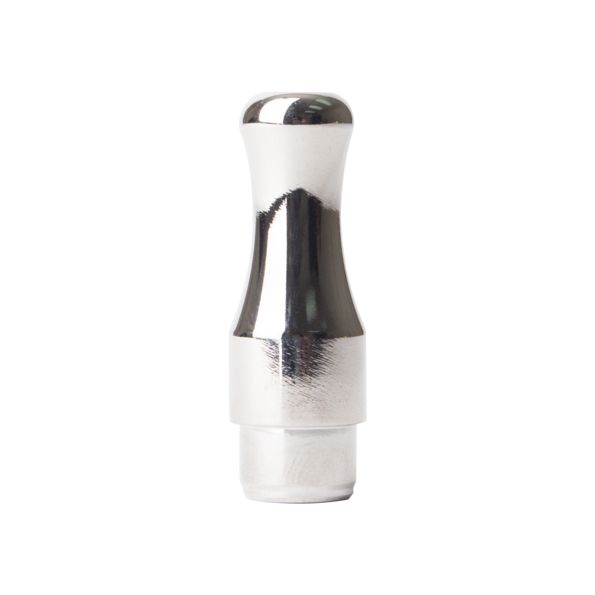

            
Vape cartridge

        

    

</section>

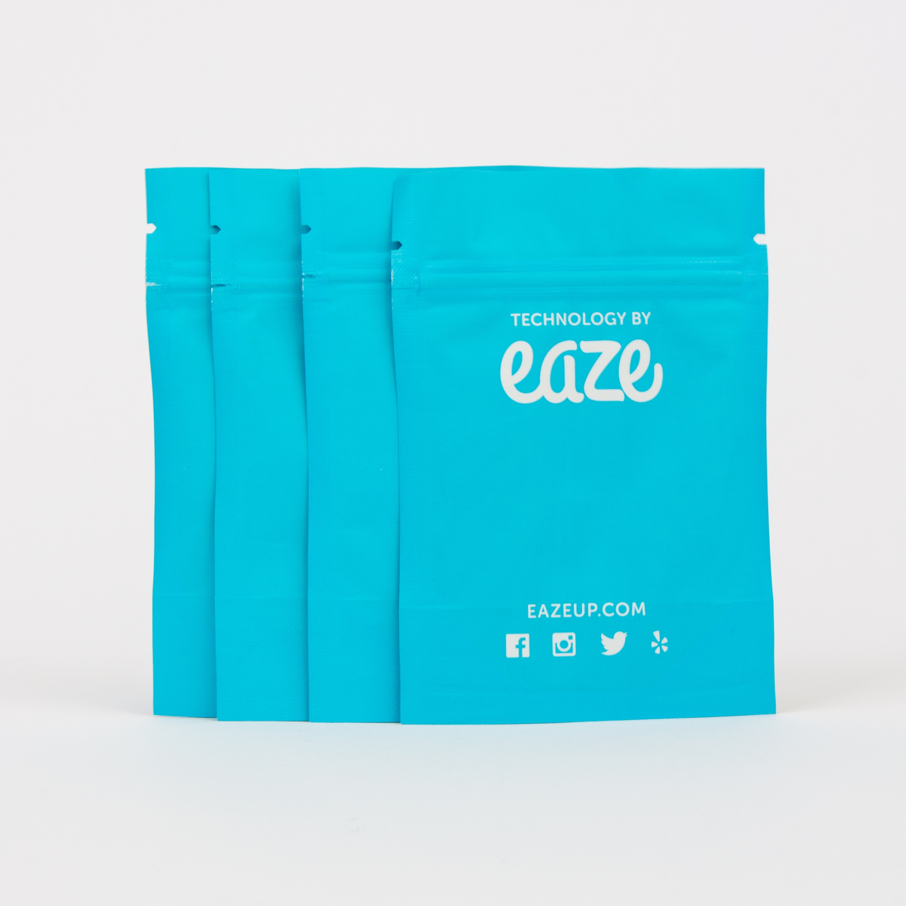

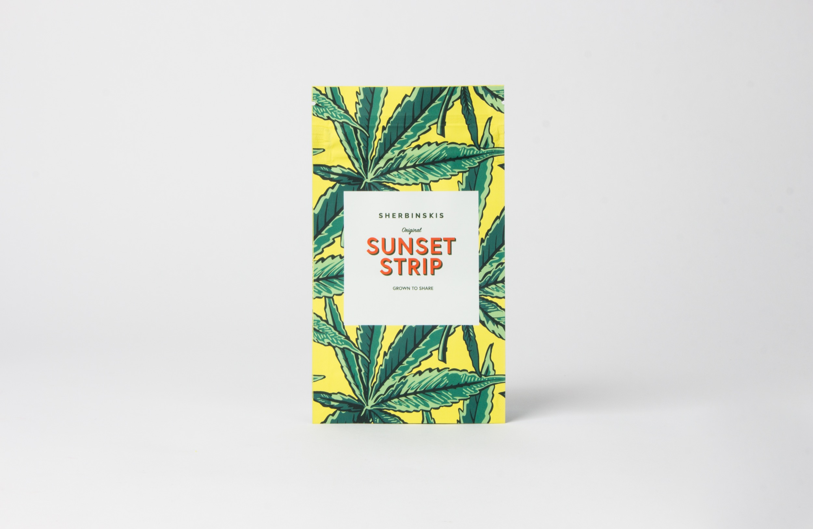

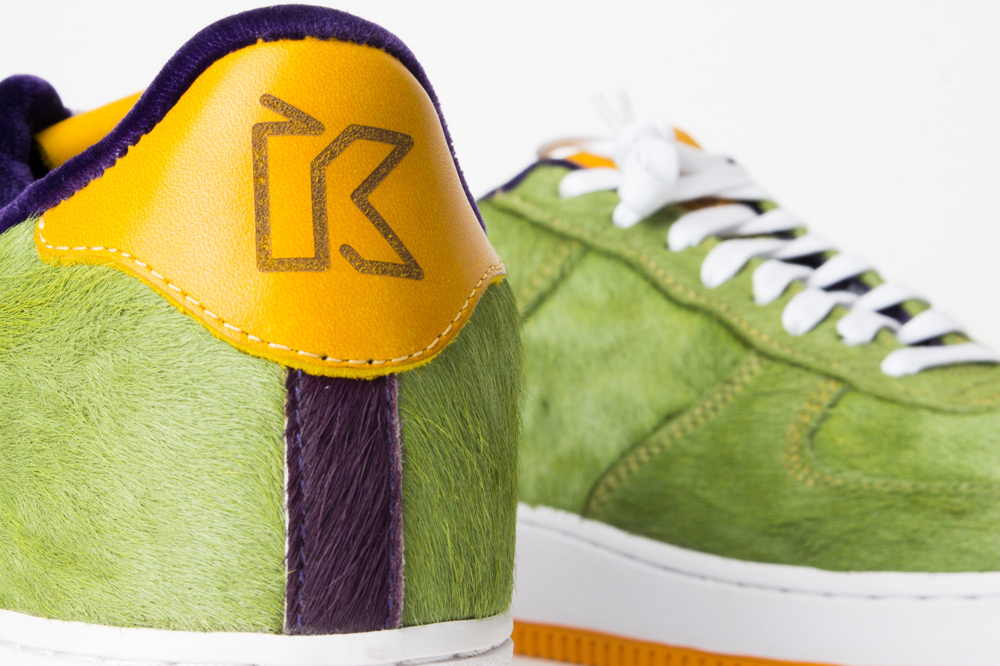

## Vaporizer Laboratory

KushBottles is a distributor of vaporizers and vaporizer accessories, and as a quality control measure, they run a vaporizer laboratory that's capable of running a gammut of tests. My role was photographing the technician at work for use in marketing materials.

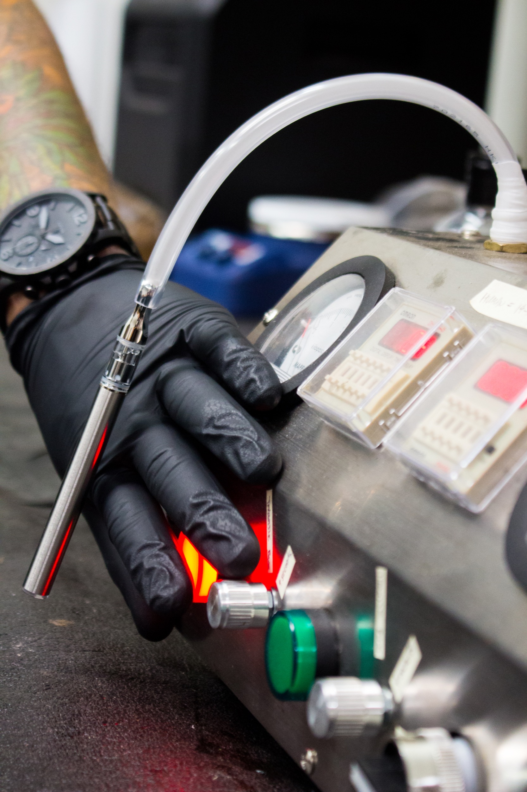

## Social Media

When I was first contracted, the marketing team had already established a style and aesthetic for their social media campaigns. The goal was to continue the style, but improve the quality and appeal of the photos. My role involved directing and photographing products for several social media campaigns.

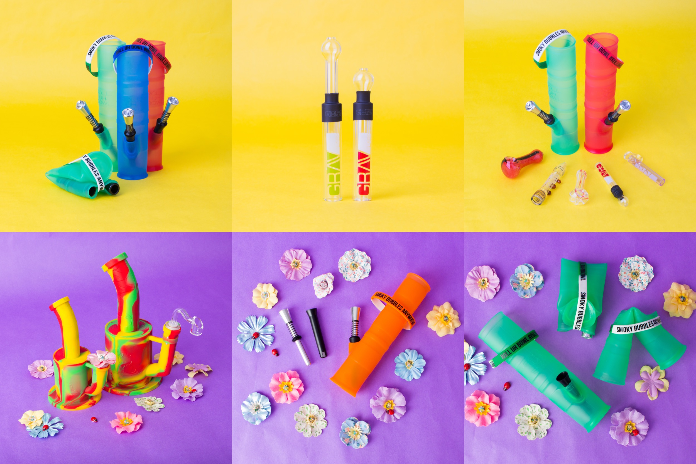

### Videography

I was also the videographer for [**the KushBottles Live show** featured on YouTube](https://www.youtube.com/channel/UCeZ1cxciZM0Rd89_VDCrT0w/videos). Each week the sales team puts on product presentations and educated customers on the benefits of each item. My role was to film the show using my equipment and provide footage to the marketing team to edit.

<iframe width="100%" height="713" src="https://www.youtube.com/embed/GjxAQ4A1jKs?ecver=1" frameborder="0" allow="autoplay; encrypted-media" allowfullscreen></iframe>

## Variety Magazine

I was contracted for a photoshoot in Huntington Beach, California to shoot Island cannabis pre-rolls on the beach. The photo was then used in a graphic later **featured in the July 2018 edition of Variety magazine.**

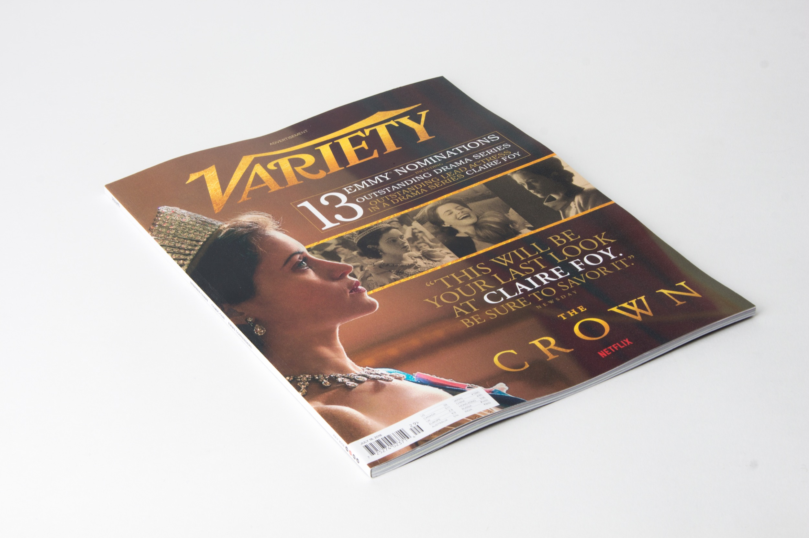 

## Marijuana Ventures Magazine

Contracted for photography that was later used in a KushBottles advertisement in Marijuana Ventures magazine. *Final graphic not displayed*

