
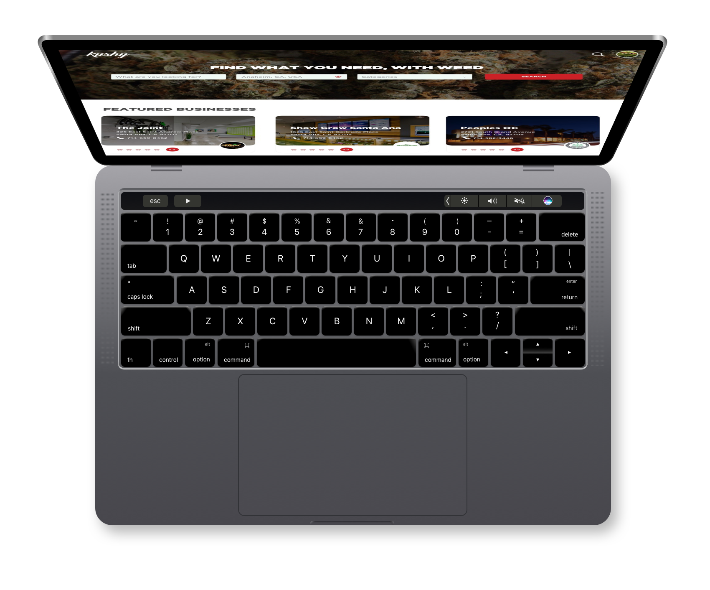

In 2017, I established **Kushy**, an online cannabis directory for medical and recreational marijuana dispensaries, brands, products, and strains. Over time, the app has evolved into a platform, with an open source API powering various apps.

I noticed a need in the cannabis community for a platform that allowed users to find businesses and share their experiences with the shop and product. There were a handful of websites offering this solution, and I found that none could offer me the basic functionality I was looking for: finding local cannabis shops, accurate menus, and ideally -- online ordering.

## UX Analysis

As I began to roughly plan the project, I began to analyze the key issues I discovered with the competitors and the UX of their apps (from the customer's perspective, all the way to the retail side). 

**Why can't I browse by price?** This one has no excuse, and no app or service has been able to provide a proper solution to filter products by price. A simple sorting by highest or lowest would be fantastic. Cannabis can be priced by weight or unit, depending on the form it's in. Cannabis flowers are sold by weight (gram, eighth, etc), and edibles are sold by unit (1x 300mg brownie). So building a menu component that would be flexible enough to accomodate these is more complex than a basic pricing table.

**Why weren't menus accurate?** Menus are updated either manually, or through integrations with something like a POS system. Manual updates require a shop employee to spend their time away from other tasks to update 2-3+ different websites, all with different interfaces. This leads to businesses favoring one service over another, leaving inaccurate data on other sites and apps.

**Why no online ordering?** Cannabis is still federally illegal, meaning little to no payment processors work with the industry. It restricts online cannabis commerce to e-checks and bank wires, as opposed to the more common credit or debit card. Even if payments were possible, our service would have to sync with the shop's POS to inform them of the stock change (to ensure no "double" sales of products with online vs brick and mortar purchases).

It started to become clear how many different interconnected services would need to be woven into the app create the most accomodating experience for users. As well as how much **interface design** there'd have to be to **create clever solutions to cannabis-exclusive problems.** 

## Planning

There was a significant amount of planning that went into a project of this scale. From business strategy, to competitive analysis, to prototyping.

### Competitive Analsysis

I began by immersing myself in a few key players in an anscillary industry offering similar services: Yelp, Grubhub, and Airbnb. Yelp and Grubhub were the lead in food discovery and delivery. And Airbnb was not only doing similar for accomodations, but they were utilizing and pioneering new technology to accomplish a modern app experience. I also made a list of competitors in my own industry to research.

I broke down each companies tech stack, branding, marketing approach, social media profiles -- everything was analyzed. From there, I was able to develop a mood board using competitors assets, as well as inspiration I'd discovered from around the web.

### Feature Roadmap and Pricing Tables

In order to get the best use of time, I set goals for various stages of the project's development. Each month I'd iterate upon the previous, adding new features to the website and resolving issues. 

I also plotted out the major goals of the company, and what kind of features we could develop to accomplish them. From there, the features were mapped out and added to the roadmap.

I even planned out each and every email we'd send to users, so I could just run through the list while designing.

### Database Architecture

The structure of the database itself would have to be fairly large to contains all the kinds of data I wanted to store (site content, user data, e-commerce, etc). My goal was to keep the database lean and leverage as much power from MySQL as possible, using plenty of relational tables to make queries more efficient.

At first, I started with **individual tables** for each primary section of the site: **Shops, Brands, Products, and Strains**. This quickly became an issue when working with Laravel and creating relationships between models. I needed an extra column in every table to let me know what "section" the data was coming from, and it made eager loading queries a pain.

I immediately **migrated over** to something *similar* to the **Wordpress database structure**. All our sections would be stored in one "Posts" table with a "section" column there. That way, I could create relationships with tables like the Reviews, or Bookmarks, and not have to worry about the logic in the model or controller.

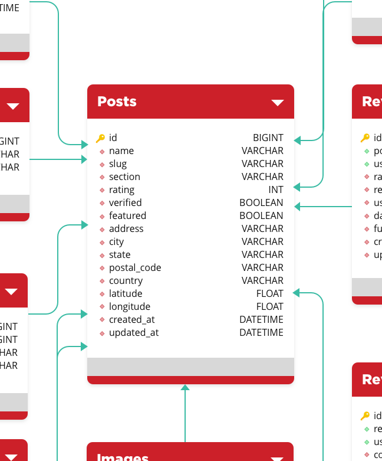

### Sitemap

I put together a sitemap to better visualize how many pages needed to be designed, and the structure of the site itself. This also helped greatly when working on the User Stories part of the UX process.

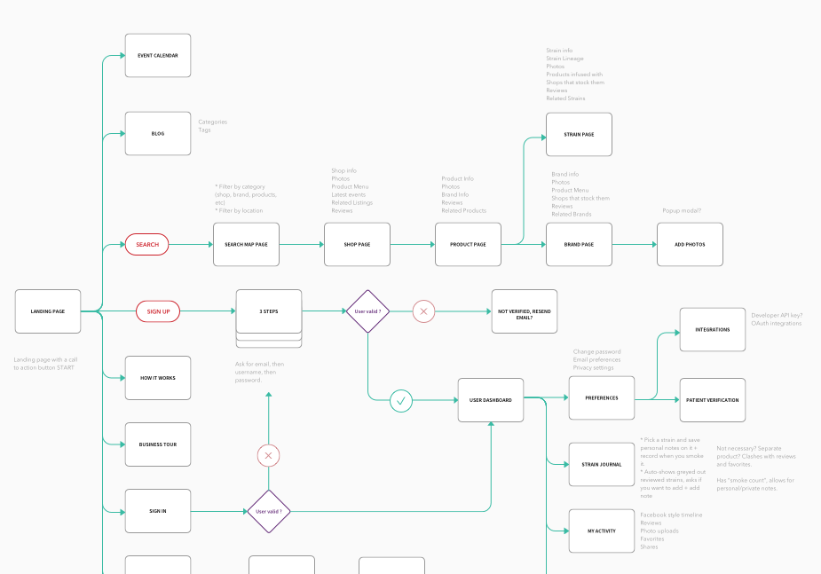

### User Flow

## Hi-Fi Mockups

I used Sketch to design interfaces and components for necessary pages. I took the time to iterate upon designs and find solutions to criticisms I had with competitors UI.

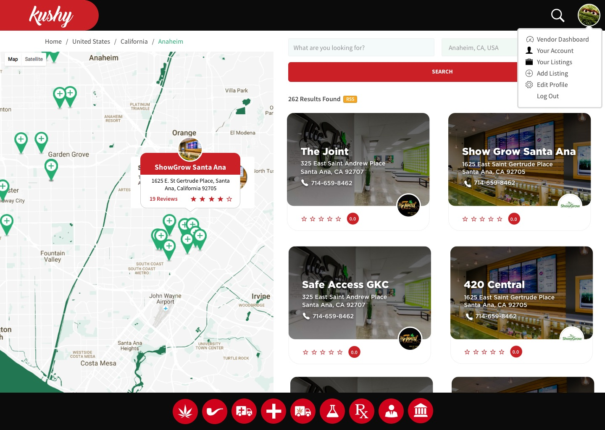

### Shop Menu

I wanted the menu experience to be as seamless as possible. Products and pricing can clearly be seen and sorted from the list view, and a popup modal on click allows for more data and a quick cart flow.

## Wordpress MVP

In order to achieve the quickest proof of concept, I developed an MVP using Wordpress as the base framework and CMS. With a multitude of plugins (3rd party and custom) and a branded template, I was capable of creating all the functionality I was looking for.

* Directory
* Map Search
* Shopping Cart
* Admin Dashboard
* MMJ Verification
* Affiliate Referral System

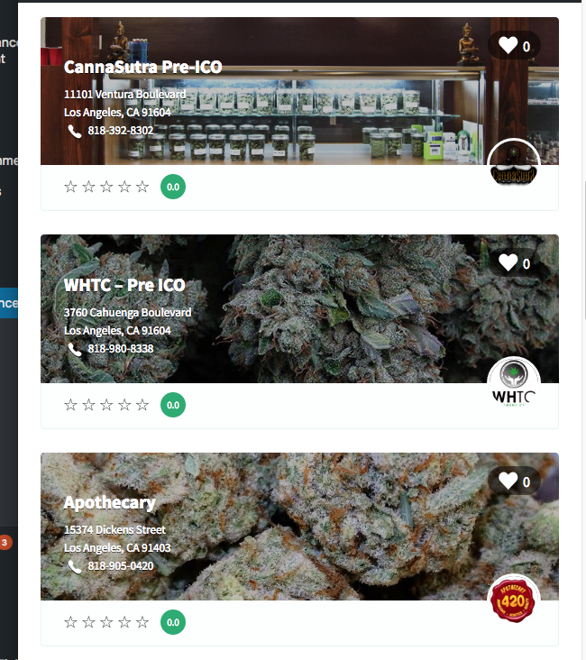

## Branding

The project first started as an offshoot to another side project, WeedPornDaily, so the initial branding was a sub-brand of that ("WPD Business Finder"). As the project grew, I renamed it to **Kushy** and started establishing brand guidelines.

I knew from the beginning **I didn't want a green website**. I gave it a shot, and didn't like it. All of my competitors had green in their color scheme, and I felt like using it for a new brand would be trite and overplayed. I settled on **red**, since I drew my primary inspiration from Yelp, Grubhub, and Airbnb (more pink than red, but still *hot*).

The aesthetic of the site would be modern, yet approachable. The use of red became more and more restricted as I progressed, and the use of measured styling like rounded corners and drop shadow elevated elements that extra little bit.

## Version 2

For the second iteration of the site, I decided to move away from Wordpress and custom code the entire stack from (nearly) scratch. After a liberal debate over NodeJS over PHP, I opted to use Laravel as the framework for the project. Over the course of a couple months, I built out a frontend for users, backend for admins, and a dashboard for businesses.

Eventually, the monolithic Laravel application I'd created was slowly broken up into separate apps. NextJS was used as the primary framework to easily achieve SSR frontend apps, and Laravel was kept as the backend API. Once the core NextJS app structure was determined, the migration was a fairly simple process of copy and paste. Blade components using Semantic UI were converted to React components using Semantic UI React. The Blade syntax converted nearly effortlessly to JSX. 

## Interface

### Design System

Since I was creating the project from scratch by myself, I opted to use a pre-existing design system to streamline the design and development process. I picked **Semantic UI** for it's great design, easy to use "semantic" classes, and compatibility with browsers.

With a bit of customization to apply the Kushy branding, I ended up with a great product with minimal effort.

<section class="row">
    

        

            

            <h4 style="opacity:0">Card</h4>
        

    

    

        

            
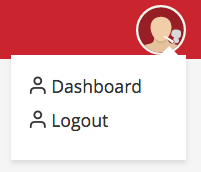

            <h4 style="opacity:0">User Dropdown</h4>
        

    

</section>

I combined the styling of Semantic UI with a Style Guide template for Sketch by Jan Losert to create a shared symbol library of all the Kushy components. 

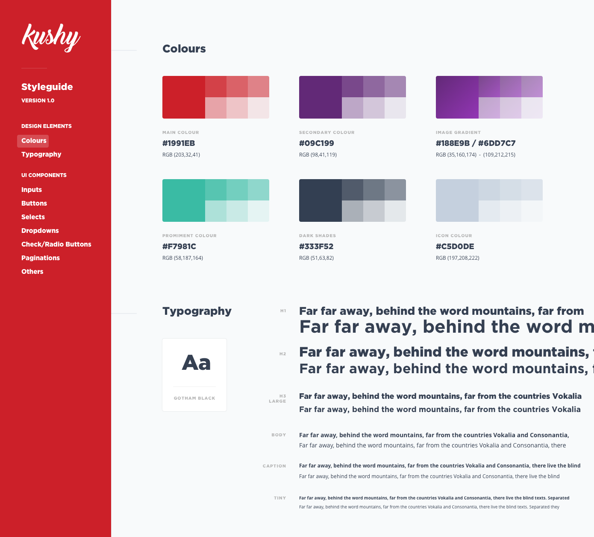

### Custom Design

As great as Semantic UI is, some components were such custom use cases that pre-existing modules from SUI couldn't encompass our data set. 

Strains in particular are very specific in their display, with THC, CBD, and CBN ratings almost always shown alongside the name. 

## Hi-Fi Mockups

I used Sketch again to design a new set of pages and components. This time around, using the new Kushy branding.

#### Shopping Cart

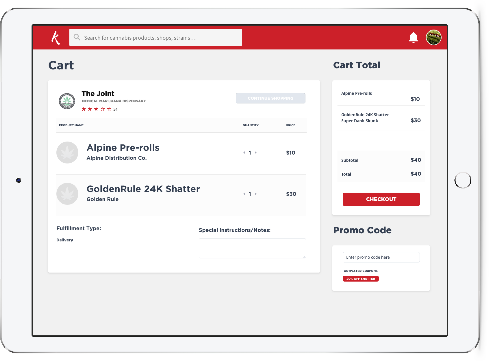

#### Developer Portal

#### User Profile

<section class="row">
    

        

            

            <h4>A</h4>
        

    

    

        

            

            <h4>B</h4>
        

    

</section>

## Final Product

### Backend Admin Interface

I developed a backend interface using Laravel in order to manage the massive amount of data we had. Through this backend admin dashboard, you're capable of all the CRUD functions you need to manage each section.   

#### React Admin

As the platform began to evolve, part of dismantlig the inital monolithic stack was creating backend admin dashboard separate from the frontend, backend, or API codebases. I began experimenting with [react-admin by Marmelab](https://github.com/marmelab/react-admin) to quickily build out the admin based off the existing API.

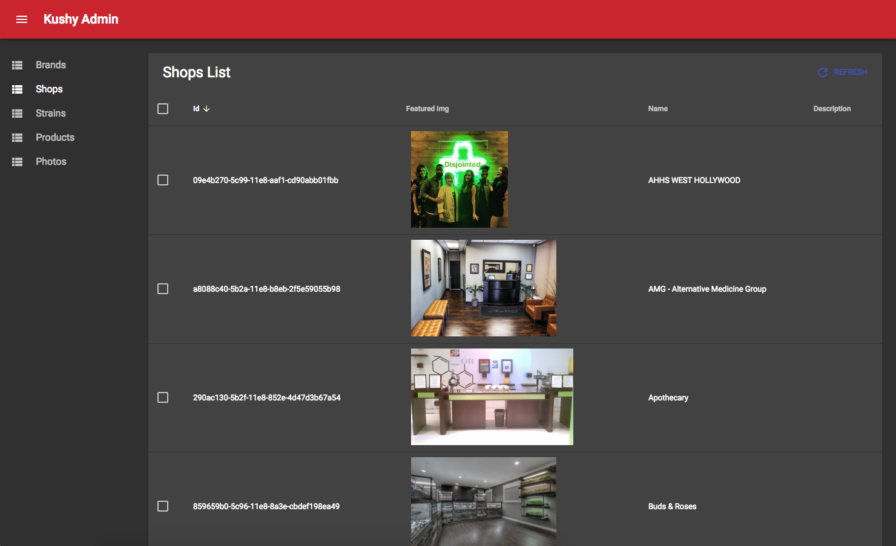

### Search / Archive

### Admin Dashboard for Businesses

### Business Tour

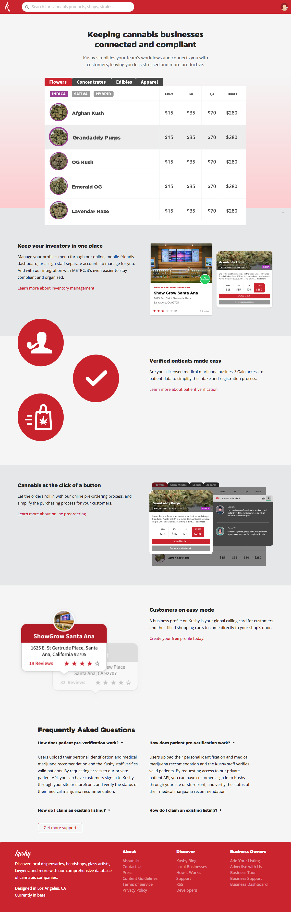

### Developer Portal

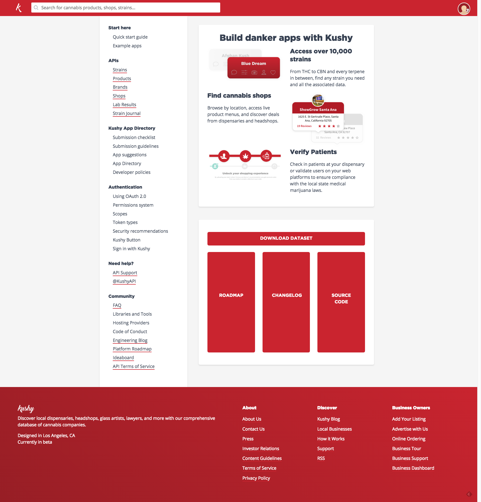

### User Profile

### Shop Profile

### E-Commerce Shopping Cart

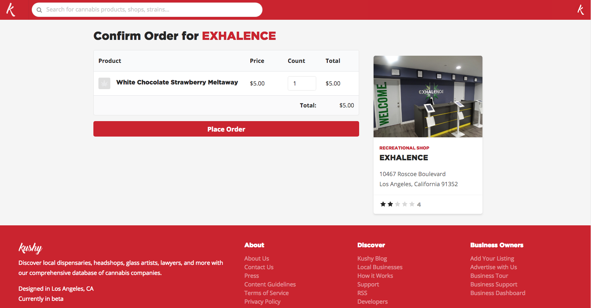

### Shipping Manifesto

As businesses migrate from the medical to recreational side of the industry, there are new requirements for businesses to track their production and sales. 

In this particular case, businesses are required to report any product they transfer to another business. If I want to ship cannabis product to another shop, I need to fill out and print a PDF from a government website. Then I need to mail that to the other shop so they can finish filling it out on their end. This is tedious and prone to many manual issues (fill out fields incorrectly, damaged or lost documents, etc).

I created a Shipping Manifesto tool for Kushy to streamline this process for businesses. Businesses login to their dashboard and create a new shipping manifesto. The form makes certain tasks easier, for example, filling out the "sender" field will query the Kushy API for other licensed vendors to autocomplete your search. 

After filling out the form, the manifesto is emailed to the recipient (or a public link can be copied to clipboard). 

From there, the recipient can finish filling out the form. Once they do, they can print it for their records -- or the sending business can print it as well.

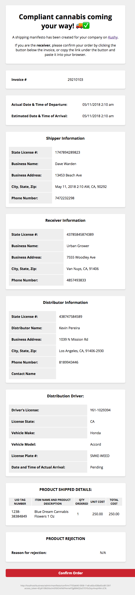

### Medical Marijuana Verification

One of the major painpoints at legal cannabis shops is time consuming process onboarding new customers. Each shop is required to take a copy of the customers ID, and sometimes medical marijuana recommendation. This causes a hold up and frustration for new customers, and more work for employees.

I developed a medical marijuana verification feature for the website that allows users to upload their ID or MMJ recommendation securely to a HIPPA compliant cloud storage solution. Once users upload their IDs, they're approved manually by Kushy staff (to ensure 100% accuracy). 

After being approved, the users are capable of pre-ordering through the Kushy app directly to dispensaries, or dispensaries can use our OAuth login flow to authorize customers by their Kushy account.

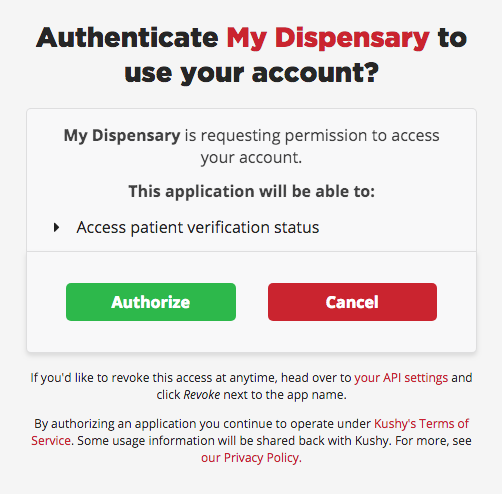

