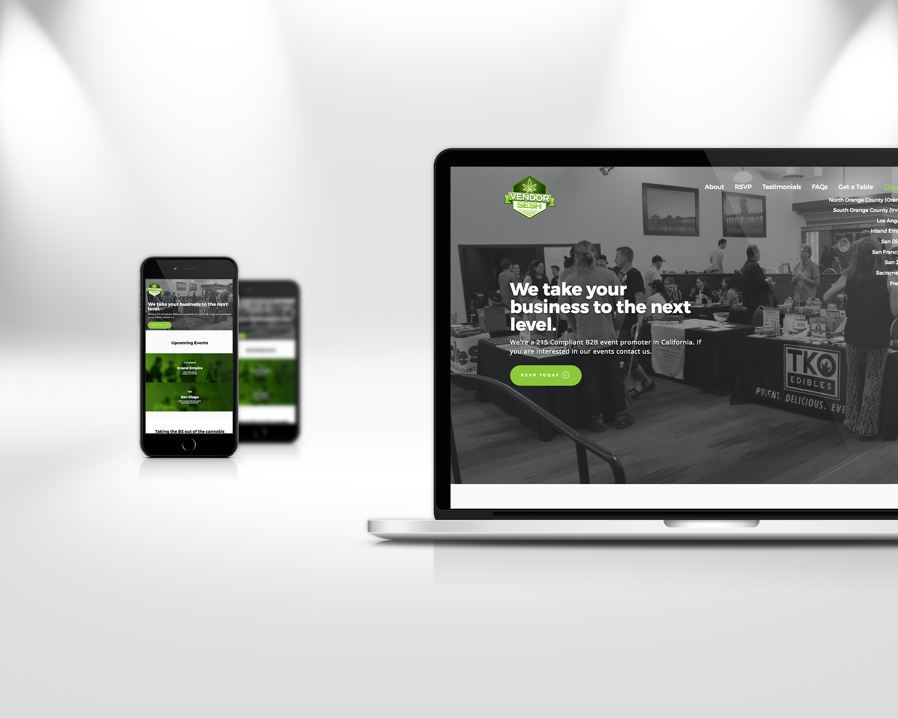
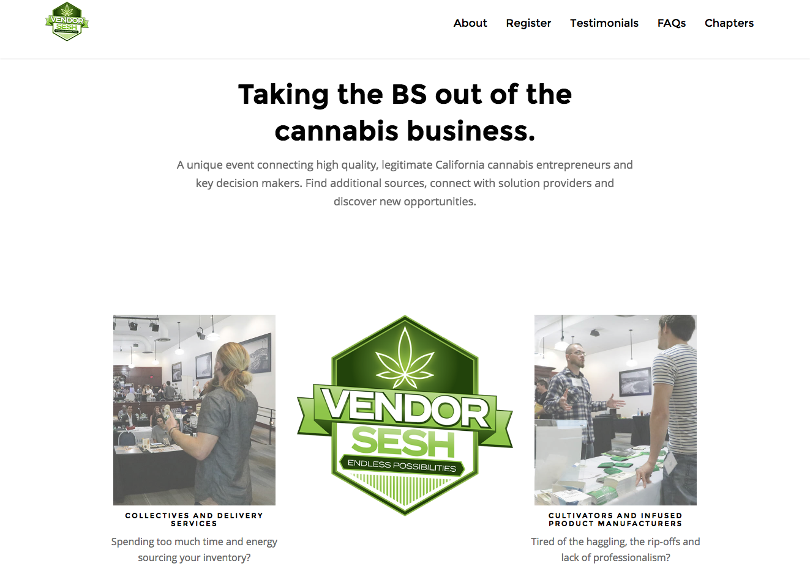
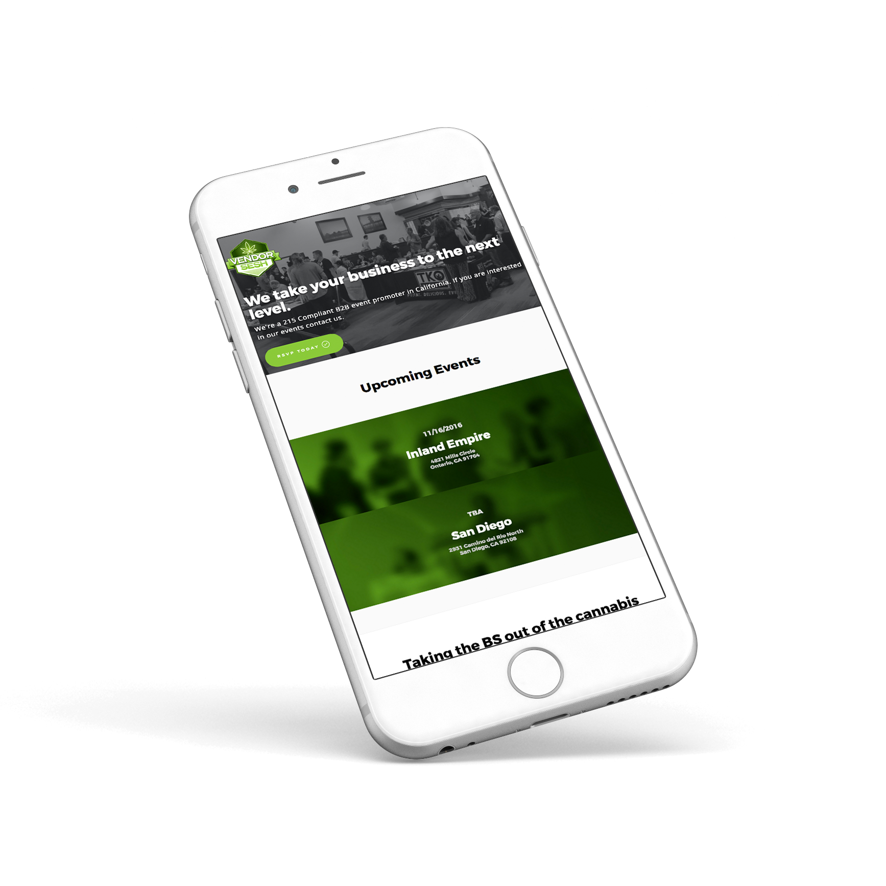

The client, VendorSesh, came to [Stay Regular](http://stayregular.net) (my cannabis design studio) looking for a website to promote their local B2B events. My role in the project was to create a primary landing page, and pages for each "chapter" of the organization, as well as a newsletter template.

Using the same website template as Empower project as the basis, I was able to quickly create a completely branded website using their pre-existing branding and my photography of the event.

## Features

* Landing page
* Chapter sub-pages
* Mailchimp integration
* Scroll-based animations
* Mobile-friendly design
* Custom photography
* Newsletter Template (compatible with MailChimp)

### Mobile-friendly

The website was designed with mobile viewports in mind, utilizing grid optimizations to alter elements based on device width.

## Newsletter
The Empower team was looking for a flexible solution for email marketing, that would allow less tech-savvy staff to easily build out an appropriate campaign.

I used a pre-existing template in my archive to quickly create a branded newsletter for the Empower team. This mockup was created to present the basic content elements and potential use cases. The newsletter was coded and optimized to work with Empower's Microsoft 365 email service.

<a href="https://github.com/whoisryosuke/vendor-sesh" class="btn">Source code on Github</a>
<a href="https://whoisryosuke.github.io/vendorsesh/" class="btn">Live Preview</a>